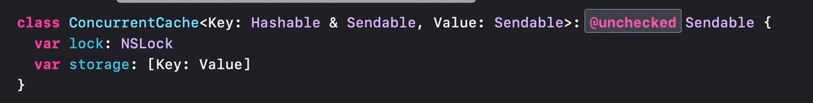

[toc]

There are a number of primitives for synchronization of shared mutable state across different execution contexts, i.e. from low-level tools like atomics and locks to higher-level constructs like serial dispatch queues. But all of them require very careful implementation. That is where actors come in.

##### Basics

The idea behind **actors** is to provide a built-in reference types which can take care of elementary data races automatically behind the scenes. It manages its own state and that **state is isolated** from the rest of the program. Like other Swift types, it too can have properties, methods, initializers,  subscripts, can coform to protocols, be augmented with extensions, etc. Its a reference type. It can't participate in any inheritance though.

However what this does mean is that any interaction with an actor from the outside, must be done asynchronously by treating its functions as asynchronous functions (not doing so will give a compiler error).


When the actor is busy, the code suspends so that the CPU it's running on can do other useful work.

##### Synchronous code within actor can run without need for `await`

Synchronous code within the actor always runs to completion without being interrupted. `await` is not needed. What it means is that if within its own implementation, an actor function can change its own state as if its synchronous code (for example in above example 'value' is being changed direcrly in `increment()`).

##### Dealing with actor reentrancy

> **Reentrancy** is actually a more general multithreading term in computing ([link](https://en.wikipedia.org/wiki/Reentrancy_(computing))). Its the term for when a function or subroutine can be interrupted and then resumed, and still have data safety even if that function (of the very same instance) was called again before first invocation's execution completed. 

`Actor reentrancy` is just a term to refer to the situation where a function inside an actor is refering to a state in multiple points with there being a suspension point in between. This means that in the first reference there might be one value but by the time the second reference is made there is such a long pause in between the value might have changed and the second point will be working on incorrect assumptions.


**To solve this** the recommended approach is to not have any potentially suspending code between the places where the actor state is crucially referred to by an actor function (in other words, perform mutation of actor state in synchronous code). _As shown below where there is no suspending code between the second 'guard(CanWithdraw)' and 'balance -= amount'.


[Swiftsenpai write-up](https://swiftsenpai.com/swift/actor-reentrancy-problem/) <br>

##### Actor isolation, nonisolated

The idea behind actor functions is that if they are accessed from outside, its done asynchronously. This can cause an issue in case of protocol conformance as the contract for those functions may not be asynchronous (even when the function is accessing only nonmutable state of the actor). This can be solved by using `nonisolated` qualifier.

Error when implemented synchronously | Compiles if `nonisolated` is used
--- | ---
 | 

> `nonisolated` means that this method is treated as being outside the actor, even though it is, syntactically, described on the actor. Literally though, what it means is that the compiler is being explicitly told that the specified property/method is actually not accessing any isolated data. FWIW, nonisolated code is not run on any actor's execution context (it always runs on a 'global cooperative pool').

`nonisolated` can be specified only if the method is not accessing any mutable state.

[(Antoine Lee article on Actors)](https://www.avanderlee.com/swift/actors/)

The fact that an actor's state should be isolated enough for execution (which otherwise automatically happens just by the virtue of it being an `actor`) is probably what is also known as **Actor isolation**. Another statement is that 'actor isolation' in code means whether a code is running inside the actor or outside it.

However, if the protocol's conformance requires implementation of static functions its not an issue (as there is no 'self' there, well so what?) and `nonisolated` does not need to be specified (only if its accessing immutable state on the actor).


If however any protocol conformance requires nonmutable state of the actor to be accessed, there will be a compiler error.

Essentially nonisolated code is code that does not run on any actor at all. Regular functions too within actors can be explicitly marked nonisolated (when possible).

[Useful link - Swift Lee](https://www.avanderlee.com/swift/nonisolated-isolated/)

A detached task does not inherit actor isolation from its context, i.e. it does not inherit same actor as the code which actually created the task. Consequently if it wants to access any actor isolated code from the context where it was created, it has to use `await`. The 'await' in 'Task.detached' 👇 (from 'WWDC 2022: Eliminate data races using Swift Concurrency').


##### Sendables

An example 👇, where using actors and classes can lead to data races. Because the 'visit' method is not on the actor, this modification could end up being a data race.


> Value types and actors are both safe to use concurrently, but classes can still pose problems.

A `Sendable` type is one whose values can be shared across different actors. Value types, Actors are Sendable. Classes can be Sendable, but only if they are carefully implemented.

Functions aren't necessarily Sendable, so there is a new kind of function type for functions that are safe to pass across actors.

Over time, sendables are things that Swift will start checking statically.

A new protocol named `Sendable` has been introduced and its recommended to have any type that makes sense as being sendable as being specified so explicitly. There should be a conscious effort made to use only Sendable types in actors. Consequently, later when Swift starts enforcing sendable types across actors the code will be complying to that already.


> There is more to understand regarding sendable functions. Check in 2021 video 'Protect mutable state with actors' 21:23 to 23:30. <br>

##### @unchecked Sendable

Its possible for a reference type such as class to be made safe from data races by implementing locks and other atomics, but the compiler can't know that. So for such types if you have implemented it, you can declare it as being safe from data races by declaring it as `@unchecked Sendable` conformant. This basically turns off compiler's checks for any declared Sendable conformance. Use this only if you are sure (there could be runtime issues otherwise?).



[Jared Sinclair article](https://jaredsinclair.com/2024/11/12/beware-unchecked.html)

##### Main Actor

The main actor is an actor that represents the main thread. It performs all of its synchronization through the main dispatch queue (i.e. its interchangeable with using `DispatchQueue.main`). 

> So while Main Actor does make sure that the code runs on main thread, it probably does also make sure that the code is dispatched asynchronously to the main thread (thereby not blocking it).

If something is delcared with the `@MainActor` attribute, it will be executed on the main actor. If such a function is called from outside the main actor, it needs to be awaited, so that the call will be performed asynchronously on the main thread. Types can be declared with this attribute too, with any opt-outs specified using `nonisolated` qualifier.

`MainActor` function | `MainActor` type
--- | ---
 | 

It can in fact be used in many more ways ([link](https://www.hackingwithswift.com/quick-start/concurrency/how-to-use-mainactor-to-run-code-on-the-main-queue)).

For example, a `@MainActor` prefix before the closure's arguments ensures that the `Task` closure is only called in main thread.

```
Task { @MainActor in
    print("This is on the main actor.")
    await someAwaitableFunction()
}
```

> In the above example, I think the code with `await` line will be run on main thread only when the awaitable function it is calling has responded and main thread is not really blocked either.

##### Sendable enforcement Xcode build settings

In 2022, a new build setting was added to decide how strictly should the compiler check for Sendable types


`@preconcurrency` can be used to ignore Sendable checks for code coming from a particular module/package,, handy if that package has not updated its types to Sendable yet.


