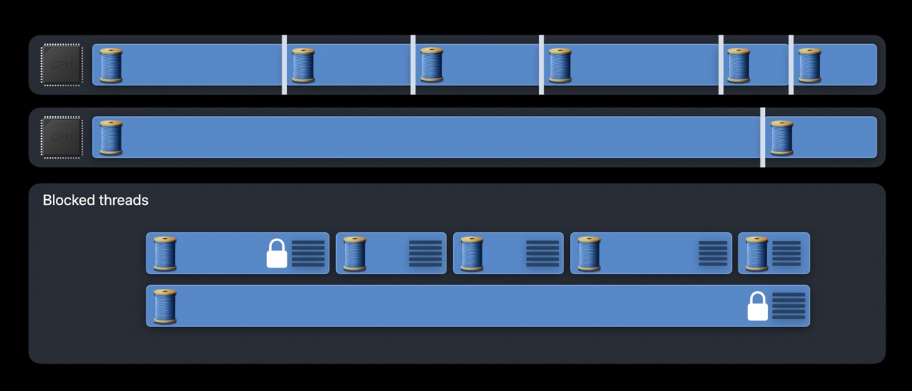
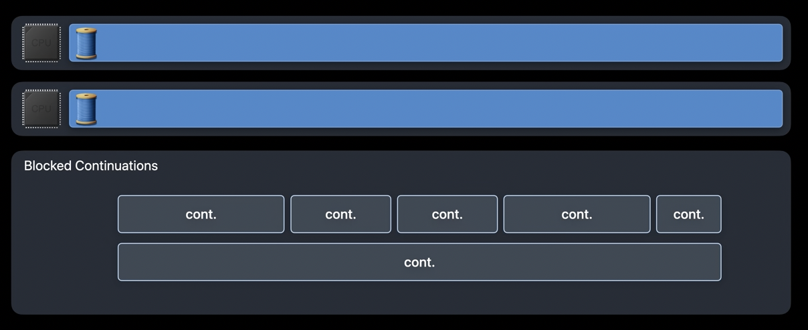
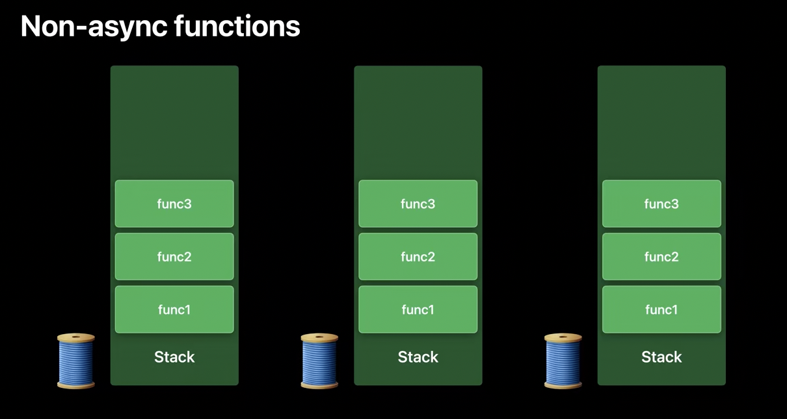
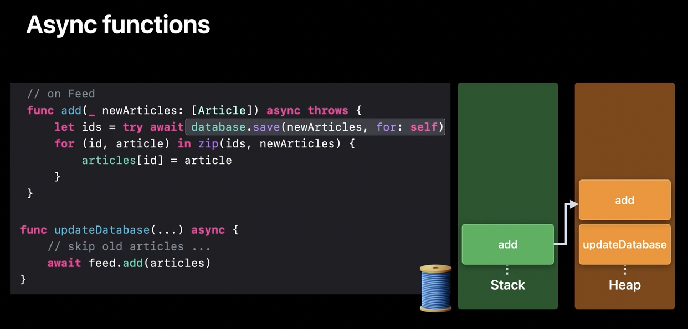
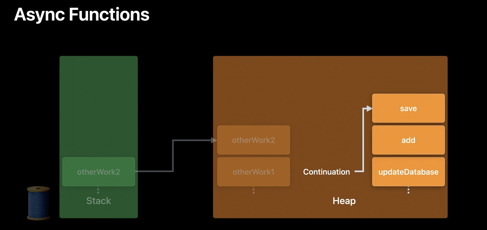
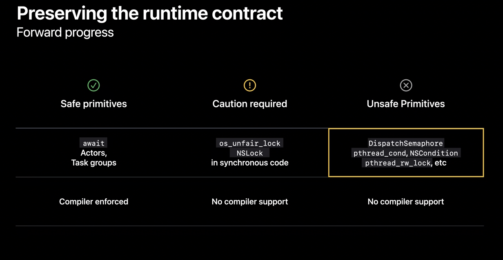
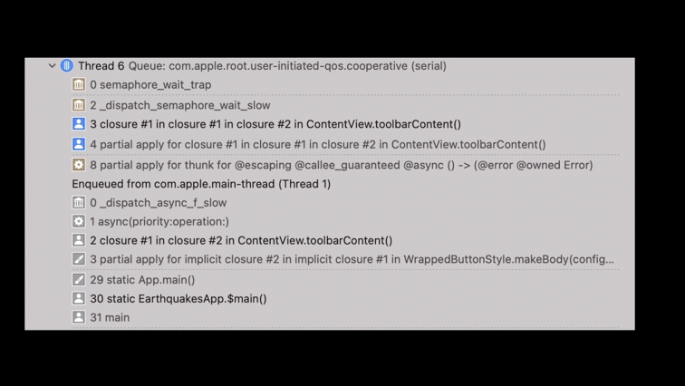
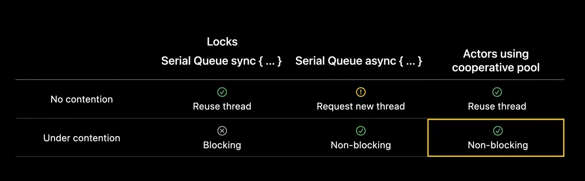

##### How things work in GCD

In Grand Central Dispatch, when work is enqueued onto a queue, the system brings up a thread to service that work item. As a concurrent queue can handle multiple work items at once, (in case of concurrent queue) the system brings up several threads all the CPU cores have been engaged. However, if a thread blocks (as seen on the first CPU core in the below diagram) and there is more work to be done on the concurrent queue, GCD then brings up more threads to drain the remaining work items.

The reason for this is twofold. Firstly, by giving the process (i.e. core?) another thread, it is ensured that each core continues to have a thread that executes work at any given time. This gives applications a good, continuing level of concurrency. Secondly the blocked thread may be waiting on a resource like a semaphore, before it can make further progress. The new thread that is brought up to continue working on the queue may be able to help unblock the resource that is being waited on by the first thread.

In such a model if more threads keep getting blocked for any reason, the CPU then has to `Context switch` between different threads. There could end up being a very large number of threads. This is what is known as `Thread explosion`. This can cause severe overcommitment of the CPU and should be avoided. Thread explosion also comes with memory and scheduling overhead that may not be immediately obvious. Each of the blocked threads is holding onto valuable memory and resources while waiting to run again. As new threads are brought up, the CPU need to perform a full thread context switch, these are not really cheap.

Further, as the blocked threads become runnable again the scheduler has to timeshare the threads on the CPU so that they are all able to make forward progress. Now, timesharing of threads is fine if that happens a few times (that is the power of concurrency) but not in a thread explosion.

> [TLDR 👉] In GCD, a core is typically not be occupied by just one thread. If one thread gets blocked waiting for something else, another thread if waiting (from the same queue as previous thread?) can engage the core. And this context switching between threads is not cheap.

##### How things are intended in Swift concurrency (aka async await)

With Swift concurrency, the execution model is different and does not have lots of threads and context switches.

Context switches are not needed, as the same thread keeps getting used as various functions/tasks get blocked and new ones come in. All the blocked threads go away and instead there is a lightweight object known as a `continuation` to track resumption of work. When threads execute work under Swift concurrency they switch between continuations instead of performing a full thread context switch. And this is lot cheaper, there is now only the cost of a function call instead.

This ability to move forward by suspending functions and replacing frames when needed is what is probably known as `Forward progress`, and its enabled by the `Runtime contract` of Swift concurrency.

> [TLDR 👉] With Swift concurrency, just the function itself can be suspended and the thread will be freed up to execute other tasks.

There are two Swift's language-level features that enable maintaining an appropriate contract with the runtime for the above. The first comes from the semantics of await and the second, from the tracking of task dependencies in the Swift runtime.

##### Stack and Heap usage

###### In GCD (or with non async await functions)

Every thread in a running program has one `stack`. When the thread executes a function call, a new frame is pushed onto its stack. This newly created `stack frame` can be used by the function to store local variables, the return address, and any other information that is needed. Once the function finishes executing and returns, its stack frame is popped from the thread.

###### In Swift concurrency (with async await functions)

A frame can go in stack or heap. When as async function is called, a frame is created for it in stack. It keeps track of variables that are not needed across suspension points in it. For any given async function, `Async frames` store information that needs to be available across suspension points. They are stored in heap.

Async function frame in both stack and heap | Stack frame are replaced when blocked
--- | ---
 | 

An async function can be broken up into continuations at an await, also known as a potential suspension point. The list of async frames in heap is the runtime representation of a continuation.

#### Gotchas while using Swift concurrency

###### Creating and managing tasks is not all that cheap

Its not all that cheap to create and manage new tasks and its dependencies, so don't create one unless there is a definite benefit in performance, readability, etc.

###### Thread used may not be same after continutaion

There is no guarantee that the thread which executed the code before the await is the same thread which will pick up the continuation as well. Hence, locks should not be held across an await. Also thread-specific data will not be preserved across an await either.

###### Gotachas when trying to achieve Forward progress

With Swift concurrency primitives like await, actors, and task groups, dependencies are made known at compile time and the Swift compiler enforces it and helps preserve the runtime contract. Primitives like `os_unfair_locks` and `NSLocks` are also safe but caution is required when using them. Using a lock in synchronous code is safe when used for data synchronization around a tight, well-known critical section. This is because the thread holding the lock is always able to make forward progress towards releasing the lock.

On the other hand, primitives like semaphores and condition variables are unsafe to use with Swift concurrency.

In particular, primitives that create unstructured tasks and then retroactively introduce a dependency across task boundaries by using a semaphore or an unsafe primitive should not be used. Such a code pattern means that a thread can block indefinitely against the semaphore until another thread is able to unblock it. This violates the runtime contract of forward progress for threads.

The use of unsafe primitives can be identified by running the app with environment variable `LIBDISPATCH_COOPERATIVE_POOL_STRICT=1`. When run with this, if there is a thread from the cooperative thread pool that appears to be hung it indicates the use of an unsafe blocking primitive.

##### Contentions and Actor hopping

> 'WWDC 2021: Swift concurrency: Behind the scenes' watch from 27:54 and try to understand it better. It explains what happens in case of 'contention' and 'no contention' across dispatch serial queues, as well as actors and also explains what happens in 'actor hopping'.

If a the calling queue is not already running we say that there is `no contention`.

The primary benefit of dispatch async is that it is nonblocking. So even under contention, it will not lead to thread explosion. However, frequent use of DispatchQueue.async can lead to excess thread wakeups and context switches. Need to understand this entire thing better.

