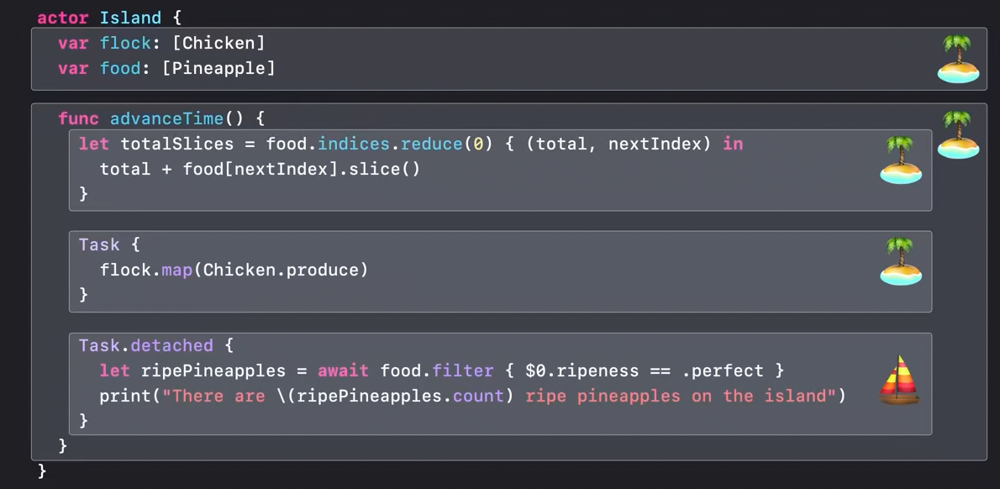
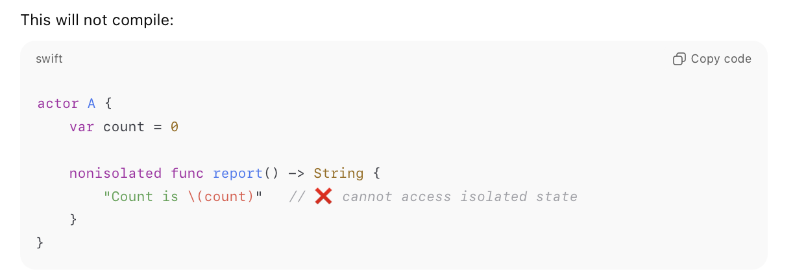
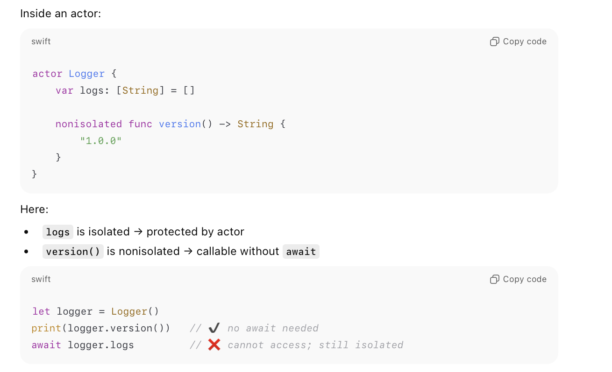

[toc]

##### Actor Isolation

The fact that only code running inside an actor can access its mutable state directly (everyone else must go through an `await`) is what is known as **Actor Isolation**. After all, that is what makes actors safe.

> A detached task does not inherit actor isolation from its context, i.e. it does not inherit same actor as the code which actually created the task. Consequently if it wants to access any actor isolated code from the context where it was created, it has to use `await`. The 'await' in 'Task.detached' 👇 (from 'WWDC 2022: Eliminate data races using Swift Concurrency').   

##### nonisolated members

The above (i.e. requiring asynchronous access to actor from outside) is what can be mitigated by using **nonisolated** qualifier. It decrees that 'this method or property does NOT require actor isolation. It can be accessed from anywhere without await'

###### Can be used only when method is not accessing mutable state

`nonisolated`  can be specified only if the method is not accessing any mutable state.

###### Usecase - When methods don't access anything mutable

###### Usecase - For declaring protocol conformance

A practical use of this is in case of declaring protocol conformance if the contract for those are not asynchronous (even when the function is accessing only nonmutable state of the actor).

| Error when implemented synchronously | Compiles if `nonisolated` is used |
| ------------------------------------ | --------------------------------- |
|         |      |

> FWIW, nonisolated code is not run on any actor's execution context (it always runs on a 'global cooperative pool').

[(Antoine Lee article on Actors)](https://www.avanderlee.com/swift/actors/)

Note though that if the protocol's conformance requires implementation of static functions its not an issue, `nonisolated` does not need to be specified. Static members cannot isolate to an actor instance anyway.

###### Resources

[Useful link - Swift Lee](https://www.avanderlee.com/swift/nonisolated-isolated/)  [ChatGPT - nonisolated](https://chatgpt.com/c/69220951-06e8-832b-9da6-cc3111beda65)

