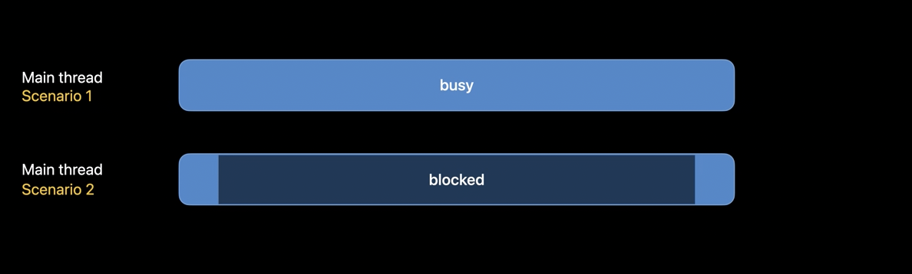
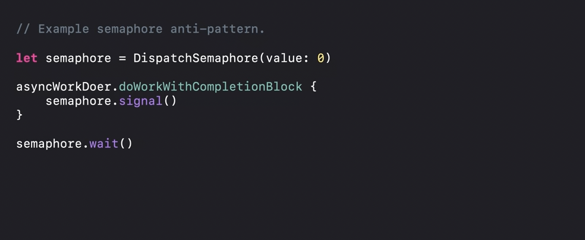
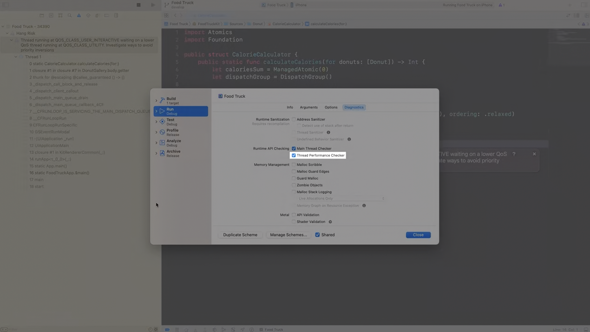
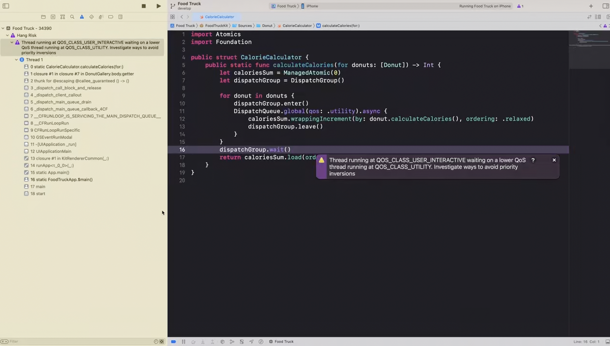
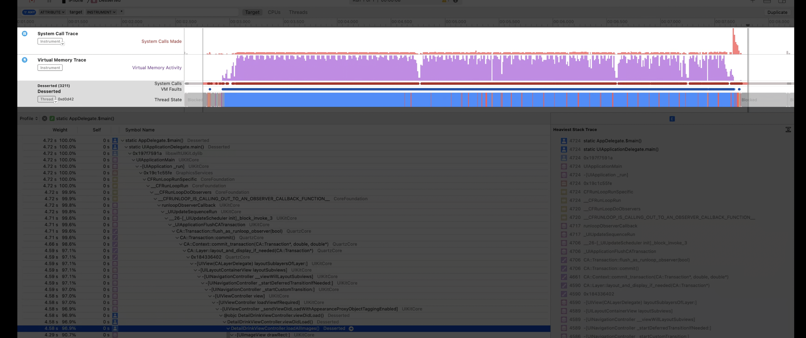
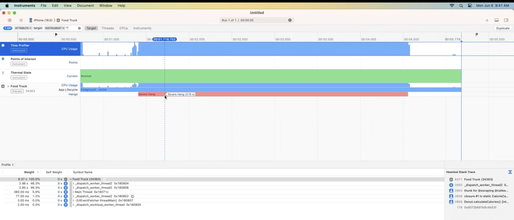
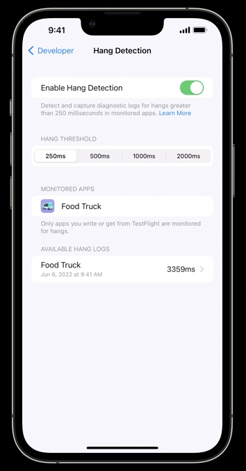
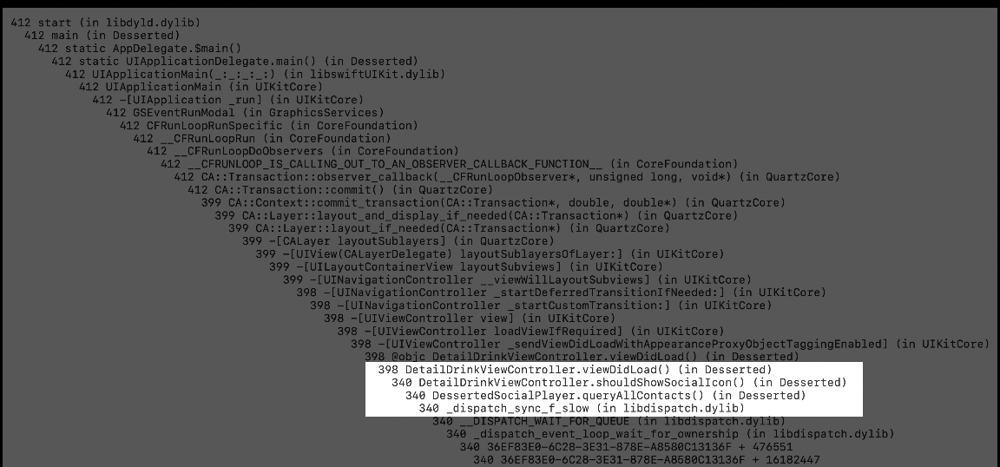
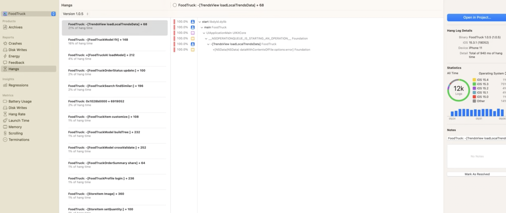
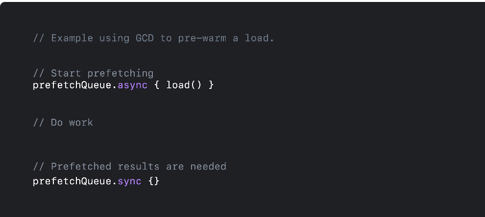

[toc]

WWDC 2021 - Understand and eliminate hangs from your app - k  WWDC 2022 - Track down hangs with Xcode and on-device detection - k  WWDC 2023 - Analyze hangs with Instruments  

#### What is an Application Hang

The `Main RunLoop` is a loop the application's main thread enters to run event handlers in response to incoming events (primarily user interactions). If processing the event takes a long time, there'll be a delay between the user input and any UI update. When this delay is quite a lot to be noticeable, that is what is termed as an `Application Hang`. In general, a delay of over one second always looks like a hang. While scrolling even a delay of 0.5 second can look like a hang.

When an application hang happens, things become even worse for the user as incoming events get piled up and cannot be handled by the main thread. So while one event is taking time to be handled, other events are piling up anyway.

#### What are the causes

A hang occurs when there's too much work being done on the main thread.

The time that the main thread takes while processing a event can be split into two cases. Either the main thread itself is busy doing work or the main thread is blocked by another thread or system resource.

##### Common causes for the main thread being busy

Proactively doing work is doing more than whats necessary to update UI, keeping the main thread busy for longer.

Another cause for hangs is performing irrelevant work on the main thread. Note that the main thread services blocks from the main dispatch queue, but it can also service blocks from other queues via dispatch sync. Consider an app with a low priority serial dispatch queue, perhaps a maintenance queue. If the main thread dispatch synced a block onto the maintenanceQueue, it would have to wait for all pending blocks on that queue to execute before the enqueued block runs. Similarly, if a block is dispatched onto the main queue from another queue, that block has to execute on the main thread.This holds even if the block is enqueued via a dispatch async.

One more cause for hangs is using suboptimal API. Be sure to read API docs so you can use the best one for the task at hand.

##### Causes main thread may be blocked

Synchronous APIs block execution from the time they're called to the time they return. These should not be used on the main thread if the API does a lot of work or has the potential to block for a long period of time. One such case is if the main thread of an app makes synchronous requests to the network. 

Another way to block the main thread is on a system resource, as these are often constrained. File I/O is one of the most commonly used, and contended, system resources. 

Data stores, which do not support concurrency, are especially problematic. If the main thread attempts to read from one while writes are already occurring, that read would be pushed out until all writers complete, which may be unbounded.

Another cause for hangs is synchronization. By definition, synchronization primitives can block execution, so it is important to limit, and be cautious of, synchronizing from the main thread.

The thread it synchronizes with can take a long time to release an implicit or explicit lock. These are some common primitives to look out for, including the `@synchronized` directive, dispatch sync, os unfair lock, and posix locks. Specifically, be aware of semaphore use, as they do not propagate priority and can lengthen a hang due to preemption. A common anti-pattern is when trying to make asynchronous API act synchronous by waiting on a semaphore. This should always be avoided on the main thread.

One more way to block the main thread is by doing work, IPC, or using system resources to fetch the value of something which doesn't change often.

#### Tools for monitoring and triaging hangs

##### Using Thread Performance Checker

The `Thread Performance Checker` in Xcode alerts you to hang-causing threading issues while debugging your app.

I notifies you in the Xcode Issue Navigator when it detects priority inversions and non-UI work on the main thread of your app, both of which are common causes of hangs.

To use it enable the `Thread Performance Checker` tool from the Diagnostics section of the appropriate scheme.

##### Using Instruments

The `Time Profiler instrument` allows to inspect what the app is doing during a hand by showing your application’s callstacks over time, indicating exactly what's executing. It presents a call tree by aggregating main-thread callstacks for the duration.

Red line indicates system calls, the purple graph indicates virtual memory faults, and the horizontal blue bar indicates the main thread is busy doing work.

Since Xcode 14, the Time Profiler instrument detects hangs and labels them directly in the corresponding process track. There is a hang being detected and labeled in the timeline. The hang duration is also specified to help evaluate the severity of the issue. 

> There is also a new standalone `Hang Tracing instrument` that exists since Xcode 14.

##### Using On-device hang detection

`On-device hang detection` provides hang detection without using Xcode or tracing, providing real-time hang notifications and supporting diagnostics while using your development-signed or TestFlight app. This was introduced in iOS 16. Its a developer settings that needs to be opted in.

Note that these diagnostics are best-effort and processed in the background at a low priority to minimize performance overhead. a passive notification is displayed when new diagnostics become available. It provides both a text-based hang log and a tailspin for the detected hang.  For a deeper investigation, open the tailspin in Instruments for viewing the thread interaction within your process or identifying the usage of system resources.

##### Using MetricKit

Once the application has shipped, MetricKit can be used to collect call trees for hangs hit in the field. MetricKit returns a call tree by aggregating callstacks taken during a hang. This tree format is similar to what the time profiler presents. 

These can be accessed both from Xcode Organizer and App Store Connect APIs.

#### Common strategies to fix hangs

Reduce the amount of work done on the main thread. Use caches (such as `NSCache`) as possible.

Notification observers are another way to reduce work on the main thread. They allow the app to react to changes in a value or state, without having to do expensive, on-demand computation. 

The most straightforward way to perform asynchronous operations from the main thread is to use asynchronous counterparts of synchronous APIs. For example, by using `async` NSURL counterparts to synchronous networking APIs, apps will be responsive. Asynchronous APIs are often indicated by the word "asynchronously" or the presence of a completion handler in the method name.

Grand Central Dispatch is a powerful multi-threading mechanism, which you can leverage in cases where there aren't async API variants. To perform a block of work asynchronously on another thread, dispatch async that block to another dispatch queue.

Grand Central Dispatch also enables you to pre-warm computation.  By dispatch asyncing a task onto a queue, perhaps a prefetchQueue, the task will start executing while the main thread stays free to do other work. When these results are needed by the main thread, it can dispatch sync onto the prefetchQueue to wait for the task to complete. We've just touched the surface of what GCD can do.

Using `dispatch_sync` with serial queues is a great way to synchronize operations when needed. 

