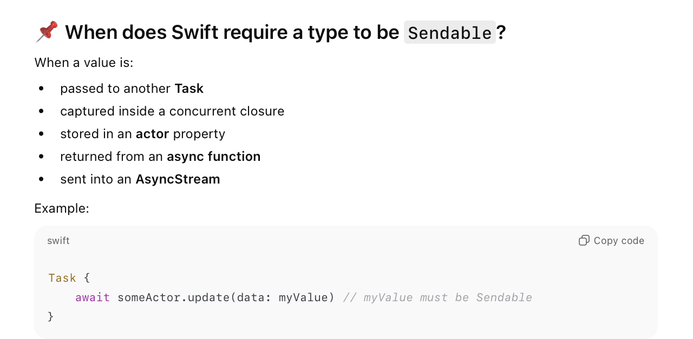
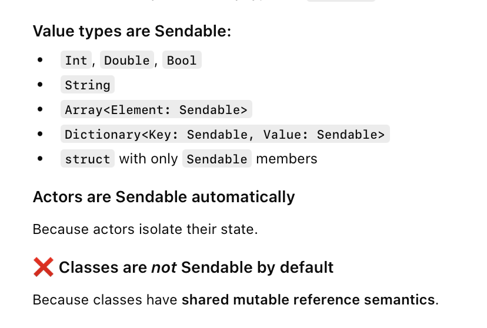
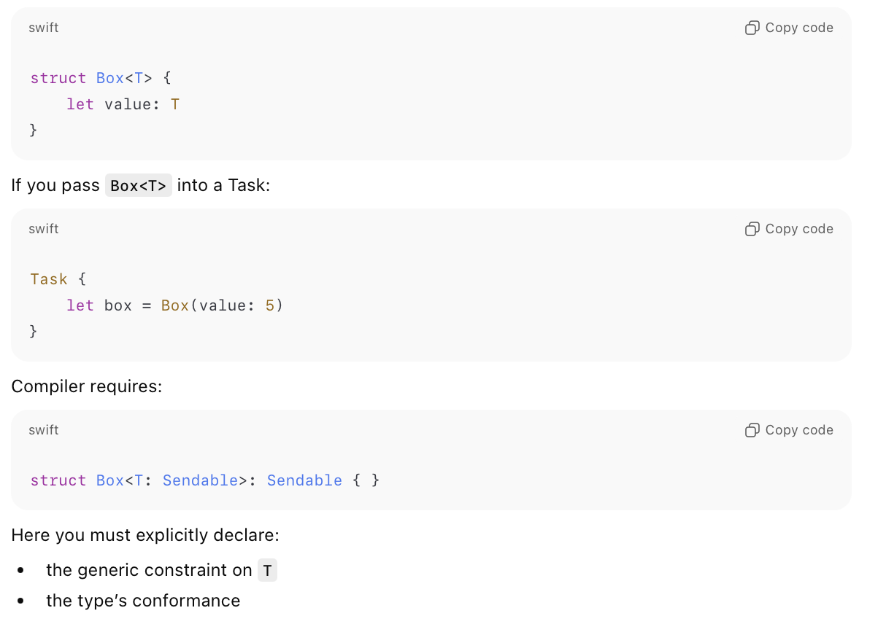
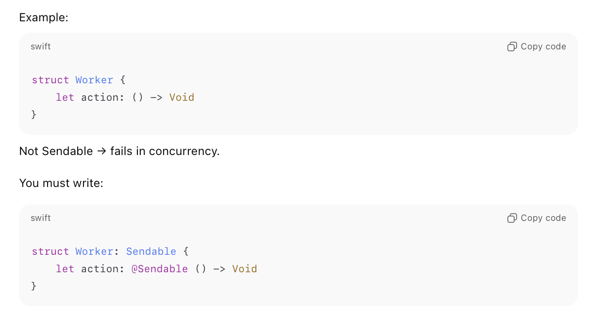
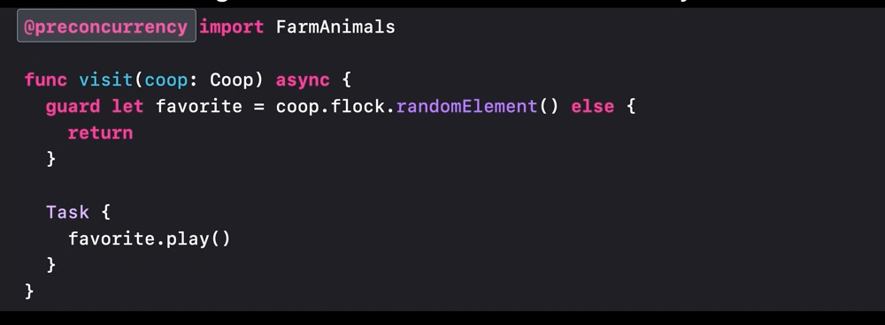
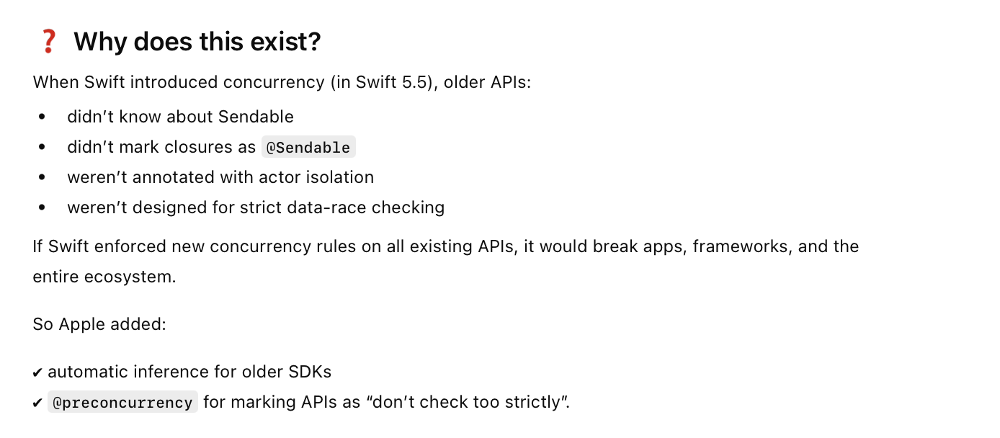
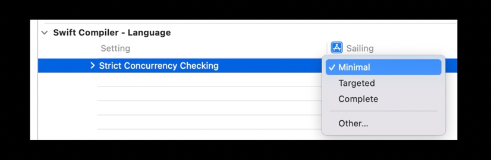

[toc]

##### Why it exists and What is it

So the thing with using actors and other thread safety constructs is that while they help improve thread safety, they can't always guarnatee thready saftey if they are not implemented properly. As of iOS26/Swift 6, its possible for the compiler to catch plenty of such possible thread safety issues itself using static analysis, and **Sendable** is basically something which helps the compiler do that.

Technically **Sendable** a marker protocol (i.e. a protocol with no method requirements) that is supposed to indicate thread safety for the conforming type. For some primitive types, the compiler just knows that they are indeed thread safe and hence a Sendable conformance need not be explicity declared for them. But for the rest, it has to be declared and then compiler tries to verify it, and if the compiler is not able to verify it but you know that they are then they need to be marked as **@unchecked Sendable** conformant (the compiler does not try to verify their thread safety, and you can build the code, but then the onus for its correctness is on you). 

```swift
public protocol Sendable { }
```

##### When does a type need to be Sendable

Swift (Swift 6 onwards) looks to do all this static analysis for all data types which it feels might get used across multiple threads. And when it cannot infer their thread safety, which can happen for custom data types that its when it needs them to be declared Sendable conformant. Its all static check though.



##### What types are already Sendable

Value types and Actors are Sendable already (unless there is some property in it that is not Sendable?). Classes however are not Sendable by default.



##### Generic types and Sendable

When a generic type is used across threads, Swift requires the generic type too to be marked as Sendable conformant even if the underlying data type is something like a struct which otherwise may not have needed Sendable conformance.



##### Making classes sendable

Classes are never automatically inferred as Sendable. For classes to be marked Sendable, all its properties should be Sendable, and the class must be immutable, and marked `final`?.

```
final class Settings: Sendable { ... }
```

It should be used very carefully though.

##### Closures and Sendable

Closures too may need to be marked Sendable if they are being used inside classes or structs that have been marked as Sendable. And they can be marked Sendable only if they don't capture non-Sendable data.



> Also check in 2021 video 'Protect mutable state with actors' 21:23 to 23:30. <br>

##### @unchecked Sendable

When a type is safe but Swift is unable to statically confirm it, it will give an error. In such case the static checks can be suppressed by marking the type as **@unchecked Sendable** conformant.

```swift
final class MyType: @unchecked Sendable {
    // compiler won't check safety
}
```

##### @preconcurrency

**@preconcurrency ** can be used to ignore Sendable checks for code coming from a particular module/package, handy if that package has not updated its types to Sendable yet. It can be used while importing modules, and also with specific functions. It should however be used with extreme caution.





##### Enforcement based on Swift version

Swift 6 mandatorily checks for Sendable conformance for any data it feelds is shared across threads/ <br>Swift 5 did not require Sendable conformance, but if added it does check for Sendable confirmance and only gave warning in case some Sendable confirmance looked incorrect to it.

In 2022 (~Swift 5.7) and the Xcode version then, a new build setting was added to decide how strictly should the compiler check for Sendable types




##### Resources

[Chat GPT link ~2025](https://chatgpt.com/c/69225367-6274-832c-8c9e-3dd2e7233d98) <br>[Jared Sinclair article](https://jaredsinclair.com/2024/11/12/beware-unchecked.html)
