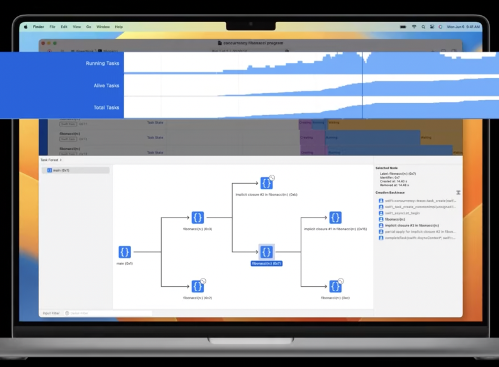

WWDC 2022: Visualize and optimize Swift concurrency

Need to watch the video. 

Basicaly there is now a 'Swift concurrency' profiling template that includes instruments for **Running Tasks**, which show you how many tasks are executing simultaneously. Next, we have **Alive Tasks**, which show how many tasks are present at a given point in time. And finally, **Total Tasks**; graph the total number of tasks that have been created up until that point in time. 

----

Various issues that can happen even with Swift concurrency if not done properly - 

Main actor blocked for too long (i.e. main thread getting blocked)  Actor contention, Thread Pool exhaustion (performance by reducing parallel execution)  Contination misuse (can cause leaks or crash)
