[toc]

#### Thread Sanitizer

In edit scheme's Run - Diagnostics option, 'Thread Sanitizer' option can be checked to get a report on all race conditions that happened while running the app. In fact there is also a checkbox to pause execution when an issue (such as race conditon) occurs.

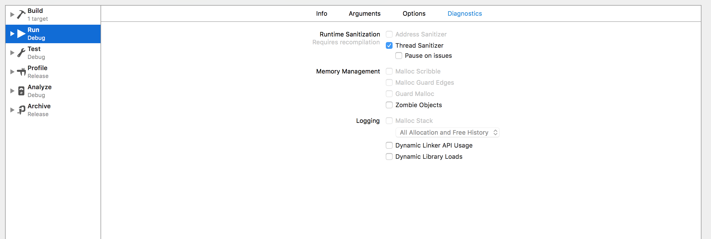

It shows the threads and the part of code where race conditions occurred.

#### Run Loop

A `run loop` is an event processing loop that can be used to schedule work and coordinate the receipt of incoming events. The purpose of a run loop is to keep the thread busy when there is work to do and put the thread to sleep when there is none. It is a loop the thread enters and uses to run event handlers in response to incoming events. Run loops can be run in different modes. Each mode defines a set of events the run loop is going to react to. If a run loop has no input sources configured, every attempt to run it will exit immediately.

A run loop is always bound to one particular thread.

> Explained in some details in 'WWDC 2015: Building responsive and efficient apps with GCD': 28:23 - 31:38.

How it differs from queues | Timer APIs
--- | ---
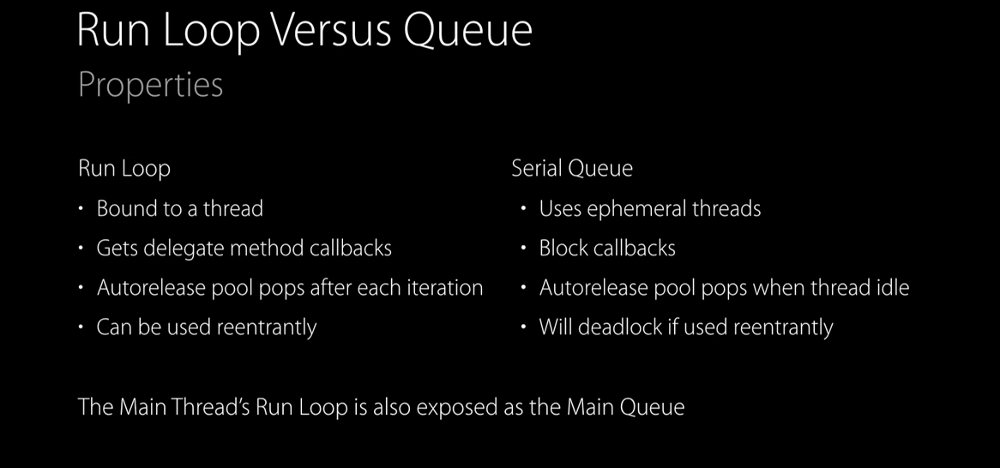 | 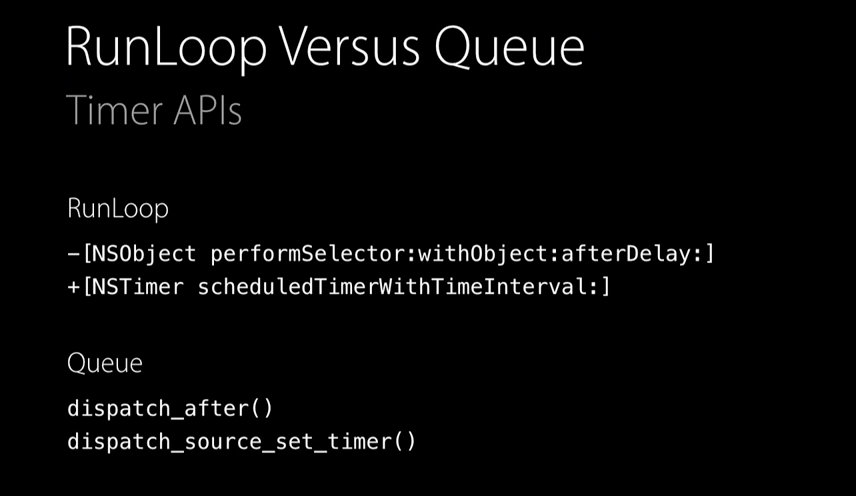

#### Understanding threads in crash logs when using GCD

_As of 2015, with GCD 👇 (explained in 'WWDC 2015: Building responsive and efficient apps with GCD': 40:00)_

The manager thread is something that is visible to see in almost all code using GCD using applications. It's there to help process dispatch sources. It is the root frame and can generally be ignored.

There can be idle threads from the thread pool shown too. They are indicated by `workq_kernreturn`. An active thread however will usually start with (i.e. will be towards the end of the frame) `start_wqthread` and will then also have `dispatch_client_callout` somewhere in between followed by custom code. The custom name given to dispatch queue will also be visible.

Idle thread | Active thread | Manager thread
--- | --- | ---
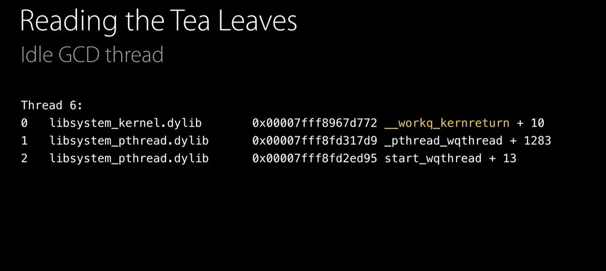 | 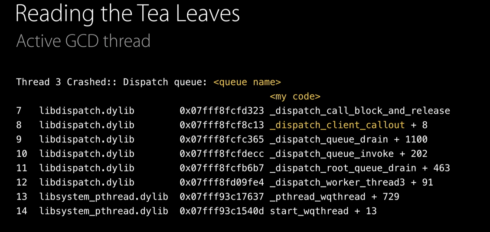 | 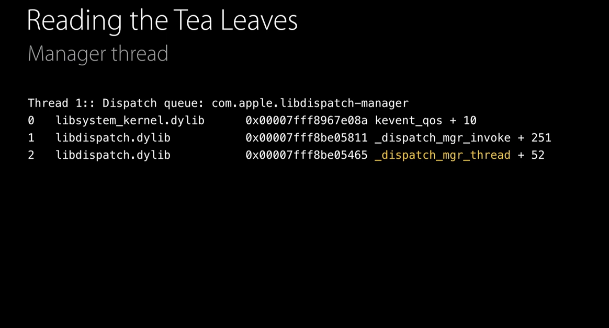

When the main thread is idle, its at `mach_msg_trap`, `CFRunLoopServiceMachPort`, and `CFRunLoopRun` and there will be `com.apple.main-thread`. Whereas if the main queue is active, something like `CFRUNLOOP_IS_SERVICING_THE_MAIN_DISPATCH_QUEUE` will be visible.

Main queue when idle | Main queue when active
--- | ---
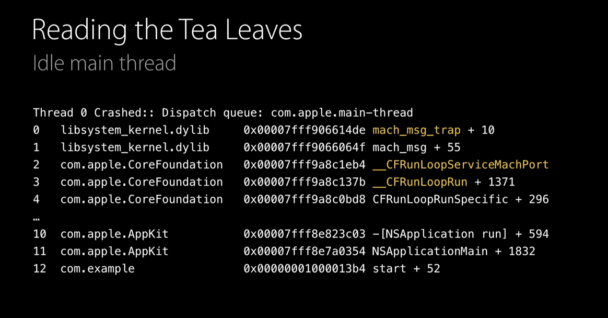 | 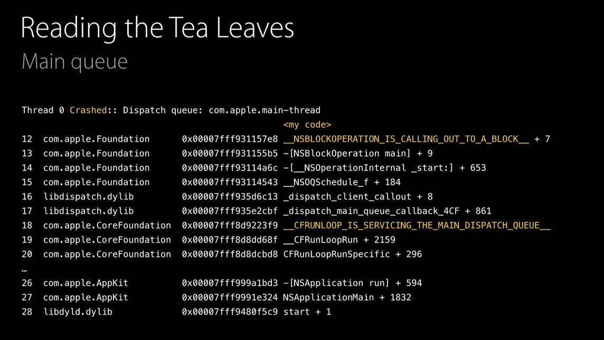

---------

GCD code | Swift concurrency code
--- | ---
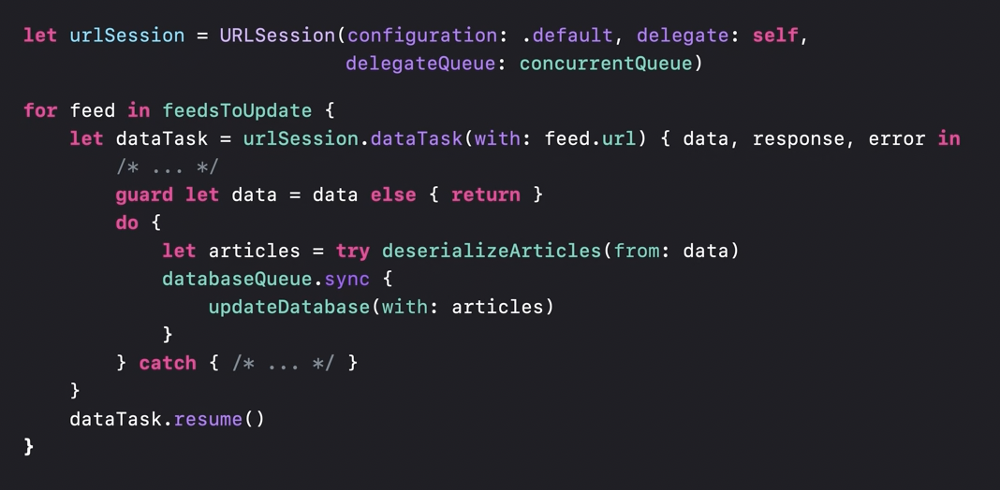 | 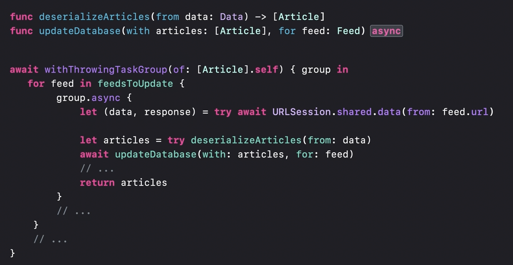

#### Per-thread local storage using pthread_key_t

> There is a code snippet in 'Swift Secrets' book > 'UNIX and I/O fundamentals' chapter > 'Threads and GCD'. Its basically a more performant way to achieve per-thread data without using any locks.

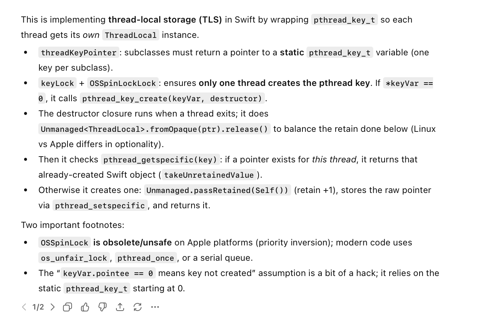

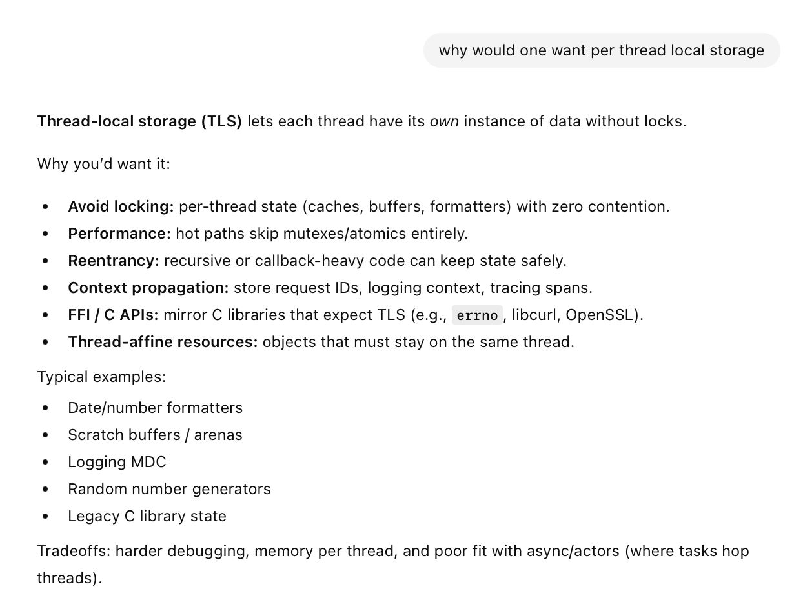

[ChatGPT link](https://chatgpt.com/g/g-p-6934bcdfcafc819182baa9435e044320-swift-programs/c/694ef72e-5be4-8326-b49f-263d52e95c77)

#### Bailing out of runtime errors, SIGABRT, etc.

> From 'Swift Secrets > UNIX and I/O Fundamentals chapter > Signals, longjmp, and Fotify'

UNIX has long had a **longjmp()** function that can rewind the stack to a previously agreed point set up by calling the **setjmp()** function. There is an open source code called Fortify.swift ([GH link](https://github.com/johnno1962/Fortify/blob/main/Sources/Fortify.swift)) that uses this to even handle runtime errors and process termination signals.

Debugging aside, this can have some real uses (for example with web servers).

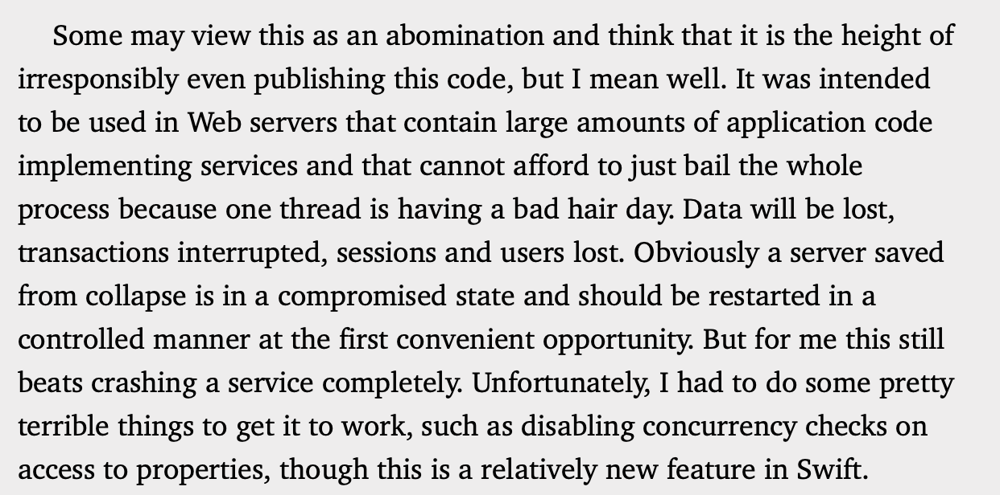

---------

CPU strategy view in Instruments

the main thread is special. It gets both a main run loop and a main queue.

