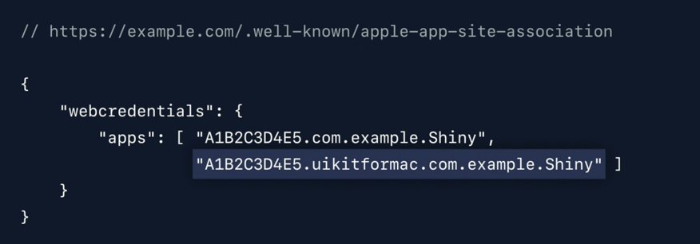
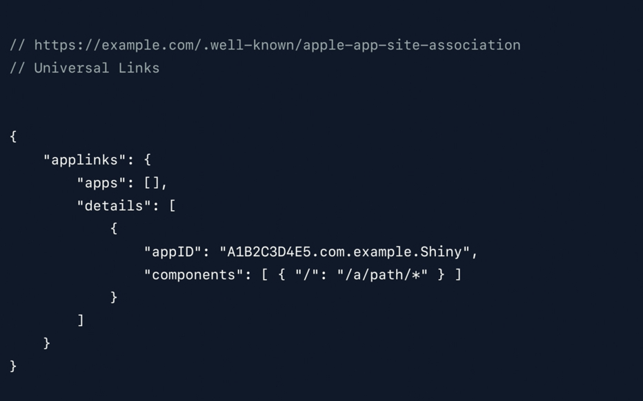
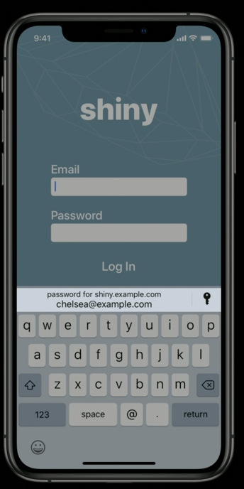
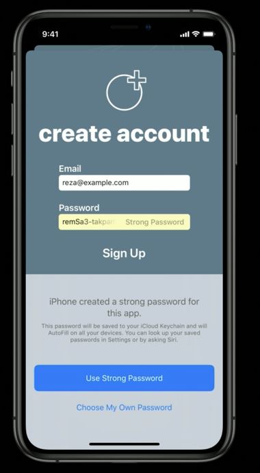

In iOS 12, the AuthenticationSession API didn't need any information about view or windows from code. Now, you'll give the session a presentationContextProvider, and that presentationContextProvider will provide a window via the PresentationAnchor method.

##### USB Security Keys for macOS apps

The 'WWDC 2019 - What's New in Authentication' talk also talks about support for USB security keys for macOS apps (at 16:20 mark).

##### Sign In with Apple

Has 2 factor authentication already (used for Apple ID already).

Provides cross platforms experience (even available for Android, through websites).

Likely has some mechanism to also account for any existing user accounts that the integrator already has for the current user.

It can be integrated in apps using `AuthenticationServices` framework

###### Useful Resources

Introduced in 'WWDC 2019 - What's New in Authentication' talk in the initial part.

'WWDC 2019 - Introducing Sign In with Apple' explains it

##### Password autofill

WWDC 2017 - Introducing Password Autofill For Apps

WWDC 2019 - What's New in Authentication (4:20 mark, again at 7:31 mark)

Available for iPad apps for Mac too (since 2019). The app's App ID has to be listed on your server in order to tie your app and your website together. 

If `webcredentials` are being used in apple-app-site-associations file (likely related to universal links, read about it), appID should be added there. If however universal links are being used, the `appID` should be added to the appID key (this key was introduced with iOS 13 in 2019).

| If using webcredentials      | If using universal links     | What it looks like           |
| ---------------------------- | ---------------------------- | ---------------------------- |
|  |  |  |

##### Warnings for weak passwords

If the user is using a weak password, websites can seek Safari's help to detect that and get a strong password recommended. It requires integration on website's side. Here is what the experience looks like. Introduced in 'WWDC 2019 - What's New in Authentication' talk at around 11:50 mark.

