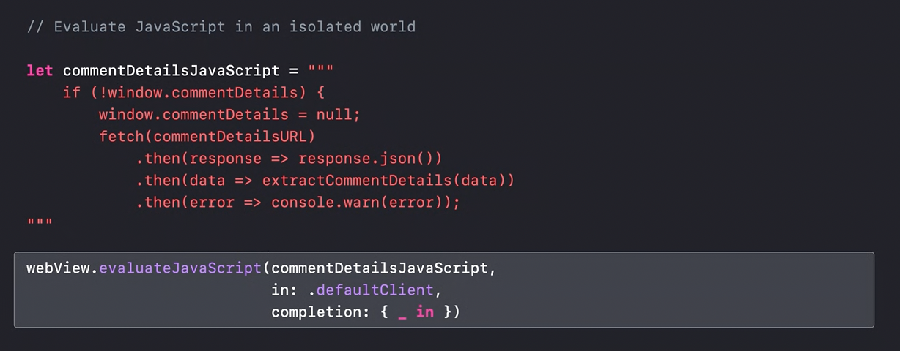
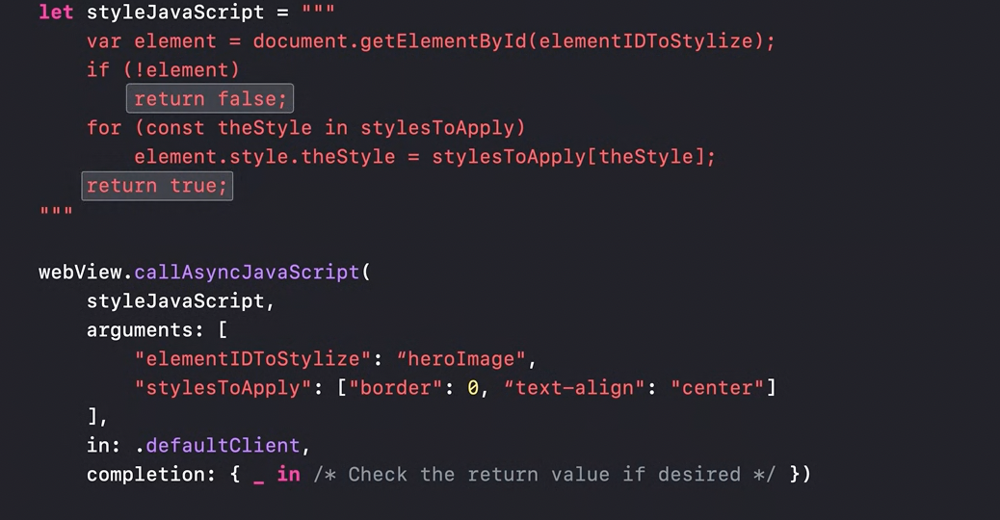
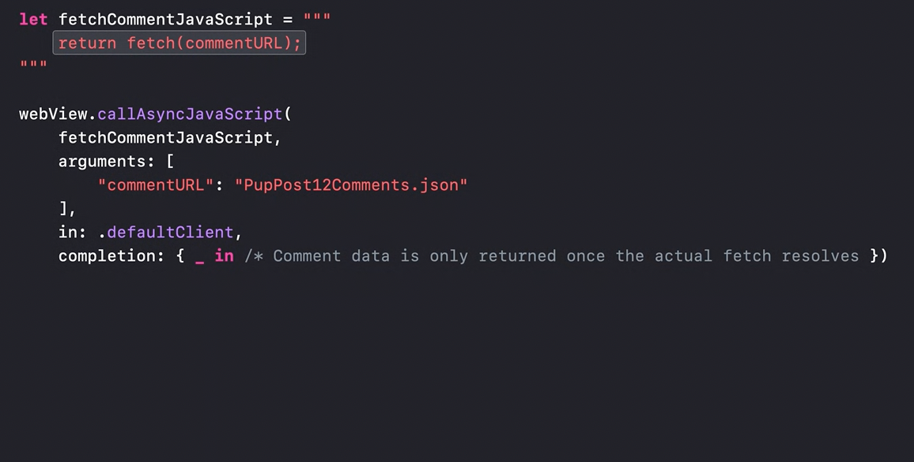
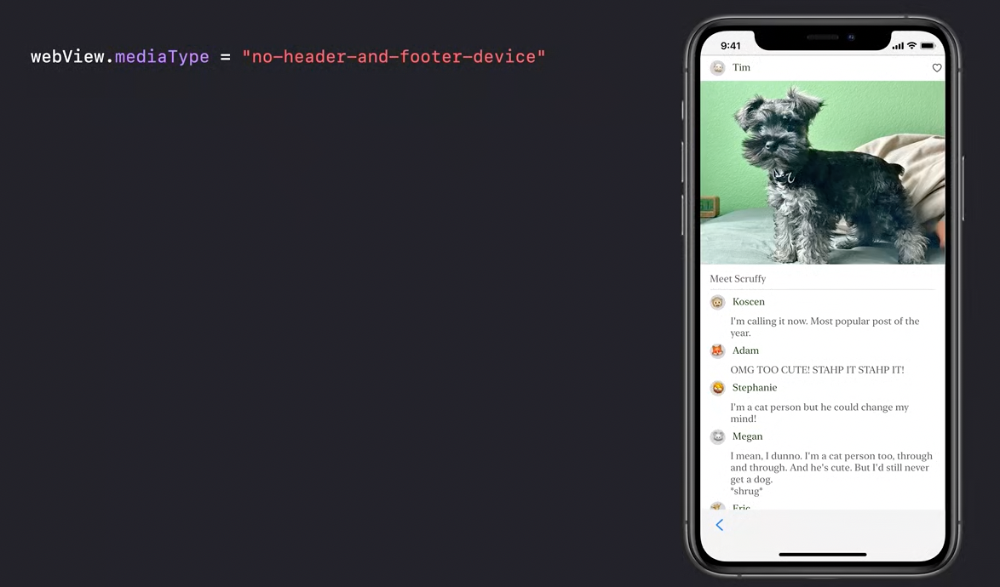
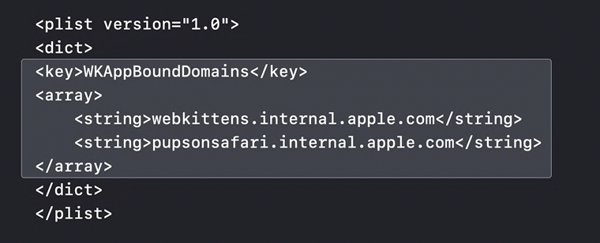
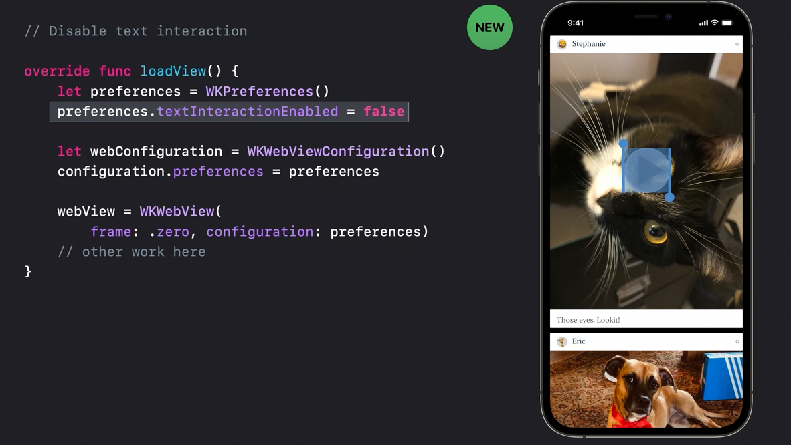
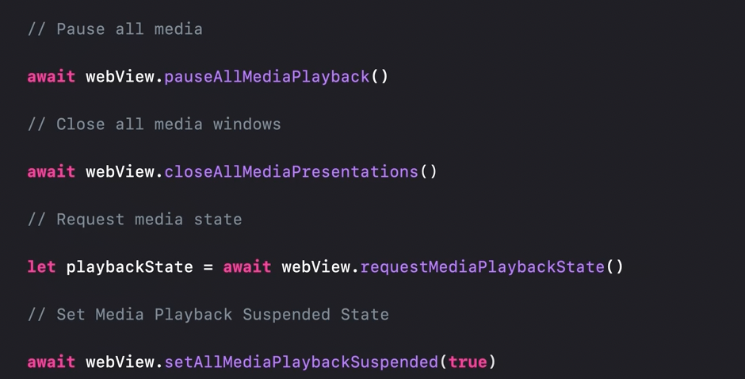
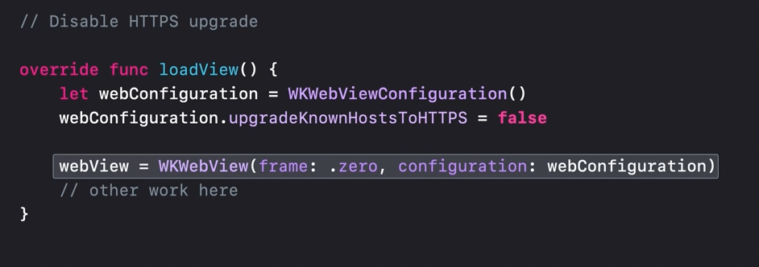
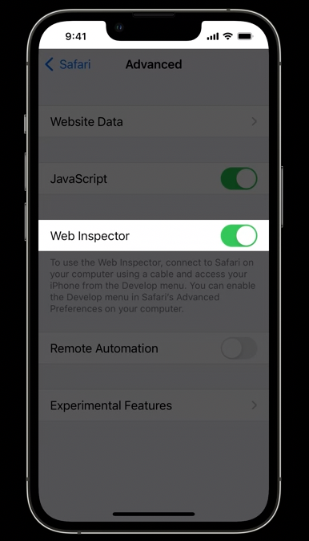

[toc]

#### WWDC20  - Discover WKWebView enhancements	

If you primarily need an in-app web browser and don't need deep customization of that experience, SFSafariViewController is the best choice for you and your users. Your users get Reader, content blockers, autofill and more, and you get a browser in a box. Built on top of WKWebView.

When you need a higher degree of configurability or are using web content in ways unrelated to browsing, you can also build on WKWebView directly. Isolates web content in a separate process. 

APIs to help you isolate your app and web content from one another.

Interact with web content via JavaScript.

##### WKWebPagePreferences

The WKWebView API has always had a way to disable JavaScript by setting the javaScriptEnabled property of WKPreferences to "false." deprecated that setting this year and we've added something new. using the allowsContentJavaScript setting on WKWebPagePreferences, you disable only the JavaScript that comes from the web page content itself. In-line scripts, remotely referenced JavaScript files, JavaScript URLs, everything. But your application's JavaScript will continue working.

`WKWebPagePreferences` API allows configuring certain behaviors on a per-navigation basis. 

> Disabling contentJS in webviews can also smoothen scrolling in the web view?

##### WKContentWorld

Its possible that JS injected by app into a webview has some symbols that the webpage's JS already has, in which case there can be conflicts. To fix this, we'll need an isolated place for our JavaScript to run separate from the application JavaScript. Our own global object. That is where `WKContentWorld` helps. 

A `WKContentWorld` is an isolated sandbox for JavaScript to run in.  it's like having your own separate window object for the same page content. There is a page world representing the web content itself, and then there are client worlds representing one or more homes for your application's JavaScript. Your application's JavaScript run in a client world can still do things like call built-in DOM APIs on the page or change the DOM itself, but it will never see the application state set up by the page's JavaScript. Likewise, the page's JavaScript will never see yours.

The fix. use the `defaultClient` world for all of my `evaluateJavaScript` calls. my app's JavaScript and the JavaScript on the page no longer conflict

You can also inject `WKScriptMessageHandlers` into a specific content world to isolate them as well.

##### callAsyncJavaScript

I can write JavaScript naturally without having to construct a string from arguments. Serialization and deserialization of argument types happens automatically. . If your JavaScript returns a promise, then your completion handler is not called right away. Instead, it waits for the promise to resolve and is called with the result of that fulfillment. `postMessageWithReplies`.

##### WKScriptMessageHandler

I wanted my native app to listen for new comments too so I can notify my native code, and I do that using `WKScriptMessageHandler`.

##### pageZoom property

new pageZoom property on WKWebView. This is actually the same property that drives command-plus and command-minus full-page-zoom in Safari.

##### mediaType property

By setting a custom mediaType on my WKWebView, I can easily get rid of those elements and also adopt any other styles that might come along for a custom app like mine, all without JavaScript, and globally instead of per navigation.

##### findString, sharing

an easy-to-use `findString` that behaves like others on the platform. If a result is found, it is selected and scrolled into view.

ability to take a bitmap snapshot of its contents. a feature to zoom in on the full-resolution version of this photo, another great way of sharing this content would be as a PDF.

With `createWebArchiveData`, I can now take that snapshot of web content for later debugging and testing. Can load webArchive content.

##### Intelligent Tracking Prevention, or ITP

ITP uses various client-side heuristics and machine learning to identify, classify and thwart trackers.  in iOS 14 and macOS Big Sur, ITP is enabled by default on all WKWebView apps. If needed, your users can switch off ITP for compatibility with a website you don't control

##### App bound domains

WKWebView has a new feature called App-bound domains. The idea is simple. You specify which domains are the core part of the implementation of your app. Deep interaction with the web content not core to your app is disabled for both the code you write and any other code you might bring in from frameworks or libraries.  You just need to add an entry for `WKAppBoundDomains` to your app's info.Plist. Loading any other domain still works, but deep interaction with other domains is prevented at a technological level. It's even possible to disable deep interaction with all domains in your app by simply adding the key to your info.Plist with an empty set of values.

#### WWDC21 - Explore WKWebView additions

##### SafariViewController improvements

in iOS 15, we have added a new API to bring one of your app extensions to a customized button on Safari view controller. You can map this button to one of your app's share extensions, and you can even set an image for that button that will best represent the extension that will run, allowing users to run your app extensions directly from the toolbar, including running JavaScript on the page. 

##### Avoiding JavaScript injection when possible

 There are also some features that are just incompatible with injected JavaScript. Like app-bound domains, but to use that any JS should not be injected. Injecting JS also does not let one use ApplePay. we've added several new APIs to allow you to easily interact with the content in your web view without having to deal with injecting JavaScript.

access the pages' theme color and related colors for a website.

a way to disable text interaction

being able to control media playback in your web view.  Previously, if you wanted to pause or suspend media that was playing in your web view, you'd need to inject JavaScript. You'd also need to find the specific element in the DOM to be able to control it. But now, we have a simple API that makes it easy to control the state of media in your web view. `setAllMediaPlaybackSuspended`, `pauseAllMediaPlayback`

##### New browser-level APIs

several browser-level APIs that will give you access to functionality that previously has only been available in Safari. 

###### HTTPS override flag

 we are taking HTTP requests to sites that we know support HTTPS and upgrading them for you. In order to get this added security, you don't need to do anything at all! But, if you do need to turn it off for some local debugging, there's an easy flag to set on configuration

###### media capture or -- as it known on the web -- getUserMedia

Allows WebRTC functions to work inside your app. 

When you load your web content from a custom scheme handler, the user request prompt will show your app as the origin of the request, rather than show a request from the website URL. If you want the prompt to remain as a request from the URL, just load without the custom scheme handler, and the prompt will be shown as it is today. 

a new API to allow you to decide when and how to prompt the user for camera and microphone permissions when working with web content.

###### a new API to manage downloads from web views

There are three ways to initiate a download. The web content can initiate a download, the server can initiate a download, and the app can initiate a download. 

Lot here, try out

#### WWDC22 - What's new in WKWebView

The new features available to WKWebView this year come in four categories: new ways to interact with web content, new capabilities for content blockers, encrypted media, and use of Remote Web Inspector. 

##### New APIs for interacting with web content

There are three new ways your app can interact with web content in iOS 16: using the full-screen API, using new CSS viewport units, and using find interactions. s games, full screen in browsers, and now they can do that in your apps too.

All you need to do in your app is set `WKPreferences.isElementFullscreenEnabled`. you can observe the value of `WKWebView.fullscreenState`, which will let your app know when the web content is becoming full screen or returning. 

We also have new CSS units to allow web content to lay out according to dynamic viewport sizes. These new CSS units include `svh`, `lvh`, `dvh`, and many others. They allow web developers to modify layout based on the smallest, largest, and dynamic viewport sizes. 

If your app changes the viewport of your WKWebView, then you should inform WebKit up front what the viewport size ranges are. 

If you set `WKWebView.findInteractionEnabled` to true, then your users will be able to use familiar UI and shortcuts like Command-F to search the text on the open page. 

For content blocking, we added a new capability to `WKContentRuleList`, the API used to implement content blockers in Safari. Now you can run regular expressions on the URL of the current frame. 

Another new capability in WKWebView in iPadOS 16 is encrypted media. If you have content that uses the Encrypted Media Extensions and Media Source Extensions APIs, you can now use it in your apps on iPadOS. 

remote web inspector. turn on Web Inspector in Safari settings on the iOS device, then enable the Develop menu in Advanced Settings in Safari on your Mac.  You can explore the DOM, run and debug JavaScript execution, view timelines of your page-loading, etc.

