[toc]

#### Things NSUserActivity allows

(~ As of 2016/iOS10)

**NSUserActivity** [reference](https://developer.apple.com/documentation/foundation/nsuseractivity)

> Most of this is from 'WWDC 2016 - Increase Usage of Your App With Proactive Suggestions'

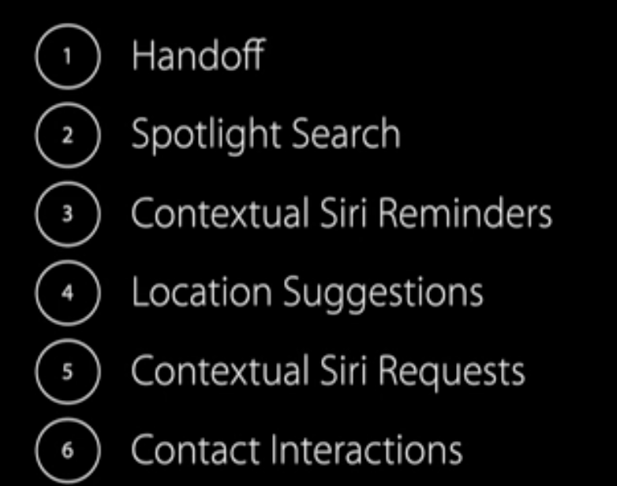

Here is a screenshot of what some of above means. With **Spotlight Search**, the app's contents can show up in Spotlight and then be deep linked from. **Location Suggestions** means that an app that shows a location in some way can have that location be available to the system which can then bring that location up at right places. Similarly **Contact Interactions** implies that a contact app can have some of its contents trickle over to Contacts app automatically.

**Contextual Siri Reminders** and **Contextual Siri Requests** basically means the user is on an app and tells Siri to create a reminder or asks something regarding current screen and Siri is able to do it by using information provided by the app. For example, I may be on VCM screen and tell Siri to create a reminder, and it will automatically create a reminder for apps that are about to expire.

And **Handoff** is well good old Handoff, meaning tell app to continue something on macOS if the user gets near to macOS (with a prompt on macOS).

| Promote app content in Spotlight Search                      | Location suggestion in apps                                  | Promote app content in Contacts app (Contact Interaction)    |
| ------------------------------------------------------------ | ------------------------------------------------------------ | ------------------------------------------------------------ |
| 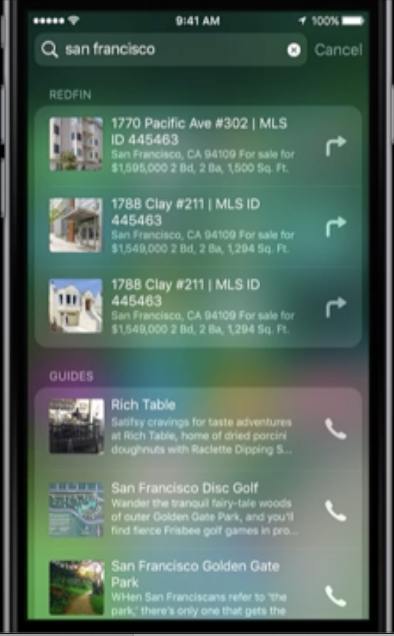 | 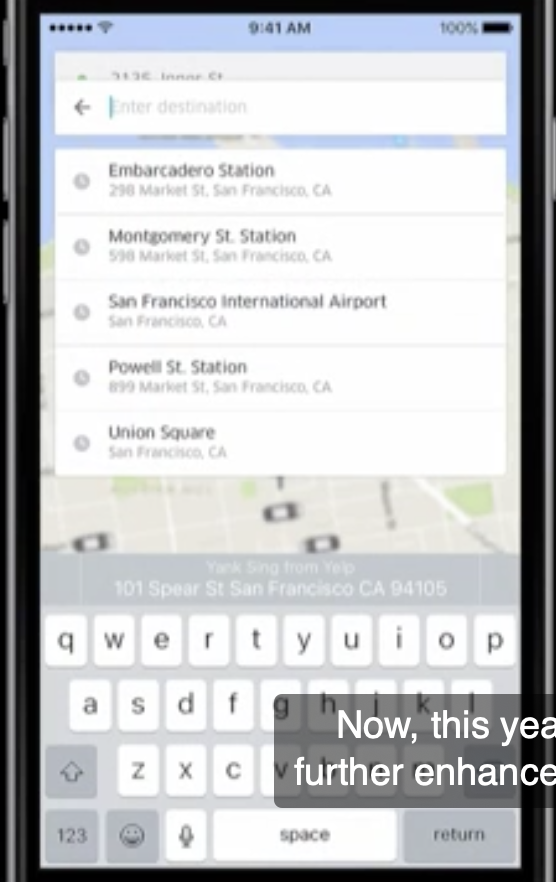 | 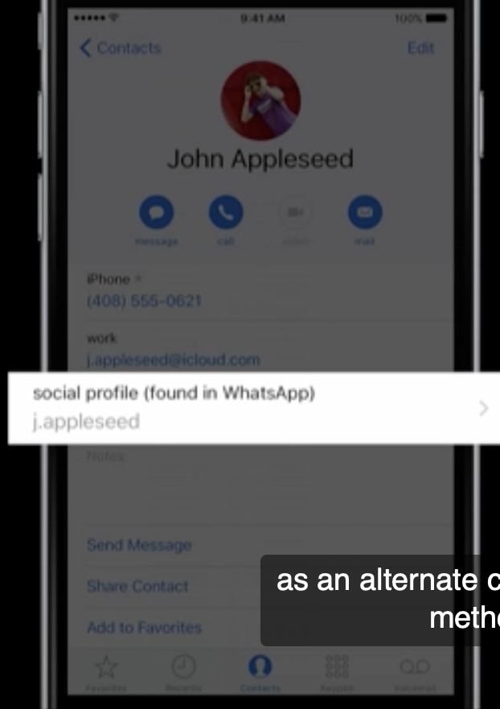 |

#### Promoting Location Suggestion

It can be done from native apps using **NSUserActivity** ([reference](https://developer.apple.com/documentation/foundation/nsuseractivity/#2421663)) and from web apps (i.e. websites) using **schema.org**.

##### Promote location from native apps

In case of promoting from native apps -

> Covered in 'WWDC 2016 - Increase Usage of Your App With Proactive Suggestions' at 16:00 mark

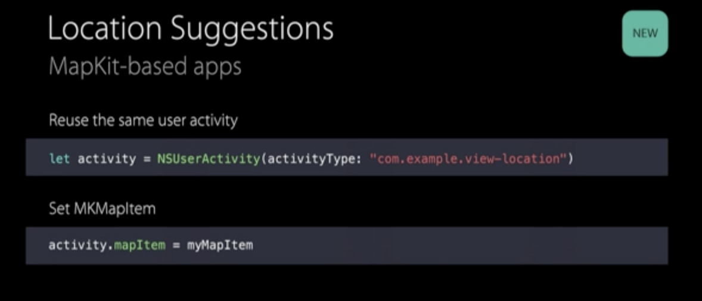

##### Promote location from web apps

In case of promoting from web apps -

> Covered in 'WWDC 2016 - Increase Usage of Your App With Proactive Suggestions' at 30:00 mark

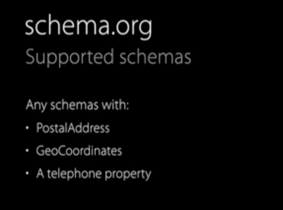

##### Use promoted location in native apps

To then have this location be autofilled in native apps, the textfield, etc. (the responder) should have tha appropriate textContentType set in its textInputTraits. This is also covered in 'WWDC 17 - The Keys to a Better Text Input Experience'.

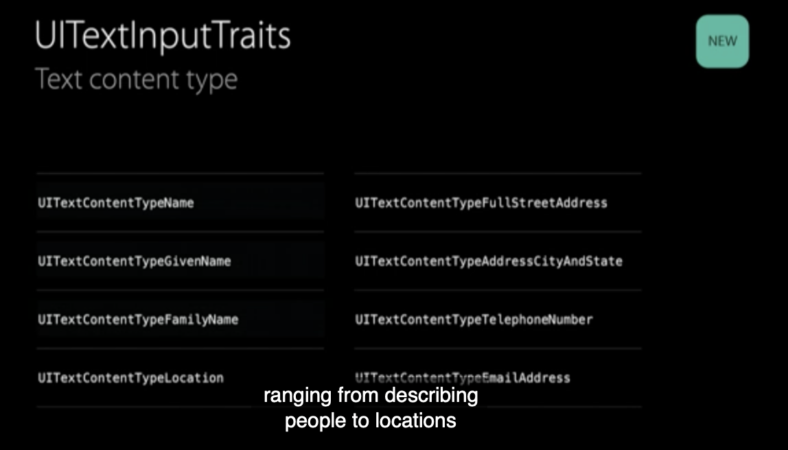

##### Directing promoted location to specific routing app

Routing apps (ie any app that can handle a location, such as Uber, Google Maps, etc.). Register yourself as a routing app using mapKit's **MKDirectionsRequest** and OS learns over time what is a user's preferred routing app and starts showing that at the bottom of app switcher when applicable.

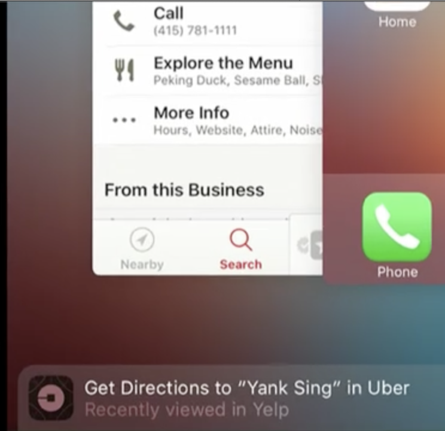

#### Media app suggestions

That is if a media is being promoted, what app gets a chance to handle it first.

> Covered in 'WWDC 2016 - Increase Usage of Your App With Proactive Suggestions' at 43:00 mark

#### Providing content to Spotlight search

Capture the desired current app state as user navigates through the app. Can then be advertised through Handoff if desired. Or add it to Spotlight index.

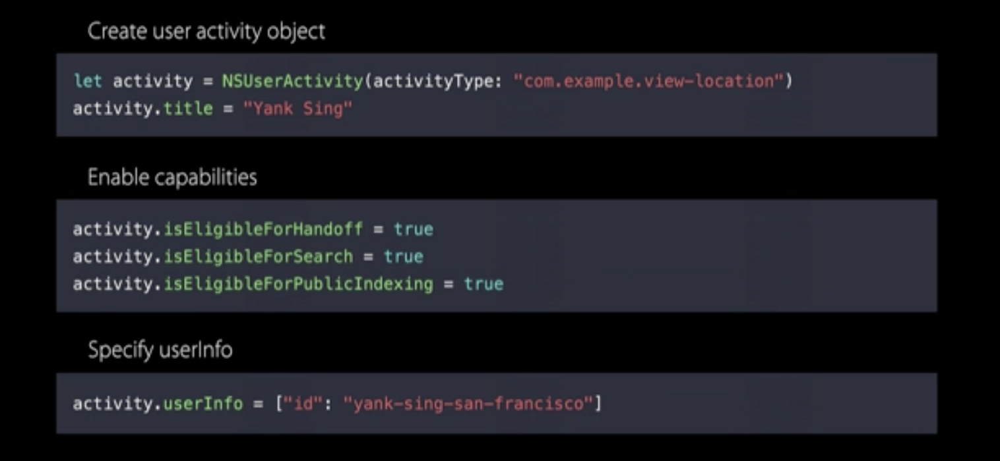

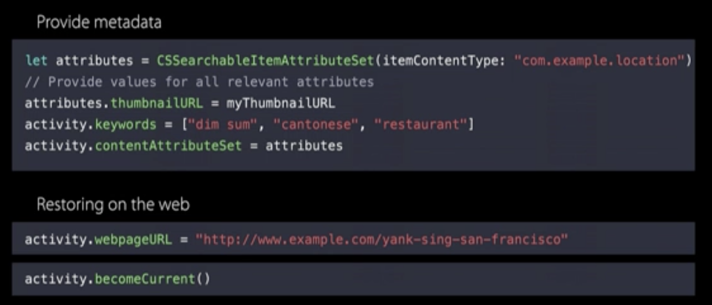

**isEligibleForSearch** is what makes the content available in search. **isEligibleForPublicIndexing** whereas makes the information available on internet too for other devices/users to use. A time duration can also be set for how long such content can stay available in search.

When activity is restored in app by handoff, etc.

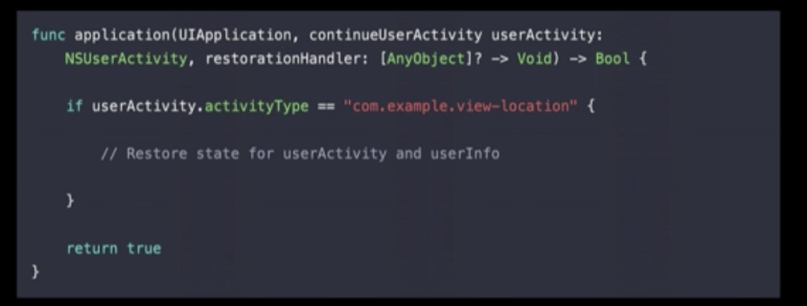

#### WWDC Videos, References

WWDC 2016 - Increase Usage of Your App With Proactive Suggestions (downloaded) - k WWDC 2015 - Introducing Search APIs  WWDC 2015 - Making the most of Search APIs  WWDC 2014 - Adopting Handoff on iOS and OS X

Sample code - Increasing App Usage with Suggestions Based on User Activities ([link](https://developer.apple.com/documentation/foundation/task_management/increasing_app_usage_with_suggestions_based_on_user_activities?language=objc))