##### WWDC 2022: Implement App Shortcuts with App Intents 

App Intents framework  App Shortcuts  

Shortcuts, Spoltlight, Siri

Until 2021 - Shortcuts were created with Add to Siri button or with Shortcuts app  With 2022 - App Shortcuts. Intents available as soon as app is installed, no need to setup. Can still be run from Shortcuts app, Spoltlight, Siri. Discoverability.

Things happen in sourcecode instead of a metadata file.

`AppIntents` framework. Intent needs to confirm to `AppIntent` protocol.

 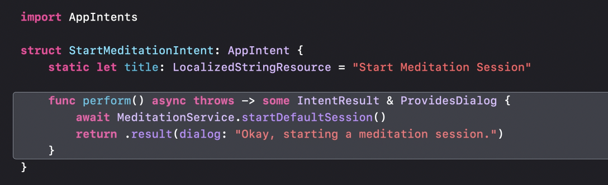

The intent can then appear in the Shortcuts app ('Start Meditation Session' is the app intent below).

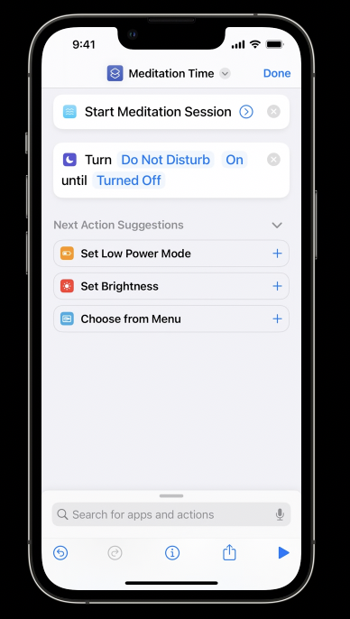

 Parameter summaries allow you to customize the look of your intent, as well as show values inline.

Ideally, someone would be able to run my intent without first having to author a shortcut at all. By creating an app shortcut, I can perform this setup step on behalf of the user, so they can start using my intent as soon as the app is installed.

An app can have upto 10 app shortcuts. App shortcuts conform to `AppShortcutProvider` protocol.

Phrases are the phrases said by user that Siri will pick up for the shortcut.

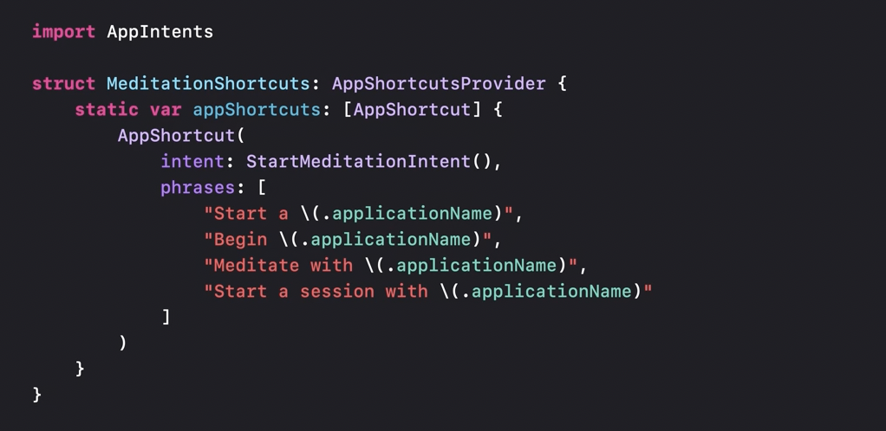

When someone searches for the app in Spotlight the shortcuts are shown there.

|                                                              |                                                              |
| ------------------------------------------------------------ | ------------------------------------------------------------ |
| 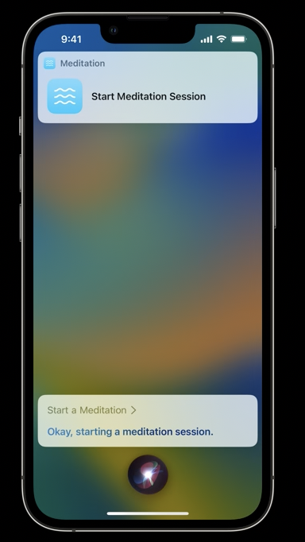 | 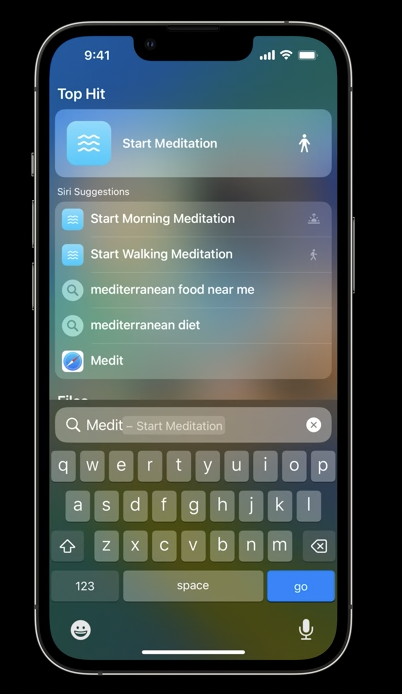 |

Custom app intent views  can show custom UI for the shortcut UI instead of the plain vanilla UI as shown in the Siri invocation in upper top. Just like widgets, custom App Intent views can't include things like interactivity or animations. App Intents supports showing custom UI at three phases: value confirmation, intent confirmation, and after the intent is finished.

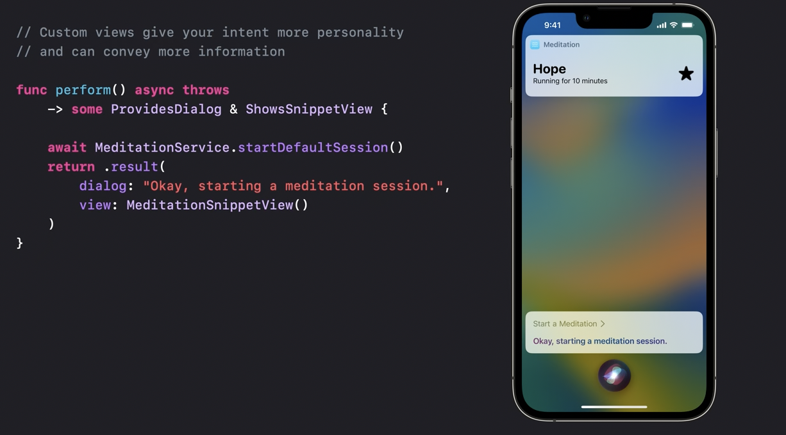

The App Intents framework has robust support for asking users follow-up questions to gather values for my intent's parameters. 

These prompts will be displayed anywhere my intent is run. When run from Siri, Siri will speak out the questions, and ask the user to speak the answer. In Spotlight and the Shortcuts app, the user will be presented with the same prompt in a touch-driven UI. App Intents supports three types of value prompts. 

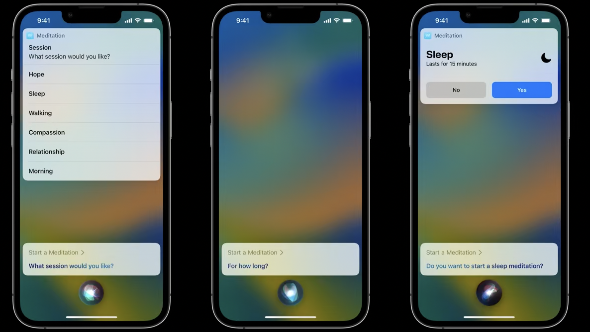

App Shortcuts has support for extending trigger phrases with predefined parameters. By implementing parameterized phrases, my app can support utterances like "Start a calming meditation" or "Start a walking meditation."

Parameters are not meant for open-ended values. 

Siri Tip and the Shortcuts link. we've created a new Siri Tip view. This view works great anywhere you may have used the Add To Siri button in the past. The Tip view is available in both SwiftUI and UIKit.

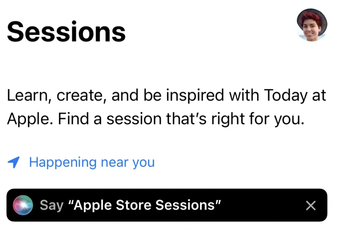

Finally, we've also included a new ShortcutsLink that will launch to a list of Shortcuts from your app. This new element is great if your app has a lot of App Shortcuts and you want to let users explore all of them. 

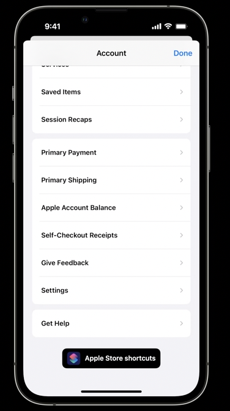

##### WWDC 2022: Dive into App Intents

In iOS 10 (2016), SiriKitIntents framework was introduced. Hooked up your app's functionality to Siri domains like messaging, workouts, and payments.

App Intents new framework.

App Intents has three key components. `Intents` are actions built into your app that can be used throughout the system. Intents use `entities` to represent your app's concepts. `App Shortcuts` wrap your intents to make them automatic and discoverable.

Can also be used to build Focus Filters.

 An app intent -- or "intent" for short -- is a single, isolated unit of functionality that your app exposes to the system. For example, an intent could make a new calendar event, open a particular screen, or place an order.

When an intent is run, it will either return a result or throw an error. An intent includes three key pieces: metadata, or information about the intent, including a localized title; parameters, which are inputs that the intent can use when it's run; and a perform method, which does the actual work when the intent is executed.

 Just exposing this intent provides huge leverage, because once customers turn this intent into a shortcut, it can be used from a ton of places in the system, including all of these.

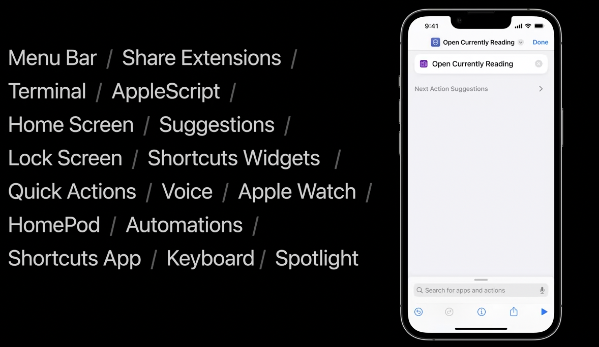

Parameters support all of these types

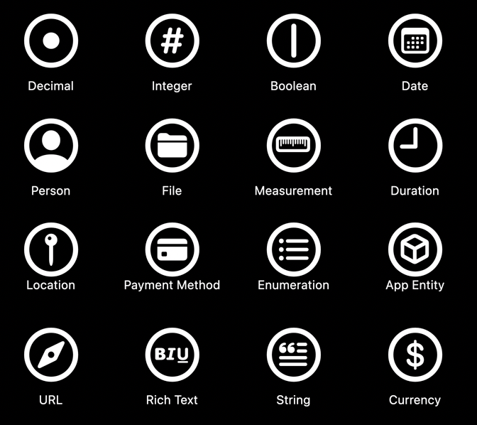

openAppWhenRun

##### WWDC 2023: Spotlight your app with App Shortcuts

Unlike in iOS 15 and before, there's no need to use the Shortcuts app or use the Add To Siri button to set up an App Shortcut before using it. App Shortcuts can be run from Siri by speaking one of their trigger phrases. They're also featured prominently right in the search results when searching in Spotlight, and they're found in the Shortcuts app where they can be part of powerful user Shortcuts and Automations.

Intents represent individual tasks that can be completed with your app, like creating a to-do list, summarizing its contents, or checking off an item. After you create an app intent, you can create an app shortcut with it, so it can be used from Spotlight or Siri. 

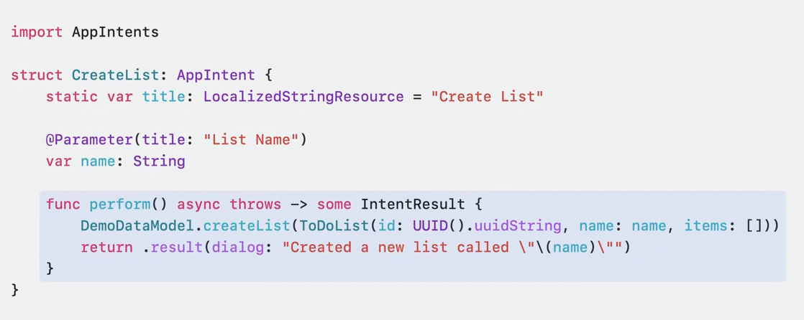

I implement an AppShortcutsProvider struct. Each app can have at most one struct conforming to this protocol. In the AppShortcutsProvider, I can specify all the app shortcuts my app supports.

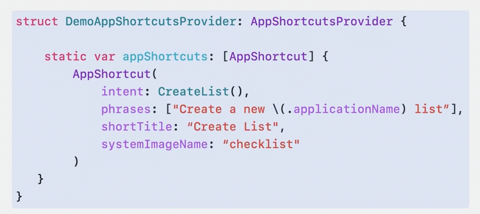

Two key concepts in App Intents: Entities and queries. Entities are concepts relating to your app that your users will want to reference. Entities from your app can be put to use in app intents when those intents use the entities as input parameters. In order to find entity instances that fit into the parameters of an app intent, the system relies on queries. At runtime, the system instantiates and calls query objects to find entities based on various search parameters.

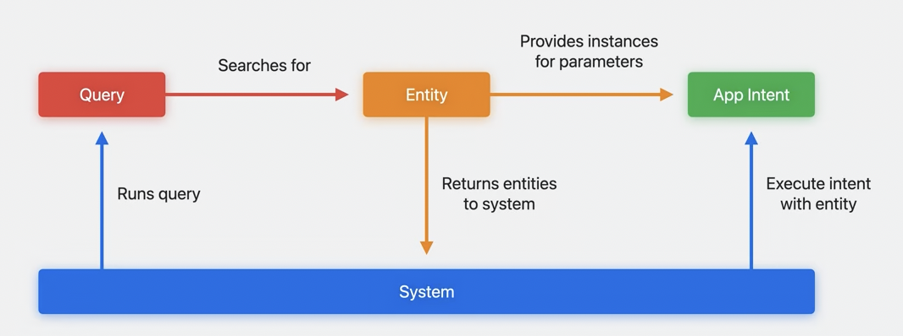

 There are two powerful ways people can discover your App Shortcuts throughout the course of simply using their device: Spotlight and Siri Tips. 

SiriTipView. The Tip View is available in both SwiftUI and UIKit, and we've provided a number of styles, so they look great in any application. Siri Tips are best placed contextually so that they are relevant to the content onscreen. 

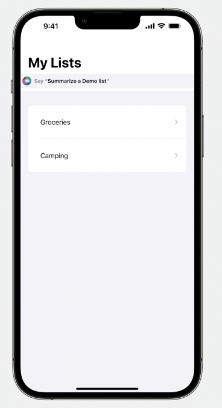

We've introduced new APIs around colors, entity thumbnails, and short titles with symbols. These new APIs are required for all App Shortcuts and will help your app really stand out. You can now set up to two colors in your app's Info plist that the system will use when your app appears in Spotlight or Shortcuts.

Takes advantage of on-device machine learning to allow phrases similar to the ones you've provided in your App Shortcut to also just work. This is powered by a new Semantic Similarity Index.  If you're not yet ready to adopt flexible matching, you can opt-out by disabling the "Enable App Shortcuts Flexible Matching" build setting. There is also a new synonyms API. This is a small addition to the DisplayRepresentation API so that you can define additional synonyms for AppEntities and AppEnum cases. This will further broaden the reach of your App Shortcuts by making it possible to speak more naturally to Siri

To help make authoring and testing App Shortcuts faster and easier, we're introducing a powerful new tool in Xcode called App Shortcuts Preview.

##### Resources

WWDC 2023: Spotlight your app with App Shortcuts - **Watched**  WWDC 2022: Implement App Shortcuts with App Intents - **Watched** WWDC 2022: Dive into App Intents - **Watched**  WWDC 2022: Design App Shortcuts WWDC 2021: Design great actions for Shortcuts, Siri, and Suggestions WWDC 2021: Donate intents and expand your app’s presence  WWDC 2020: What's new in SiriKit and Shortcuts WWDC 2020: Feature your actions in the Shortcuts app 

App shortcuts ([link](https://developer.apple.com/design/human-interface-guidelines/app-shortcuts)) App Intents ([link](https://developer.apple.com/documentation/AppIntents))  