[toc]

##### Universal Control (Control iPad from Mac)

A way to control iPad from Mac's trackpad/keyboard. Different from Sidecar as over here iPad is not showing Mac's display, it instead is iPad's display itself.

YouTube video ([link](https://www.youtube.com/watch?v=P4ut_Vk-Z9w)), Official guide ([link](https://support.apple.com/en-us/102459))

The trick in configuring is to ensure that the in macOS display settings the iPad is set as 'Use as - Linked keyboard and mouse'.

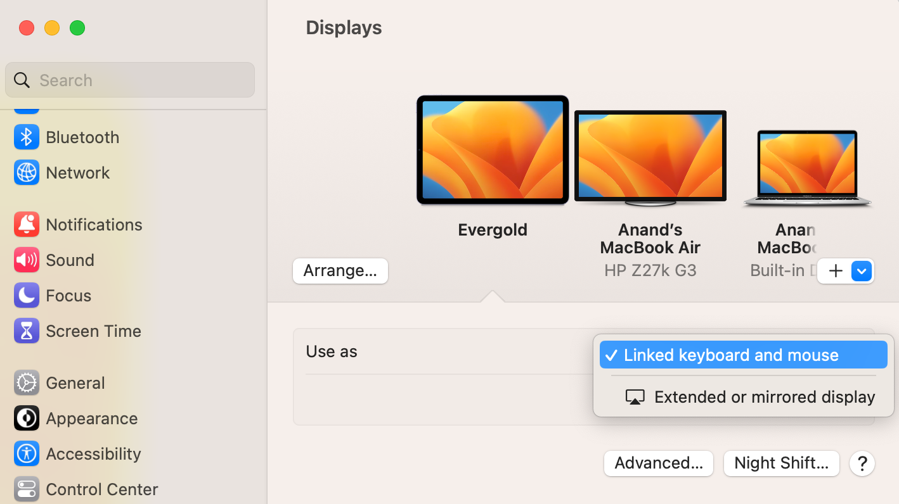

##### Controlling from iOS devices (Control iPad from iPhone)

Not everything can be done, but several common things like media playback, etc. can be controlled. Go to 'Accessibility > Control Nearby Devices'. ([link](https://support.apple.com/guide/iphone/control-a-nearby-apple-device-iphd9bc05ba9/ios#:~:text=Go%20to%20Settings%20%3E%20Accessibility%20%3E%20Control,control%2C%20then%20tap%20a%20button.))

|  | 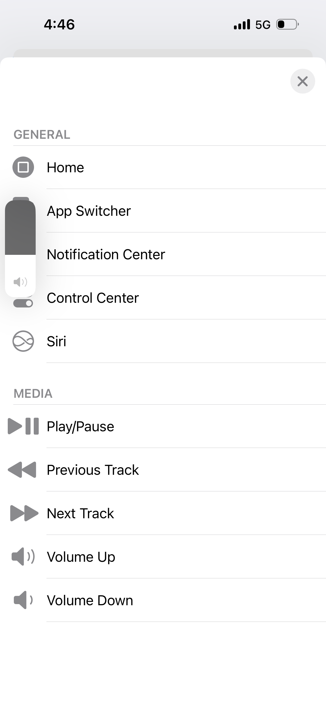 |
| ------------------------ | ------------------------ |

##### Sidecar (Show Mac on iPad)

Use iPad or any external monitor as an additional display for the Mac. It can be used an another display/space or just be used to mirror any other display.

To start using iPad as one, just hover over any window's maximize window and select 'Move to iPadName'. To disconnect the iPad an external display one way is to go to Mac's settings and tap Disconnect for that iPad.

| Move window to iPad                                          | Configure iPad as extended display                           |
| ------------------------------------------------------------ | ------------------------------------------------------------ |
| 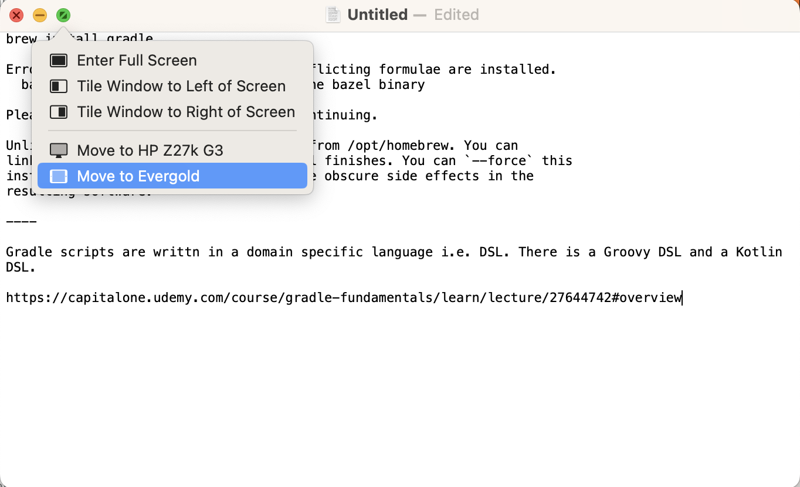 | 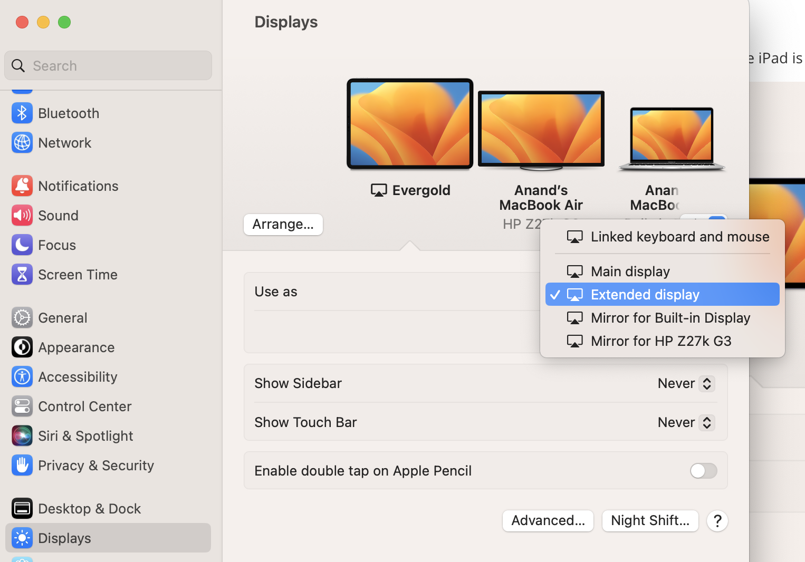 |

Official documentation ([link](https://support.apple.com/en-us/102597))

##### Continuity Sketch (Sketch from iOS to macOS's compatible apps)

There are some macOS apps that support sketching into them directly from iOS (using finger on iPhone and Apple Pencil on iPad). In the macOS app the option 'Import from iPhone or iPad > Add Sketch' needs to be selected. A canvas automatically appears on iOS and then once the sketch is drawn there, the 'Done' button there has to be tapped for the sketch to appear. Notes is one such app.

| Start on macOS                                               | Do sketch on iOS                                      |
| ------------------------------------------------------------ | ----------------------------------------------------- |
| 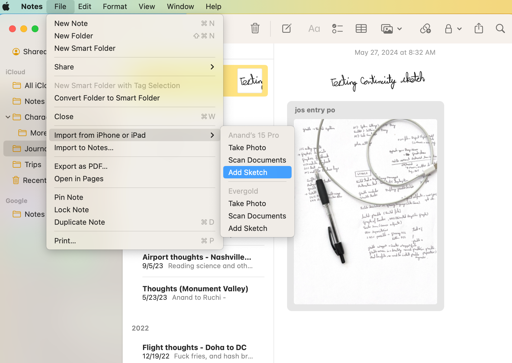 | 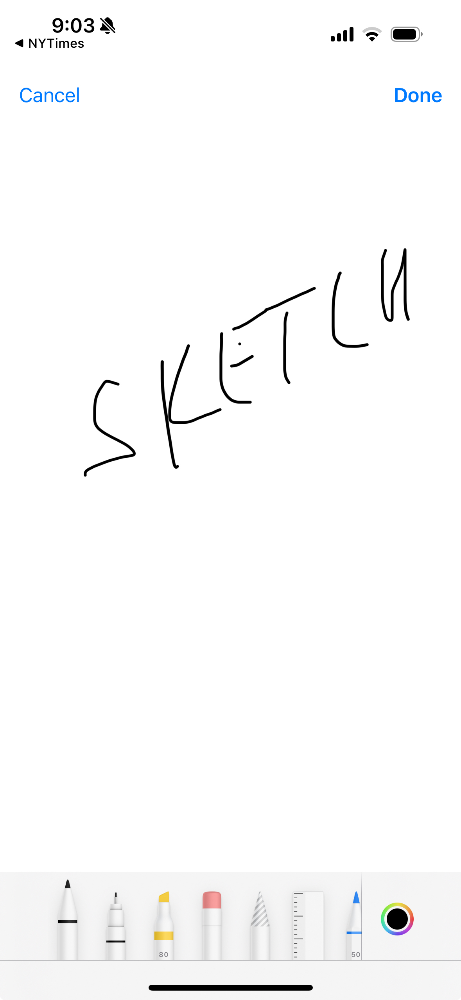 |

Official documentation ([link](https://support.apple.com/en-in/guide/mac-help/mchl74e7c6df/13.0/mac/13.0))

##### iOS Assistive Access (Minimalistic OS)

Its a way to have a very trimmed down version of iOS where only few selected apps appear in home screen and the content is larger. In Apple's words, 'it allows people with cognitive disabilities to use iPhone with greater ease'. It can be set up from 'Settings > Accessibility > Assistive Access'.

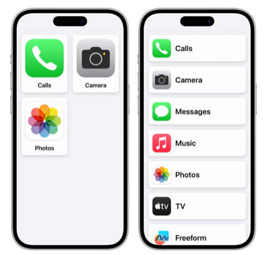

Official documentation ([link](https://support.apple.com/en-in/guide/assistive-access-iphone/welcome/ios#:~:text=What%20is%20Assistive%20Access%3F,Learn%20about%20Assistive%20Access))

##### iOS Guided Access (Restricting touch real estate)

Its traditionally been used for restricting the device to just one app, but it can be used more creatively than that. It can also be used to restrict touches in just a part of the real estate. Very useful in something like YouTube app where you wouldn't want unintended touches in bottom edges to start new videos.

It needs to be enabled in 'Settings > Accessibility > Guided Access' and a passcode configured. What I saw is that the 'Accessibility Shortcut' option there needs to be enabled too and then in 'Settings > Accessibility >  Accessibility Shortcuts' and also swiped up and given a priority where it is right on top (otherwise it doesn't tend to start if there is another accessibility shortcut set).

| Guided Access                    | Accessibility Shortcuts          |
| -------------------------------- | -------------------------------- |
| 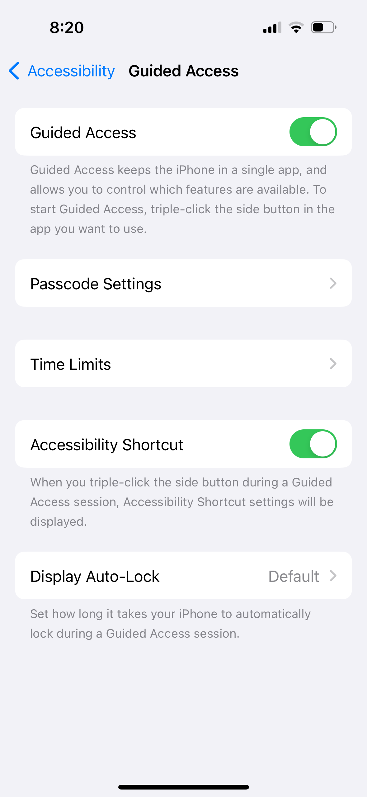 | 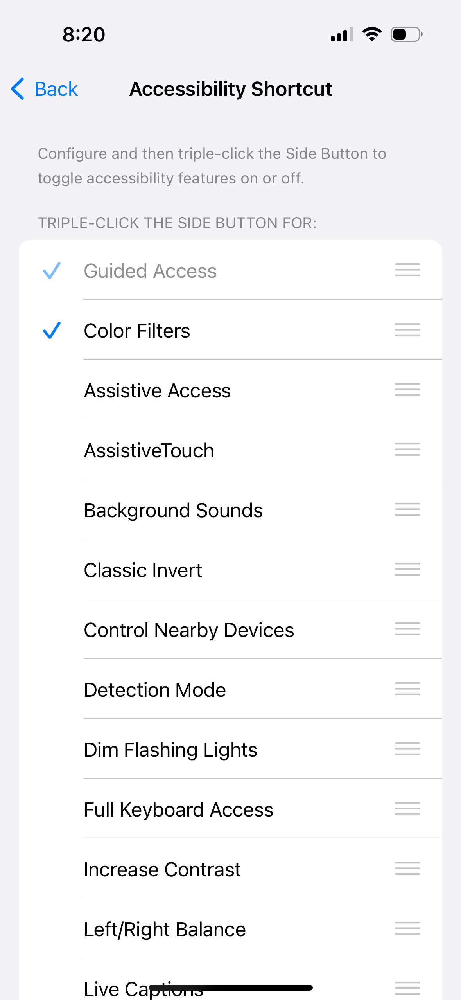 |

The real estate can then be set once Guided Access is started with a triple click on side button. In fact, its also possible to setup a shortcut such as whenever a certain app is opened (for example YouTube) the Guided Access can automatically be activated.

Official documentation ([link](https://support.apple.com/en-us/111795))

##### iPadOS Stage Manager (App groups, multiple apps in one space)

> There in macOS too

Its basically a way to create Mac like Spaces in iPad, i.e. grouping together of certain apps. And in those spaces, the apps can be sized and positioned as you wish. One app can only be in one app group at a time. Also, there can be more than two apps in one app group (unlike in split-view where there can be only two apps). This is probably more useful in larger iPads along with an external keyboard, without those this doesn't seem to be of much use yet as the space is still quite constricted.

| Stage Manager (there are 3 apps displayed together here) | App Switcher (app group on left has 3 apps together) |
| -------------------------------------------------------- | ---------------------------------------------------- |
| 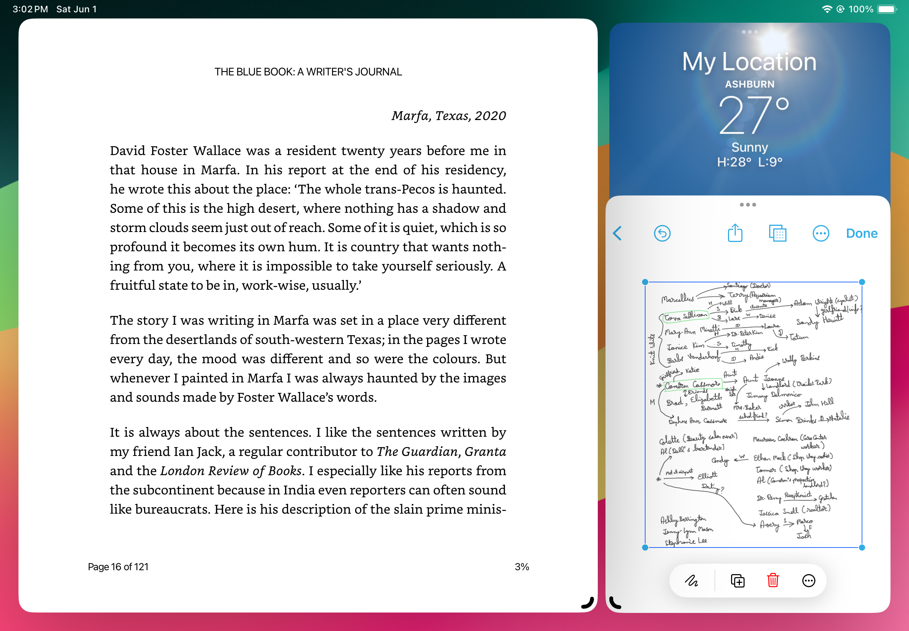                         | 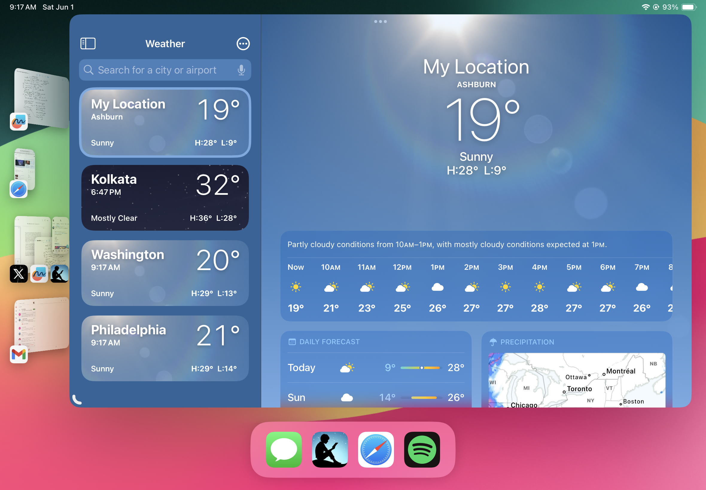                     |

To turn on Stage Manager, a button in Control Center can be used. It can also be done from 'Settings > Multitasking & Gestures', note that at a given instant only one of 'Split View & Side Over and 'Stage Manager' can be used.

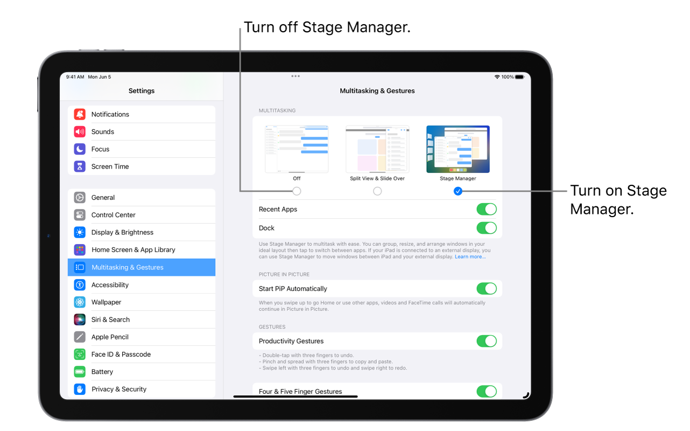

Official documentation ([link](https://support.apple.com/en-sg/guide/ipad/ipad1240f36f/ipados))

