[toc]

([WWDC link](https://developer.apple.com/videos/play/wwdc2021/102/))

##### Swift macros (4:00 - 8:00)

A new annotation (property wrapper) or freestanding code (prefixed with hash sign) that uses existing code to generate new code.

`@CaseDetection`, `@URL`, `@AddAsync` are some attribute (i.e. annotation) macros and `#assert` is a freestanding macro.

| Attached macros                                              | Freestanding macros                                          |
| ------------------------------------------------------------ | ------------------------------------------------------------ |
| 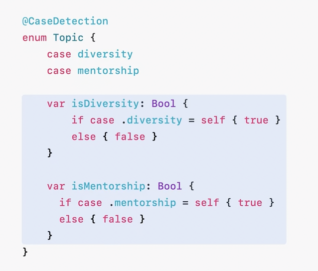 | 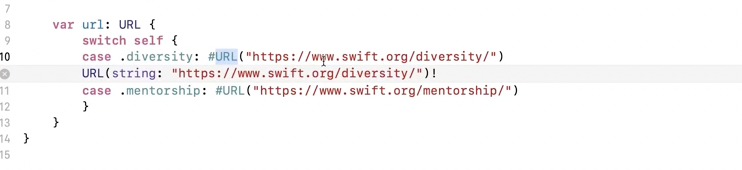 |

| Expand macro option in Xcode                                 | Some built-in macros                                         |
| ------------------------------------------------------------ | ------------------------------------------------------------ |
| 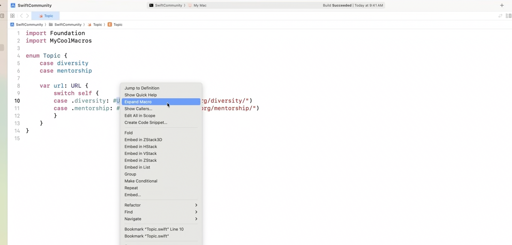 | 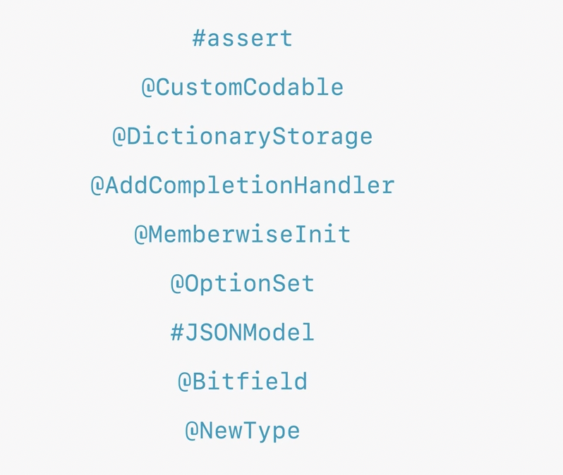 |

Custom macros can be written too. You can also benefit from community-authored macros, or share your own macros with others, through Swift packages.

##### Inter-operability between Swift and C++ (8:00)

 Since its inception, Swift has provided bi-directional interoperability with C and Objective-C. Swift is now extending that interoperability to C++. 

##### SwiftUI (9:30)

Swift Charts - Pie charts, selections, inspector API, expanded MapKit support
Animations now default to spring based motions
New API called AnimationPhase for multi-part animations
Adds full support for keyframing. Keyframes let you define values of multiple properties at specific times within an animation, and SwiftUI then ineterpolates the intermediate values.

`@Observable` macro - All publicly visible properties are published automatically

##### SwiftData (15:50)

New framework for data modeling and management (i.e. persistence?). Built on top of CoreData's persistence layer but has a completely new API.

`@Model` macro - Does a lot of things. Enables persistence, iCloud synchronization, undo and redo, Spotlight search and more. Additional annotations for individual properties (like @Attribite(.unique)).

##### WidgetKit (19:29)

Allows to surface your app's contents in many places across the system. In more places than just home screen now, in StandBy on iPhone, lock screen on iPad, on macOS on Desktop in full color. 

| In Standby on iPhone                                         | In Lock screen on iPad                                       | In Desktop on macOS                                          |      |
| ------------------------------------------------------------ | ------------------------------------------------------------ | ------------------------------------------------------------ | ---- |
| 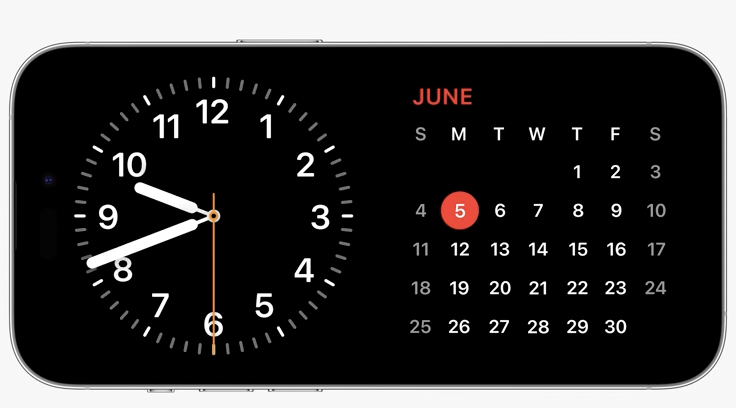 | 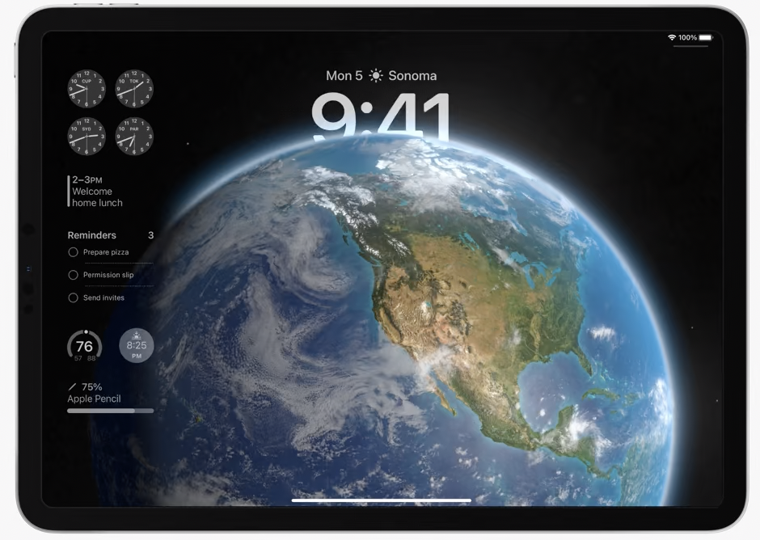 | 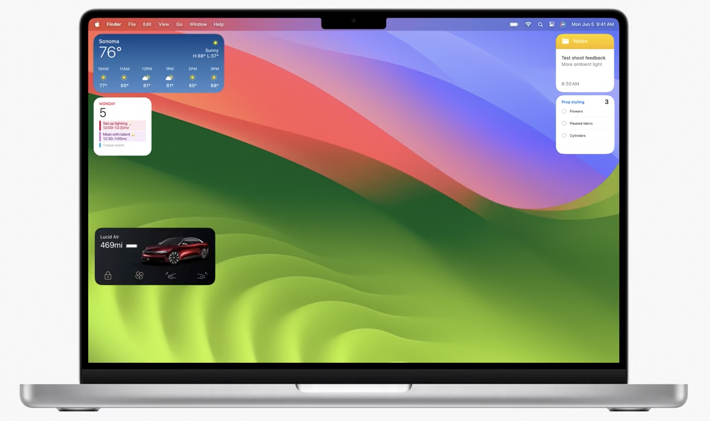 |      |

Simple things like tap actions can now be handled directly from the widget. Widget's code is run asynchronously to generate content, and then saved into an archive. When the widget needs to be drawn, archive is loaded, rendered in the background, and displayed as a part of the system UI.  When a user taps a button, its extension is run again to handle the action and update the UI. 

##### App intents (24:39)

They are more than just interactivity in widgets. They elevate your app's functionality across the system, in Spotlight, Shortcuts, and Siri. When you wrap your intent in an app shortcut, it will appear right next to your app icon in Spotlight results, with a richer, more interactive presentation. 

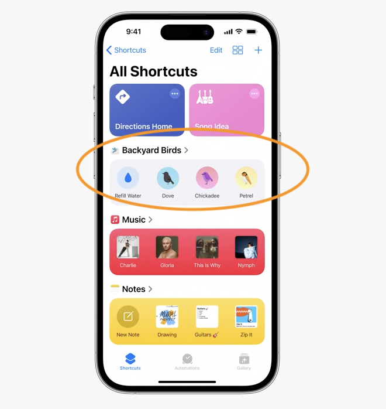

##### TipKit (25:45)

Educating users about the right features at the right time. templates to match what users are accustomed to seeing in system apps.

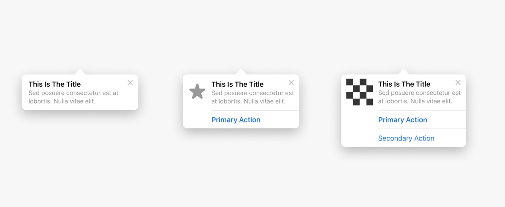

##### AirDrop (26:23)

Users can skip the share sheet and quickly send content to another device nearby. 

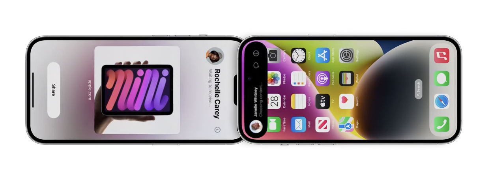

##### Hardware (27:20)

Improvements for Gaming, Cameras, Displays, and Apple Watch

macOS gets a Game Porting Toolkit for porting games from Windows to macOS.

Camera - Zero Shutter Lag, you capture the exact moment when the shutter is pressed. overlapping captures, the camera will dynamically adjust image quality when the shutter is pressed rapidly. And with deferred processing, high-quality images including Deep Fusion can be processed in the background.

Support for HDR photography

Video lighting effects

If you have a video conferencing app, there are a number of improvements to screen sharing and camera functionality in ScreenCaptureKit. The new ScreenCaptureKit picker makes it simpler for users to start screen sharing, in a more private and secure way. The picker also makes it simple for your app to capture multiple windows or even multiple apps all at once. Your users can start sharing right from the app they're in and they'll appreciate that they see a preview of what's being shared in the new Video Effects menu. Another benefit of ScreenCaptureKit is higher resolution content for better-looking screen shares when sharing a single window. We've also brought external camera support to iPad. Any USB camera can now be connected and used within your iPad app. And we are thrilled to add camera and microphone capabilities to an entirely new platform: tvOS. conferencing apps can use Center Stage, which makes group video calls more dynamic on the biggest screen in the home

##### watchOS (34:36)

##### Accessibility (40:00)

Expanded support for users who are sensitive to animations and flashing lights. Our frameworks now include APIs for two features that can make content in your apps more accessible to these users. The first feature is `Pause Animated Images`, which will stop the motion in animated GIFs. The second feature is `Dim Flashing Lights`, which automatically darkens the display of video during sequences of bright, flashing lights.

##### Privacy (43:36)

Calendar permissions. New add-only permission.

A new photo picker that you can embed into your app, so users can easily select photos to share from inside your experience.

To help you understand how third-party SDKs use data, we've introduced `privacy manifests for external SDKs`. These are files that outline the privacy practices of the third-party code in your app, in a standard format. When you prepare to distribute your app, Xcode will combine all the manifests across all the third-party SDKs you're using into a single, easy-to-use report.

It can be hard to know the code you've downloaded was written by the developer you expect. To address that, we're introducing `signatures for third-party SDKs`.

| Privacy manifests for external SDKs                          | Signatures for third-party SDKs                              |
| ------------------------------------------------------------ | ------------------------------------------------------------ |
| 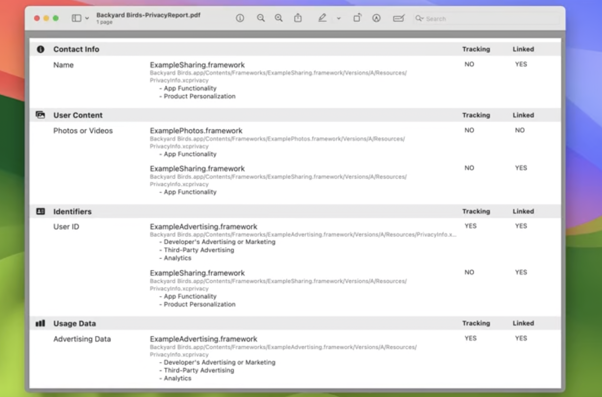 | 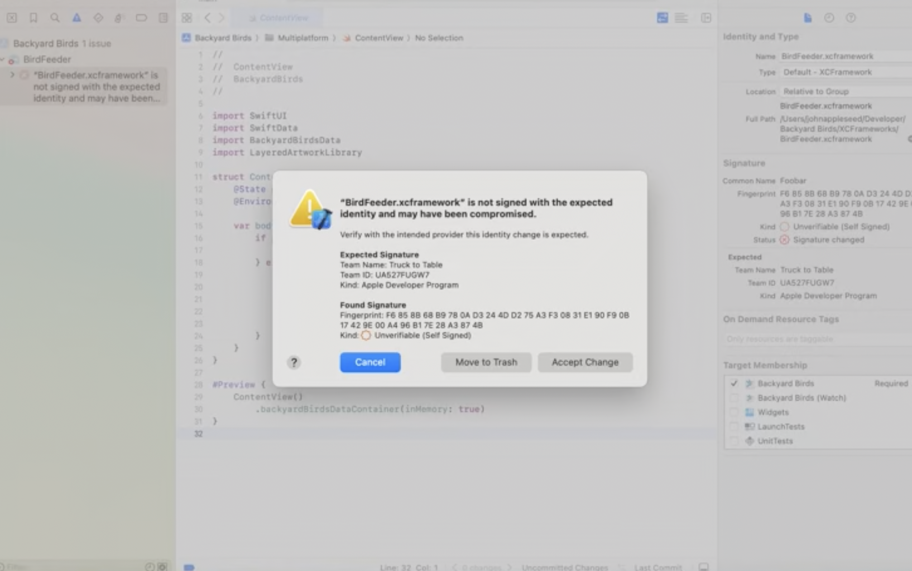 |

`Communication Safety`  uses privacy-preserving technology to protect children on our platforms. `SensitiveContentAnalysis `framework will let you know if a user has enabled Communication Safety or Sensitive Content Warning, so you can tailor your app experiences based on which feature is enabled.

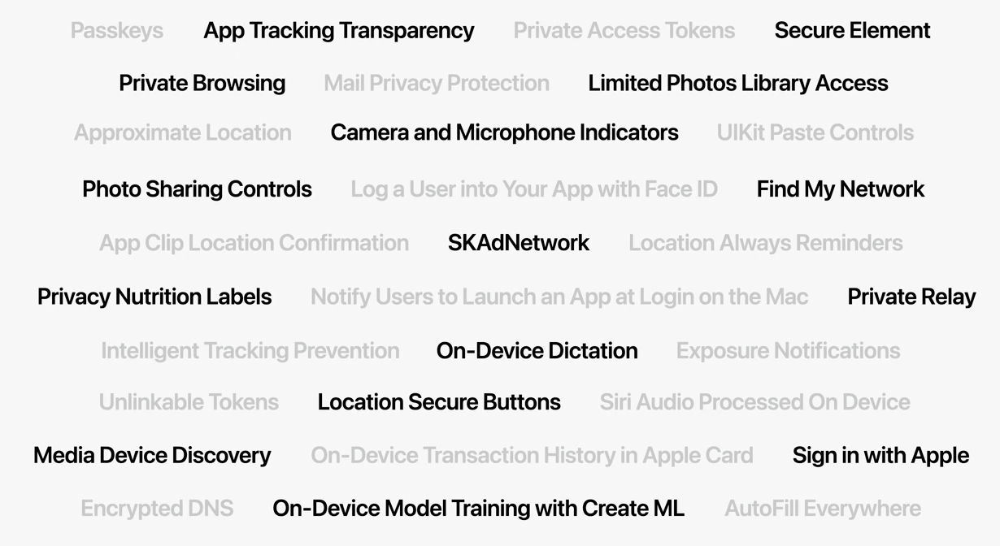

##### What's new in App Store (StoreKit) (48:36)

A new collection of views to power your app's merchandising UI across all platforms
The `ProductView` enables you to display your products using data you defined in App Store Connect. 
`SubscriptionStoreView` is a purpose-built view for subscriptions.

`SKAdNetwork` helps ad networks measure how successfully ad campaigns drive downloads of your app, all while preserving user privacy.

##### Xcode improvements (52:00)

`#Preview` macro

##### Testing (55:38)

Test report improvements

##### Xcode Cloud (57:54)

It connects with Apple services like TestFlight and App Store Connect.

When distributing to TestFlight, you can now create and share tester notes, helping keep all your users up to date on your latest improvements. Xcode Cloud also supports macOS notarization when distributing with DeveloperID, so you can automatically check your app for malicious components before sharing it with your users. 

##### Compiling and Linking (59:35)

The linker has been redesigned from the ground up, bringing massive improvements in link speed. Linking is up to five times faster. The new linker also reduces the size of debug binaries by up to 30%. 

And for apps that embed a lot of frameworks, there's a new framework type (`Mergeable Libraries`) that delivers faster builds during development and reduced app size and faster launch time for production. 

##### visionOS (1:00:00)

Infinite canvas. Regardless of the kind of app you're building, you need to understand how it will exist in 3D, in your user's space.  

By default, apps launch into the `Shared Space`. The Shared Space is where apps exist side by side, much like multiple apps on a Mac desktop.
On visionOS, your app can open one or more `windows`, which are SwiftUI scenes and behave just as you would expect, as planes in space. 

Additionally, your app can create three-dimensional volumes, which are also SwiftUI scenes, and showcase 3D objects, like a game board or a globe. `Volumes` can be moved around this space and viewed from all angles.
Full Space, in which only your apps, windows, volumes, and 3D objects appear across the user's view.
So those are the foundational elements of spatial computing: windows, volumes, and spaces. 

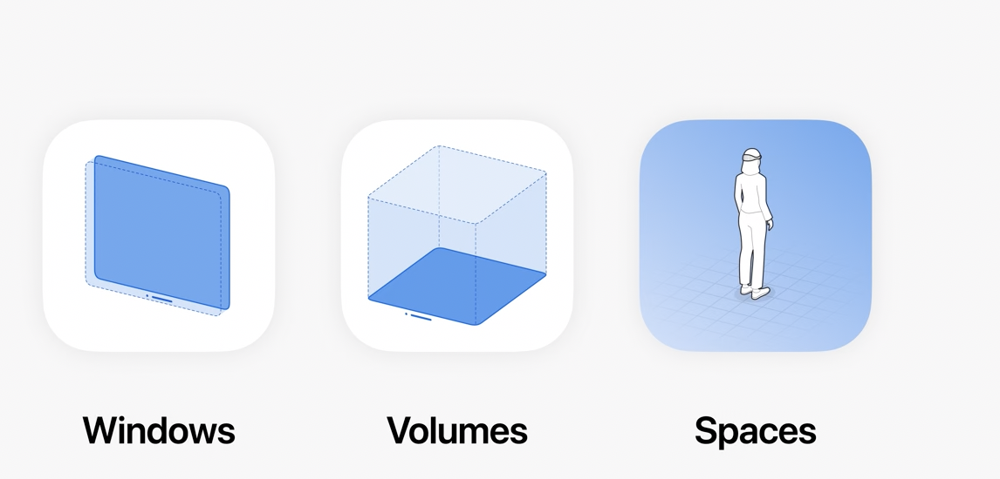

Existing iPad and iPhone apps are supported, each as a single scalable 2D window with their original look and feel. 

You use SwiftUI and UIKit to build your user interface, `RealityKit` to present 3D content, animations, and visual effects, and ARKit to understand the space around the user. These are all part of the visionOS SDK. So what does it take to bring your app to Vision Pro? First, in Xcode, add the visionOS destination to your project. 

you can add visionOS-specific code to expand your app into a collection of windows, volumes, or spaces. From here, you can begin to take advantage of the extended capabilities of SwiftUI, RealityKit, and `ARKit`. 

On visionOS, many of our frameworks have been extended to support spatial experiences. With SwiftUI, you can now add depth or add a 3D object inside a window. On iOS and MacOS, a ZStack is typically used for layering views. visionOS goes further, and you can separate them with depth. And with additional view modifiers, you can have more control over width, height, and depth.

You can also create a volume with SwiftUI. It can exist alongside your app windows, and when running in the Shared Space, sits side by side with other apps. 

And SwiftUI now renders through RealityKit, so you can easily mix SwiftUI and RealityKit APIs.
When you're ready to extend your apps with full scenes of dynamic 3D models, animations, and visual effects, you'll want to use RealityKit
RealityKit automatically adjusts to physical lighting conditions and grounds the experience in reality by casting shadows on floors and tables. This makes your app look like it belongs in the room.
RealityKit also has significant new capabilities, including the ability to create portals into 3D scenes. and a customizable material system to create stunning visual effects. 

Additionally, rendering is even more efficient on Apple Vision Pro by using a technique called Dynamic foveation. RealityKit leverages eye tracking to selectively render regions the user is focusing on at very high fidelity, reducing the rendering cost of content in the periphery, and enabling your apps to maximize the processing power of the device.
RealityKit provides a new SwiftUI view called RealityView. RealityView can be used within windows, volumes, and spaces, letting you place 3D content anywhere you want within the scenes that you control. It also supports Attachments, which allow you to embed 2D SwiftUI views with your 3D content. 

ARKit understands the space around the user, allowing app content to interact with the room, whether it's a ball bouncing off the floor or water splashing on the wall. ARKit hosts the real-time algorithms on visionOS that power a host of core system capabilities. 

##### How to test for visionOS using Xcode (1:15:02)

There will be a simulator in Xcode.

Mac Virtual Display lets you bring a high-fidelity 4K virtual monitor of your Mac right into your Vision Pro just by looking at it.
As you evolve your visionOS apps, they will become more spatial, breaking outside the boundaries of flat windows and bringing 3D experiences to users unlike ever before. Doing this right requires a new visual tool. That's why we made Reality Composer Pro. Reality Composer Pro is an application that lets you preview and prepare 3D content for your visionOS apps. 

| Simulator                                                    | Reality Composer Pro                                         |
| ------------------------------------------------------------ | ------------------------------------------------------------ |
| 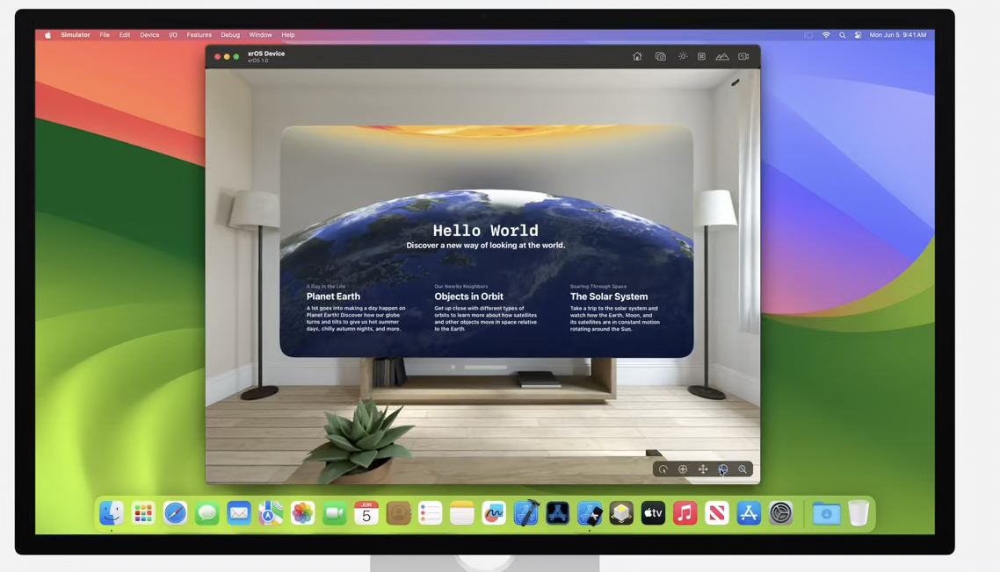 | 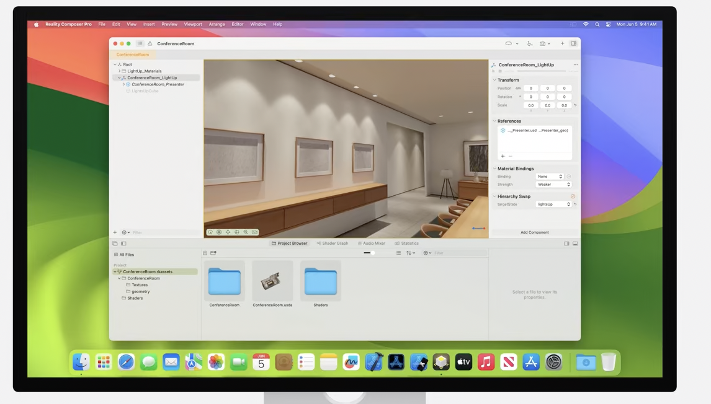 |

TestFlight will be available to use on Vision Pro from the start. 

##### Unity apps in visionOS (1:20:00)

Apple and Unity have been deeply collaborating to layer Unity's real-time engine on top of RealityKit and enable their development tools to target visionOS. This means that Unity-created apps can coexist with other visionOS apps in the Shared Space