[toc]

WWDC 2024 Keynote ([link](https://developer.apple.com/videos/play/wwdc2024/101/))

##### visionOS 2

Left and right eye view from your beautiful 2D image, creating a spatial photo with natural depth that looks stunning on Vision Pro. Experience all your panoramas and spatial photos and videos together with the people you love using SharePlay in the Photos app.

New spatial Personas. Now you can just hold your hand up and tap to open Home View. Or flip your hand over to bring up time and battery level. And tap again to open Control Center, giving you quick access to frequently used features like Notifications and Mac Virtual Display. 

Adding train support to Travel Mode.

Makes it even easier for developers to create sophisticated spatial apps. There are many new frameworks and APIs for developers to explore, like `advanced volumetric APIs`. `TabletopKit` makes it possible for developers to quickly create apps that anchor to flat surfaces.

We've made it so easy to capture spatial video anywhere with iPhone 15 Pro and iPhone 15 Pro Max.

Apple Immersive Videos are 180-degree, 8K recordings with Spatial Audio that give you mind-blowing experiences with lifelike fidelity.

##### iOS 18

| Position apps anywhere in home screen                        | Customization sheet to tint app icons                        |
| ------------------------------------------------------------ | ------------------------------------------------------------ |
| 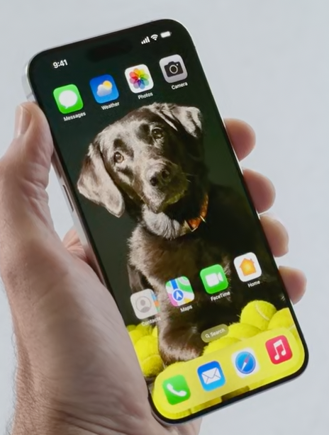 | 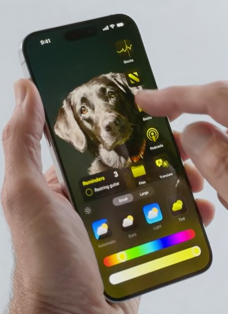 |

Plenty of enhancements to Control Center. Use `Controls` framework. 

| Groups (i.e. pages) in Control Center (swipe vertically)     | Controls Gallery                                             |
| ------------------------------------------------------------ | ------------------------------------------------------------ |
| 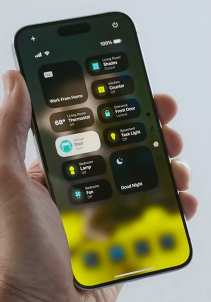 | 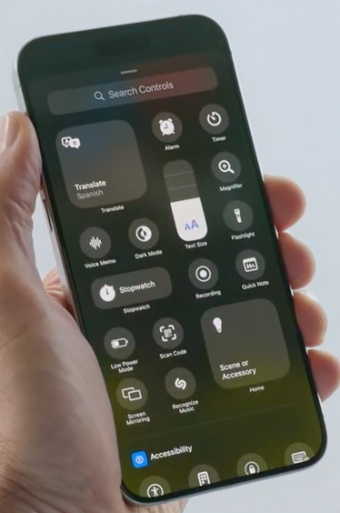 |

These new controls are also available from the Lock Screen. You can even use the Action button on iPhone 15 Pro to invoke these new controls. 

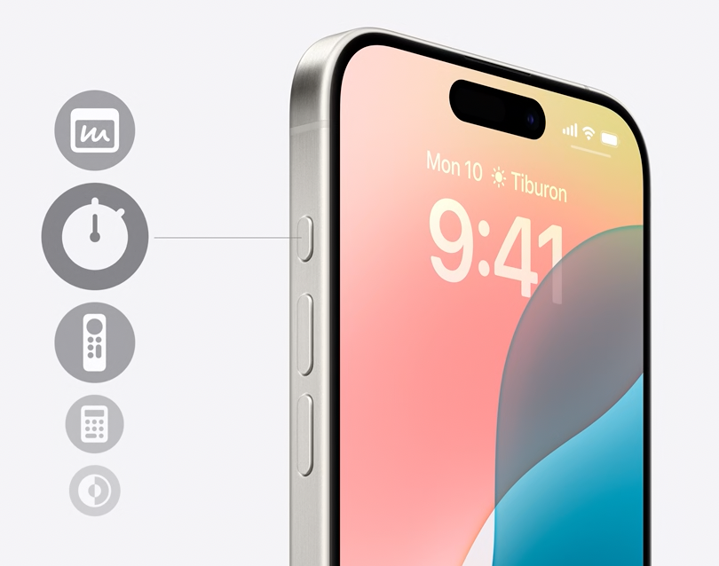

Apps can be locked and need biometric authentication to unlock. And information from inside the app won't appear in other places across the system. Apps can be hidden too.

In iOS 18, we're putting you in control by letting you decide which contacts an app can see. We're also putting you in control when you pair accessories. An app may ask for Bluetooth and local network access but also gain visibility to all the other devices on your network, from your computers and TVs to your door locks and blood pressure monitor. 

`Messages` - Tapback with any emoji or sticker, Schedule messages, more text formatting and effects.

Messages via satellite (both iMessage and SMS).

Some improvements in `Mail` app, mostly Catehorization related. 

And then in `Maps` (Topographic maps including trail routes). Maps delivers new topographic maps with detailed trail networks and hiking routes, including all 63 U.S. national parks, that can be saved to your phone and accessed offline with turn-by-turn voice guidance and the ability to create your own hikes.

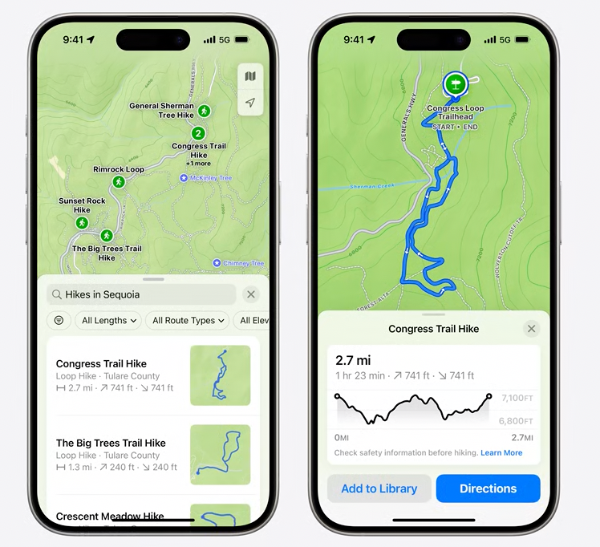

`Wallet` now offers `Tap to Cash`, to exchange Apple Cash without sharing phone numbers or email addresses.

We're adding two new ways to pay with Apple Pay Online (what are those ways?), giving customers around the world the ability to redeem rewards and access installments from their banks and card providers. 

`Game Mode` is coming to iPhone, enabling a more immersive experience with games like "Zenless Zone Zero." Just like on Mac, Game Mode minimizes background activity to sustain the highest frame rate.

Plenty of redesign in `Photos` app., has something called Collections.

##### Audio, Home, and tvOS

Explained from 30:30

Something called `Insights` in tvOS to know tv cast, soundtrack etc.

##### watchOS

Explained from 36:00

##### iPadOS 18

Explained from 43:00

iPadOS 18, starts with features you saw in iOS, like new ways to personalize your Home Screen, customize Control Center, and relive special moments in the Photos app. iPadOS 18 also brings exciting new ways to get things done, reimagined with Apple Pencil.

Floating tab bar. Refined animations.

One of `SharePlay`'s best features is screen sharing! It's a great way to help friends and family from afar, and we're making it better in two ways. Now you can tap and draw on your screen to point out what they should do on theirs. Can control screen too.

Freeform adds Scenes, an all-new way to select sections of a board to present them one by one.

Calculator app on iPad. Particularly useful with Apple Pencil. Math Note experience.

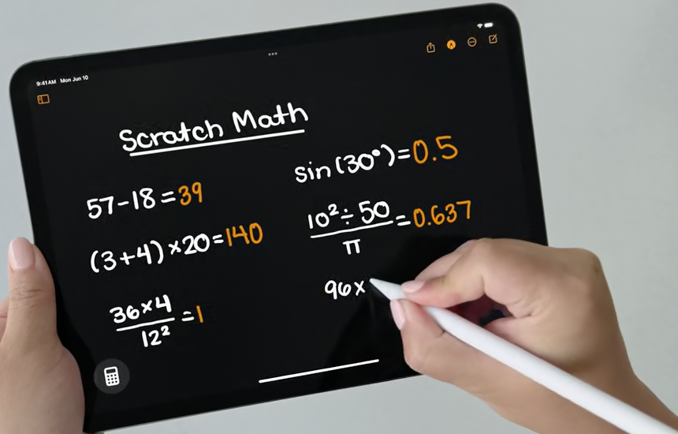

Notes has a new feature called Smart Script. With Smart Script, we're making handwriting your notes smoother than ever. It starts with improving the appearance of your writing, as you write. We use a powerful on-device machine learning model to re-create your handwriting style from your notes, which unlocks new capabilities. Now you can just paste typed text into a handwritten note, and it will appear in your own style. 

##### macOS Sequoia

Explained from 50:52

Continuity - Now offers `iPhone Mirroring`, i.e. mirror iPhone on Mac and control it too from Mac.

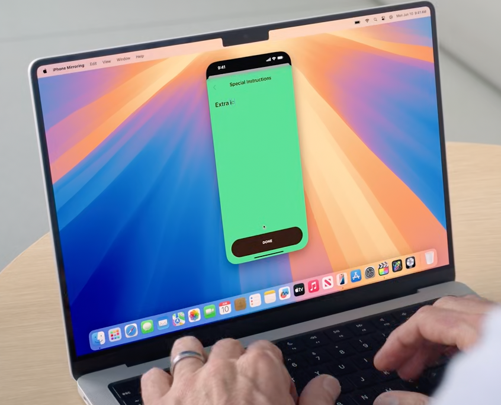

iPhone notifications in Mac, can even interact with them.

iPhone's audio even comes through Mac.

Tiles for arrangement on desktop. Improvements to video conferencing.

New `Passwords` app to manage passwords.

Safari can now help you discover more about the page with `Highlights`. Safari uses machine learning to automatically detect relevant information and highlight it for you as you browse.

Summaries are also integrated into a redesigned Reader. Reader instantly removes distractions from articles, and now it can provide a table of contents and includes a helpful summary, right next to the article. 

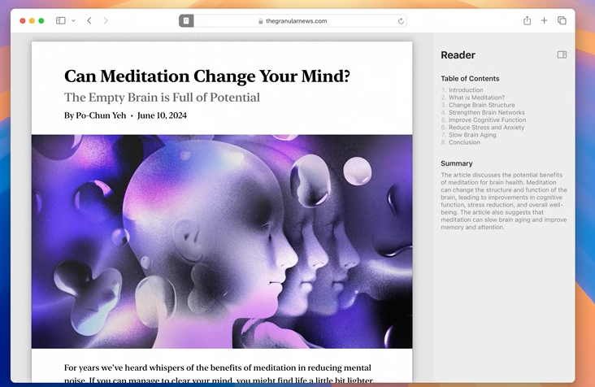

When Safari detects a video on the page, `Viewer` helps you put it front and center, while still giving you full access to system playback controls, like AirPlay and Picture-in-Picture.

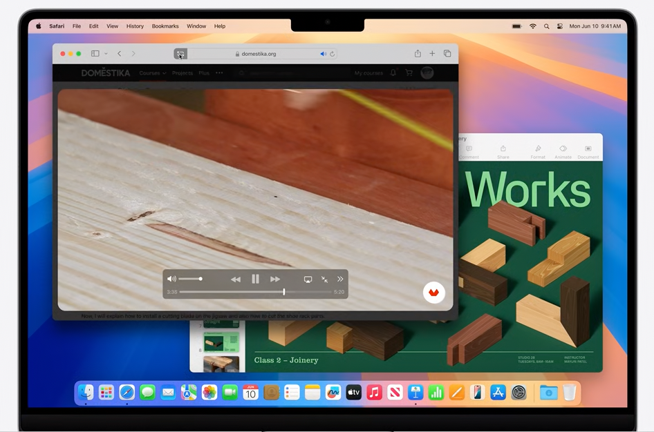

 Game Porting Toolkit 2 to bring more games to Mac.

##### Apple Intelligence

Apple's revamped AI. Deeply integrated into the platform and across apps.

Will understand and create language, as well as images, and take action for you to simplify interactions. 

For example, your iPhone can prioritize your notifications to minimize unnecessary distractions, while ensuring you don't miss something important. 

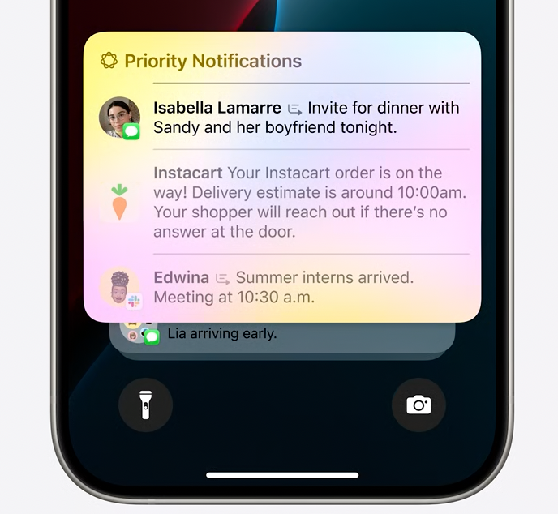

Also powers brand-new `Writing Tools` that you can access systemwide to feel more confident in your writing. Writing Tools can rewrite, proofread, and summarize text for you, whether you are working on an article or blog posts. Available automatically across Mail, Notes, Safari, Pages, Keynote, and even your third-party apps. 

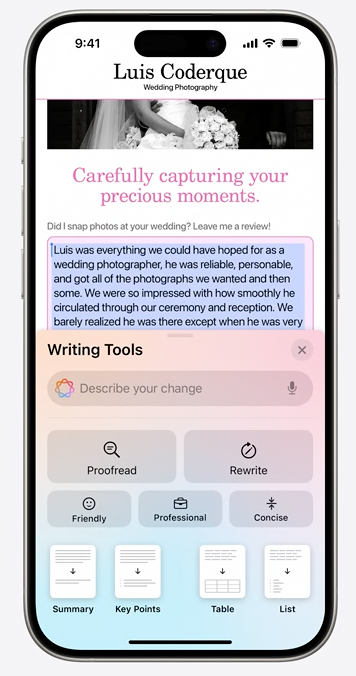

Offers a host of capabilities for images. And now you can create totally original images. And because Apple Intelligence understands the people in your photo library, you can personalize these images for your conversations.

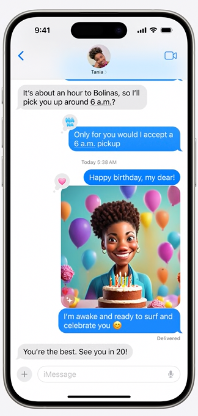

You can create images in three unique styles: Sketch, Illustration, and Animation. In addition to Messages, this experience is built into apps throughout the system, like Notes, Freeform, Keynote, and Pages.

Another way Apple Intelligence is deeply impactful is its ability to take action across your apps. So you can say things like, "Pull up the files that Joz shared with me last week," or, "Show me all the photos of Mom, Olivia, and me," or, "Play the podcast that my wife sent the other day." 

The cornerstone of the personal intelligence system is on-device processing. 

 Many of the generative models run entirely on-device, but some are processed on server but not stored there.

We want to extend the privacy and security of your iPhone into the cloud to unlock even more intelligence for you. So we have created Private Cloud Compute. `Private Cloud Compute` allows Apple Intelligence to flex and scale its computational capacity, and draw on even larger, server-based models for more complex requests, while protecting your privacy. Your data is never stored or made accessible to Apple. Independent experts can inspect the code that runs on these servers to verify this privacy promise.

`Siri` gets a new look, a light that glows around the rim.

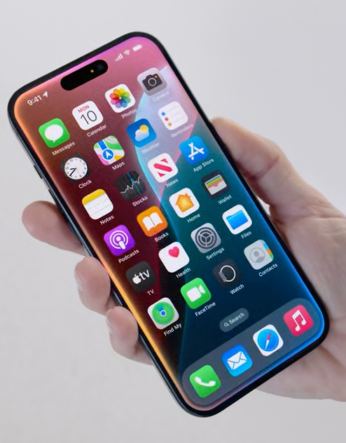

What's great is that now, at any time, you have the option to type to Siri. With just a double tap at the bottom of the screen.

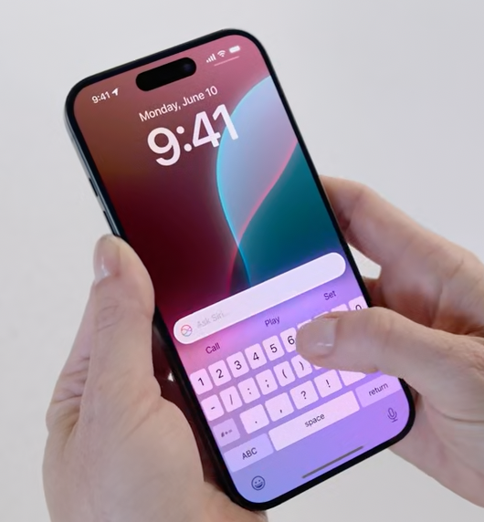

Can tell information about apps.

Significant enhancements to AppIntents, a framework that lets apps define a set of actions for Siri, Shortcuts, and other system experiences. For developers, they'll be able to use the App Intents framework to define actions in their apps and tap into Apple Intelligence too. (So what's new, chaining intents across apps?)

`Writing Tools` can help you communicate even more effectively. 

Introducing `Genmoji`. Leveraging the power of Apple Intelligence, you can create Genmoji, on-device, right in the Keyboard, and match any moment perfectly. Just provide a description and you'll see your Genmoji appear.

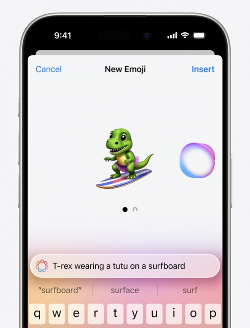

To make it easy to experiment with creating images, we've also built a dedicated `Image Playground` app. You can use it to try out Styles, play around with different concepts, and make something to share with friends in other apps or on social media. And for Developers, they can integrate the new Image Playground experience in their app too, with a new API. With the Image Playground experience and Genmoji, you can create fun and delightful images right where you need them. 

A brand-new tool in the Notes app that we call `Image Wand`, can transform a rough sketch into a polished image that complements your notes and makes them more visual.

| 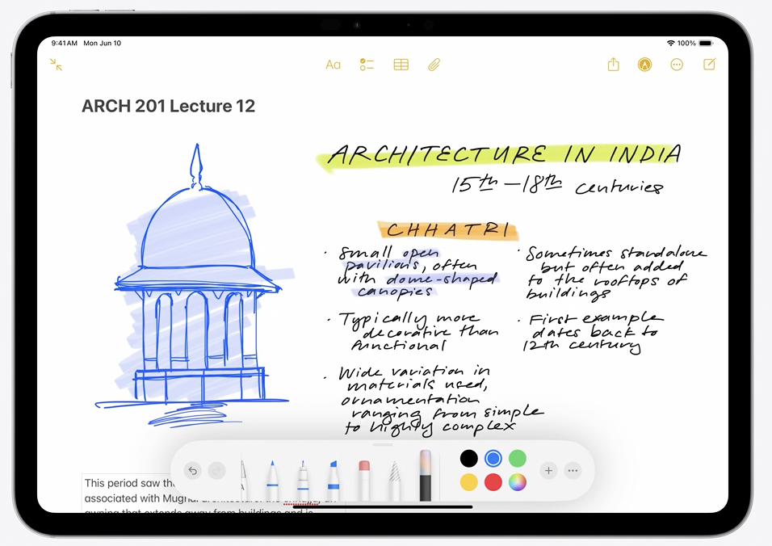 | 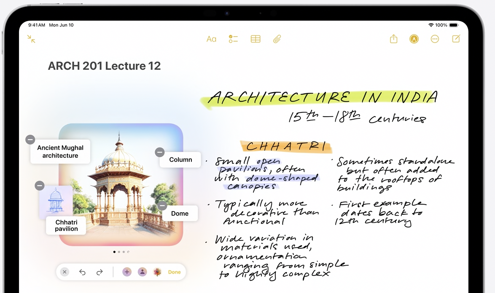 |
| ------------------------------------------------------------ | ------------------------------------------------------------ |

In Photos app, `Clean Up` tool will identify distracting objects in the background, so you can make them disappear.

Can create a Memory Movie.

In the Notes app, you can now record and transcribe audio, to capture detailed notes while staying present in the moment. Recordings, transcriptions, and Apple Intelligence-powered summaries are also coming to the Phone app. 

ChatGPT (powered by GPT-4o) integrated into Siri. For example, if you need menu ideas for an elaborate meal to make for friends using some freshly caught fish and ingredients from your garden, you can just ask Siri. Siri determines that ChatGPT might have good ideas for this, asks your permission to share your question, and presents the answer directly. 

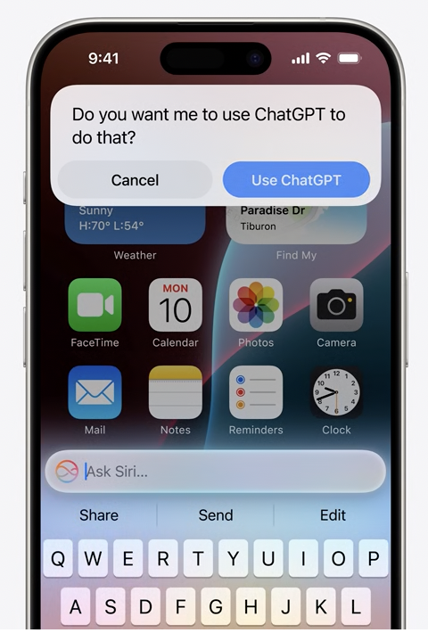

We've also integrated ChatGPT into the systemwide Writing Tools with Compose. You can create content with ChatGPT for whatever you're writing about.

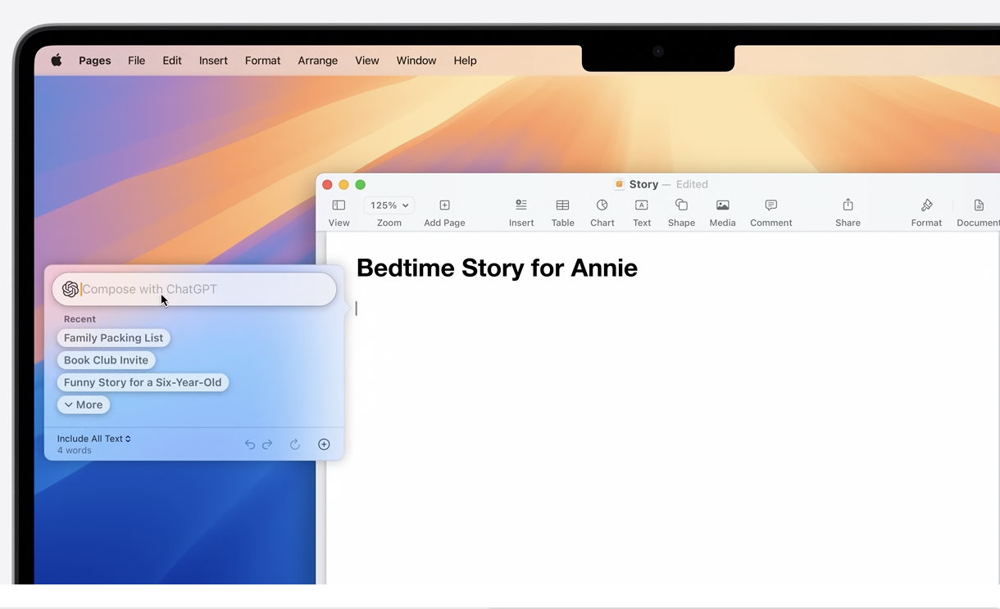

And for ChatGPT subscribers, you'll be able to connect your account and access paid features right within our experiences. 

> So `Apple Intelligence` is used for system specific contextual things and for external things user can chose to use `ChatGPT`.

Investing deeply in the App Intents framework to connect the vast world of apps with Apple Intelligence. We're defining new intents across our operating systems and making them available to developers starting with these categories. These intents are pre-defined, trained, and tested
