[toc]

WWDC video ([link](https://developer.apple.com/videos/play/wwdc2024/102/))

#### Apple Intelligence

`Apple Intelligence` brings in Generative AI, can generate language and images. On-device LLM. Three things that needed to be solved - Should support many different tasks and be powerful (i.e. accurate?) enough, Small enough to run on a device, Energy efficient.

`Adapters` are small a collection of model weights that are overlaid onto the common base foundation model. They can be dynamically loaded and swapped, giving the foundation model the ability to specialize itself on-the-fly for the task at hand. Apple Intelligence includes a broad set of adapters, each fine-tuned for a specific feature. 

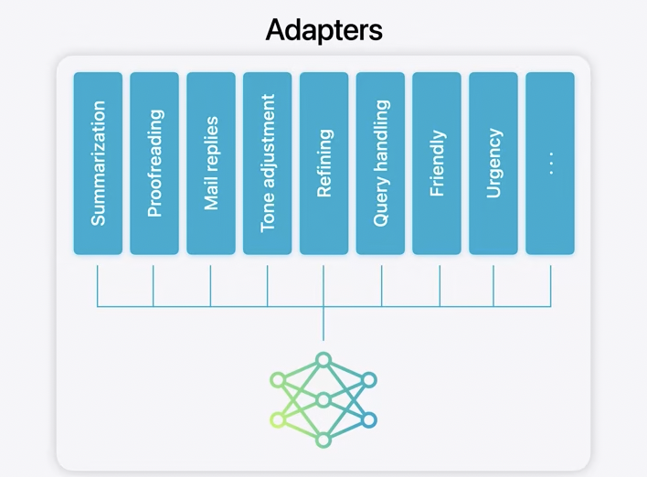

State-of-the-art quantization techniques to take a 16-bit per parameter model down to an average of less than 4 bits per parameter to fit on Apple Intelligence-supported devices

Shortest time to process a prompt and produce a response. We adopted a range of technologies, such as speculative decoding, context pruning, and group query attention, all tuned to get the most out of the Neural Engine. We also applied a similar process for a diffusion model that generates images, using adapters for different styles and Genmoji. 

Extended Apple Intelligence to the cloud with `Private Cloud Compute` to run those larger foundation models. Designed specifically for processing AI privately. Our tooling is designed to prevent privileged access, such as via remote shell, that could allow access to user data. 

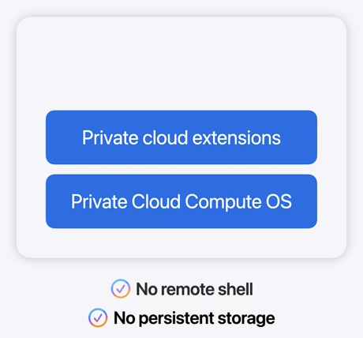

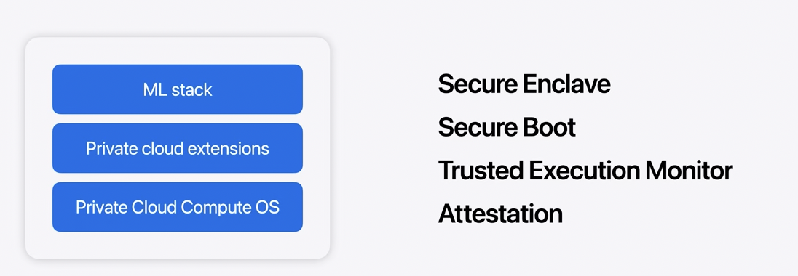

Only the chosen cluster can decrypt the request data, which is not retained after the response is returned and is never accessible to Apple. 

When a user makes a request, Apple Intelligence orchestrates how it's handled either through its on-device intelligence stack or using Private Cloud Compute. 

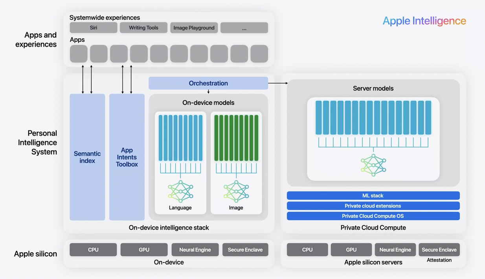

New APIs to bring these features into your apps - Writing Tools, Genmoji, and Image Playground

If you're using any of the standard UI frameworks to render text fields, your app will automatically get `Writing Tools`. And using our new TextView delegate API, you can customize how you want your app to behave while Writing Tools is active, for example, by pausing syncing to avoid conflicts while Apple Intelligence is processing text. Suggest text, Genmoji and more. While emoji are just text, Genmoji are handled using AttributedString.

creating fun, original images across apps. The new Image Playground API can be used. 

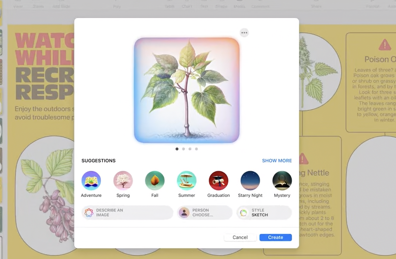 

Writing Tools, Genmoji, and Image Playground are three powerful new Apple Intelligence features

Siri will be able to take hundreds of new actions in and across apps, including some that leverage the new writing and image generation capabilities we just talked about. Enhancements in AppIntents framework.

Siri will be able to invoke any item from your app's menus (on Mac?). Siri will now also be able to search data from your app, with a new Spotlight API that enables `App Entities` to be included in its index.

Exposing your app's capability using App Intents is the key to this integration

----

Vision framework is getting a whole new Swift API this year.

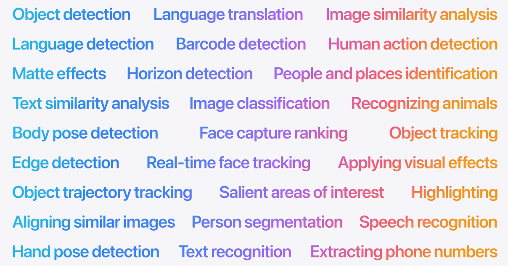

And you can extend them by using Create ML to bring in additional data for training. For example, if you have a unique data set of images, you can augment our image models with your data to improve classification and object detection. 

Optimizations in CoreML model executions.

----

Using Generative Models inside Xcode 16. Code completion becomes predictive with suggested symbol names and comments.

`Swift Assist`, a companion for all your coding tasks. Swift Assist knows Apple's latest SDKs and Swift language features, so you'll always get up-to-date and modern code. Your code is never stored on the server. It's only used for processing your request, and most importantly, Apple doesn't use it for training machine learning models.

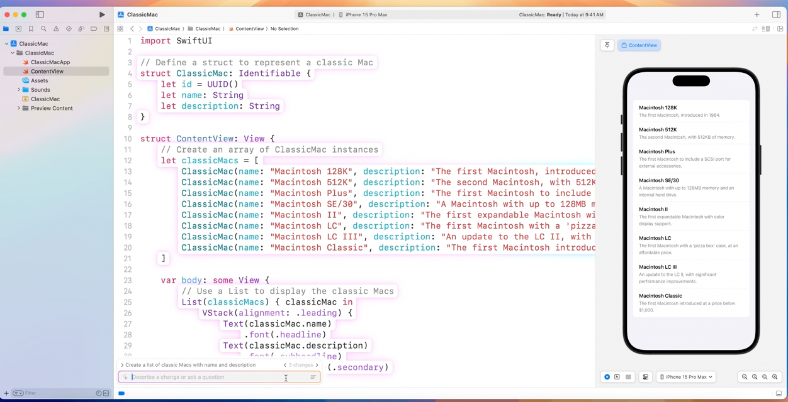

single view of your backtraces, showing relevant code from all stack frames together

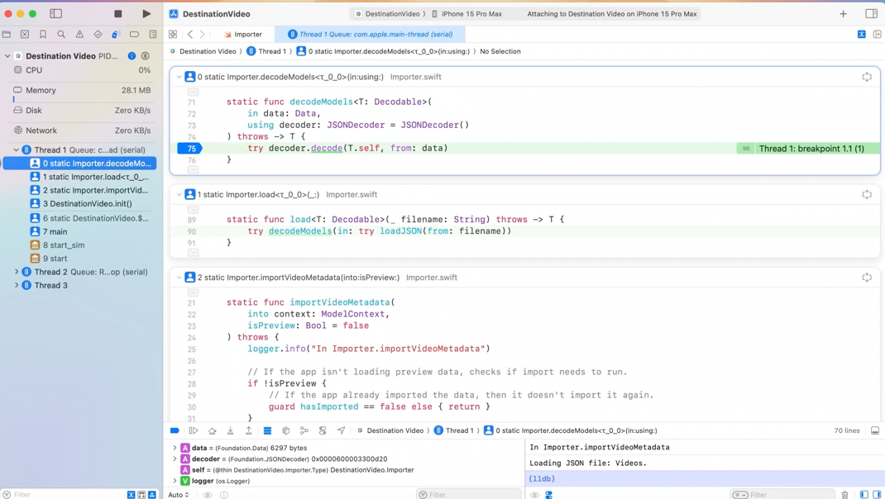

A "flame graph" of your profiling data in Instruments, giving you deeper insight into your app's performance.

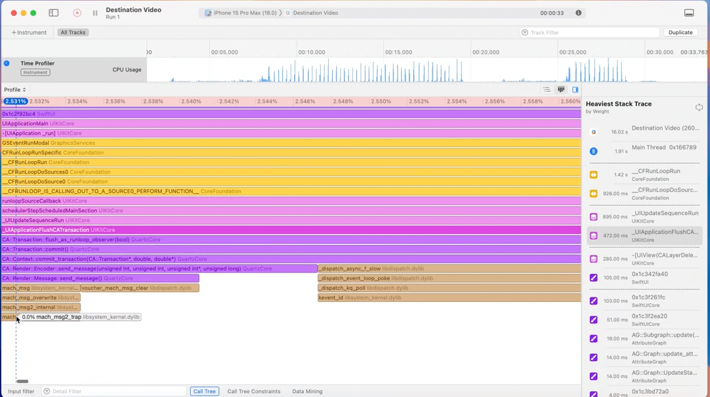

enhancements to localization catalogs

----

Apple uses Swift throughout our software stack, from apps and system services, to frameworks, all the way down to firmware like the Secure Enclave. And it's also used for network services, like Private Cloud Compute.

Investing in support for Swift in Visual Studio Code and other editors that leverage the Language Server Protocol. Expanding our Linux support to include Debian and Fedora and improving support for Windows. A new GitHub organization, dedicated to Swift at github.com/swiftlang.

Swift 6 makes concurrent programming dramatically easier by introducing `data-race safety`. Swift 6 eliminates these kinds of bugs by diagnosing them at compile time. Need to opt-in.

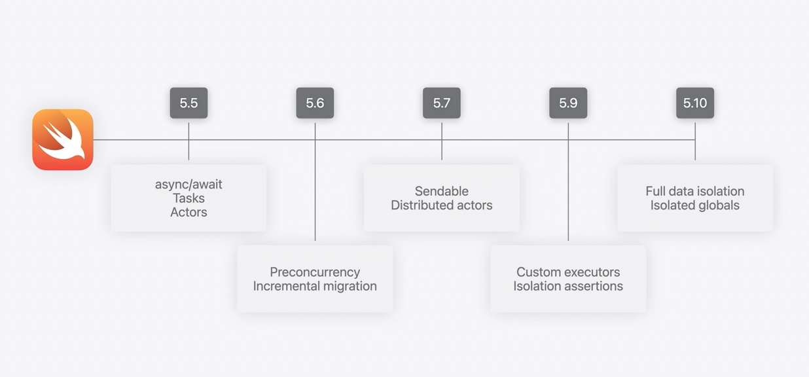

Many more improvements in Swift 6. concurrency, generics, and a new "Embedded Swift" subset for targeting highly-constrained environments like operating system kernels and microcontrollers. 

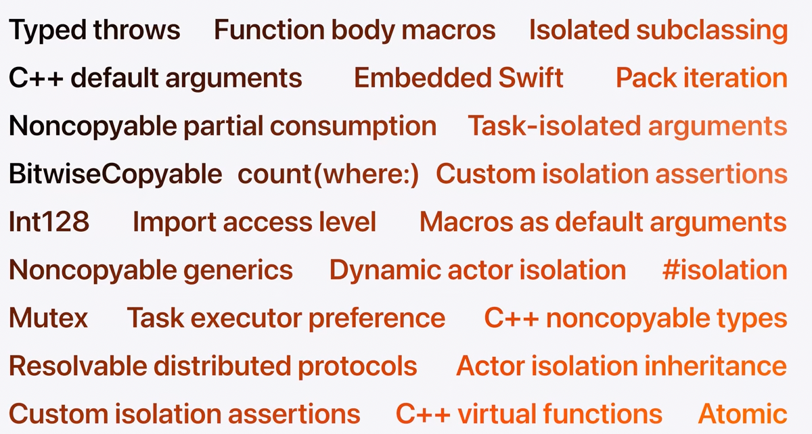

New framework for testing called `SwiftTesting`. macros like `#expect` to evaluate the result of any Swift expression.

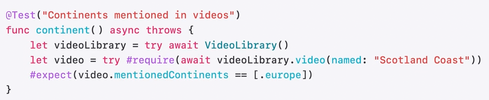

----

SwiftUI from 35 min mark. This year, we focused on previews, customizations, and interoperability. 

Xcode Previews has a new dynamic linking architecture that uses the same build artifacts for previews and when you build-and-run. This avoids rebuilding your project when switching between the two, 

A new `@Previewable` macro makes it possible to use dynamic properties like @State directly in an Xcode Preview

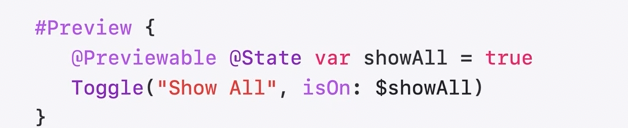

New custom hover effects for visionOS, which give your users additional context when interacting with UI elements, new options to customize window behavior and styling in macOS, giving control over things like the window's toolbar and background, and a new text renderer API 

Gesture recognition has been factored out of UIKit, enabling you to take any built-in or custom UIGestureRecognizer and use it in your SwiftUI view hierarchy. This works even on SwiftUI views that aren't directly backed by UIKit, like those in a Metal-accelerated drawing group. And Animations have been factored out of SwiftUI so you can now set up animations on UIKit or AppKit views and then drive them with SwiftUI.

 we continued to build on SwiftData's simple syntax and modeling capabilities with the addition of `#Index` and `#Unique`.

RealityKit has been the framework to create compelling 3D and spatial experiences. eality Composer Pro, which simplified the development of spatial apps but only supported visionOS. This year, these APIs and tools are now aligned across macOS, iOS, and iPadOS as well with RealityKit 4 so you can easily build for all of these platforms at once. Everything you expect, including MaterialX, Portals, and Particles are now available.

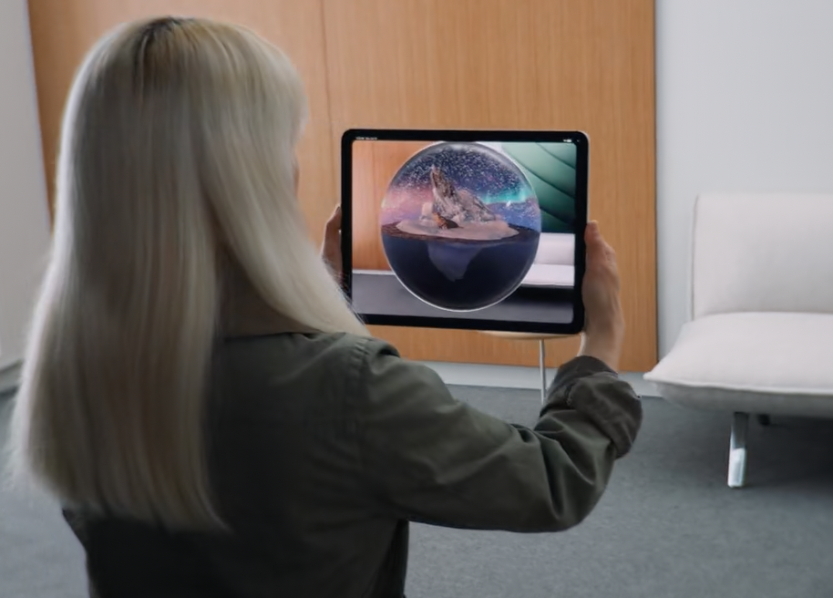

-----

iOS is more customizable than ever, and it starts with `Controls`. They make getting to frequent tasks from your apps faster and easier. Controls can toggle a setting, execute an action, or deep link right to a specific experience.  Controls can toggle a setting, execute an action, or deep link right to a specific experience. Using the new Controls API, you can create a control by specifying the type, a symbol, and an App Intent. 

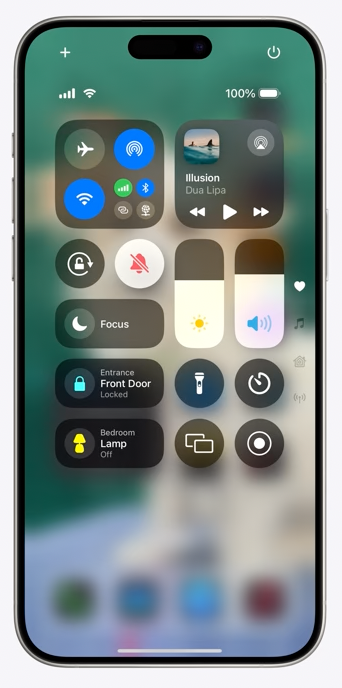

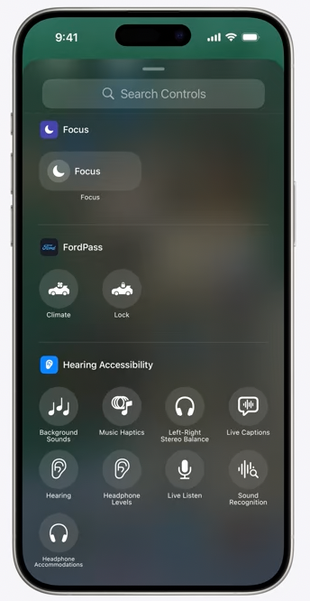

For apps that leverage the camera, the new `LockedCameraCapture` framework enables captures even while the device is locked.

App icons and widgets can now appear Light, Dark, or with a Tint. To get you started, a tinted version of your app icon will automatically be available to your users. And no matter how your icon is rendered, you can make sure that it always looks great by customizing each version. 

----

Two years ago, iOS added support for passkeys. Passkeys are a replacement for passwords that are more secure, easier to use, and can't be phished. They offer faster sign-in, fewer password resets, and reduced support costs. This year, we've created a seamless way to transition more of your users to passkeys with a new `Registration API`. Also available on iPadOS.

iPadOS has a redesigned tab bar. It floats at the top of your app and makes it easy to jump to your favorite tabs. And it turns into a sidebar for those moments when you want to dive deeper. s when you want to dive deeper. Like when you want to explore your channels in Apple TV. There's a new API that simplifies building important interactions like customization, menus, and drag and drop. 

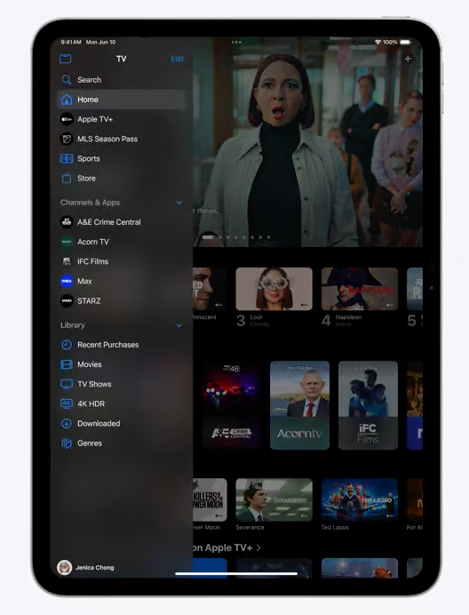

Interruptible animations keep your app feeling responsive as users navigate your UI, because they don't have to wait for animations to complete before their next interaction.

The new zoom transition with an updated Document Launch View. 

----

watchOS updates from 49:30. one of the coolest new features on watchOS this year actually starts on iOS: Live Activities. The new accessory WidgetGroup layout is one way to provide more information and interactivity to your customers. 

To make sure that your informative and interactive widgets appear when they'd be most useful, you can now specify one or more RelevantContexts, such as time of day, AirPods connection, etc.

For those of you eager to integrate `Double Tap` into your apps, handGestureShortcut is the modifier you've been looking for. Use this modifier to identify a Button or Toggle as the primary action in your app, widget, or Live Activity to give your customers quick, one-handed control.

----

macOS changes from 52 min mark. VisionOS changes from 56 min mark.

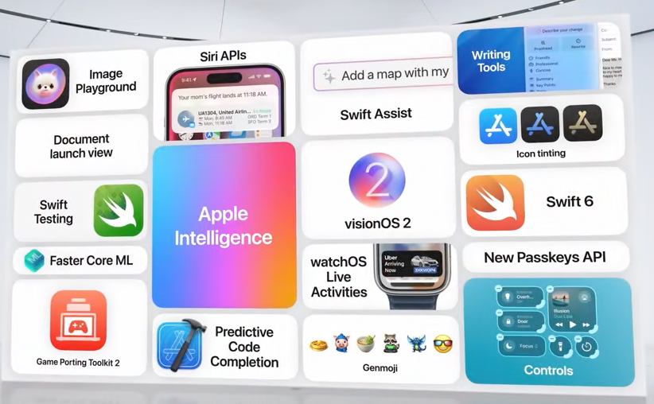