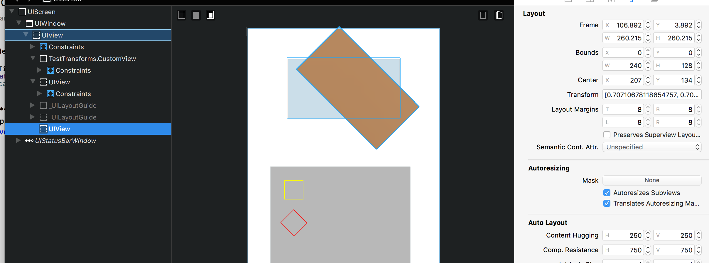
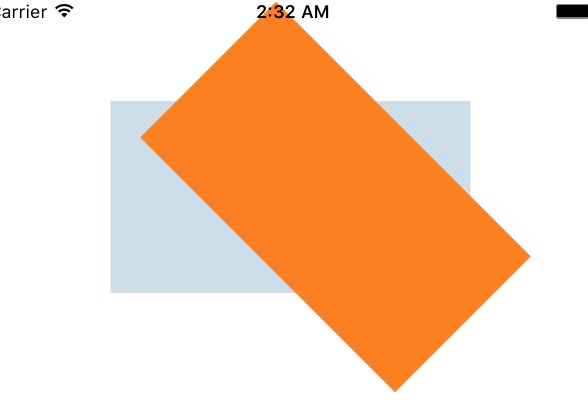
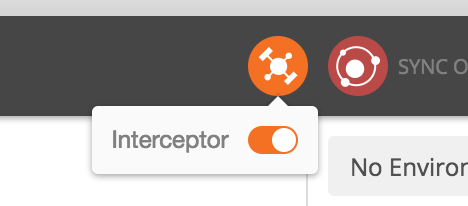

List of all supported deep links (URL schemas) to iOS apps and Settings sub-screens - [Link](https://github.com/FifiTheBulldog/ios-settings-urls/blob/master/settings-urls.md) (~Oct 2022)

******************

There is framework called Compression that can be used to compress/uncompress NSData. There are 4 different compression formats which vary in speed and size. [This](https://www.raywenderlich.com/148569/unsafe-swift) article shows how to do some basic work with them in one of the examples.

compression_algorithm

COMPRESSION_LZ4
COMPRESSION_LZMA
COMPRESSION_ZLIB
COMPRESSION_LZFSE

compression_stream_operation

COMPRESSION_STREAM_ENCODE
COMPRESSION_STREAM_DECODE

COMPRESSION_STREAM_FINALIZE

compression_stream_process

******************

transform property of views. How the center and even frame changes.
https://developer.apple.com/reference/uikit/uiview/1622459-transform

******************

It may sometimes happen that the project will not open. This is typically due to corrupted pbxproj file. One way to fix it is by resetting the workspace. This can be done by deleting the xcuserdata folder in xcodeproj or xcworkspace package. ([link](http://stackoverflow.com/a/4456229/1135417))

******************

Updating just one dependency in carthage cartfile -
carthage update DependencyName

Do a ssh add if carthage update seems to get stuck -
ssh-add -k ~/.ssh/id_rsa

******************

assumingMemoryBounds converts UnsafeMutableRawPointer to UnsafeMutablePointer<T>.

Library for drawing charts - https://github.com/danielgindi/Charts

let vConstraints = NSLayoutConstraint.constraints(withVisualFormat: "V:|-50-[v]-50-|",

Xcode shortcut for adding documentation - Cmd + Option + /
Any documentation added this way automatically shows up in the quick help definition as well.

access level, internal and private
cookiecutter
bufferunlockflags

XCTestWaiter - http://masilotti.com/xctest-waiting/

Saving an image to camera roll -
UIImageWriteToSavedPhotosAlbum(portraitImage, nil, nil, nil)

While using Postman, turn on Interceptor to send Authorization.

Change the transform of a UIButton. How does the coordinate system here work.

self.skipButton.transform = CGAffineTransformMakeScale(-1.0, 1.0)
buttonLabel.transform = CGAffineTransformMakeScale(-1.0, 1.0)
buttonImageView.transform = CGAffineTransformMakeScale(-1.0, 1.0)
Getting color of a pixel.
http://stackoverflow.com/questions/34569750/get-pixel-value-from-cvpixelbufferref-in-swift
	http://stackoverflow.com/questions/10163346/getting-desired-data-from-a-cvpixelbuffer-reference
http://stackoverflow.com/questions/37117185/ciimage-set-color-of-one-specific-pixel

Working with UnsafeMutablePointer.
http://stackoverflow.com/a/29815031/1135417

Extrapolating point -
http://stackoverflow.com/questions/23823135/calculate-coordinate-by-distance-from-another-coordinate
http://stackoverflow.com/questions/26490313/calculate-lat-long-coords-a-specific-distance-away-from-another-pair-of-lat-long

Working with pixels and bytes -
http://stackoverflow.com/questions/15935074/why-is-my-images-bytes-per-row-more-than-its-bytes-per-pixel-times-its-width

Provisioning -
http://bigzaphod.tumblr.com/post/78574849549/provisioning
https://github.com/chockenberry/Provisioning (quick look .mobileprovision files)
Capture lists

http://stackoverflow.com/questions/24320347/shall-we-always-use-unowned-self-inside-closure-in-swift

http://ericasadun.com/2014/08/26/swift-capturing-references-in-closures/

http://stackoverflow.com/questions/21987067/using-weak-self-in-dispatch-async-function
Testing -

add unit test
@testable import
framework search path should have the target

Sort out -

Storyboard and animations
CoreData
Table Views, Collection Views

IBDesignables
UIView systemLayoutSizeFittingSize
dynamic text

alignment rects
alignmentRectInsets
debug console - alignmentRectForFrame:

label attributes inspector - arrange position view - what is it
label preferred width
show - frame rectangle and alignment rectangle

Xcode - turning on Clang analyzer
Rust, TypeScript, asm.js, broad WebGL support

Libraries in https://github.com/vsouza/awesome-ios

baseline constraints. textview and buttons have them. do textfield also have them,

alignmentRects and alignmentRectInsets
dynamic text
Universal Links (https://developer.apple.com/library/ios/documentation/General/Conceptual/AppSearch/UniversalLinks.html)

https://stackoverflow.com/a/32382761/1135417
https://stackoverflow.com/questions/18992840/how-to-check-if-a-static-library-is-built-for-64-bit

How to make navigation bar not translucent
edgesForExtendedLayout, understand even though it has been deprectaed in favor of safe area since iOS 11

Readme files -
A readme.md file is nothing but somehting used on github to automatically generate html content that serves as introduction fpr the repository. Some of the syntax is listed here - https://stackoverflow.com/a/10818246/1135417.
Here is a sample readme.md file - https://raw.githubusercontent.com/snowplow/snowplow/master/README.md
This content does get shown at the home page of the repository as an HTML - https://github.com/snowplow/snowplow

Installing cocoapods -
Ok so the trick was that I had to be in visigoth, set terminal proxy (i.e. run proxify function on terminal), and then do a non-sudo cocoapods install.

Also, before running the command add below lines in the home directory's .profile file. (Its needed if doing a non-sudo installation, [link](https://guides.cocoapods.org/using/getting-started.html))
export GEM_HOME=$HOME/.gem
export PATH=$GEM_HOME/bin:$PATH

gem install cocoapods --verbose
pod -version (check the version after installation)
