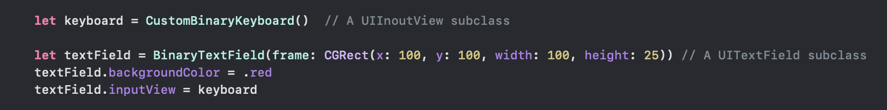
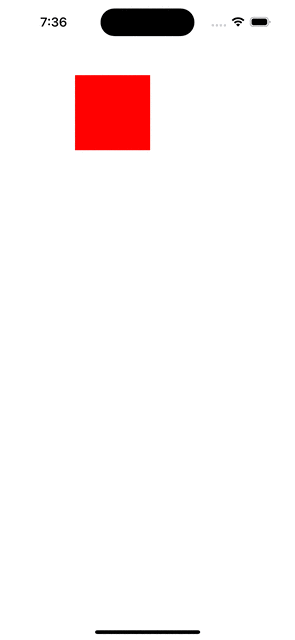
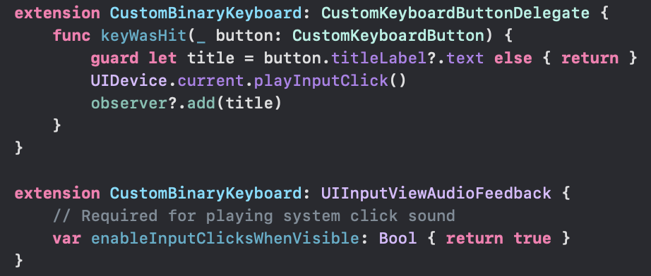

[toc]

#### What is it

Custom keyboard extensions make a new keybord available system-wide. That might be too much for something that may be needed just for certain textfields in certain screens of a particular app. That is where **UIInputView** comes in, it can be attached to a specific UIResponder (i.e. textField, textView, etc.).

UIResponder's `inputView`  property ([link](https://developer.apple.com/documentation/uikit/uiresponder/1621092-inputview))  `UIInputView` reference ([link](https://developer.apple.com/documentation/uikit/uiinputview))  

Here is how it feels. Over here the red colored area is actually a textfield, and what comes underneath is the custom keyboard.

#### How to create it

Essentially create a UIInputView subview and add the required UIButtons to it. Anytime a UIButton is tapped, inform it to the required consumer using delegates etc. Assign an instance of this UIInput subview to the required textfield, etc.'s inputView property.

Note that there are also a few properties in UIInputView such as **inputStyle** ([link](https://developer.apple.com/documentation/uikit/uiinputview/1619471-inputviewstyle)) that can be used to do some minor styling of the keyboard/UIInputView.

Also, **UIInputViewAudioFeedback** ([link](https://developer.apple.com/documentation/uikit/uiinputviewaudiofeedback)) can be used to attach keyboard click sounds when an input event happens.

#### Journal

UIInputVew has a property named **textDocumentProxy** that can access textfield's textInputTraits.

> Ok, I can have a custom inputView in a UIViewController's specific UIResponder fields. I can even attach inputAccessoryview to it. But how to have an inputView or inputAccessoryView in a webView.

#### Useful resources

Magnus Kahr tutorial ([link](https://www.magnuskahr.dk/posts/2019/05/creating-a-custom-input-in-swift/))  Test project name - 'Custom Keyboards/UIInputView/BinaryKeyboard - magnuskahr'  Keyboards and input home page ([link](https://developer.apple.com/documentation/uikit/keyboards_and_input))  'WWDC 17 - The Keys to a Better Text Input Experience' at 30:00 mark (have it downloaded)  