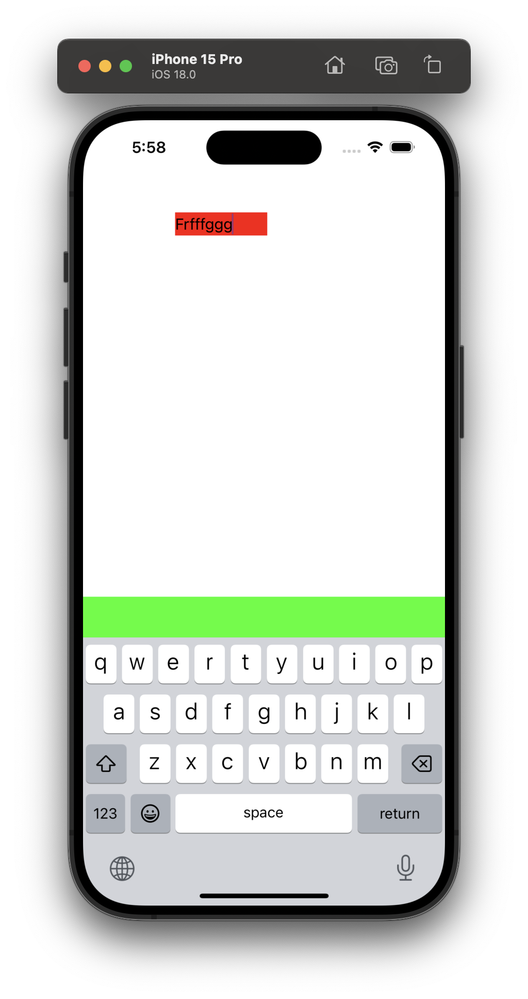
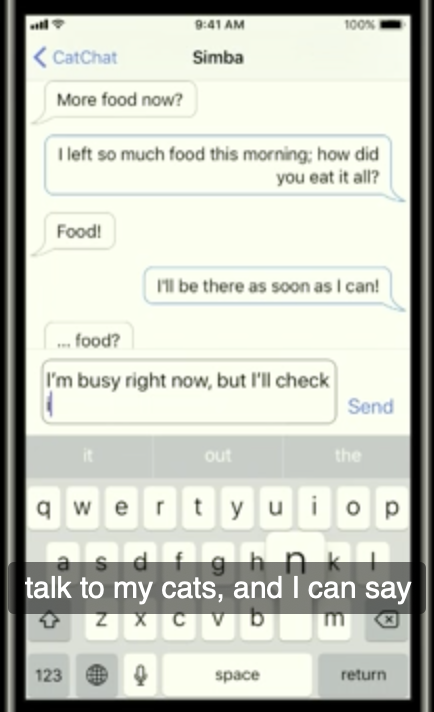

[toc]

##### Attaching an accessory view to the system keyboard 

Input Accessory View is a custom view that can be attached above the keyboard, that shows up with the keyboard. This can be done by assigning a custom UIView to the **inputAccessoryView** property of the UIResponder ([reference](https://developer.apple.com/documentation/uikit/uiresponder/1621119-inputaccessoryview), [SO link](https://stackoverflow.com/questions/35689528/add-a-view-on-top-of-the-keyboard-using-inputaccessoryview)). Keep in mind though that anything shown in that custom view does not automatically get tied to keyboard taps though, so if you show some text there and user taps on it you will still have to insert that in the correct textfield yourself.

```swift
let customView = UIView(frame: CGRect(x: 0, y: 0, width: 10, height: 44))
customView.backgroundColor = UIColor.green
textField.inputAccessoryView = customView
```



##### Dynamic height for inputAccessoryView

Its possible to have the inputAccessoryView's height change dynamically even after it shows up. This can be done using intrinsicContentSize, etc. ''WWDC 17 - The Keys to a Better Text Input Experience' covers this at 7:30 min mark.

A screenshot from above WWDC video for this. Note that the textView there is actually a part of the inputAccessoryView.

