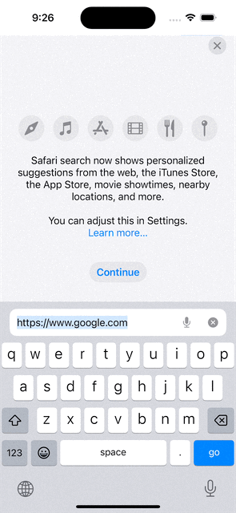
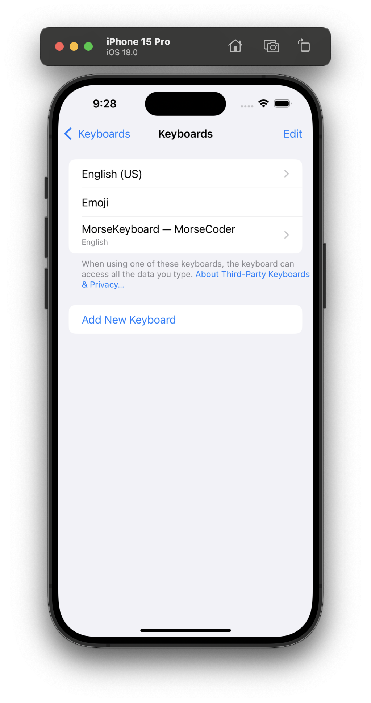
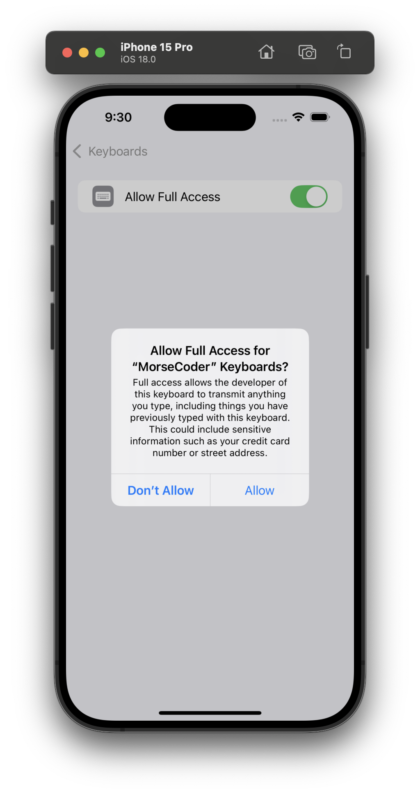

[toc]

#### What is it

A type of extension (i.e. separate target) where theb developer can provide their own keyboard which other becomes available system wide (after user opts in) and other apps can use it to.

Essentially code needs to be written to have buttons for all the keys/alphabets you'd need. There isn't some entity that represents a default iOS keyboard which can simply be subclasses and modified as needed. Button also needs to be provided to switch to another keyboard (in fact there is a method that even says if there is another keyboard available and hence if there is a need to show this button).

##### References

Creating a custom keyboard ([reference](https://developer.apple.com/documentation/uikit/keyboards_and_input/creating_a_custom_keyboard/))  Configuring open access for custom keyboard ([reference](https://developer.apple.com/documentation/uikit/keyboards_and_input/creating_a_custom_keyboard/configuring_open_access_for_a_custom_keyboard))  Designing a custom keyboard interface ([reference](https://developer.apple.com/documentation/uikit/keyboards_and_input/creating_a_custom_keyboard/configuring_a_custom_keyboard_interface))

#### Entitites

This code is placed in a view controller that should be a subclass of **UIInputViewController** ([reference](https://developer.apple.com/documentation/uikit/uiinputviewcontroller)).

To create a custom keyboard, first subclass the UIInputViewController class, then add your keyboard’s user interface to the **inputView** property of your subclass.

Also, the text entered so far is accessible using **textDocumentProxy** property ([reference](https://developer.apple.com/documentation/uikit/uiinputviewcontroller/1618193-textdocumentproxy)).

#### Open Access

By default, a custom keyboard disallows access to the network and prevents writing to the containing app’s shared group containers (reading is permitted). This can be tweaked by opting for **Open access** which lets you do things like store keyboard configuration, perform more complex analysis on text the user typed, or provide advanced features that require server support.  `RequestsOpenAccess` flag should be set as true in the keyboard’s Info.plist. User has to opt in regardless.

#### How it feels

Here is what it feels like, in any app when the keyboard comes up this custom keyboard can be brought up. 

The companion app typically includes a tutorial/help for the keyboard. Also, note that the user does need to activate the custom keyboard for the first time using Settings app.

| Activating custom keyboard in Settings app                   | Giving full access to custom keyboard                        |
| ------------------------------------------------------------ | ------------------------------------------------------------ |
|  |  |

#### Useful resources

Kodeco tutorial ([link](https://www.kodeco.com/49-custom-keyboard-extensions-getting-started/page/3?page=1#toc-anchor-001)) Test project name - 'Custom Keyboards/Keyboard Extension/MorseCoder'  'WWDC 17 - The Keys to a Better Text Input Experience' at 36:00 mark (have it downloaded)  