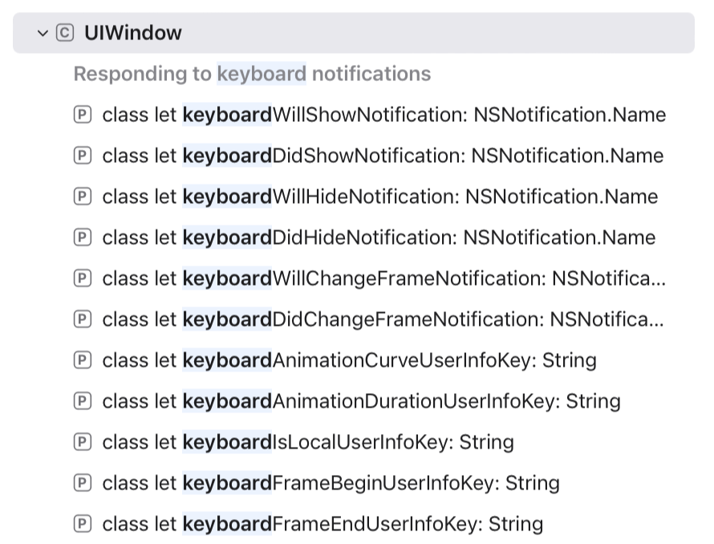
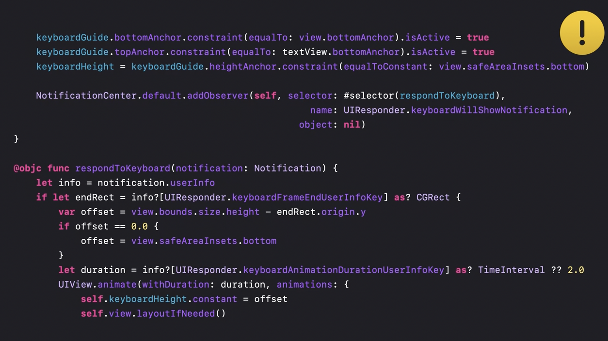
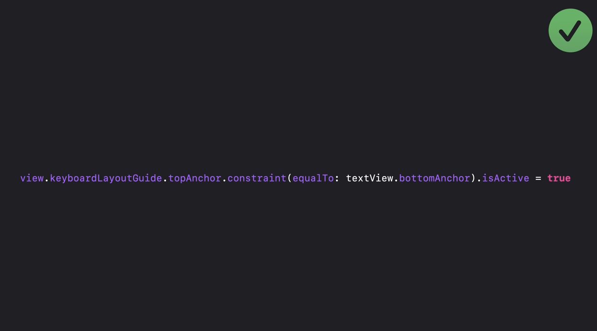
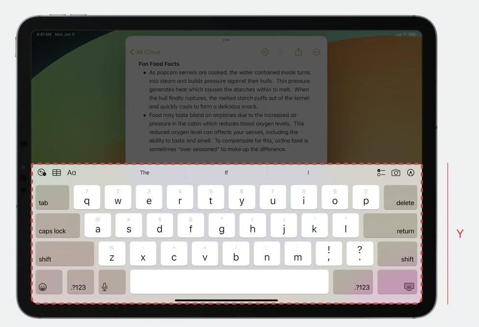
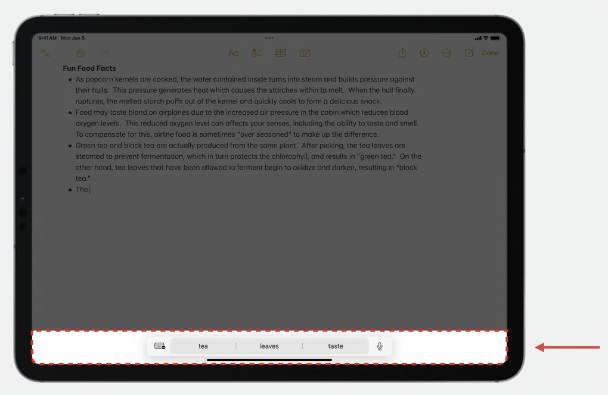
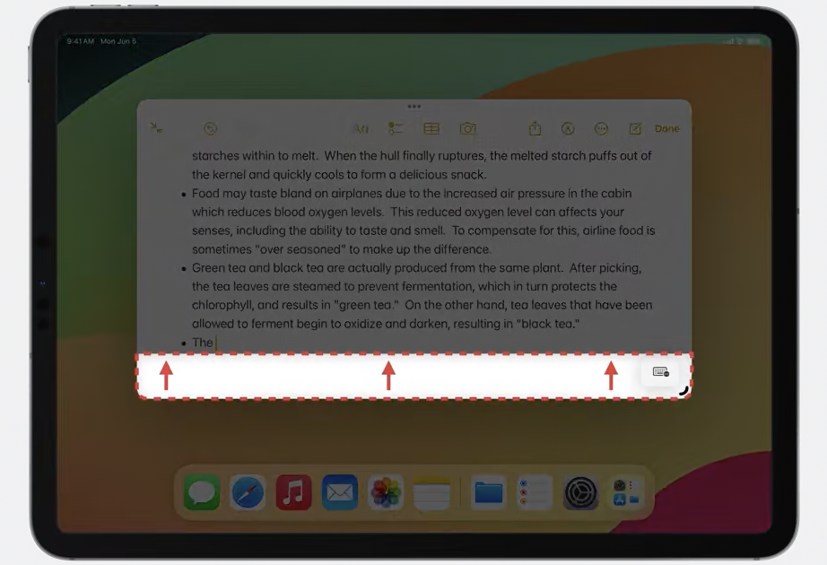
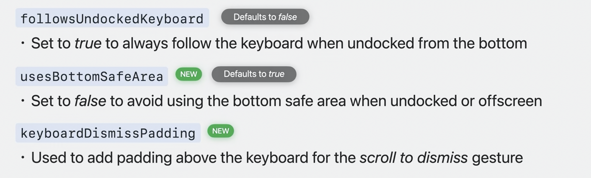
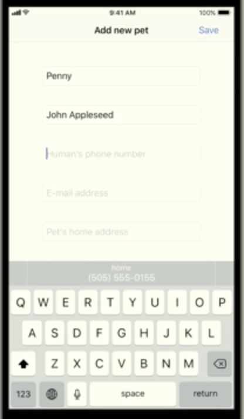
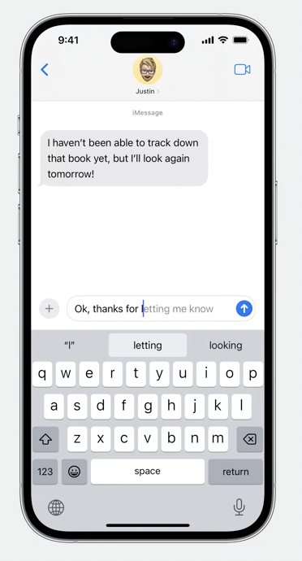
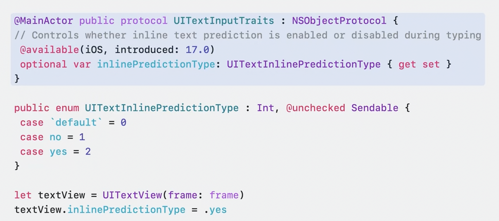

[toc]

#### Keeping track of keyboard height

It can't be assumed that the keyboard's height will stay constant after it gets displayed. It can change for a variety of reasons including inputAccessoryView height change, language change, keyboard being undocked, etc. However anytime these changes happen, it can be tracked by observing various combinations of these nortifications.

> The first 7 min of 'WWDC 17 - The Keys to a Better Text Input Experience' cover this along with some code snippets.



#### Responding to keyboard showing up

> Covered in 'WWDC 21 - Your guide to keyboard layout'.

The goold old situation, keyboard shows up and you need to adjust your view controller's layouts to ensure any important content is not obscured by keyboard.

##### Classic handling: With notifications alone

The way till 2021. Observe notifications and then adjust your subviews' frames.



##### Since 2021: With keyboardLayoutGuide

The way after WWDC 2021, use a brand new dedicated layout guide called **keyboardLayoutGuide** ([reference](https://developer.apple.com/documentation/uikit/uiview/keyboardlayoutguide?language=objc)). <br>Its of type **UIKeyboardLayoutGuide** which in turn is a subclass of another kind of new layout guide known as **UITrackingLayoutGuide**.

 It can be used to effectively manage docked and split keyboards too (explained in the WWDC video). And even 'Text input from Camera' (as that too is technically a part of keyboard UI).



##### Since 2023: More properties to handle Stage Manager, Assistant Toolbar, etc.

> This then got even more enhancements in WWDC 2023. Covered in 'WWDC 23 - Keep up with the keyboard'

With advanced multi-tasking (i.e. things like Stage Manager) apps are necessarily full screen. So if unhandled, keyboard may not fit well with app's real estate and you can't simply assume that your app is full screen and do the Math accordingly.



When a physical keyboard is attached, an assistant toolbar is shown and that too should actually be treated as a part of on-screen keyboard.




When outside of Stage Manager, we're preserving existing behavior where this mini toolbar does not act as part of the keyboard and will overlap your views. Users can access the content underneath by dragging the toolbar to the other side of the screen. However, when in Stage Manager, the mini toolbar does act as part of the keyboard.



The existing default behavior is as follows: the keyboard layout guide follows the keyboard when it's onscreen and docked. If the keyboard is not docked, such as when it's floating on iPad, the guide's height will match the view's bottom safe area. Finally, the guide will track any keyboard dismiss gestures once the touch point intersects with the guide. This is how it was until iOS 17. In iOS 17, even these have become customizable. There are now three properties on UIKeyboardLayoutGuide. followsUndockedKeyboard, usesBottomSafe (behaves similar to InputAccessoryView), keyboardDismissPadding.



With Stage Manager, don't rely exclusively on keyboard notifications and the dimensions it gives. When the screen's coordinate space and your app's coordinate space differ, the raw keyboard height value will no longer be the correct value to adjust your views.

#### Separate process for keyboard

Since 2023, there's only one keyboard process, instead of multiple instances running in multiple apps. It leads to better performance, but can need some additional code for proper handling in apps.

>Introduced and covered in 'WWDC 23 - Keep up with the keyboard'.  
>
>Covered towards later part of above video - "With the new out of process architecture since 2023, there may be some small changes in behavior with notifications you should know about. in the new out of process architecture, when your app requests the keyboard, the system will asynchronously initialize the keyboard UI and then asynchronously post the notifications and perform the animations. This introduces some slight differences in timing, so if your app is relying on the timing of the notifications as some sort of "callback" from invoking becomeFirstResponder, or perhaps performing significant work on the main thread which could cause the handling of the notifications to be delayed, you should keep this new model in mind, as it may have an effect on your app." 

#### Preserving keyboard type for screens

Its possible to remember what keyboard the user had for a certain screen and then automatically bring that up next time the user is on that screen. For this a unique identifier has to be assigned to that screen's **textContentInputIdentifier** property. ([Reference](https://developer.apple.com/documentation/uikit/uiresponder/textinputcontextidentifier))  This is a UIResponder property.

> Covered in 'WWDC 17 - The Keys to a Better Text Input Experience' at 12' mark.

#### Inspecting the current keyboard language

Its possible to know the current keyboard language using **textInputMode** property ([reference](https://developer.apple.com/documentation/uikit/uiresponder/textinputmode)). This too is a UIResponder property.

>Covered in 'WWDC 17 - The Keys to a Better Text Input Experience' at 17:30 mark.

#### UITextInputTraits

**UITextInputTraits** is a protocol which has properties for various things regarding text input. UITextField and UITextView conform to it already, and conformance to it can be added for any custom text input type too. ([Reference](https://developer.apple.com/documentation/uikit/uitextinputtraits?language=objc)) 

Here are some of its properties. 

> 'WWDC 17 - The Keys to a Better Text Input Experience' covers some of these at 18:30 mark.

**keyboardType** ([reference](https://developer.apple.com/documentation/uikit/uikeyboardtype)) is used to set the associated keyboard type, i.e. ascii, numbersAndPunctuation, etc.

**textContentType** ([reference](https://developer.apple.com/documentation/uikit/uitextcontenttype)) is used to indicate what the text is meant for, i.e. name, address, credit card number, etc. which in tuen then gets used by QuickType bar to provide appropriate suggestions.



There are plenty of `smart*` properties (like **smartInsertDeleteType** ([reference](https://developer.apple.com/documentation/uikit/uitextinputtraits/smartinsertdeletetype?language=objc))) which are used for some special text insertion, etc. (Covered at 24:00 mark in above WWDC video.)

#### Hiding the QuickType bar in the keyboard

Both **autocorrectionType** and **spellCheckingType** properties of the UIResponder need to be set to false.

```swift
textField.autocorrectionType = .no
textField.spellCheckingType = .no
```

#### Inline Predictions

> 'WWDC 23 - Keep up with the keyboard' at 23:00 mark

Intelligent auto-completes in textfield (not directly programmable QuickType Bar suggestions). The suggestion is generated by the system and uses contextual information (already entered?) in the focused textfield.




Its activated using a new **inlinePredictions** property in **textInputTraits**. It is automatically enabled for most fields (other than some like search and password textfields).



#### Misc.

What is Adaptive Shortcuts Bar?
