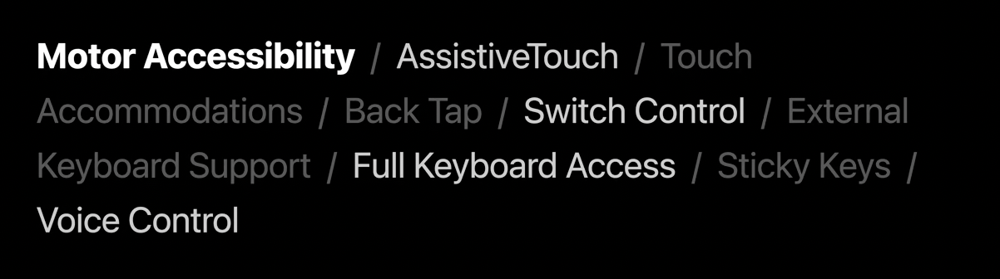
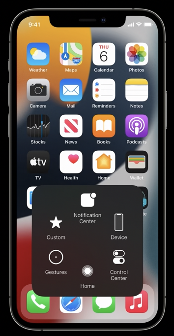
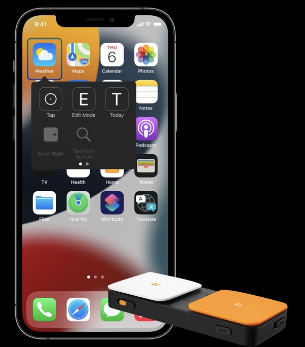
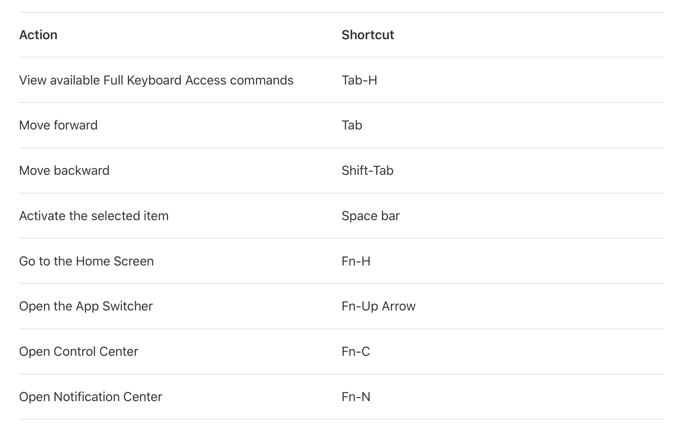
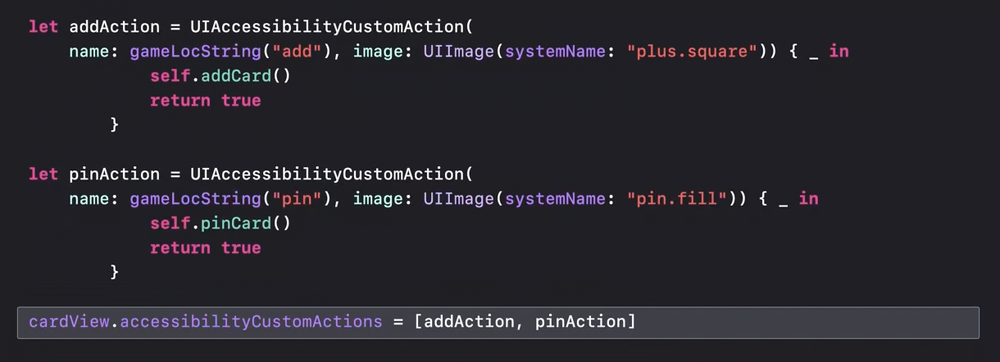
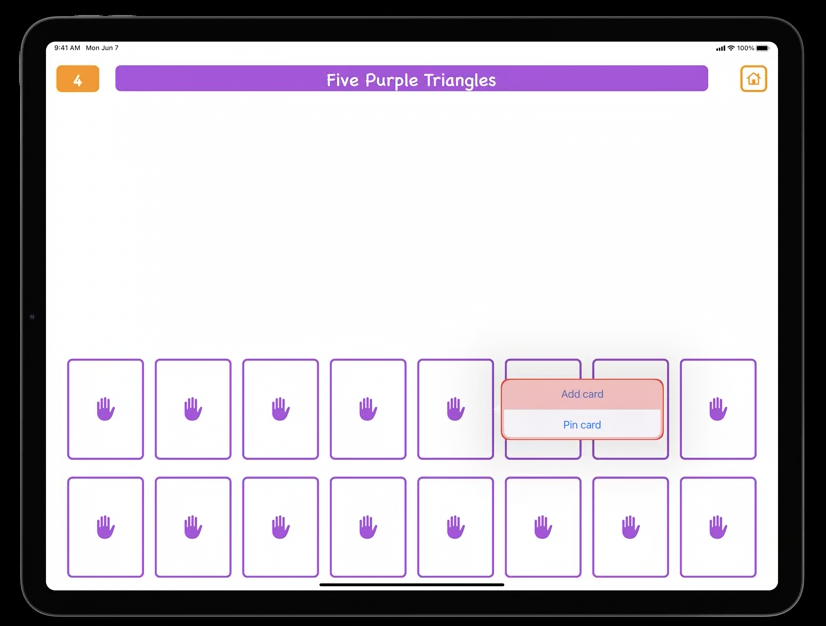
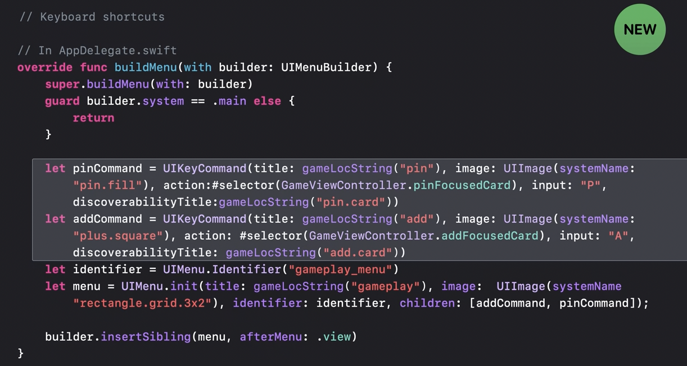

> Do specific things when certain key combinations are pressed in attached keyboard.

##### Motor Accessibility Solutions in iOS

Options provided by iOS for users with motor accessibility needs. (~2021)

| Assistive Touch                                              | Switch Controls (physical switch for taps)                   |
| ------------------------------------------------------------ | ------------------------------------------------------------ |
|  |  |

##### What is Full Keyboard Access

**Full Keyboard Access** is the middle ground between Assistive Touch and Switch Control. Its for people who are senstive to rouch screen but also do not want to use a Physical Switch. And it also serves as an alternative to Voice Control.

Has navigation command (access elements), interaction command, gesture command (pan gesture, etc.). And they all have Tab as modifier key (i.e. the key which morphs a usual key into something else.), and even that can be modified.

Its can be enabled using 'Settings > Accessibility > Keyboards > Full Keyboard Access' ([Official documentation](https://support.apple.com/guide/iphone/control-iphone-with-an-external-keyboard-ipha4375873f/ios))

Default keyboard commands - 

##### Custom Actions with 'Tab Z'

**UIAccessibilityCustomAction** ([reference](https://developer.apple.com/documentation/uikit/uiaccessibilitycustomaction?language=objc)) is something that gets used for assigning certain custom actions in app which show up when 'Tab-Z is hit, or in VoiceOver, as well as Switch Control'.

UI in a sample app for above code snippet, when Tab Z is pressed the actions show up in a popover.

##### Custom keyboard shortcuts

A custom keyboard shortcut can be added too. It works even for normal system keyboard. Explained in 'WWDC 21 - Support full keyboard access in your iOS app' at 8:00.

##### Resources

WWDC 21 - Support full keyboard access in your iOS app - k WWDC 21 - Take your iPad apps to the next level  WWDC 21 - Focus on iPad keyboard Navigation