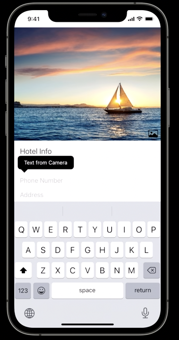
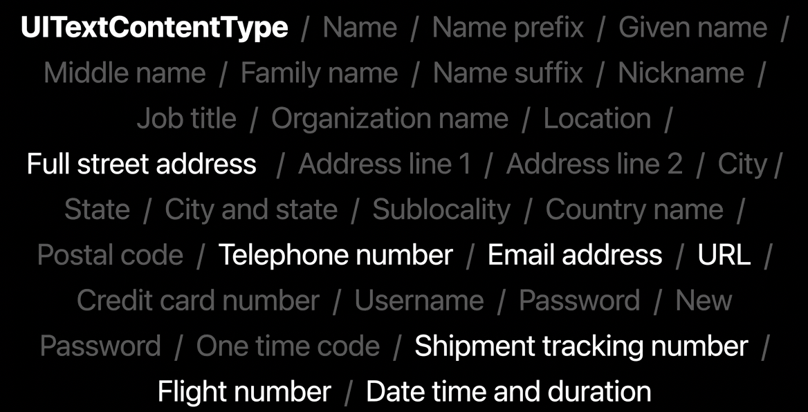
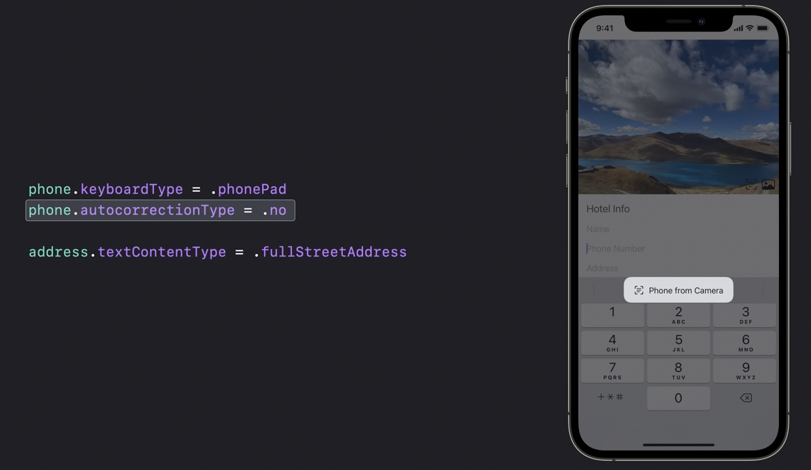
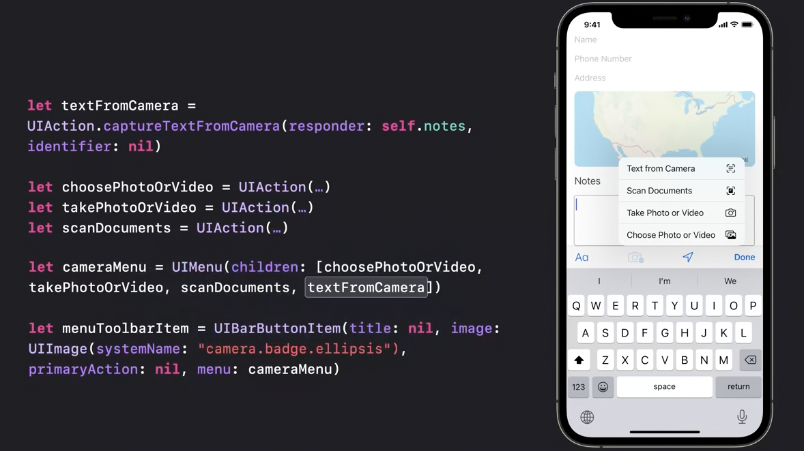
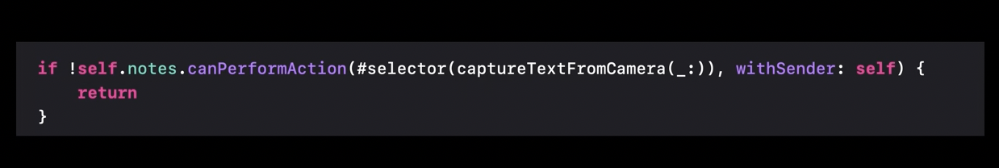
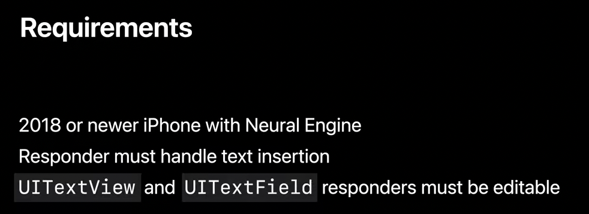
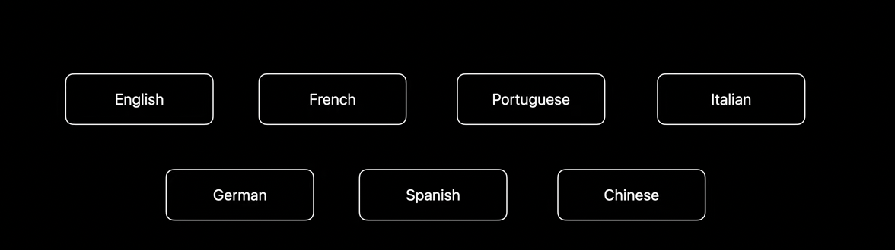

> Covered in 'WWDC 21 - Use the camera for keyboard input in your app'. Its basically a way to detect text from an image/camera feed and insert that in text control (and even on top of  image view as caption).

| How to launch it                                             | How it feels                                                 |
| ------------------------------------------------------------ | ------------------------------------------------------------ |
|  |  |

Filtering is done by using the TextContentType and KeyboardType properties which are available on text fields and text views.

The TextContentType can be any one of these various values. But the camera won't filter for all of these types. It'll filter on just these seven.

if there are no autocorrection or predictive text candidates, iOS gives you a button for quick access to the camera. 

You can add your own dedicated launcher button. To do that, first we need to create a UIAction using the captureTextFromCamera factory method

##### Check if the feature is available on current device

And additionally user must have one of some specific languages as their preferred languages.

It can even be used to put a caption on top of UIImageview in some way by having itthe image view adopt UIKeyInput protocol. Explained at around 08:00 mark.