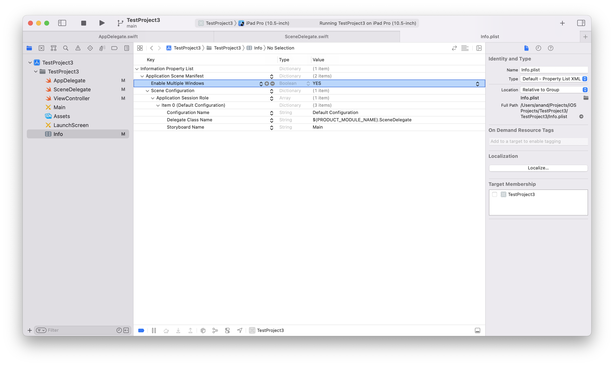

Working with multiple windows of the same app was introduced in iOS 13 (2019), and that is when things like `UIWindowSceneDelegate` came in.

##### Enabling Multiple Windows
Whether an app suuports multiple windows or not is determined by the Info.plist key `Enable Multiple Windows`. It is off by default.



##### Scene Delegate

A `scene` seems to represent a single window of an app. So if there are 2 windows open at the same time, there is just 1 appDelegate instance but 2 sceneDelegate instances open at the time.

`UIApplicationDelegate` methods -
```
func application(_ application: UIApplication, didFinishLaunchingWithOptions launchOptions: [UIApplication.LaunchOptionsKey: Any]?) -> Bool
func application(_ application: UIApplication, configurationForConnecting connectingSceneSession: UISceneSession, options: UIScene.ConnectionOptions) -> UISceneConfiguration {
func application(_ application: UIApplication, didDiscardSceneSessions sceneSessions: Set<UISceneSession>) {
```

`UISceneDelegate` methods -
```
func scene(_ scene: UIScene, willConnectTo session: UISceneSession, options connectionOptions: UIScene.ConnectionOptions)
func sceneDidDisconnect(_ scene: UIScene)
func sceneDidBecomeActive(_ scene: UIScene)
func sceneWillResignActive(_ scene: UIScene)
func sceneWillEnterForeground(_ scene: UIScene)
func sceneDidEnterBackground(_ scene: UIScene)
```

Typical sequence of methods called as a single window app is launched, etc. -
```
appDelegate - didFinishLaunchingWithOptions
sceneDelegate - willConnectTo
intialVC - loads
intialVC - viewWillAppear
sceneDelegate - sceneWillEnterForeground
sceneDelegate - sceneDidBecomeActive
intialVC - viewDidAppear
--- MINIMIZE APP ---
sceneDelegate - sceneWillResignActive
sceneDelegate - sceneDidEnterBackground
--- RE-FOREGROUND APP ---
sceneDelegate - sceneWillEnterForeground
sceneDelegate - sceneDidBecomeActive
```
