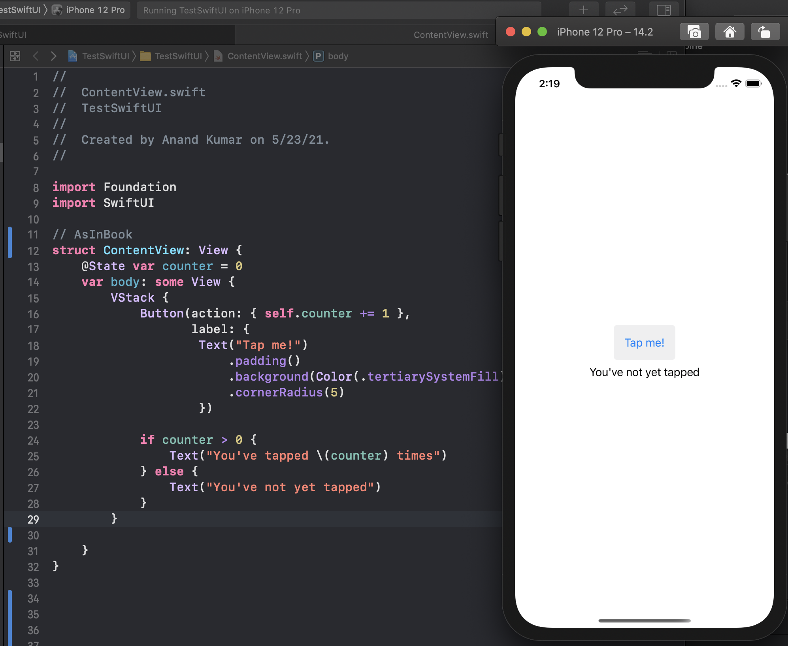

#### The Very Basics

Its possible to create a view controller (i.e. `UIHostingController`) whose root view is a SwiftUI `View`.

```
window.rootViewController = UIHostingController(rootView: contentView)
```

The argument passed to the initializer is a `View` (i.e. something that conforms to `View` protocol).

```
public protocol View {
    associatedtype Body : View
    @ViewBuilder @MainActor var body: Self.Body { get }
}
```

A `View` compliant type needs to have a property named `body` that itself provides the View. Note that the `body` is also qualified with a result builder named `ViewBuilder`.

Here is an example. The view here includes a `VStack` which in turn includes a `Button` and a `Text`. How the layout happens, is something that SwiftUI controls itself.



Any View compliant struct or type created this way is technically a custom view.

### Modifiers

`View` also has several `Modifiers`, i.e protocol methods with default implementations which can be used to further configure views. These modifiers actually wrap the view on which they are invoked into another view. Hence any modifier's signature says that it returns a `some View`.

```
func tint(Color?) -> some View
```
