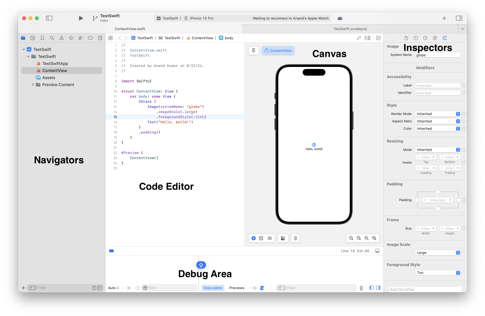
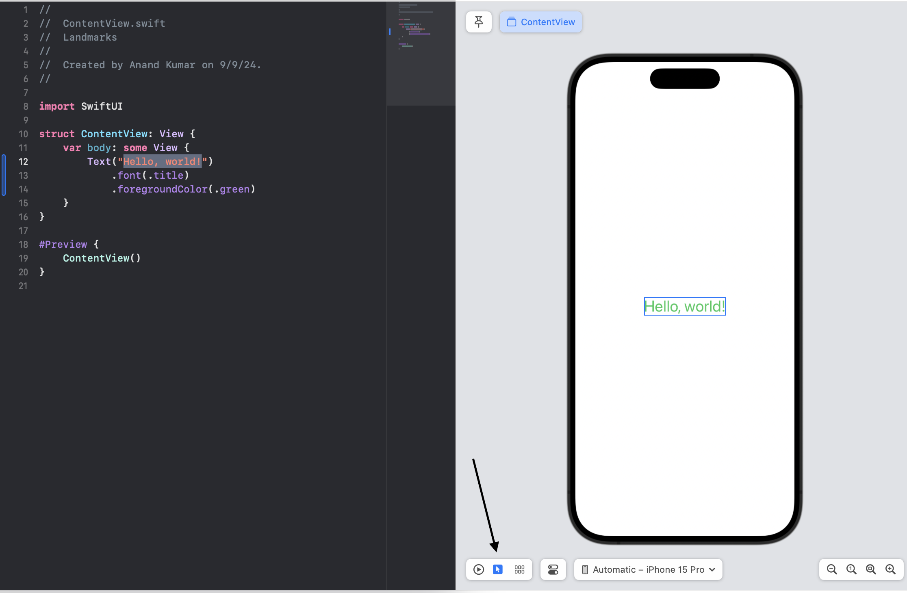
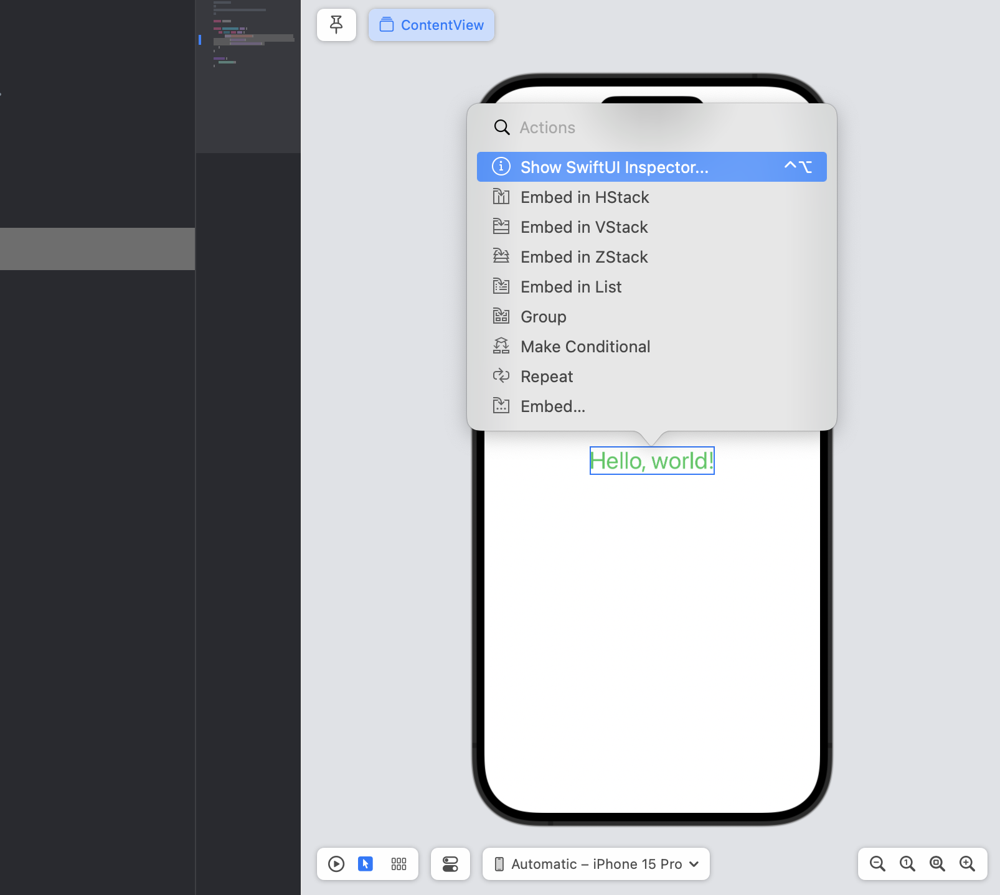
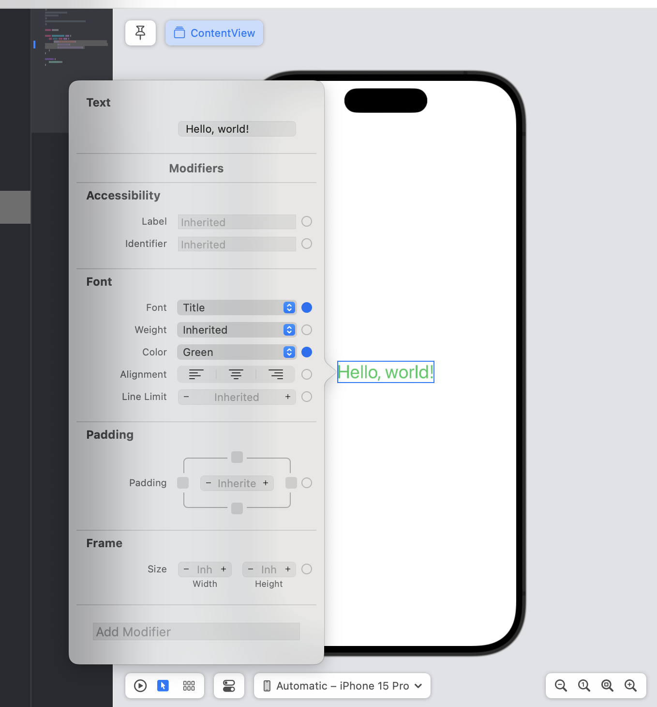
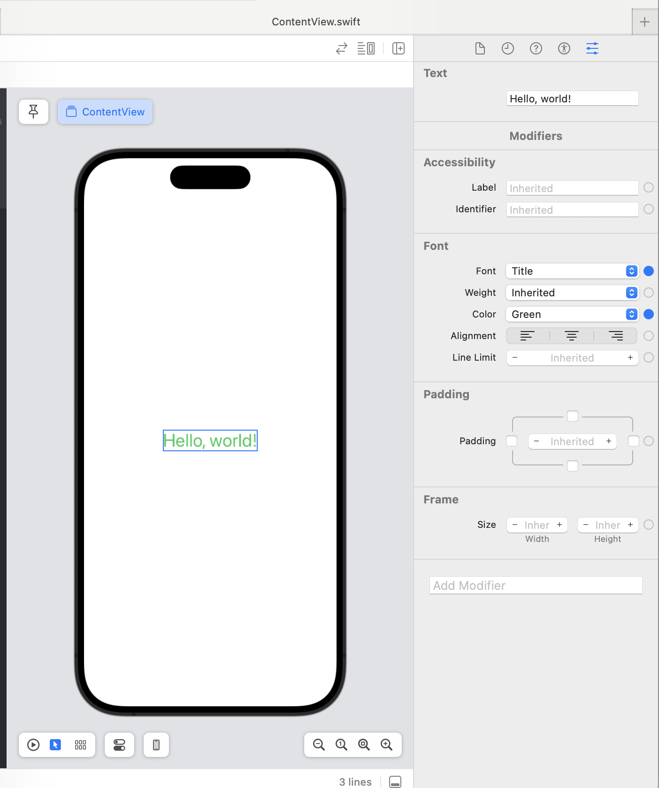
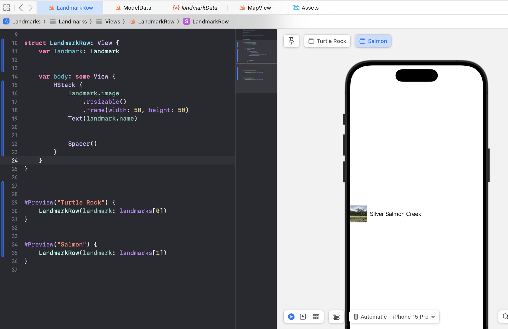
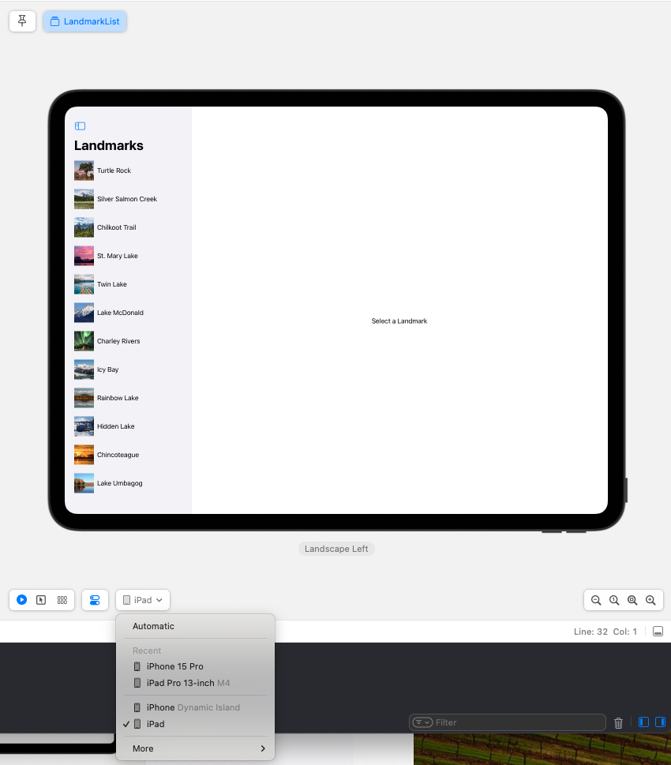
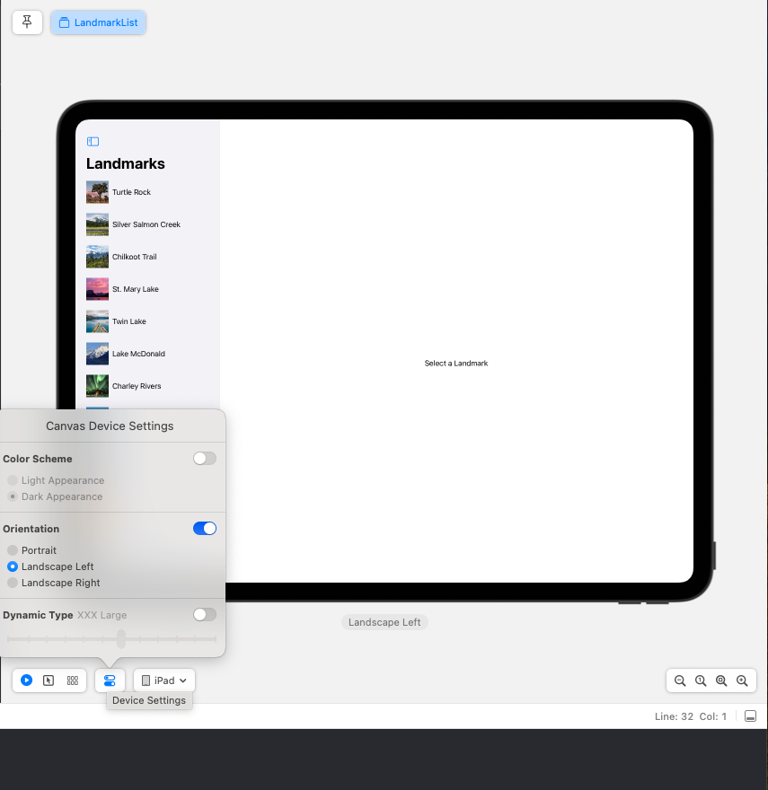

[toc]

##### Showing or Hiding Canvas

`Canvas` is shown automatically for SwiftUI files but can be hidden using the menu option 'View > Editor > Canvas'. The keyboard shortcut is 'Cmd + Option + Enter'.

##### Modes - Live, Selectable

As of Xcode 15.4, Canvas has a `Selectable mode` and if that is on then any element that is tapped in the Canvas its corresponding code gets highlighted in the code editor. The first mode BTW is `Live mode` and things like scrolling, animation, etc. are probably preview-able only in that.

##### Editing Popover

Doing a Command Control Click on any element brings up an Editing Popover which has various options.

##### SwiftUI Inspector

The equivalent of Attributes Inspector in xib/storyboards.

| From Editing Popover                                         | From Inspectors Side panel                                   |
| ------------------------------------------------------------ | ------------------------------------------------------------ |
|  |  |

##### Multiple Previews in same Canvas

There can be multiple Preview macros specified (each with their own identifier) and both can be viewed in the canvas (there are separate buttons for both).

##### Changing device, orientation, color scheme, etc.

| Changing device                                              | Changing device settings (color scheme, orientation, etc.)   |
| ------------------------------------------------------------ | ------------------------------------------------------------ |
|  |  |

