#### Gist

App > Scenes > Views

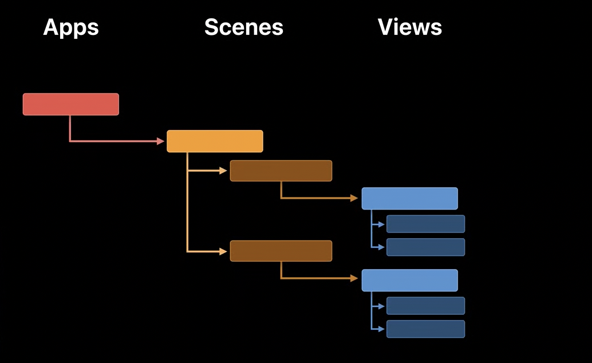

**Scenes** are different regions (windows) that are there in an app. An app can have multiple scenes. On iOS they have just one scene. but on macOS and iPadOS apps can have multiple scenese (i.e. windows). On iOS scenes take up the full screen, on iPadOS scenes need not take full screen and the system decides how much real estate it takes, on macOS scenese can easilty have a real estate whose size can be set by the user.

Loosely speaking, **Windows** are the same thing as scenes. A scene has a window.

macOS also allows to gather up related windows into a single, tabbed window. In this case, the scenes are represented as individual tabs instead (so just like a Safari window can have multiple tabs, any macOS app too can be made to have multiple tabs in one window). But then the shared window is also represented by its own scene, serving as a container for the child scenes associated with each tab. 

> An example of how having multipe windows in iPad OS feels from UX perspective 👇. Every window here is a disntinct scene, and all scenes can maintain their own states. Safari is such an app, custom apps too can be like this.  

| Long press on app icon to do 'Show All Windows'              | New window can be added using + button                       |
| ------------------------------------------------------------ | ------------------------------------------------------------ |
| 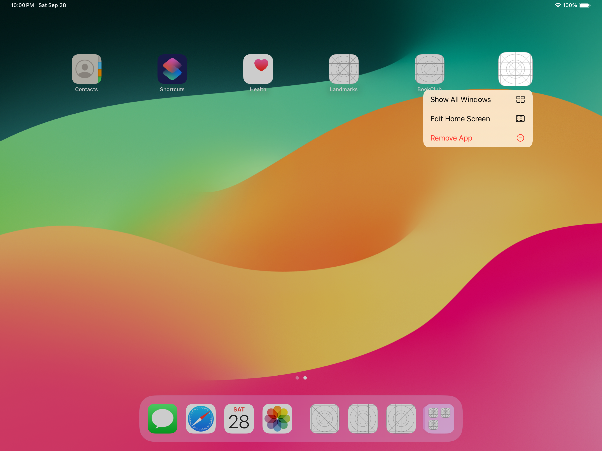 | 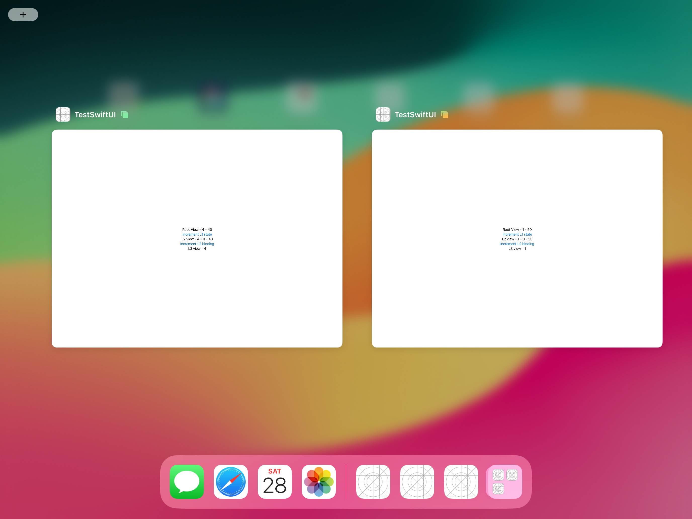 |

If a **WindowGroup** is used as the app's scene (which is what is normally used), then on macOS the app autotmatically gets the menu option 'File > New Window'. It spins up a new scene/window just like the standard one.  macOS also supports grouping its windows together using menu option 'Merge' and all existing scenes get bundled into one scene as window tabs (each tab continues being a different scene).

#### Theoretical definitions

A `scene` represents a part of your app’s user interface that has a life cycle that the system manages. A `WindowGroup` is a a scene that serves as a template for each window that the app creates from that group. Each Scene acts as the root element of a view hierarchy.

Technically, an `App` is a protocol ([reference](https://developer.apple.com/documentation/swiftui/app)), a `Scene` is also a protocol ([reference](https://developer.apple.com/documentation/swiftui/scene)), and a `Window` is a struct ([reference](https://developer.apple.com/documentation/swiftui/window)).

An `App` conforming type should have a `body` property that returns a `Scene`. It can even have state properties (such as `@StateObject`, etc) which can then get passed to views. A `Scene` conforming type to needs to have a `body` property that returns a `Scene`.

| App                                       | Scene                                                        | View                                                         |
| ----------------------------------------- | ------------------------------------------------------------ | ------------------------------------------------------------ |
| 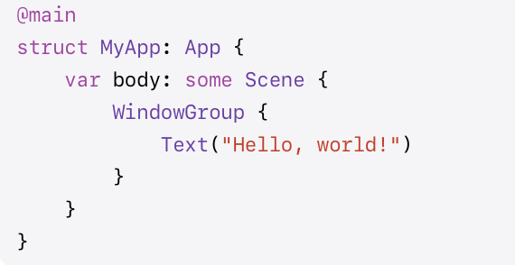 | 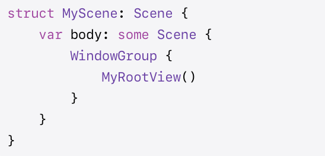 | 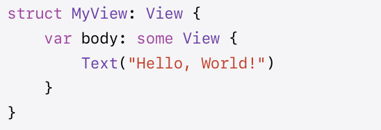 |

#### scenePhase

A Scene can go through three phases (denoted by **ScenePhase** enum) - active (scene is in foreground and interactive), inactive (scene is in foreground but should pause work), background (scene isn't visible in UI). It can be resd using the scenePhase value in environment.

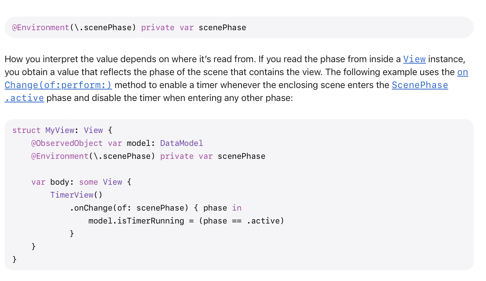

> Essentially what I saw is that anytime the scenePhase is about to change it somhow goes from `.inactive` to that new phase. If its coming to foreground its eventually `.active`, and if it is going to background its eventually `.background`. Over here, I launched app, minimized it, and then reactivated it, that's it.

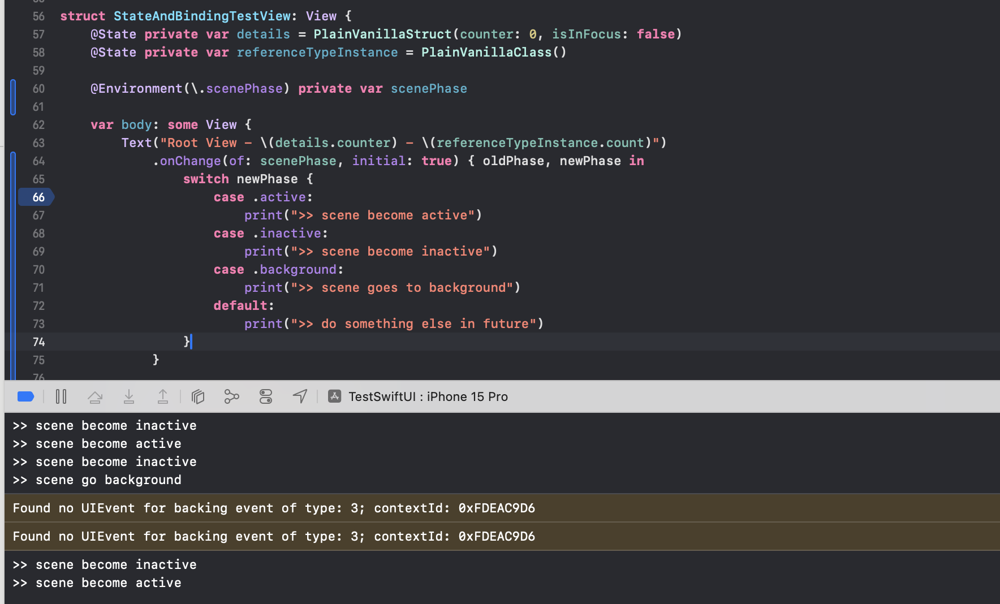

#### Types of Scenes

**WindowGroup** is the most common scene type and is used for data-driven apps (i.e. most apps). The idea here seems to be that even if a `WindowGroup` has several Views in it, they together represent just one window. Its more like 'this sequence of views still denote just one scene/window, and new scenes/windows can be created with same sequence'. A window whose template could be used to open a group of such windows.

**Window** (on macOS alone) and represents a single, unique window on all platforms. This common window is accessible through menu option 'Windows' and it has the verbiage provided in the method.

**DocumentGroup** is a scene type that automatically manages opening, editing, and saving of document-based scenes.

**Setting** (on macOS alone) which automatically sets up the standard preferences window. 

**MenuBarExtra** (on macOS alone) is something that renders as a control in the system's menu bar. It shows its contents in either a menu or window which is anchored to the label.

| DocumentGroup                                                | Setting (macOS)                                              | MenuBarExtra (macOS)                                         |
| ------------------------------------------------------------ | ------------------------------------------------------------ | ------------------------------------------------------------ |
| 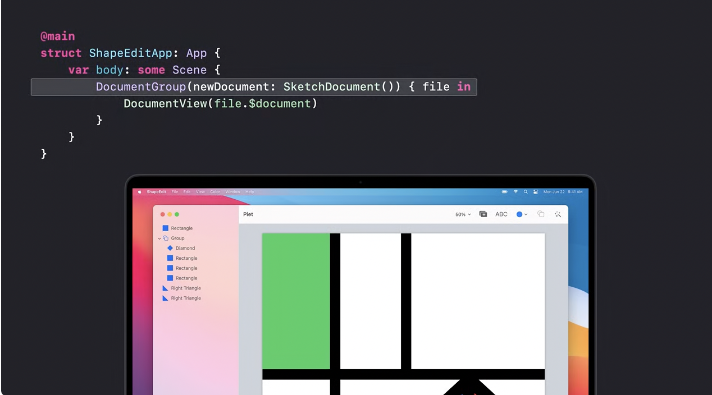 | 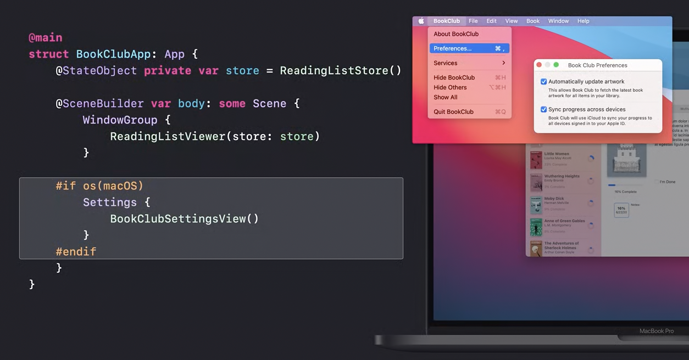 | 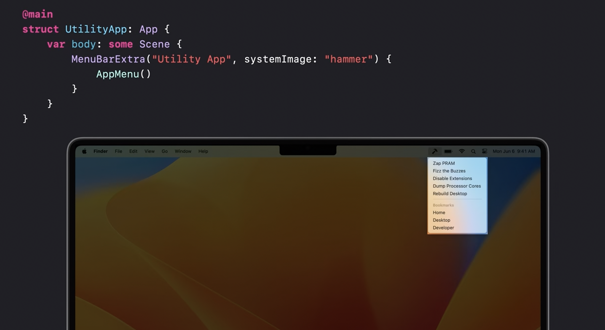 |

Here is an example of a **Window** scene

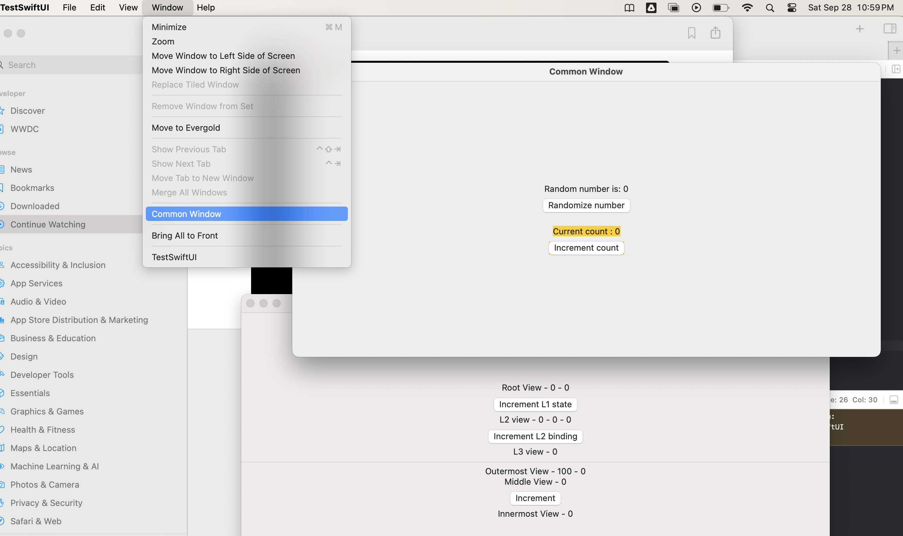

#### Multiple WindowGroups in one scene

> Its confusing still as to what is the outcome of having multiple windowGroups in one Scene. Maybe all windowGroups get defined there, only one (the top most one) is opened by default but all the ones that can later be programmatcally opened have their templates there. ([Reference](https://developer.apple.com/documentation/swiftui/windowgroup#Present-data-in-a-window))

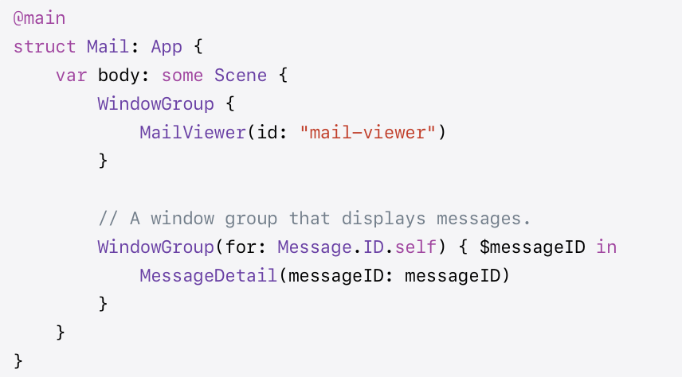

#### Presenting Windows

There are various callable types accessible via Environment that can be used presenting windows tied to a scene.

**openWindow** action, which can present windows for either a `WindowGroup` or `Window` scene. The identifier passed to the action must match an identifier for a scene defined in the app. in case of WindowGroup, it can also take a presentation value which the presented scene will use to display its contents. The convention is to have these identifiers be of `UUID` SwiftUI type. 

The destination WindowGroup for that ID can be defined in the same Scene. When openWindow presents a value for which a window already exists, the group uses that window rather than creating a new one. The view is be given a binding to the initial presented value.  This binding can be modified at any time while the window is open.

| Sending an openWindow request                                | Handing an openWindow request with a value                   |
| ------------------------------------------------------------ | ------------------------------------------------------------ |
| 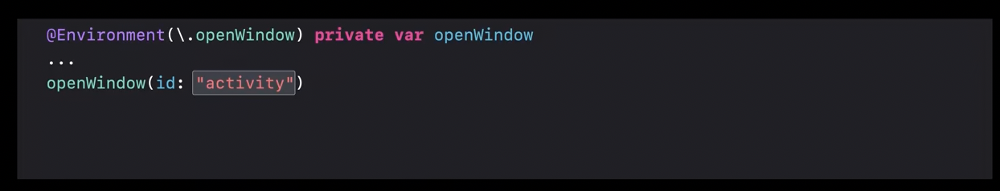 | 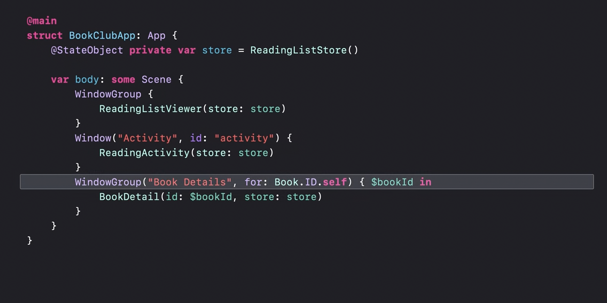 |

**newDocument** action, which supports opening new document windows.

For presenting document windows where the contents are provided by an existing file on disk, there is the **openDocument** action.

#### Misc.

##### @SceneStorage property wrapper

There is even a property wrapper named `@SceneStorage` that can do persistence for the state of a scene. (~2020)

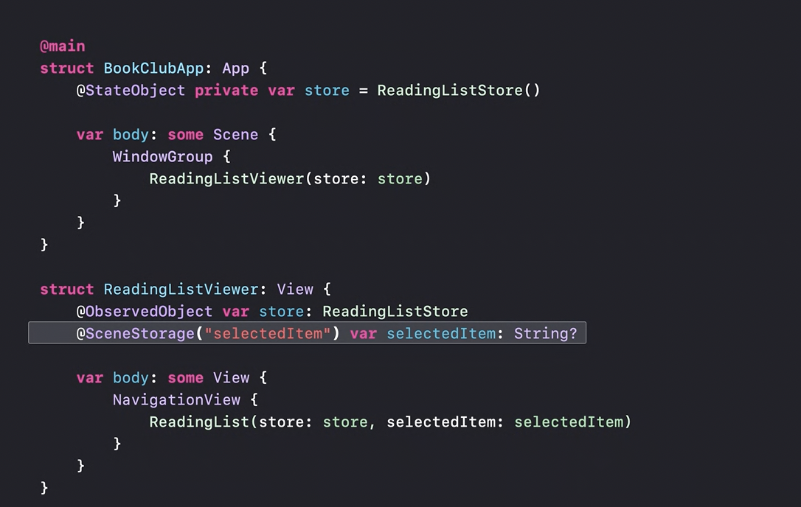

##### commandsRemoved scene modifier

A scene modifier `commandsRemoved`, allows you to modify a scene such that it will no longer provide its default commands, like the one in the 'File' menu (so basically a bunch of menu options that otherwise get added by default are removed).

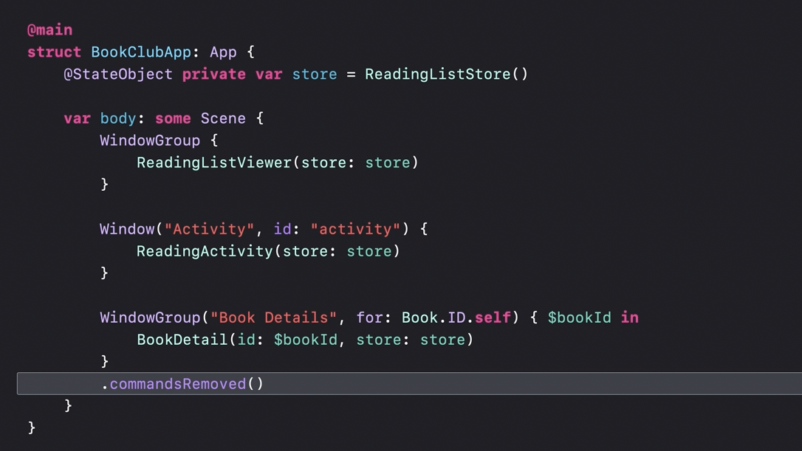

#### Resources

WWDC 2022 - Bring multiple windows to your SwiftUI app  WWDC 2020 - App essentials in SwiftUI  

