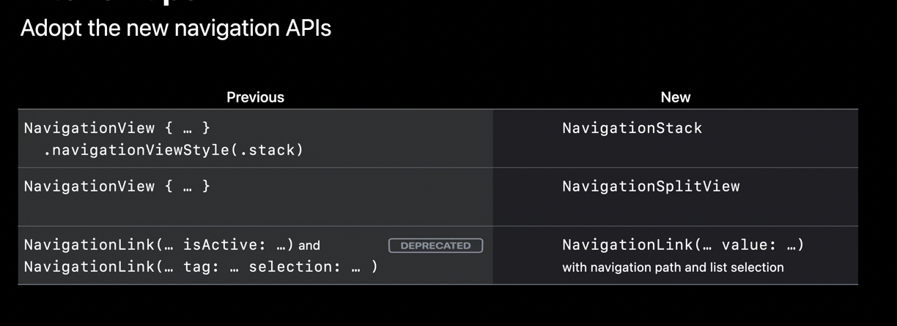
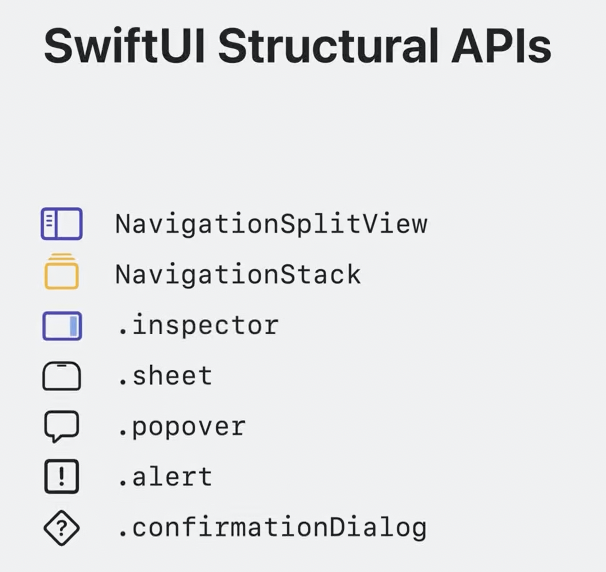

##### Sections in [Navigation](https://developer.apple.com/documentation/swiftui/navigation) homepage (~iOS 18, 2024)

Presenting views in columns - `NavigationSplitView`, `NavigationSplitViewVisibility`, `NavigationLink`  Stacking views in one column - `NavigationSatck`, `NavigationView` Managing column collapse - `NavigationSplitViewColumn`  Setting titles for navigation content  Configuring the navigation bar - `NavigationBarItem` Configuring the sidebar - `SidebarRowSize` Presenting views in tabs - `TabView`, `Tab`, `TabRole`, `TabSection` Configuring a tab bar - `AdaptableTabBarPlacement`, `TabBarPlacement` Configuring a tab - `TabPlacement`, `TabContentBuilder` Enabling tab customization - `TabViewCustomization`, `TabCustomizationBehavior`  Displaying views in multiple panes - `HSplitView`, `VSplitView` (both are **macOS** only)  

###### A lot of these were introduced only with iOS 16

iOS 16 onwards, use `NavigationStack` and `NavigationSplitView` instead of `NavigationView`.

Note that a lot of above APIs were actually introduced only with iOS 16 in 2022, and there were different APIs for similar things before that. The below screenshot shows the corresponding previous APIs. There is an official migration guide ([link](https://developer.apple.com/documentation/swiftui/migrating-to-new-navigation-types)) too.

##### SwiftUI's structural APIs

~ iOS17, 2023

##### Resources

WWDC 2022: The SwiftUI Cookbook for Navigation WWDC 2022: SwiftUI on iPad: Organize your interface WWDC 2023: Inspectors in SwiftUI: Discover the details

