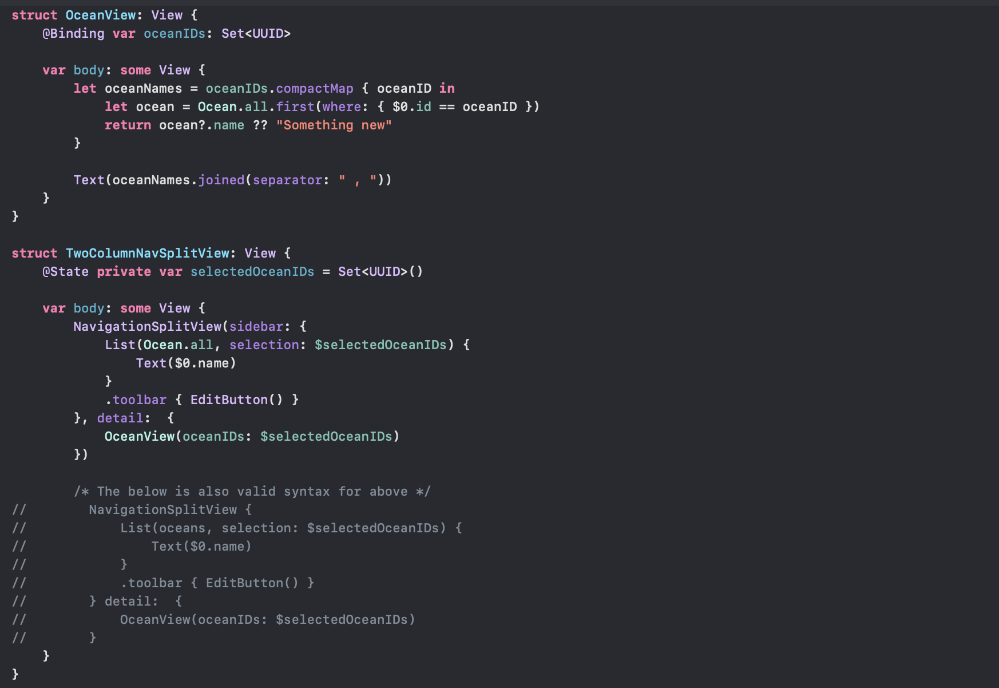
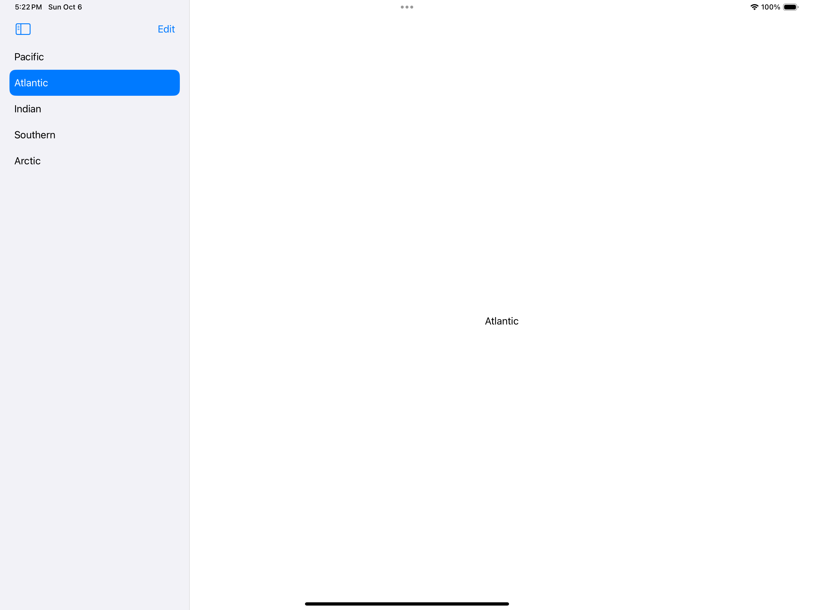
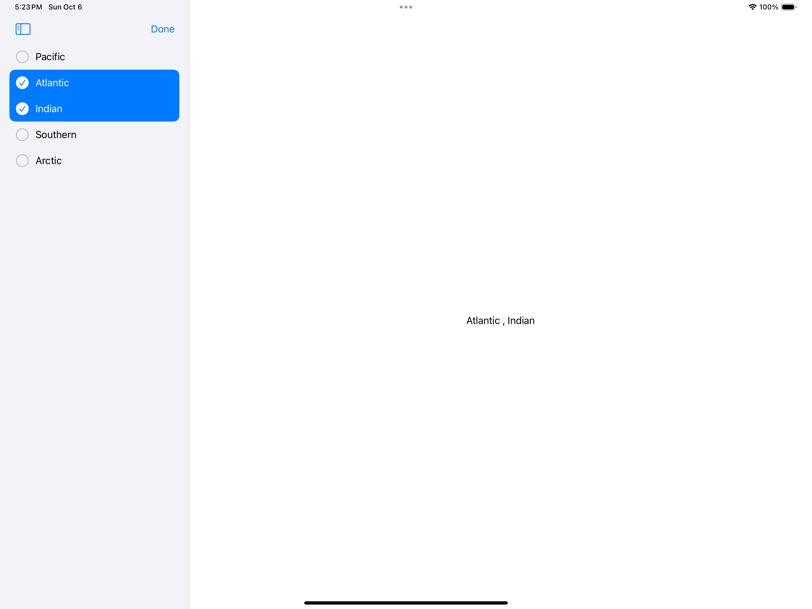
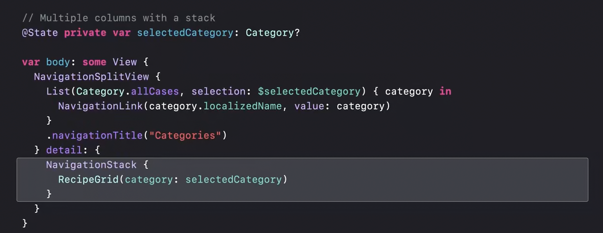
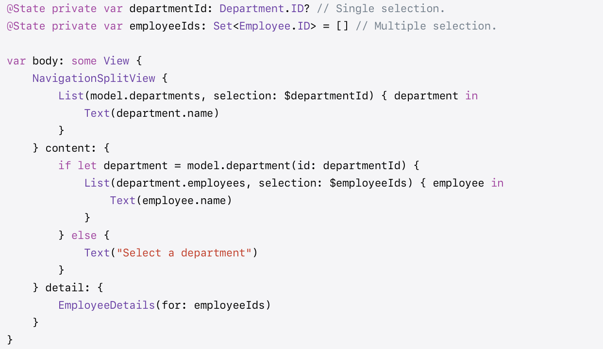

[toc]

**NavigationSplitView** is basically the SwiftUI equivalent of UIKit's UISplitView. However, it can even have 3 panes (and not just two).  [Reference](https://developer.apple.com/documentation/swiftui/navigationsplitview)

#### Two column NavigationSplitView

Sample code for a two column NavigationSplitView.

What's happening above is that the view on first pane is specified in the first **sidebar:** argument, and what should show in the second pane is shown in the second **detail:** argument. 

> Note that the commented out code snippet just below it actually identical. All that is happening is that argument names are not given and aren't even separated by comma (so just a Swift feature where argument names can be skipped in case of them being closures even when they are not the last argument.

In the **List** that's there in the View in the first pane, the selected items get stored in the specified `@State` property. Thr custom view in the second pane is then able to work off a `@Binding` of that `@State`. 

Eventually it looks like below.

| Two column NavigationSplitView (one item selected)           | Two column NavigationSplitView (multiple items selected)     |
| ------------------------------------------------------------ | ------------------------------------------------------------ |
|  |  |

> Its even possible to have a NavigationStack inside a NavigationSplitView column.

##### Example using NavigationLink

In the below example, every item in the List uses an explicit `NavigationLink` and it specifies what value to pass onto the state. Quite similar to above, but just slightly different in how detail view is populated.

#### Three column NavigationSplitView

Its done using **init(sidebar:content:detail:) **. Code snippet provided in the official reference.

#### 
