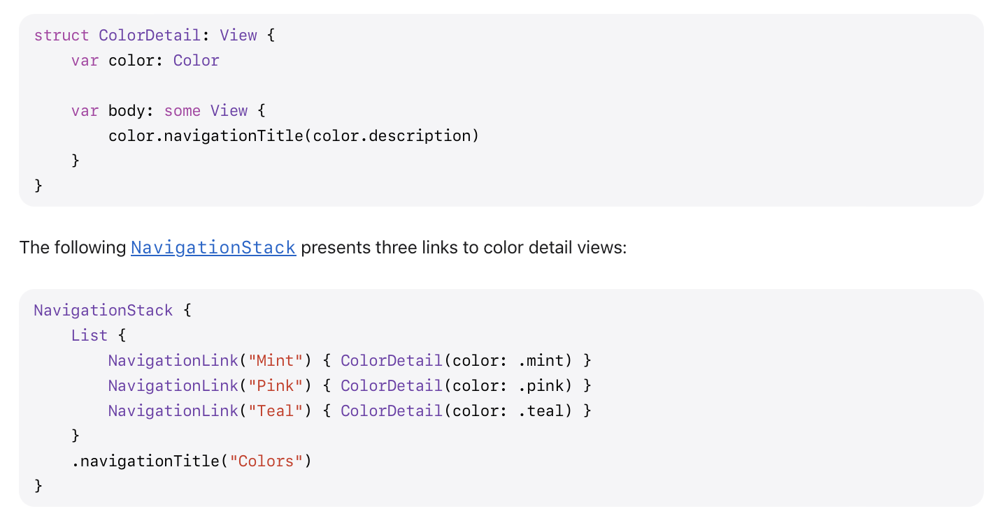
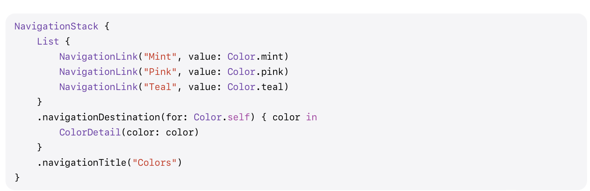

Simply put, **NavigationStack** in the SwiftUI equivalent of UIKit's UINavigationController.  [Reference](https://developer.apple.com/documentation/swiftui/navigationstack)

#### Sample code

In the below code snippet for the root view a `List` has been used, and for every item a **NavigationLink** is there that corresponds to what should be displayed and what **value** should be passed to the navigation destination if that item is selected.

The **.navigationDestination()** modifier specifies what should show up in the next view when a NavigationLink is selected.

The binding passed in the **path:** argument of the NavigationStack initializer is where the values corresponding to the current stack (the **Navigation State** that is) are maintained. The NavigationStack updates the state of this binding itself anytime a push/pop is done by user. The corresponding state can be programmatically modified too to update the navigation stack (that is what is happening in the `Button`  handler in the below snippet).

> Note that the navigation stack state nebver contains the value corresponding to the root view of the stack. So it is like viewControllers property of UNNavigationController, but the rootViewController is never there in the array.

It then shows up like this.

| Root View                                                    | Second view                                                  | Third view programatically added to stack                    |
| ------------------------------------------------------------ | ------------------------------------------------------------ | ------------------------------------------------------------ |
|  |  |  |

#### NavigationLink

The user taps on a **NavigationLink** inside a NavigationStack or NavigationSplitView to show a new view.  [Reference](https://developer.apple.com/documentation/swiftui/navigationlink)

It can be initialized in various ways. 

Its possible to directly link it to a destination view using **init(_:destination:)**.

Its also possible to link using a data value to be presented, in the sense that while initialization just the data to be presented is specified (using **init(value:label) **) and then another modifier **navigationDestination(for:destination:)** looks at that value and figures out what view to present

