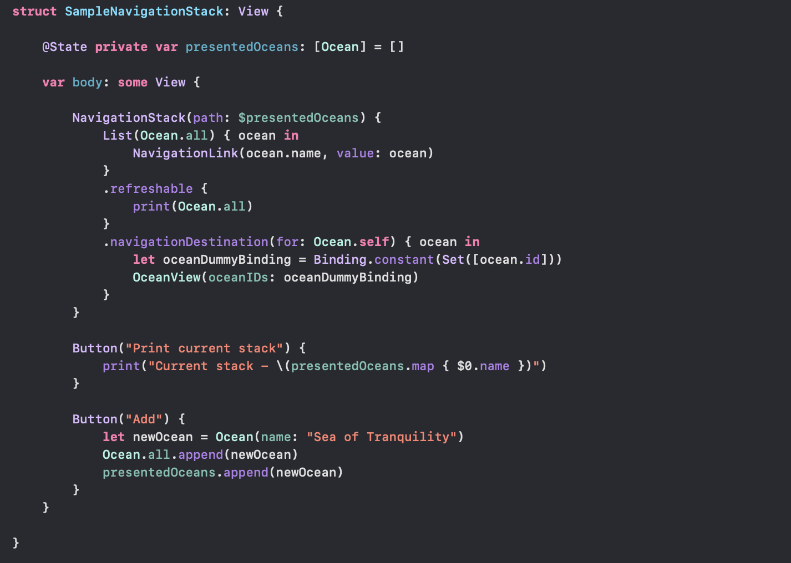
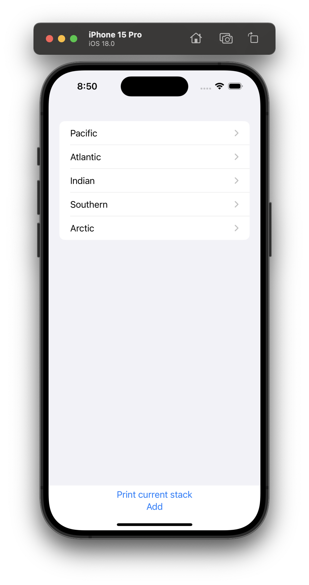
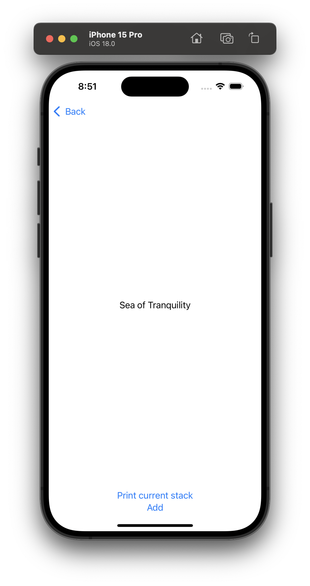

Simply put, **NavigationStack** in the SwiftUI equivalent of UIKit's UINavigationController.  [Reference](https://developer.apple.com/documentation/swiftui/navigationstack)

#### Sample code

In the below code snippet for the root view a `List` has been used, and for every item a **NavigationLink** is there that corresponds to what should be displayed and what **value** should be passed to the navigation destination if that item is selected.

The **.navigationDestination()** modifier specifies what should show up in the next view when an item is selected.

The binding passed in the **path:** argumnt of the NavigationStack initializer is where the values corresponding to the current stack (the **Navigation State** that is) are maintained. The corresponding state can be programmatically modified too to update the navigation stack (that is what is happening in the `Button`  handler in the below snippet).

It then shows up like this.

| Root View                                                    | Second view                                                  | Third view programatically added to stack                    |
| ------------------------------------------------------------ | ------------------------------------------------------------ | ------------------------------------------------------------ |
|  |  |  |

