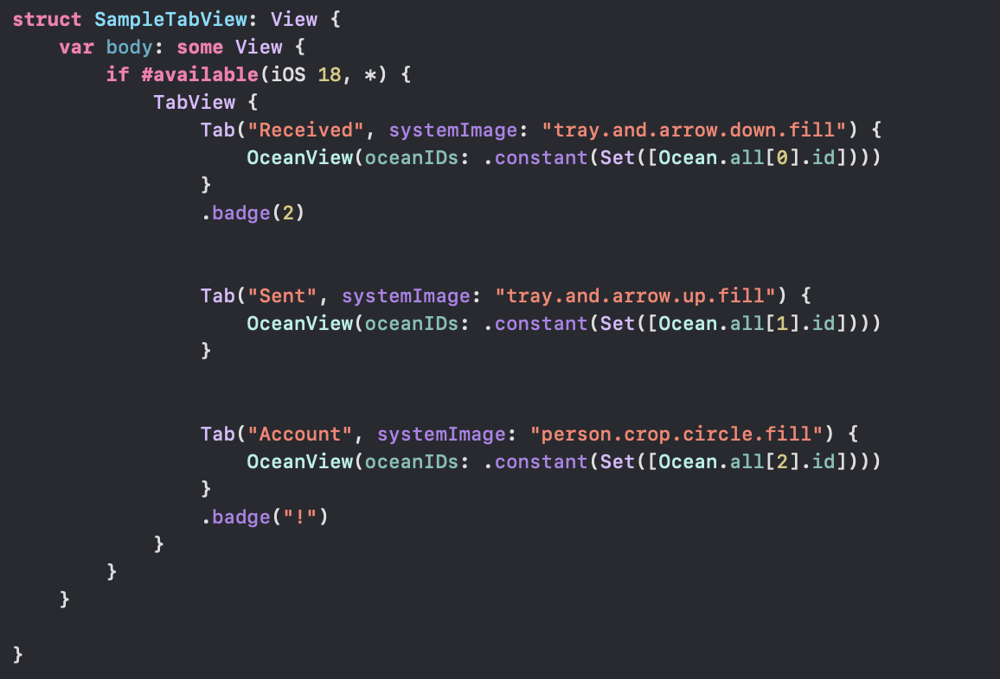
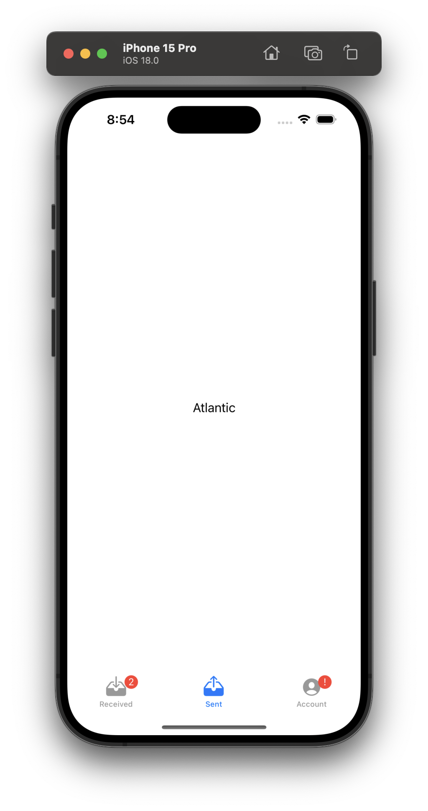
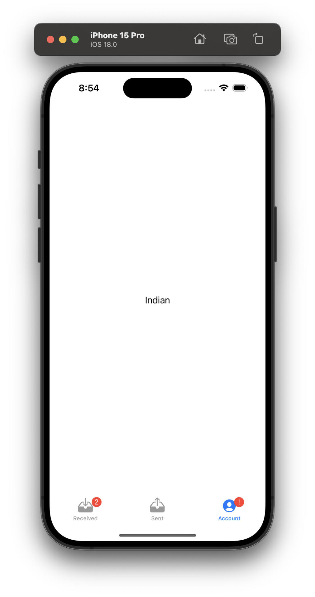

**TabView** is basically the SwiftUI equivalent of UIKit's UITabBarController.  [Reference](https://developer.apple.com/documentation/swiftui/tabview)

#### Sample Code

As simple as this. note how a **systemImage** can be used for tab image, and how a **badge** too can be added to it.

> Note that **Tab** is actually an addition in iOS18. Prior to that I think pretty much just any plain `View` could be used.

It then shows up like this.

| Tab 2                                                        | Tab 3                                                        |
| ------------------------------------------------------------ | ------------------------------------------------------------ |
|  |  |

