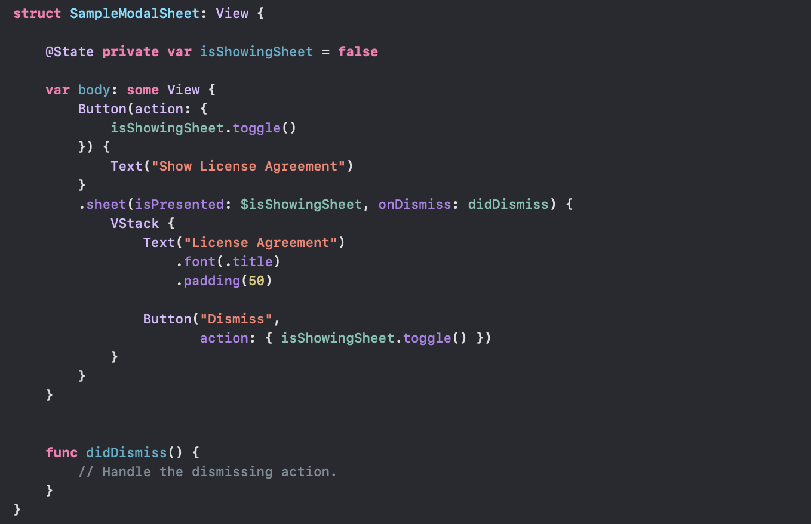
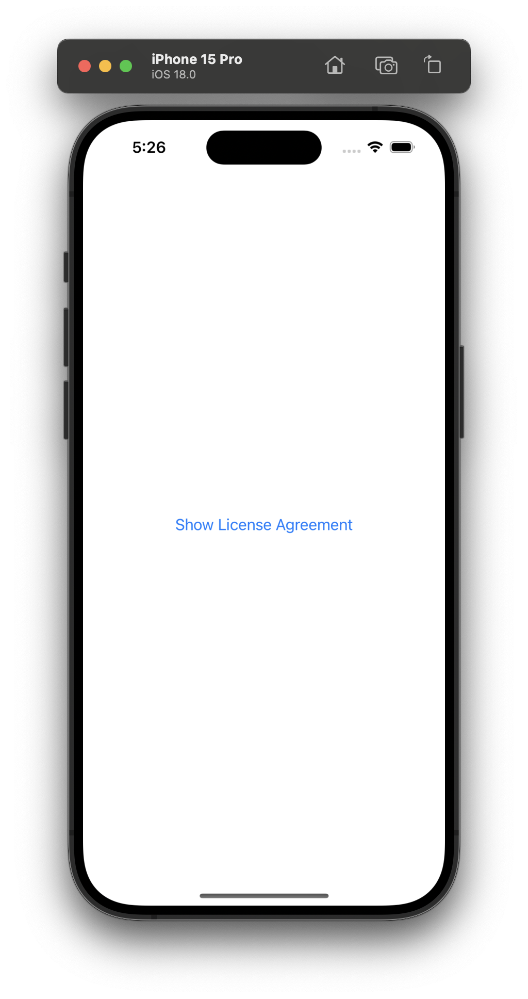
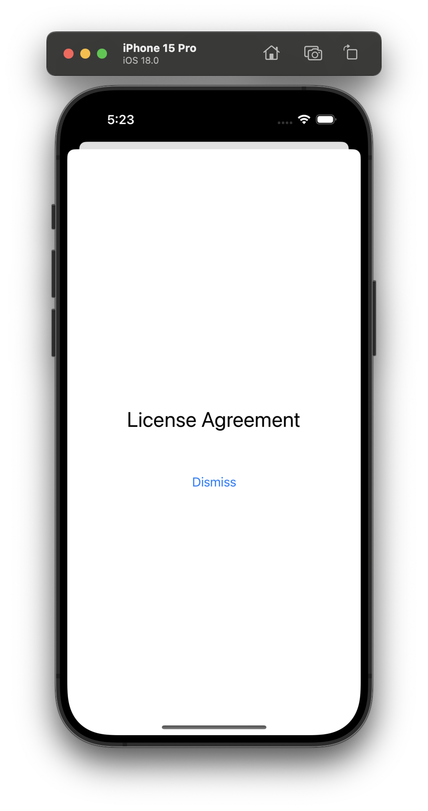
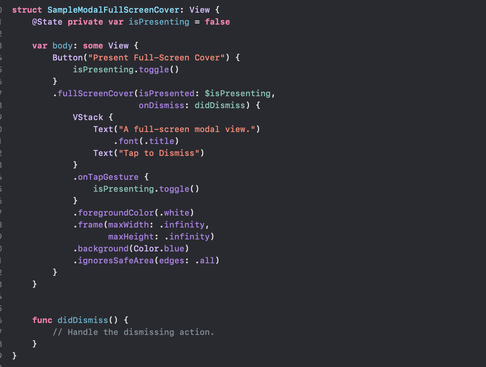
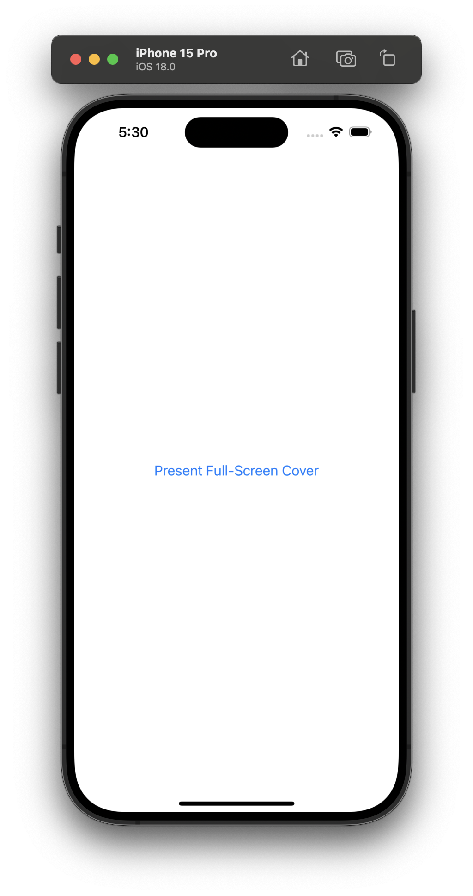
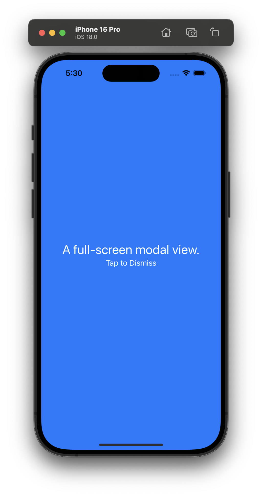
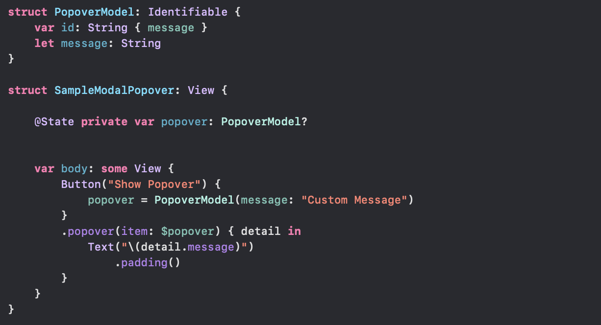
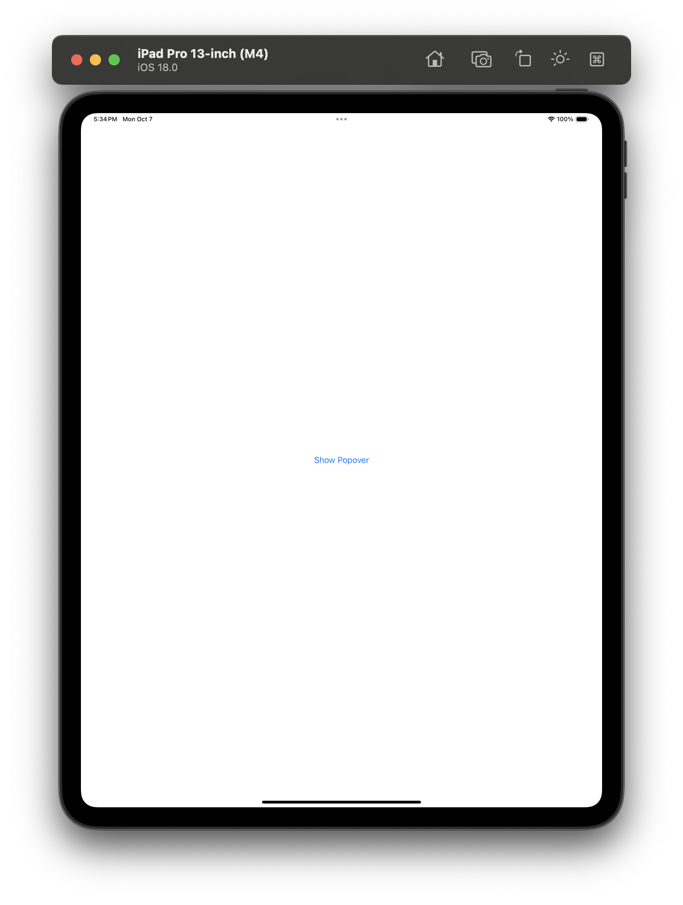
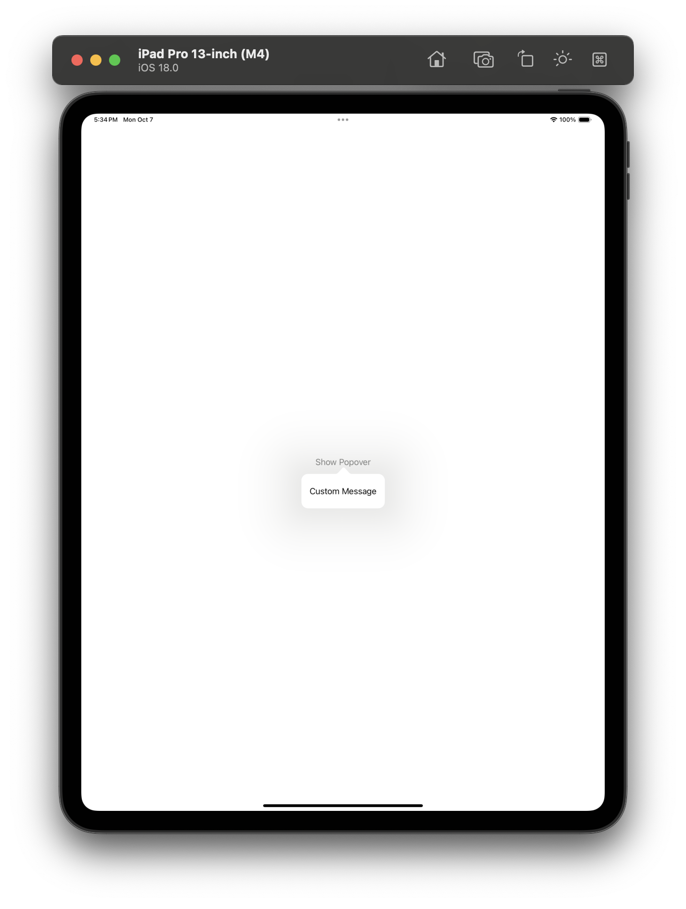

[toc]

> The fact whether the modal gets shown or not is decided by a binding to a boolean state.

#### Sheet

In plainspeak, its a bit like `presentViewController:animated:` of UIKit. A new View that modally shows up in screen but does not take up the entire real estate. Its shown using functions like **sheet(isPresented:onDismiss:content:)**.

[Reference](https://developer.apple.com/documentation/swiftui/view/sheet(ispresented:ondismiss:content:))

| Tapping on this button                                       | Brings up this Sheet                                         |
| ------------------------------------------------------------ | ------------------------------------------------------------ |
|  |  |

#### Cover

Its a modal view that covers as much of the screen as possible. Its shown using functions such **fullScreenCover(isPresented:onDismiss:content:)**. [Reference](https://developer.apple.com/documentation/swiftui/view/fullscreencover(ispresented:ondismiss:content:))

| Tapping on this button                                       | Brings up this Full Screen Cover                             |
| ------------------------------------------------------------ | ------------------------------------------------------------ |
|  |  |

#### Popover

A UIKit iPad popover basically. Its shown using functions such as **popover(item:attachmentAnchor:content:)**. [Reference](https://developer.apple.com/documentation/swiftui/view/popover(item:attachmentanchor:content:))

On iPhone it pretty much behaves like a Sheet.

| Tapping on this button                                       | Brings up this Popover                                       |
| ------------------------------------------------------------ | ------------------------------------------------------------ |
|  |  |

