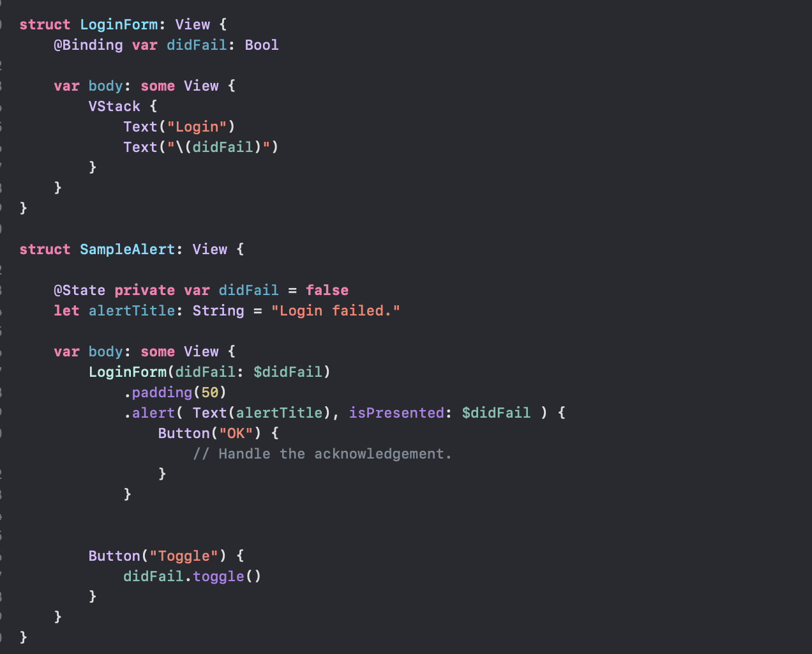
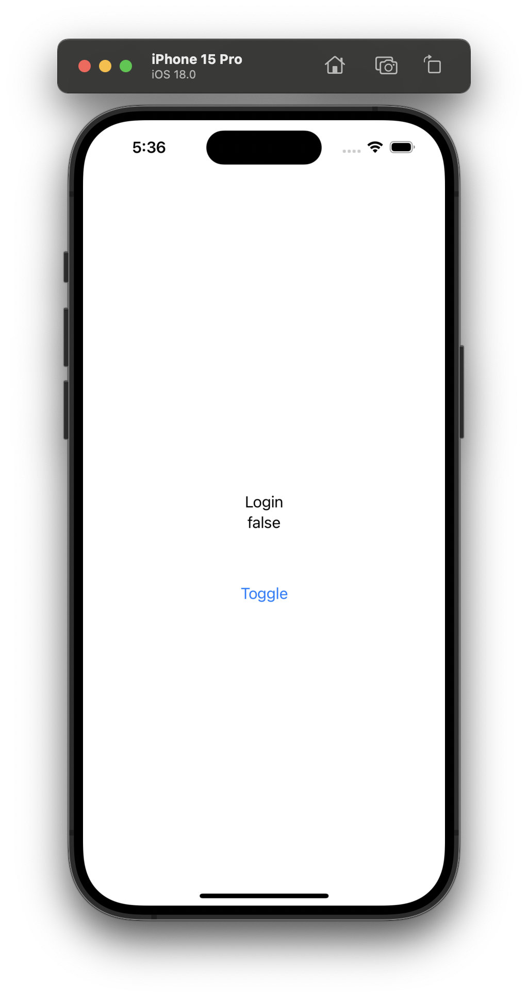
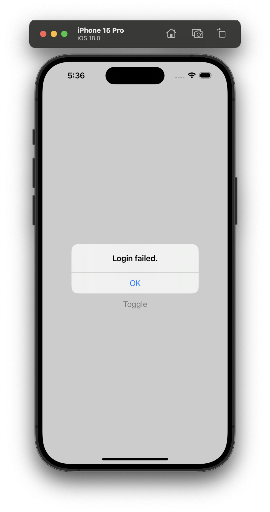
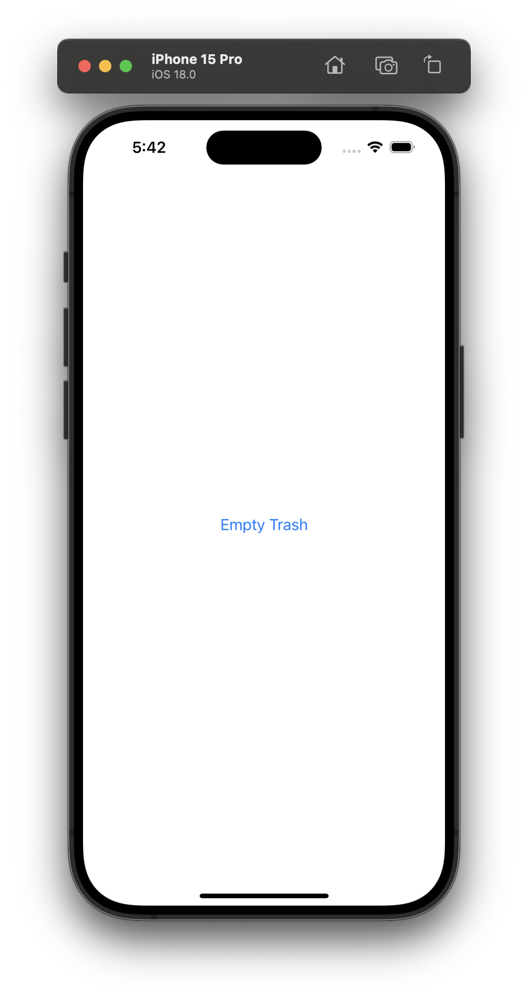
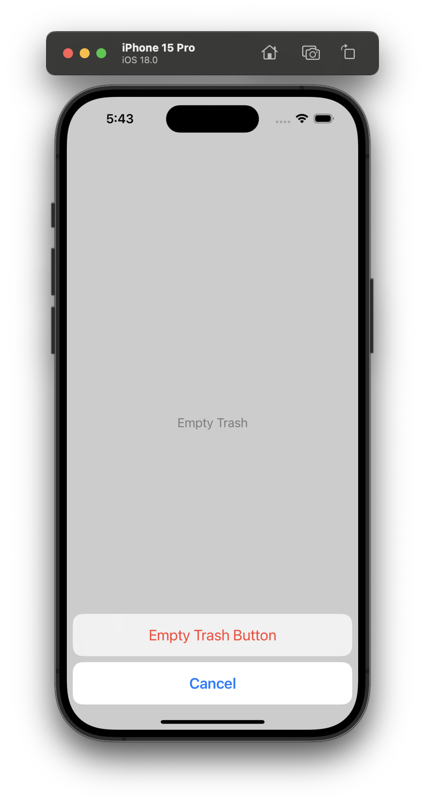

[toc]

> Here too a binding to a bool state decides if the modal should be shown.

#### Alert

Pretty much UIAlertController of UIKit. Shown using methods such as **alert(_:isPresented:actions:)**. [Reference](https://developer.apple.com/documentation/swiftui/view/alert(_:ispresented:actions:))

| Tapping on this button                                       | Brings up this Alert                                         |
| ------------------------------------------------------------ | ------------------------------------------------------------ |
|  |  |

> Strangely though, tapping the OK button in the Alert seems to be resetting the state of the View underneath. Why?

#### Confirmation

Its the SwiftUI equivalent of UIAlertController in actionSheet mode. It brings up various option buttons from bottom (think this was in UIKit too). Its done using methods such as **confirmationDialog(_:isPresented:titleVisibility:actions:)**.   [Reference](https://developer.apple.com/documentation/swiftui/view/confirmationdialog(_:ispresented:titlevisibility:actions:))

| Tapping on this button                                       | Brings up these options                                      |
| ------------------------------------------------------------ | ------------------------------------------------------------ |
|  |  |

