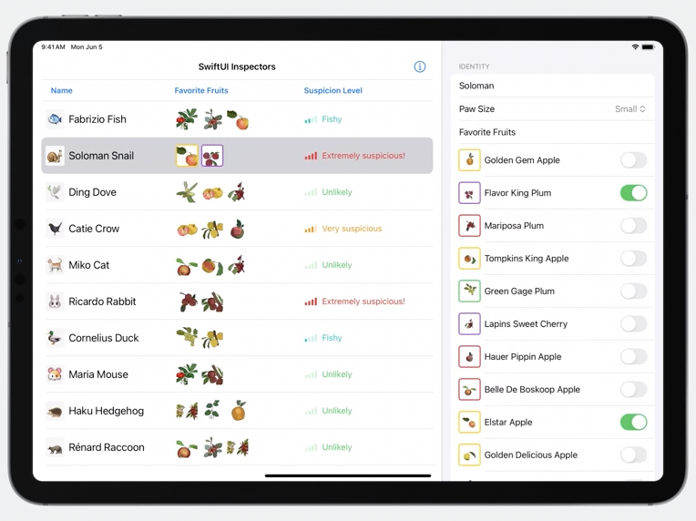
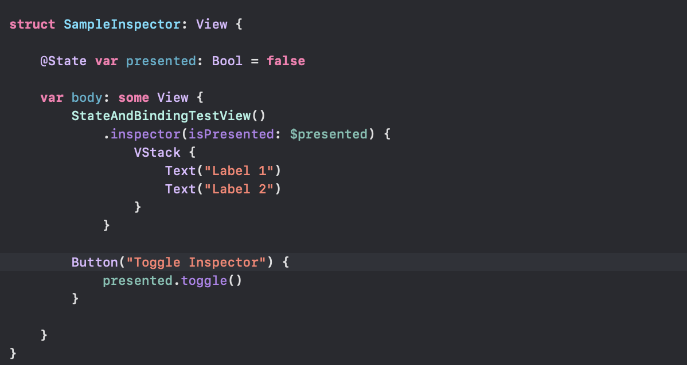
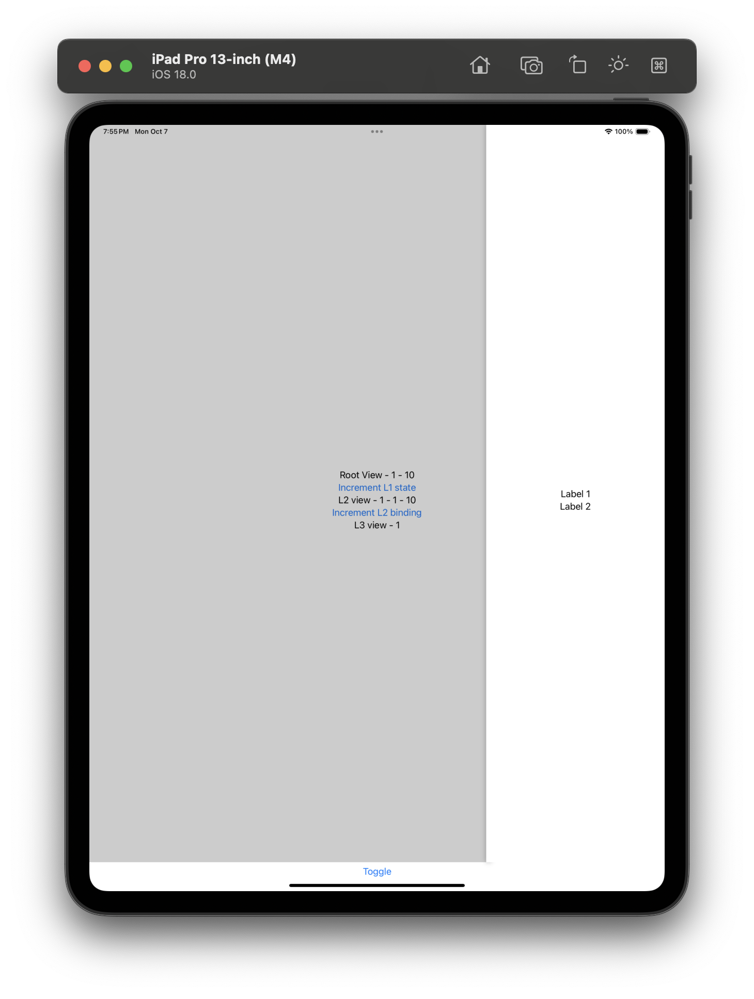

What are inspectors  modifiers for presentation customizations  

WWDC 2023: Inspectors in SwiftUI: Discover the details

----

A new kind of UI introduced in iOS 17 (2023). They are just like Xcode inspectors, i.e. a trailing panel that slides in from right and shows more informatiopn about the selection. 

Its shown using **inspector(isPresented:content:)** modifier. [Reference](https://developer.apple.com/documentation/swiftui/view/inspector(ispresented:content:))

##### Sample code

