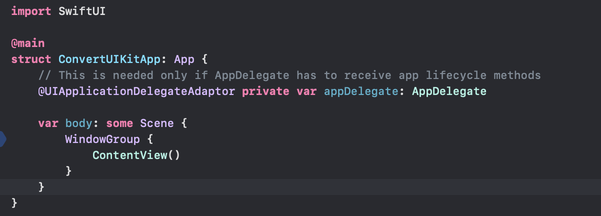
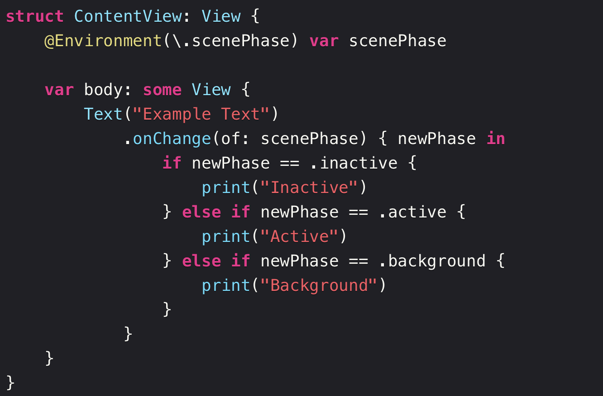

#### Migrating app entry point from UIKit to SwiftUI

Documentation ([link](https://developer.apple.com/documentation/swiftui/migrating-to-the-swiftui-life-cycle))

If there is an existing UIKit app whose entry point needs to be changed to a SwiftUI view (instead of application delegate), it can be done this way -

1. Create a SwiftUI struct that conforms to **App** protocol. Append **@main** attribute to it, at the same time remove that attribute from the already existing AppDelegate.



2. Optional - Add a property with the property wrapper **@UIApplicationDelegateAdaptor**. This is needed if the existing appDelegate should receive app lifecycle callbacks.
3. Delete existing `Main.storyboard` if there.
4. Navigation to Target Settings > Info and remove the keys 'Main Storyboard file base name'  and 'Storyboard Name' in 'Application Scene Manifest > Scene Configuration > WindowApplicationSessionRole > Item 0 (Default Configuration)'. The keys exist as shown below before removal.


5. Delete the app and reinstall, and it should work.

Note that the SceneDelegate lifecycle methods are called even after doing the above (and even if the appDlegate property is not set in the App struct).

> ☝️ So the above steps are probably for an app that was already having an app delegate and a scene delegate with the app delegate having `@main`.
>
> If the existing setup is something else, probably the below needs to be done. <br>If you were previously launching your app in your scene delegate, remove the `scene(_:willConnectTo:options:)` method from your scene delegate. <br>If you didn’t previously support scenes in your app and rely on your app delegate to respond to the launch of your app, ensure you’re no longer setting a root view controller in `application(_:didFinishLaunchingWithOptions:)`. Instead, return true.

##### Getting app lifecycle callbacks

After adding the `UIApplicationDelegateAdaptor` property, I saw that applicationDidFinishLaunchingWithOptions was called indicating that is all that is needed for AppDelegate lifeycle callbacks to happen, but then there is this snippet written too in the documentation (i.e. there is a certain Environment value to be read) -

> You will no longer be able to monitor life-cycle changes in your app delegate due to the scene-based nature of SwiftUI (see Scene). Prefer to handle these changes in **ScenePhase**, the life cycle enumeration that SwiftUI provides to monitor the phases of a scene. Observe the Environment value to initiate actions when the phase changes. <br>If you read the phase from inside a **View** instance, the value reflects the phase of the scene that contains the view. If you read the phase from within an **App** instance, the value reflects an aggregation of the phases of all of the scenes in your app.

```swift
@Environment(\.scenePhase) private var scenePhase
```

its something like this as per HackingWithSwift tutorial (notice the **.onChange(of:) {}** method).



Documentation [link](https://developer.apple.com/documentation/swiftui/migrating-to-the-swiftui-life-cycle#Monitor-life-cycle-changes) <br>HackingWithSwift [tutorial](https://www.hackingwithswift.com/quick-start/swiftui/how-to-detect-when-your-app-moves-to-the-background-or-foreground-with-scenephase)

##### AppDelegate conforming to ObservableObject protocol

As per 2024 documentation, if your app delegate conforms to the ObservableObject protocol, as in the example above, then SwiftUI puts the delegate it creates into the Environment. You can access the delegate from any scene or view in your app using the EnvironmentObject property wrapper. Very convenient.

```
@EnvironmentObject private var appDelegate: MyAppDelegate
```

##### Getting window scene delegate callbacks

As per 2024 documentation, iOS apps that define a `UIWindowSceneDelegate` to handle scene-based events (like app shortcut) can also be handled to receive callbacks in case of SwiftUI entry points. Also that, (as with the app delegate) if you make your scene delegate an observable object, SwiftUI automatically puts it in the Environment, from where you can access it with the EnvironmentObject property wrapper, and create bindings to its published properties.

[Documentation](https://developer.apple.com/documentation/swiftui/uiapplicationdelegateadaptor#Scene-delegates)