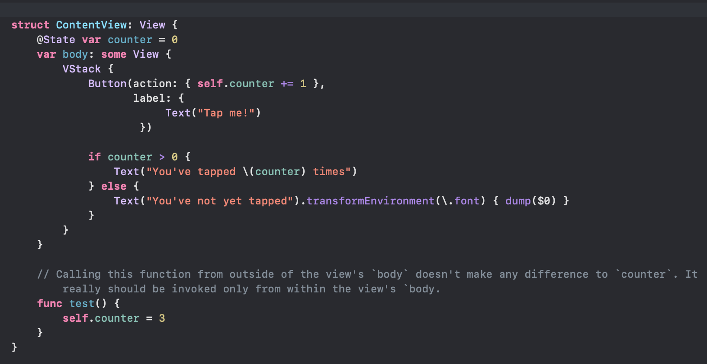
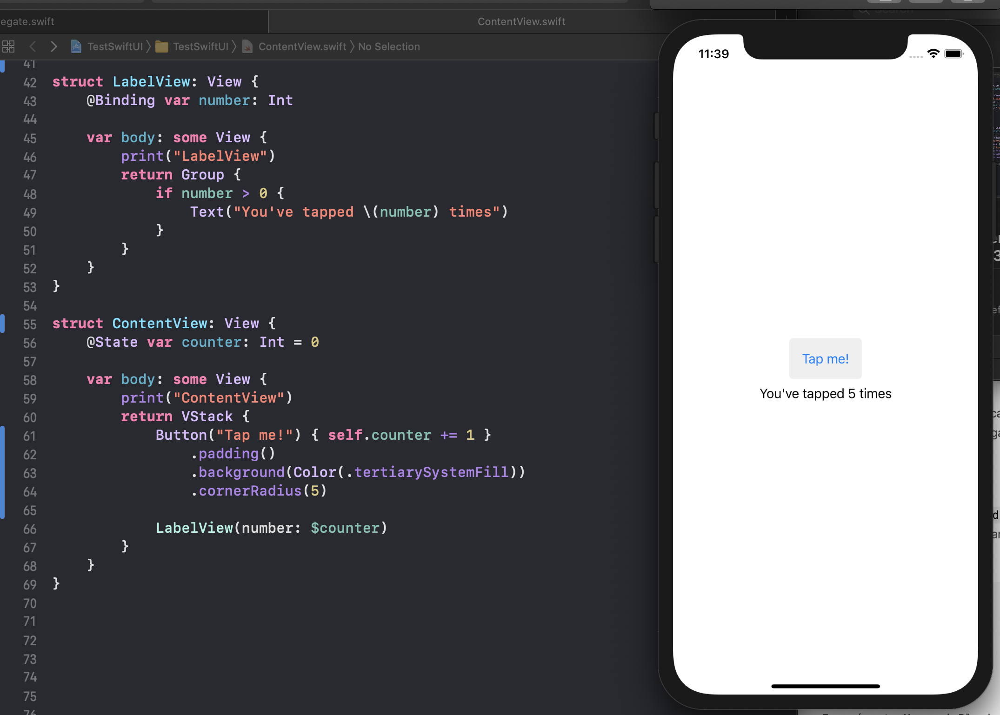
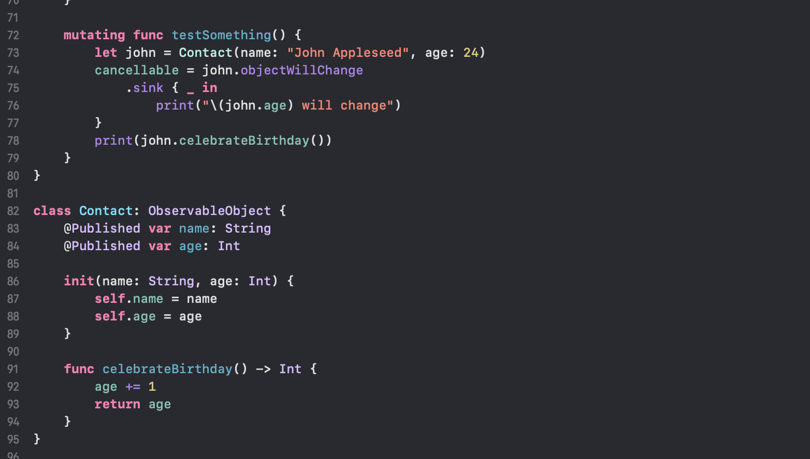
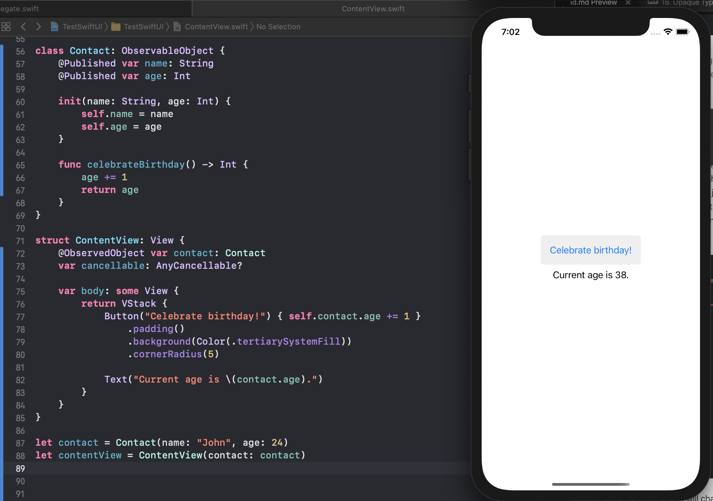
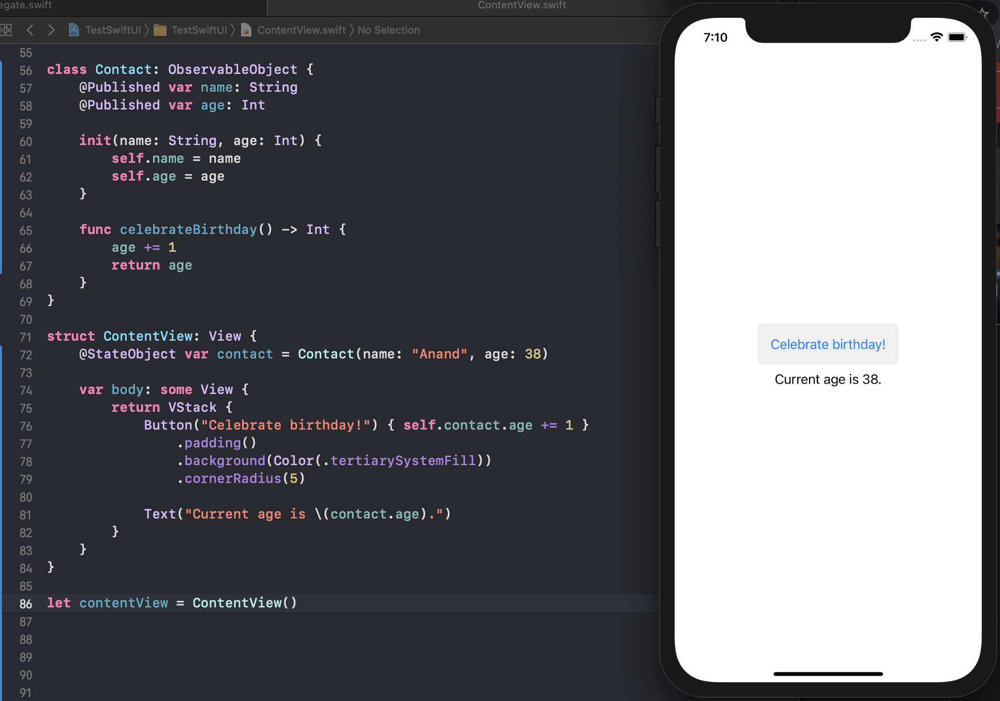

[toc]

> @State  @Binding  @ObservableObject, @Published > @ObservedObject, @StateObject  

##### @State

When a property in a `View` is qualified with the `State` property wrapper, that property becomes capable of trigerring a view update (actually recomputation) anytime its changed. All this gets handled automatically by `SwiftUI`.

A state property should be accessed only from inside the view's body or from a function called from the view's body. Trying to access it from anywhere else doesn't generate a compiler error, but is futile as neither does it change the wrapped value actually used by the view's body, nor does it fetch the wrapped value being used by the view's body.

> But then, how to update a `State` qualified property from outside? There can well be a legitimate need to. Is it that `State` should be used only for state that can be modifiable only locally. Yes, looks like.

The `State` property wrapper [struct](https://developer.apple.com/documentation/swiftui/state) has an initializer named `init(initialValue: Value)` but it looks more like a legacy thing with no current utility which just happens to be there for backward compatibility. It also has an initializer named `init(wrappedValue: Value)` which is in turn the same thing as actually qualifying a `View` property with `@State` (and that is what should be done).

It has a function named `update()` too which is called by SwiftUI  before rendering a view’s body to ensure the view has the most recent value, but again don't think it never needs to be called explicitly by a View, etc.

##### @Binding

When a property in a `View` is qualified with `Binding` property wrapper, that property can have its value being set somewhere outside the View and yet any change to the value can trigger a view update. Such properties from the look of it don't get any initial value for themselves (makes sense as the value is stored elsewhere).

Also, the outside place where the value exists should be declared as a `State` property in a `View`, with the binding passed as the state's projected value (i.e. `$`).

In the below example, number is a Binding and its corresponding View is initialized using the projected value of State counter in another View.

> Is the only way to yield a `Binding` is by using the projected value of a `State`? If so, it would mean `Binding` is to be used when the source of truth is the `State` property of another View.

##### ObservableObject, @Published, @ObservedObject

`ObservableObject` is a protocol in `Combine`, `ObservedObject` is a property wrapper in `SwiftUI`.

`ObservableObject` is a protocol that has a computed property named `objectWillChange` of the type `Publisher` with a default implementation that publishes an element when any `@Published` property of the conforming type is just about to change. In other words if a type has been declared as `ObservableObject` compliant then any property in it that has been qualified with `@Published` when about to be changed, the conforming type emits an event via its publisher property named `objectWillChange`.

Here the sequence of things printed is '24 will change', '25'.

> `objectWillChange` publisher just emits an event whenever any `@Published` property is about to change. It doesn't have an indication of which particular property is about to change.

When a property in a `View` is qualified with a `ObservedObject` property wrapper, that source of truth can be an `ObservableObject` instance. So whenever a `Published` property in the `ObservableObject` changes, SwiftUI automatically updates the view.

> The `ObservedObject` property however should not be initialized within the same `View`. For doing that, the `StateObject` property wrapper needs to be used instead.

##### StateObject

`StateObject` is like `ObservedObject`, except that the property can also be initialized within the `View` itself. It can still be passed from outside, but does not have to be.

> The reference says StateObject can be passed into a property that has the ObservedObject attribute. What exactly does it mean, need to try it.

> While its mentioned that an ObservableObject qualified property should not be initialized within the View, it still seemed to work when I did. Nevertheless, better to use StateObject instead as mentioned in the reference.

##### Useful links

[Apple reference](https://developer.apple.com/documentation/swiftui/state-and-data-flow)  
[Swift by Sundell](https://www.swiftbysundell.com/articles/swiftui-state-management-guide/)
