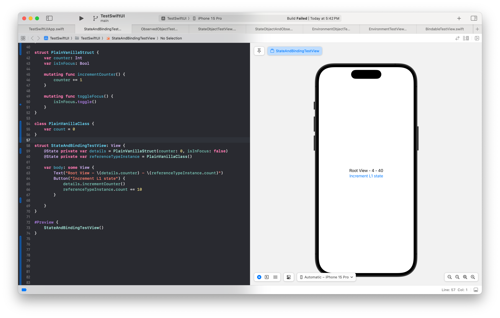
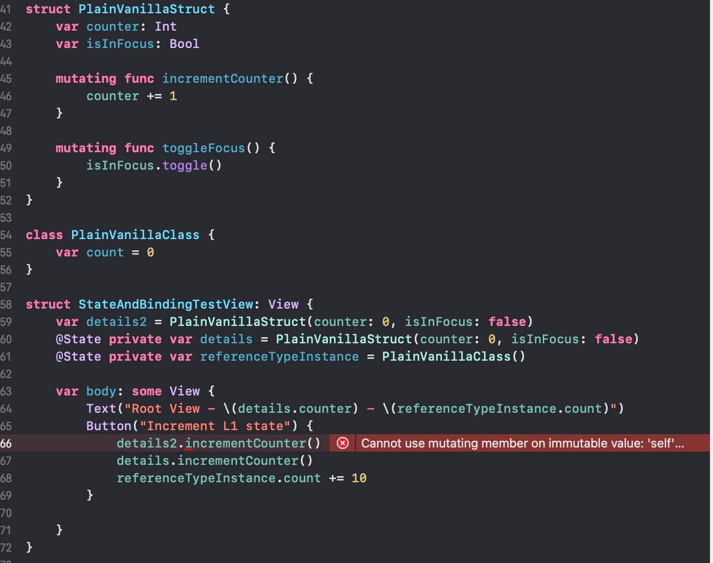
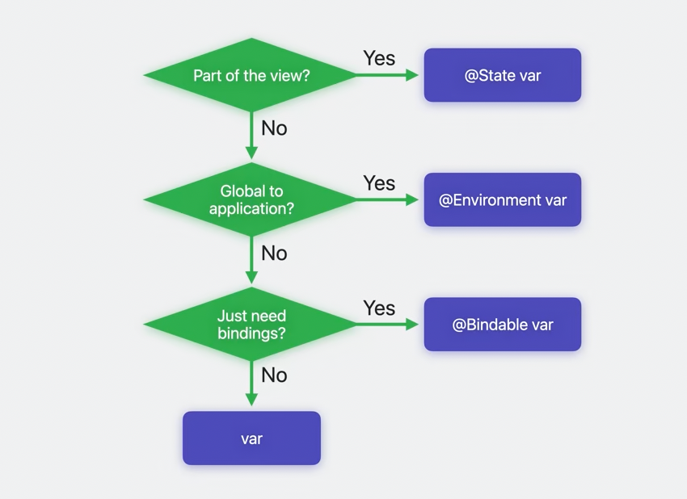
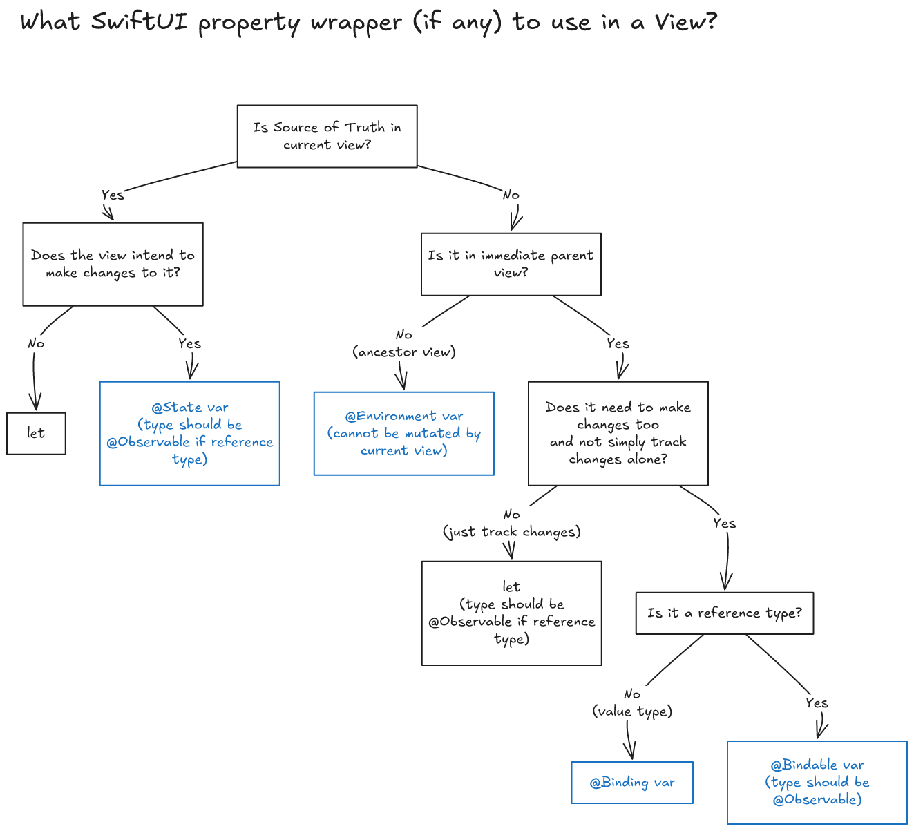

[toc]

#### The Basic Idea with various Property Wrappers

The basic idea with all the SwiftUI data related property wrappers in a View is that if somehow the data changes, the UI is updated accordingly.

In the below snippet anytime the Button is tapped, it updates the value of those @State properties, and that update also automatically updates the verbiage shown in the Text.

Also its only such properties that are actually mutable from a result builder. For example, if an ordinary property is attempted to be changed from the result builder the compiler will throw an error.

#### The 3 Basic Property Wrappers (~iOS 17, 2023)

👇 iOS 17 onwards, a rough flowchart on what property wrapper to use inside a View (from 'WWDC 2023 - Discover Observation in SwiftUI' video). `@State`, `@Bindable`, `@Environment` are the three basic property wrappers that are usually sufficient.

👇 My summary 

**@State** should be used for data for which source of truth lies in the same View, i.e. where the properties themselves are the source of truth. It can be used both with value types and reference types.

**Observable** is a protocol introduced with iOS 17 (i.e. 2023) that replaces `ObservableObject` protocol. It comes with an **@Observable** attached macro that reduces the boilerplate code needed to mark objects as something observable. There is no need to mark properties as `@Published`.  

**@Bindable** can be used when the source of truth is elsewhere and the type conforms to `Observable` protocol.  If the source of truth lies in same View, it can be qualified with `@State` or even not qualified with anything.

> From what I have seen though, `@Bindable` however cannot be used with value types and with them **@Binding** should be used instead.

**@Environment** should be used when the environment is supposed to have the data which in turn has been put there by an ancestor using **environment()** modifier. The property that gets put in the environment with that modifier should be declared in an extension of **EnvironmentValues** struct, with the property being synthesized there using keys that conform to **EnvironmentKey** protocol. Such environment properties are guranteed to have a default value, and are hence safe to use.

> TestProject - TestSwiftUI ('State And Data Management' group there)

#### Other Legacy Property Wrappers

**@Binding** can be used for properties where the source of truth does not lie in the same View, and the source of truth is actually a `@State` somewhere up in the view hierarchy.

**ObservableObject** is a protocol where any conforming type that has properties qualified with **@Published** property wrapper automatically gets a publisher named **objectWillChange** that publishes anytime one of those properties are about to change.  

**@StateObject** should be used when the source of truth is a reference type and it conforms to `ObservableObject` protocol, and there is a need to have the view invalidate/reset itself when its containing view changes.  **@ObservedObject** should be used when the source of truth is a reference type and it conforms to `ObservableObject` protocol, and there is no need to have the view invalidate/reset itself when its containing view updates.  **@EnvironmentObject** should be used when the environment is supposed to have an object that conforms to `ObservableObject` protocol. An ancestor view should have set that as object in the environment using **environmentObject()** modifier. It is unsafe, and there can be only one environmentObject in the environment of a given concrete type.

