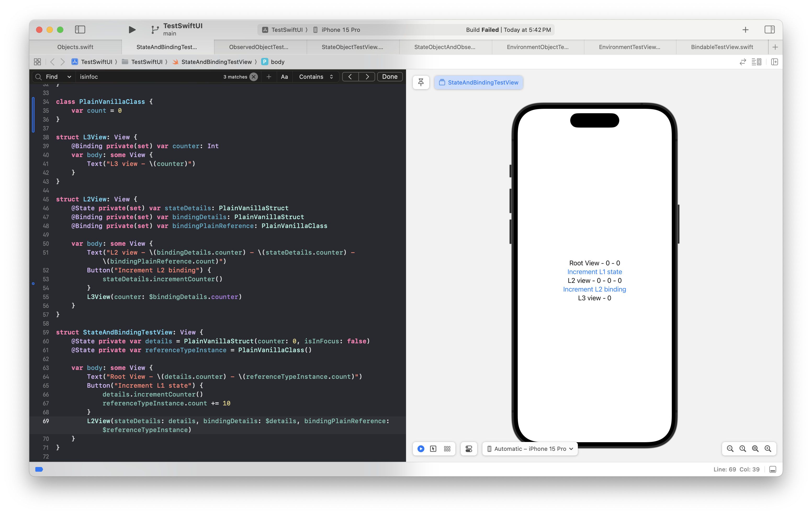

[toc]

#### @State property wrapper

Apple's documentation ([link](https://developer.apple.com/documentation/swiftui/state))

**@State** should be used for data for which source of truth lies in the same View, i.e. where the properties themselves are the source of truth. 

> When used with a value type, there is no need to annotate the value type with anything more. But if used with a reference type, the reference type must be annotated with `@Observable` attached macro. Explained more in next note.

#### @Binding property wrapper

Apple's documentation ([link](https://developer.apple.com/documentation/swiftui/binding))

**@Binding** should be used for data for which source of truth lies in a parent View.

A state gets passed as a binding through its project value (i.e. $ notation), and (when the state is a value type) hence becomes read-write from the subview too. If however the (value-type) state is passed as is to a subview, then the subview too receives it as a state which in turn is a copy of the original state.

What is @Binding in View2, can be passed as @Binding to View3, using $bindingProperty syntax (i.e. projected value of binding)

The below snippet shows those, the outermost view ('StateAndBindingTestView') has 2 state properties. And its subview 'L2View' has 1 state and 2 binding properties. 

> Again Binding too is probably officially meant for value types, but does work with reference types too.