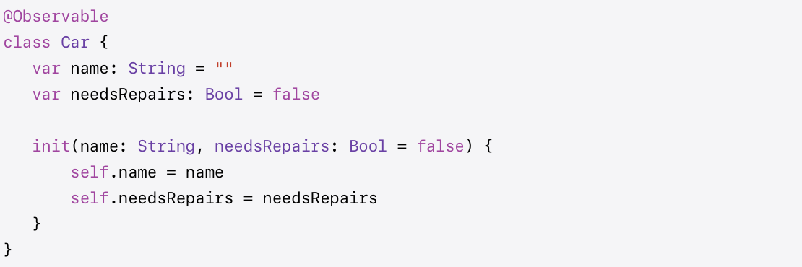
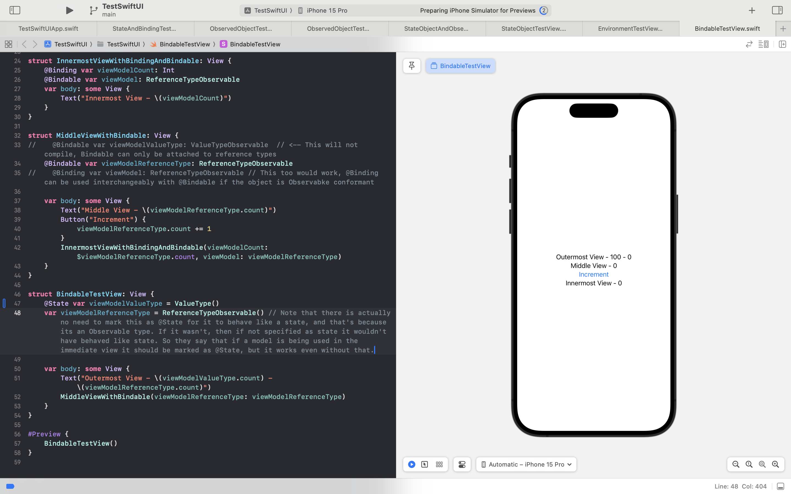

[toc]

> 👉 These are available since iOS 17 (2023).  Together 'Observable protocol/macro + @State/@Bindable property wrapper' is basically a replacement of sorts for 'ObservableObject protocol + @ObservedObject/@StateObject property wrapper' combination.

Also, the 3 basic SwiftUI data flow property wrappers since the advent of these are - `@State`, `@Bindable`, and `@Environment` (no `@Binding` there).

#### Observable protocol, Observable() macro

Apple documentation - protocol [link](https://developer.apple.com/documentation/Observation/Observable), macro [link](https://developer.apple.com/documentation/observation/observable())

**Observable** protocol by itself simply indicates a type that emits notifications to observers when its data changes, it has no methods of its own. **Observable()** macro however defines and implements the intended behavior of this protocol by automatically synthesizing the code during build. There is no need to specify `@Published`, etc. anywhere.

Note that the `Observable()` macro can only be used with reference types, and attaching it to value types generates compiler error.

#### @Bindable property wrapper

Apple documentation ([link](https://developer.apple.com/documentation/swiftui/bindable))

**@Bindable** can be used for reference type properties (and actually ordinary variables too) that conform to `Observable` protoco/Observable() macro. Also, it can be used as binding i.e. for data whose source of truth is elsewhere as well as like a state i.e. data where the source of truth is right there.

FWIW, if a reference type uses `Observable()` macro, it need not even be qualified with `@State` for it work like a State as it works like that even without it.

Also note that if View1 has an Observable property and needs to pass a Bindable qualified object to View2, it can simply pass that property (no $ notation, etc. there as the View1 is not using a property wrapper to begin with).

If a binding needs to be created from a bindable that can be done using $ notation.