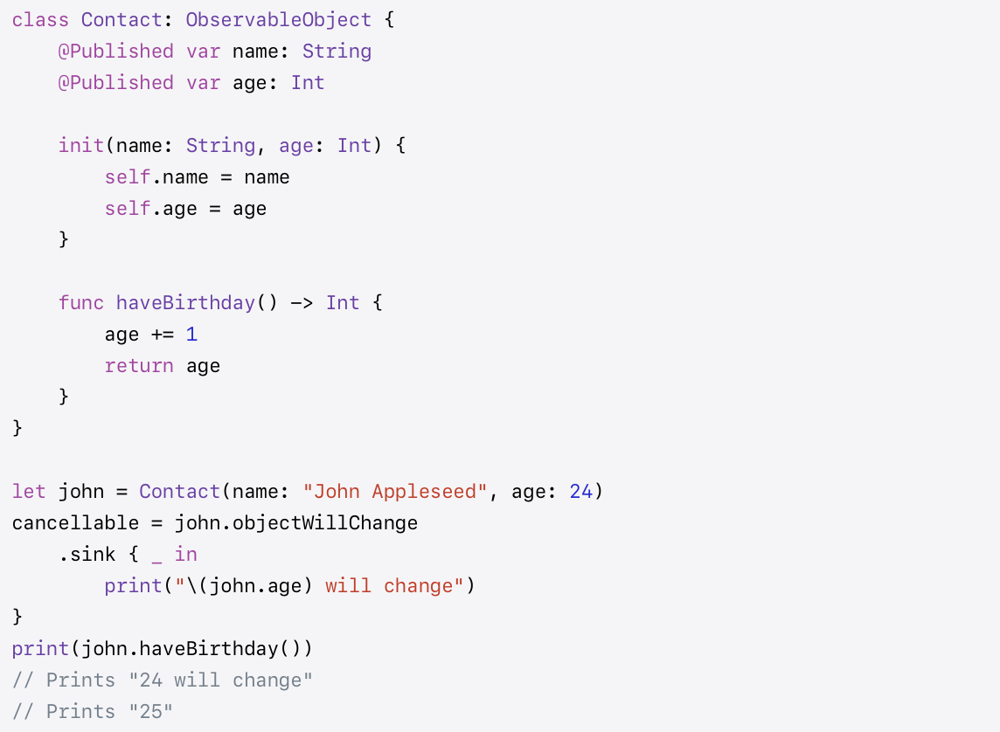
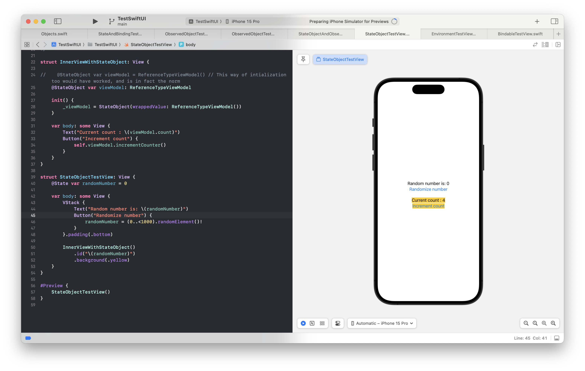
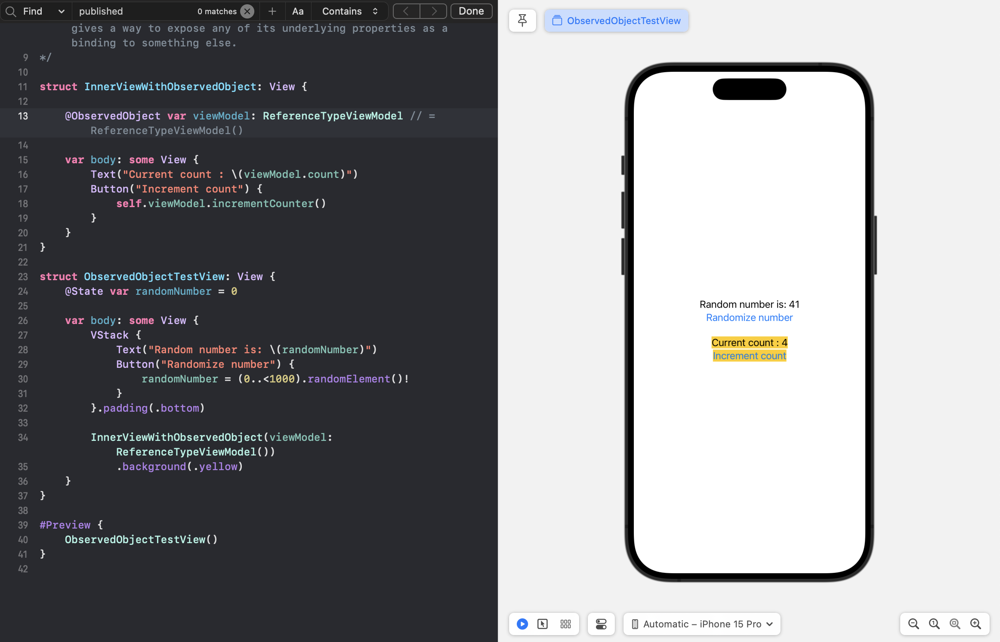
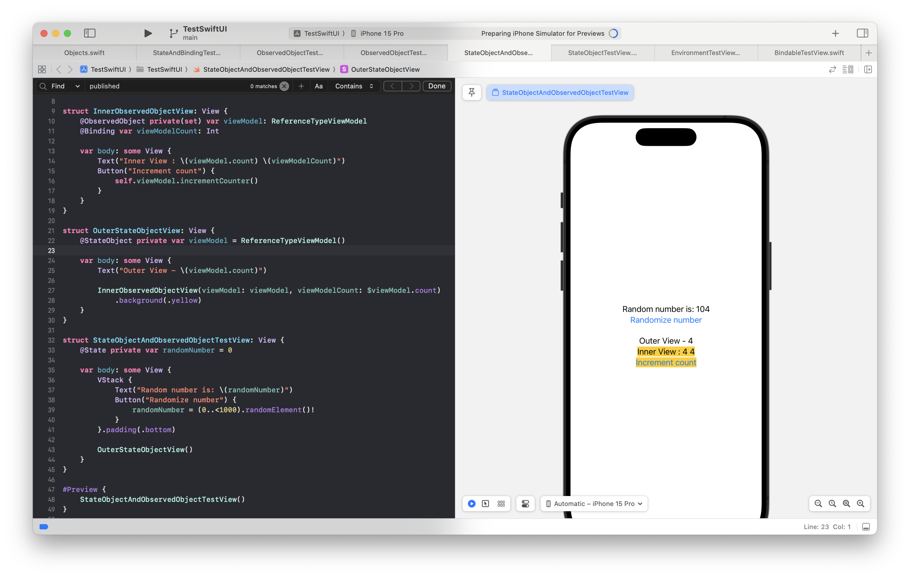

[toc]

> 👉 These are all legacy. Until iOS 16 (2022) the below were the norm for the purpose they serve, however since iOS 17 (2023) they have been replaced by Observation (i.e. `Observable` protocol/macro, `@Bindable` property wrapper).

#### ObservableObject protocol

Apple documentation ([link](https://developer.apple.com/documentation/Combine/ObservableObject))

**ObservableObject** is a protocol in Combine framework that's available for reference types alone. If a class conforms to ObservableObject protocol, then for any property that it has marked with **@Published** property wrapper if that property were to change a built-in **objectWillChange** publisher automatically emits an event saying something in the object is about to change. Technically, the objectWillChange publisher can also be made to manually emit an event from its conformant instance (thereby making unnecessary the @Published property).

#### @StateObject property wrapper

Apple documentation ([link](https://developer.apple.com/documentation/swiftui/stateobject))

**@StateObject** only work with objects (i.e. reference types) and for which source of truth lies in the same view. The object that its attached to should declare conformance to `ObservableObject` protocol. Basically it should be used for reference type data (get it to conform to ObservableObject protocol) and are the reference type equivalent of `@State`.

A `@StateObject` property need not be initialized right at the declaration and can even be done from an init method using `StateObject(wrappedValue:)`.

Also, if the View's identifier changes the view is reset automatically.

#### @ObservedObject property wrapper

Apple documentation ([link](https://developer.apple.com/documentation/swiftui/observedobject))

**@ObservedObject** only work with objects (i.e. reference types) and for which source of truth lies in the same. The object that its attached to should declare conformance to `ObservableObject` protocol. 

They are typically meant to be used in conjuction with @StateObject in a parent view, and are the loose reference type equivalent of `@Binding`. Also for that reason, while an initial value can be specified for @ObservedObject it should not be done (as its set from somewhere else).

#### Sharing reference data across views

Typically what if View 1 and View 2 (with View 2  being a subview) need to share reference type data, then View1 declares a `@StateObject` and initializes it, View2 declares a `@ObservedObject`, and View 1 sets that from its StateObject property (no $ notation needed).

This can also be done using `@EnvironmentObject`. View1 can simply add that @StateObject to environment using `environmentObject()` modifier and View 2 gets that through @EnvironmentObject property wrapper.

#### Difference between @StateObject and @ObservedObject

The nuance with `@StateObject` (as compared to `@ObservedObject`) is that if the containing view (i.e. the view that has this `@StateObject` property) needs to update any of its subviews then this subview (that had the `@StateObject` property) is not reset. And that looks like a good thing.

If however the view's identifier changes, the view is reset regardless. This can be done with `.id()` modifier. This however should not be done only when needed as its expensive.

AVanderLee article ([link](https://www.avanderlee.com/swiftui/stateobject-observedobject-differences/))

#### @EnvironmentObject property wrapper

> To read an ObservableObject from the environment, **@EnvironmentObject** property wrapper needs to be used. Explained more in `EnvironmentObject, Environment` note.
