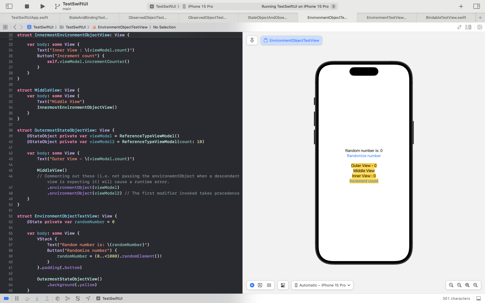
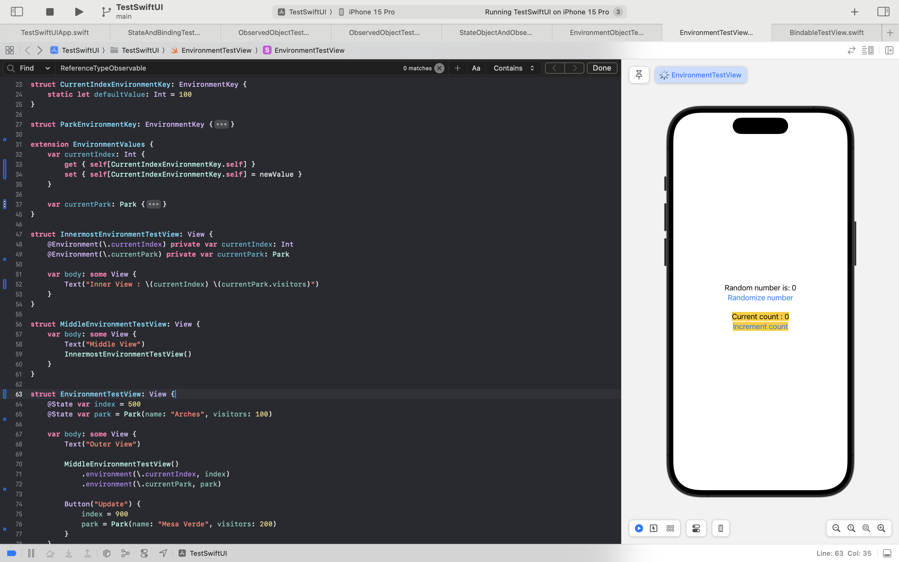

[toc]

#### @EnvironmenObject property wrapper

Apple documentation ([link](https://developer.apple.com/documentation/swiftui/environmentobject))

**@EnvironmentObject** is used only  with objects (i.e. reference types) and the object that its attached to should declare conformance to `ObservableObject` protocol.

If an ancestor view has a compliant ObservableObject passed to its **environmentObject()** modifier, then this property receives it automatically. So essentially, there is no need to manually pass an object through multiple layers as it can be set just once and then automatically received by all the descendants.

 If however a view has an `@EnvironmentObject` property and yet at runtime a compliant object has not been set in the envnironemnt already, there will be runtime error.

> Its even possible to directly create and pass an `ObservableObject` in the `environmentObject` modifier (as in `.environmentObject(ReferenceTypeViewModel())` and when set this way, the current view doesn't seem to get reset when the containing view is updated.

#### @Environment property wrapper

Apple documentation -  @Environment property wrapper ([link](https://developer.apple.com/documentation/swiftui/environment))  EnvironmentValues struct ([link](https://developer.apple.com/documentation/swiftui/environmentvalues))  EnvironmentKey protocol ([link](https://developer.apple.com/documentation/swiftui/environmentkey))

Mark any property whose value you intend to read from an environment property as **@Environment**. From wherever you want, pass that value to environment using the **environment()** modifier. For setting up the corresponding environment property though, first delcare it by extending **EnvironmentValues** string. Every environment property would also need an underlying key, set that in a custom struct that conforms to **EnvironmentKey** protocol.

This is a safer mechanism over `@EnvironmentObject` as a default value is there. However note that iOS 17 onwards, an `Observable` object too can be read with `@Environment` and that is not guranteed to be safe as it may not have a default value.

> Also, check `Entry()` macro in iOS 17 ([link](https://developer.apple.com/documentation/swiftui/entry())). A convenient shorthand for creating environment values, transactions (something animation related), etc.