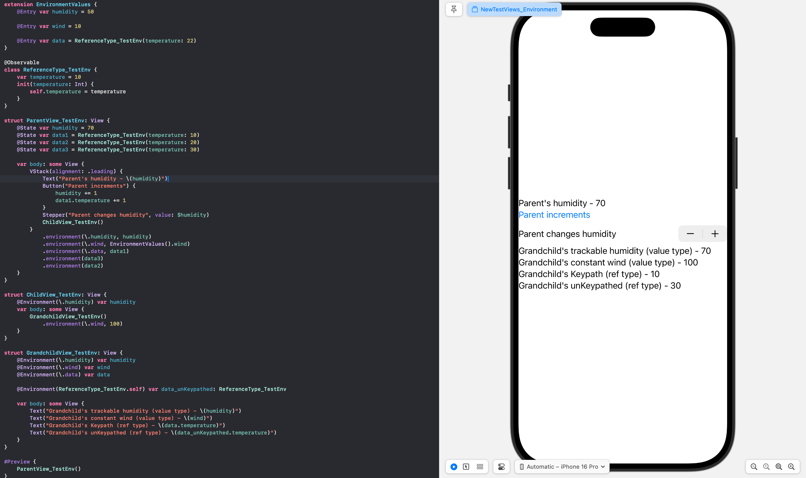
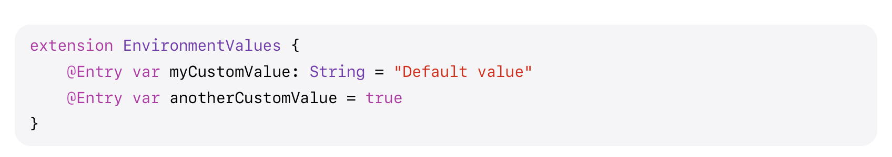
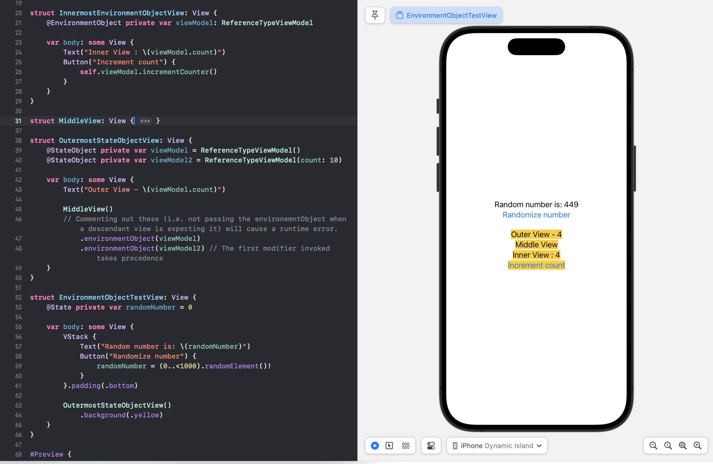

[toc]

#### @Environment property wrapper

Apple documentation -  EnvironmentValues struct ([link](https://developer.apple.com/documentation/swiftui/environmentvalues))  EnvironmentKey protocol ([link](https://developer.apple.com/documentation/swiftui/environmentkey))  @Entry attached macro ([link](https://developer.apple.com/documentation/swiftui/entry()))  environment() modifier ([link](https://developer.apple.com/documentation/swiftui/view/environment(_:_:)))  @Environment property wrapper ([link](https://developer.apple.com/documentation/swiftui/environment))  

Mark any property whose value you intend to read from an environment property as **@Environment**. From wherever you want, pass that value to environment using the **environment()** modifier. For setting up the corresponding environment property though, first delcare it by extending **EnvironmentValues** string. Every environment property would also need an underlying key, set that in a custom struct that conforms to **EnvironmentKey** protocol.

> Note that a view cannot modift any property of it that it has marked as **@Environment** (regardless of the var there). Environment values are ready-only.

 `@Entry` attached macro in iOS 17 ([link](https://developer.apple.com/documentation/swiftui/entry())) is a convenient shorthand for creating environment values. 

**@Environment** property wrapper can be applied in two ways, either by tying to a declared environment keypath or by just tying to a general reference type. It then also gets passed by the ancestor accordingly. 

#### @EnvironmentObject property wrapper [Legacy]

Apple documentation ([link](https://developer.apple.com/documentation/swiftui/environmentobject))

**@EnvironmentObject** is used only  with objects (i.e. reference types) and the object that its attached to should declare conformance to `ObservableObject` protocol.

If an ancestor view has a compliant ObservableObject passed to its **environmentObject()** modifier, then this property receives it automatically. So essentially, there is no need to manually pass an object through multiple layers as it can be set just once and then automatically received by all the descendants.

If however a view has an `@EnvironmentObject` property and yet at runtime a compliant object has not been set in the envnironment already, there will be runtime error.

> Its even possible to directly create and pass an `ObservableObject` in the `environmentObject` modifier (as in `.environmentObject(ReferenceTypeViewModel())` and when set this way, the current view doesn't seem to get reset when the containing view is updated.