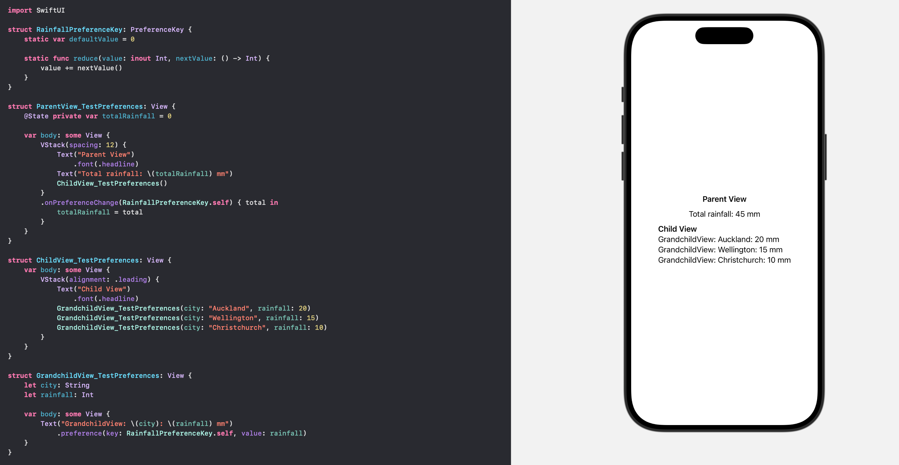

https://swiftwithmajid.com/2020/01/15/the-magic-of-view-preferences-in-swiftui/

Its a way to pass value up the view hierarchy, from a child to its parent/ancestor.

Roughly speaking, a struct representing that data needs to be declared and made to conform to **PreferenceKey** protocol, it should have a default value and then also **reduce()** function implemented that will be given the current value and another function that will denote the next upcoming value, this reduce function should then update the current value as it wants to.

A parent view needs to have an **.onPreferenceChange()** modifier that gets called whenever this preference value changes.

The child view should propagate the preference up using a **.preference()** modifier.

