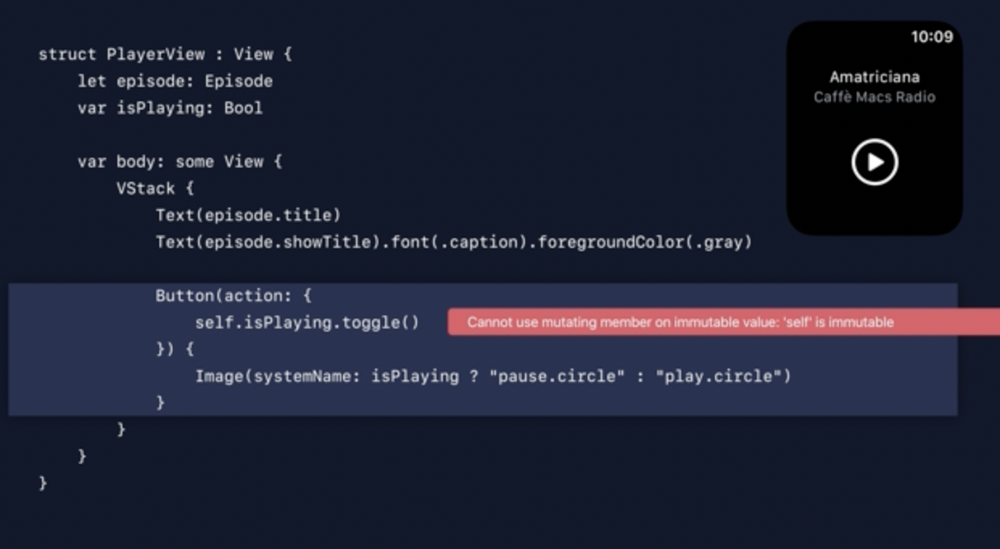
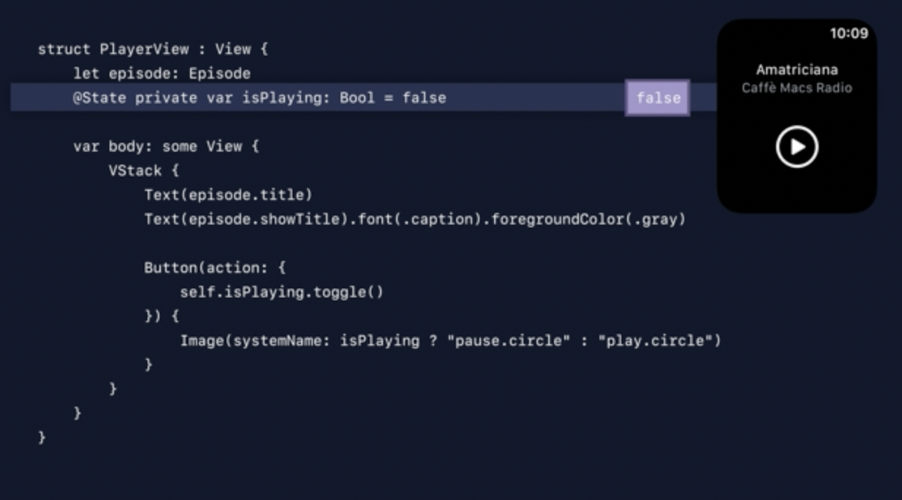
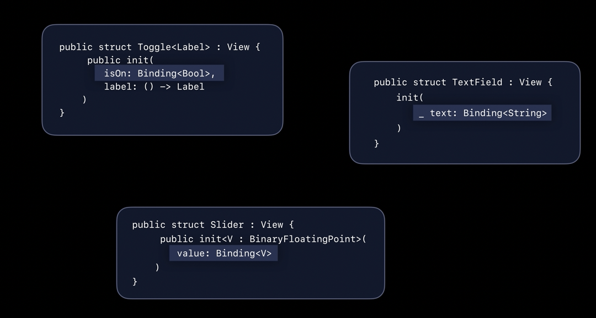
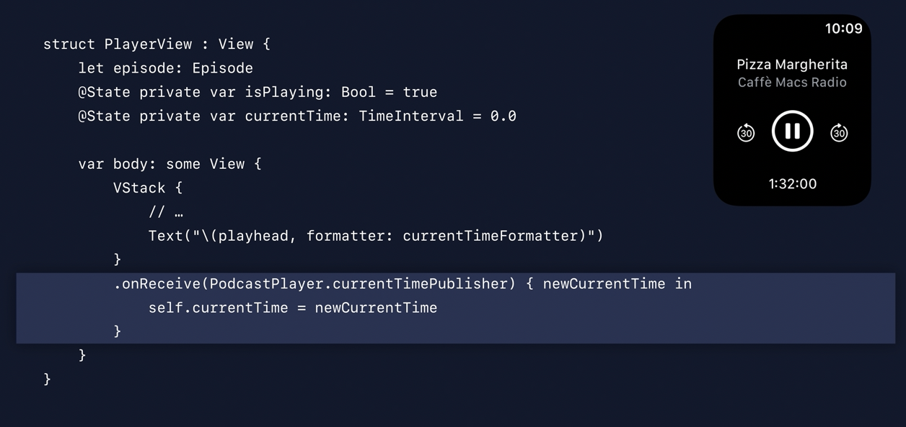

##### Resources

WWDC 2019 - Data Flow Through SwiftUI <br>  <br>WWDC 2023 - Discover Observation in SwiftUI <br>

Learning SwiftUI tutorials - Chapter 3: State and data flow ([link](https://developer.apple.com/tutorials/swiftui-concepts)) <br>

SwiftUI documentation Data and Storage - Model Data ([link](https://developer.apple.com/documentation/swiftui/model-data)) <br>SwiftUI documentation Data and Storage - Environmenrt values ([link](https://developer.apple.com/documentation/swiftui/environment-values)) <br>SwiftUI documentation Data and Storage - Preferences ([link](https://developer.apple.com/documentation/swiftui/preferences)) <br>SwiftUI documentation Data and Storage - Persistent and Storage ([link](https://developer.apple.com/documentation/swiftui/persistent-storage)) <br>

Test projects - <br>SwiftUI-StateAndDataManagement <br>TestSwiftUI

##### Misc.

@State or such is needed to be able to update a self property from a View's result builder. Else, there will be a compilation error and that is a good thing.

| Error without State property wrapper                         | No error with State property wrapper                         |
| ------------------------------------------------------------ | ------------------------------------------------------------ |
|  |  |

Pretty often built-in views require a binding to be passed to them (single source of truth).



----

##### onReceive(_:perform:)

`onReceive(_:perform:)`

```swift
nonisolated
func onReceive<P>(
    _ publisher: P,
    perform action: @escaping (P.Output) -> Void
) -> some View where P : Publisher, P.Failure == Never
```

Adds an action to perform when this view detects data emitted by the given publisher.

So this is handy when the dependency changing is informed through a Publisher




