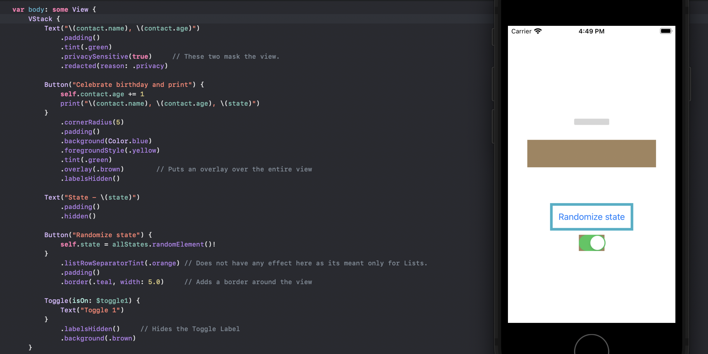
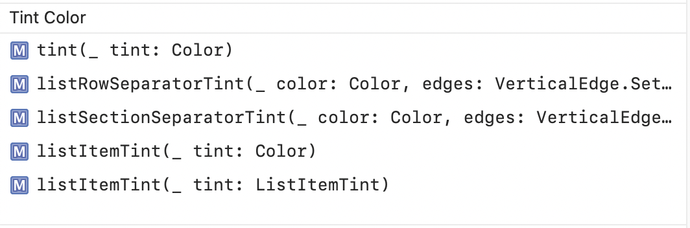
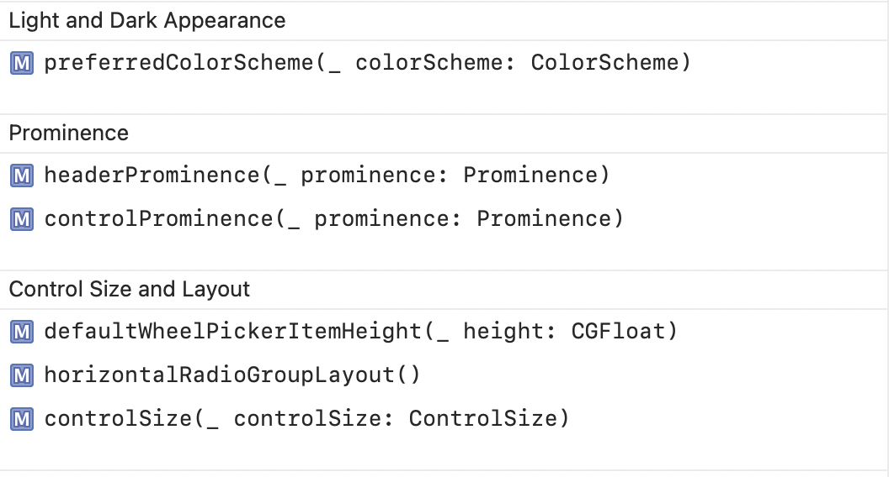
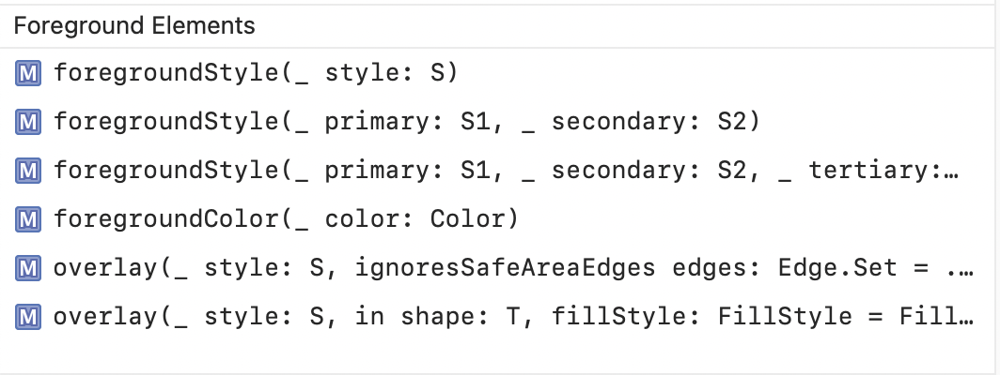
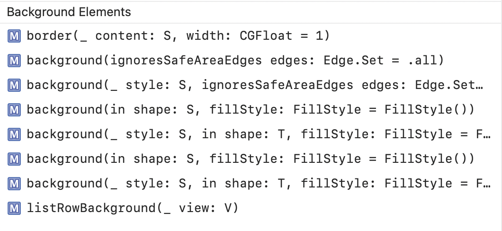
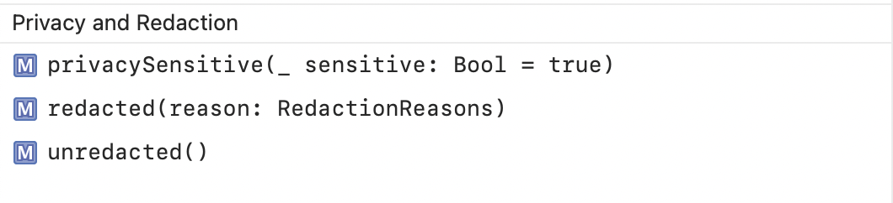
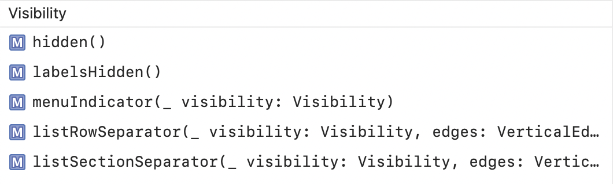

## Appearance related modifiers

> SwiftUI can be tricky. There are so many different ways that a view's appearance can be modified, and also in the sense that there can be so many attributes for the same kind of thing. Take color for example. A view can have an accent color, foreground color, background color, preferred color scheme.

##### Various kind of colors in a View

`Tint color` is probably supposed to be thought of as an accent color (i.e. a color that is not too pervasive in a view but shows up as kind of a supportive color). There is no telling how accent color shows up (or even if it does) for various kinds of views. May be it can be known only by trial and error. In case of a `Text`, the font color is determined by tint color.

And then there are `foreground color` and `background color`. In case of a `Button`, the foreground color impacts the font color (and actually overrides tintColor) while the background color can be though of as the color for everything else underneath. In fact `backgroundStyle` too seems to be working like `backgroundColor` in case of a Button.

##### Modifiers can modify the underlying Views differently.

There is no one way that a modifier will modify a View. It also depends upon the underlying View. For example, For example, `labelIsHidden` does hide the Label for a `Toggle` but does not for a `Button` (may be because having a label is considered essential for a button and hence SwiftUI will not allow that to be hidden).

Then there is also `preferredColorScheme` which sets the colorScheme (dark mode/light mode) environment value which too gets factored in. And of course there is system wide dark/light mode too that can get factored in absence of a preferred color scheme.

##### Figuring out the extent of a View

There are many different ways that can be employed. For example, there is `backgroundColor()`, `border(:width)`.

Also, there is also `overlay()` which can totally cover up a view with the specified view (often a Color).

##### Hiding a View

It can be done in several different ways. `hidden()` simply hides a view but it still continues to be take all of the space that it would have otherwise taken. `labelIsHidden()` just potentially hides any Label that may be there in the view. `opacity(0)` too has the effect of hiding a view (but here too it still continues to take up the required space).

If a view truly has to be hidden such that it does not take up any space, then I think it has to be wrapped in an `if` conditional and then when the condition is not met it does not even get rendered.

##### Misc. modifiers

`privacySensitive` and `redacted(reason:)` - These two modifiers can together redact and hide the contents of a view.

##### Sample code snippet

### Appearance -

```
Text("\(contact.name), \(contact.age)")
    .padding()
    .tint(.green)
    .privacySensitive(true)  // These 2 mask the view
    .redacted(reason: .privacy)

Button("Celebrate birthday and print") {
  ....
}
    .cornerRadius(5)
    .padding()
    .overlay(.brown)   // Puts an overlay over the entire view

Button("Randomize state") {
    ....
}
    .padding()
    .border(.teal, width: 5.0)   //Adds a border around the view

Toggle(isOn: $toggle1) {
    Text("Toggle 1")
}
    .labelsHidden()     // Hides the Toggle Label
    .background(.brown)
```



### All modifiers

Tint Color | Light and Dark appearance, Prominence
--- | ---
 | 

Foreground elements | Background elements
--- | ---
 | 

Privacy and Redaction | Visibility
--- | ---
 | 
