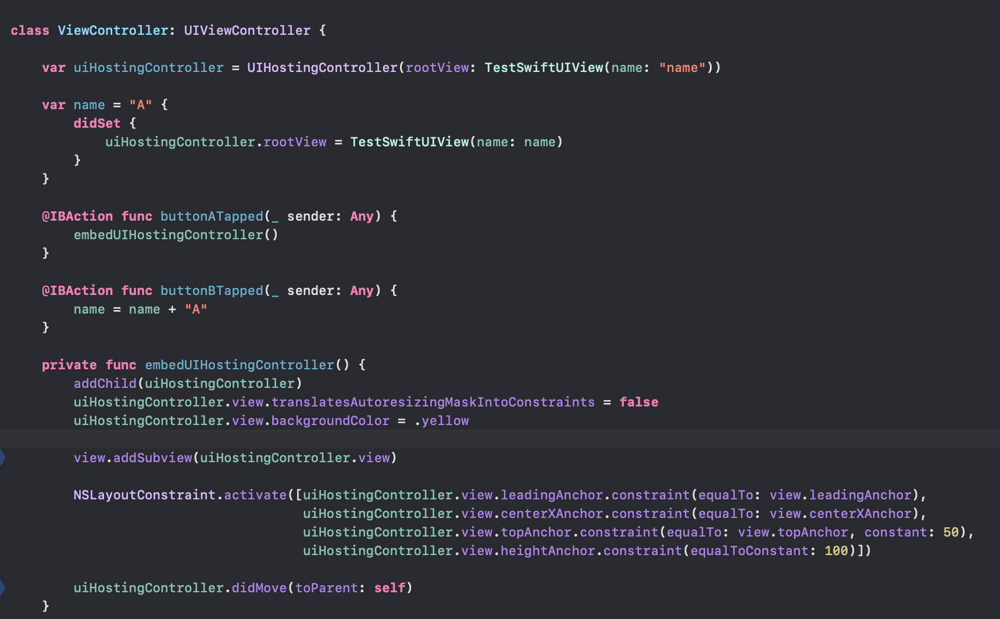
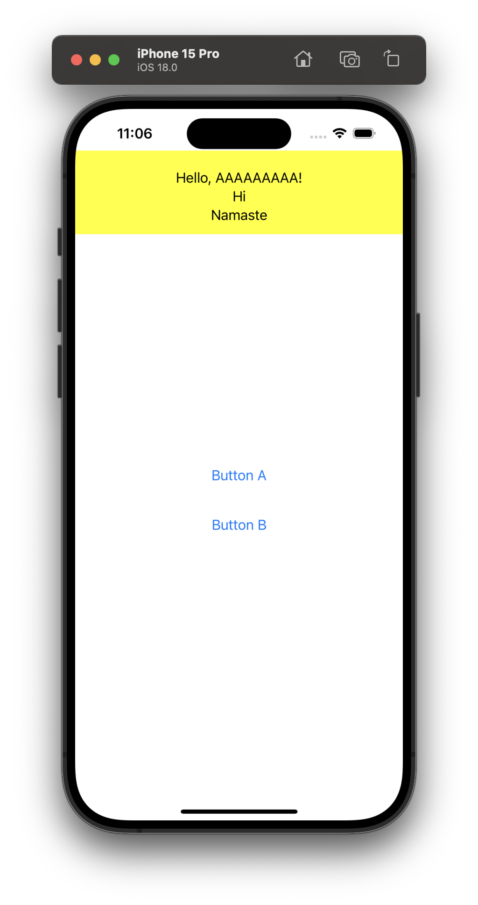
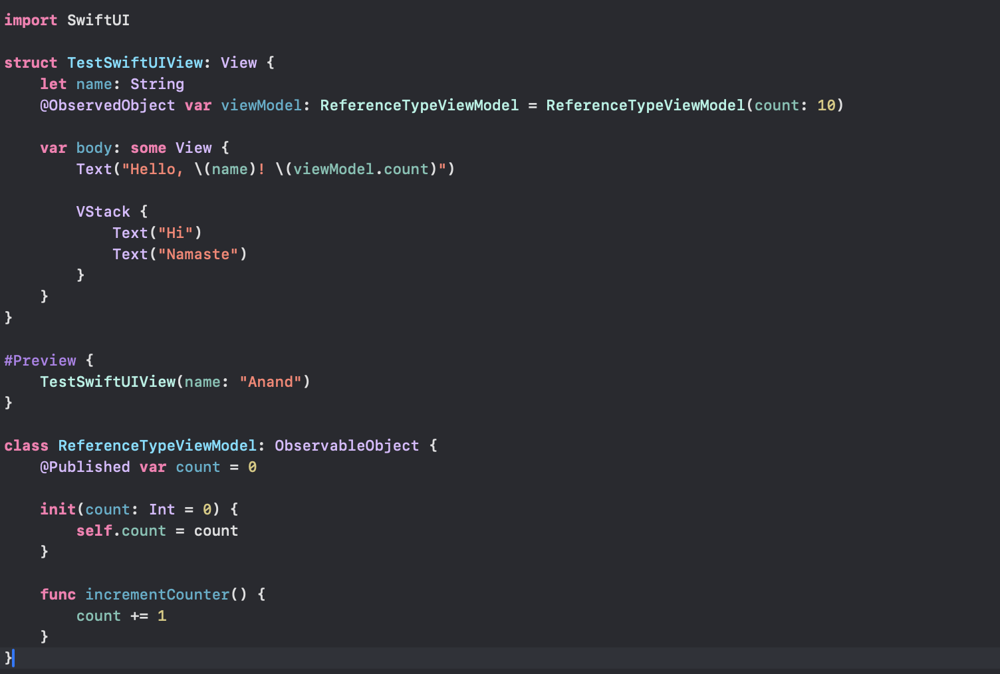
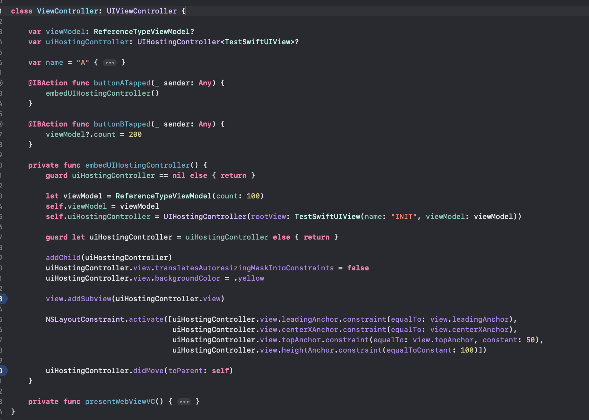
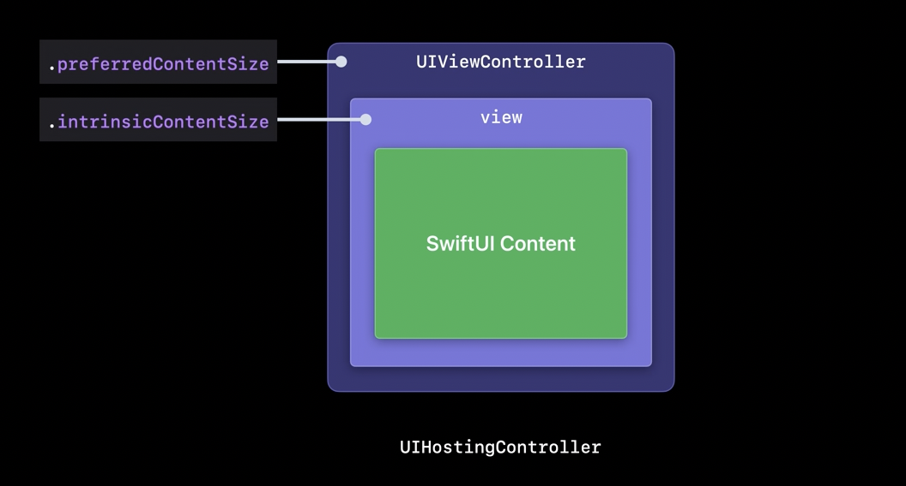

#### UIHostingController

**UIHostingController** is a UIKit view controller that can present a SwiftUI VIew, which goes into its **rootView** property. It still continues to have the regular UIView view property as well.

##### Changing rootView itself to update UI

[Reference](https://developer.apple.com/documentation/swiftui/uihostingcontroller)

To have the SwiftUI View update itself when some value outside the SwiftUI part changes (i.e. to have it behave in a 'declarative/reactive way'), the rootView property needs to be updated. For example in below code snippet,  whenever the name property is changed in its didSet the rootView is also being changed.

| Code                                                         | Result                                                       |
| ------------------------------------------------------------ | ------------------------------------------------------------ |
|  |  |

##### Using @ObservedObject to update UI

When SwiftUI's source of truth lies elsewhere, its also possible to update the UI more easily by having the SwiftUI View's property be **ObservableObject** conformant and to mark it as an **@ObservedObject**. Then when the same property is changed from outside such as from UIViewController, the SwiftUI View is updated automatically.

| @ObservedObject in SwiftUI View                              | Object changed from UIViewController                         |
| ------------------------------------------------------------ | ------------------------------------------------------------ |
|  |  |

> The above snippets are from 20222. The above should now (i.e. ~2023) also be doable using **Observable** protocol and **@Bindable.** Have to give it a try.

##### Responding to SwiftUI View size changing when content updates

Its something to do with using the **sizingOptions** property. Its an property that tracks how the hosting controller tracks changes to the size of its SwiftUI content. With the values being `intrinsicContentSize` (the hosting controller’s view automatically invalidate its intrinsic content size when its ideal size changes), and `preferredContentSize` (the hosting controller tracks its content’s ideal size in its preferred content size).

#### Misc.

When embedded in a UITableView or UICollectionView, a property of theirs' named `contentConfiguration: UIHostongConfiguration` is used to have SwiftUI code. Explained more in 'WWDC 2022: Use SwiftUI with UIKit'.

#### Resources

WWDC 2022: Use SwiftUI with UIKit