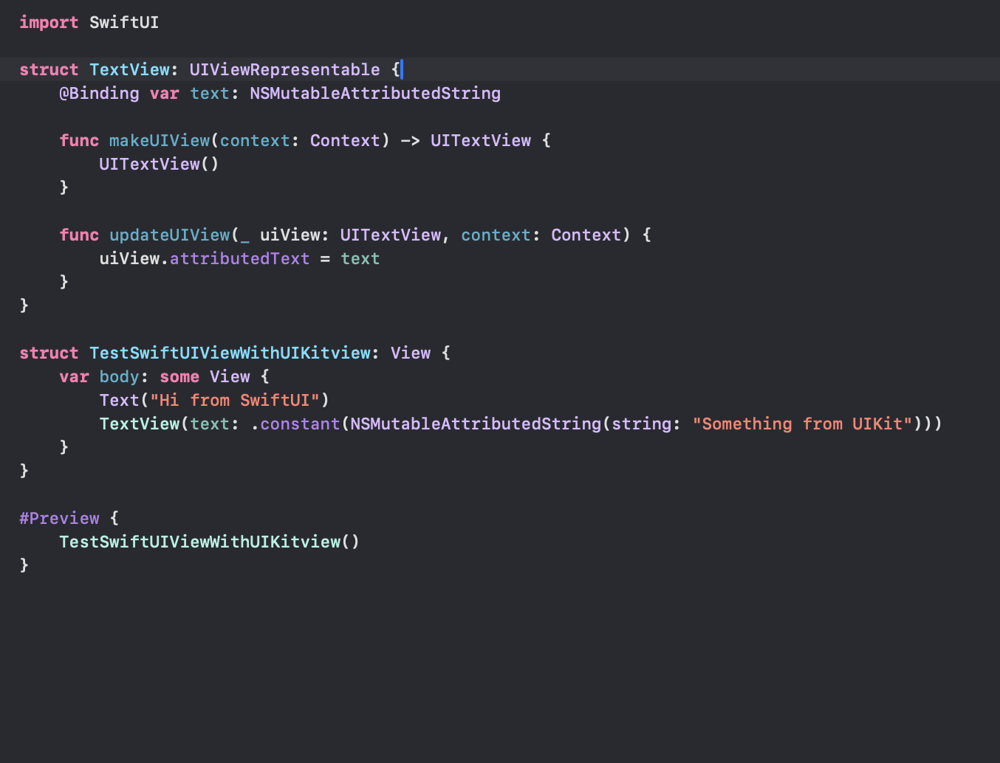
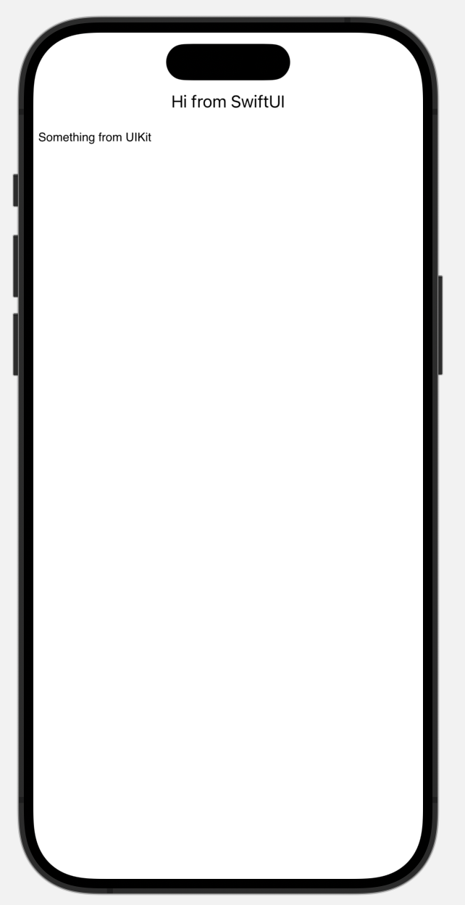

##### Embedding UIView in SwiftUIView

Create a struct and get it to conform to **UIViewRepresentable** protocol ([reference](https://developer.apple.com/documentation/swiftui/uiviewrepresentable)). This protocol requires two methods implem\ented, a **makeUIView()** where the UIView should be created and an **updateUIView()** which takes in a **UIViewRepresentableContext** instance ([reference](https://developer.apple.com/documentation/swiftui/uiviewrepresentablecontext)) and should update the view using latest state information from SwiftUI.

This struct can then be embedded in any SwiftUI VIew hierarchy.

| Code                                                         | Result                                                       |
| ------------------------------------------------------------ | ------------------------------------------------------------ |
|  |  |

> Note that for any UIKit view/viewController that is to be embedded into a SwiftUI View,  `center`, `bounds`, `frame`, and `transform` should not be set as SwiftUI changes them anyway and if set from UIKit there can be undefined behavior.

##### Embedding UIViewController in SwiftUI View

Similarly there are **UIViewControllerRepresentable** protocol ([reference](https://developer.apple.com/documentation/swiftui/uiviewcontrollerrepresentable)) and **UIViewControllerRepresentableContext** struct too ([reference](https://developer.apple.com/documentation/swiftui/uiviewcontrollerrepresentablecontext)) for embedding UIViewController

##### Resources

Paul Hudson article ([link](https://www.hackingwithswift.com/quick-start/swiftui/how-to-wrap-a-custom-uiview-for-swiftui))  Antoin Van der Lee article ([link](https://www.avanderlee.com/swiftui/integrating-swiftui-with-uikit/))