[toc]

### Image

Its pretty much like UIKit Image.

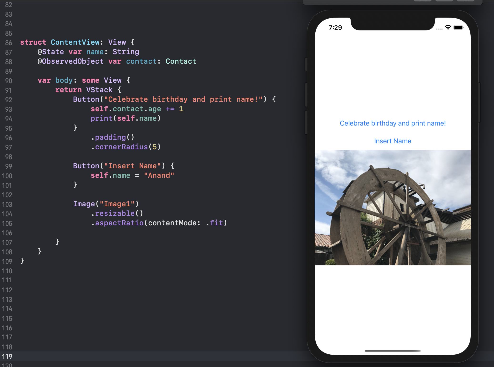

Creating an Image | Styling Images
--- | ---
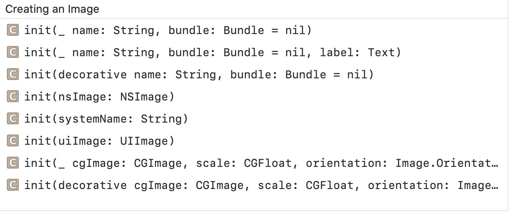 | 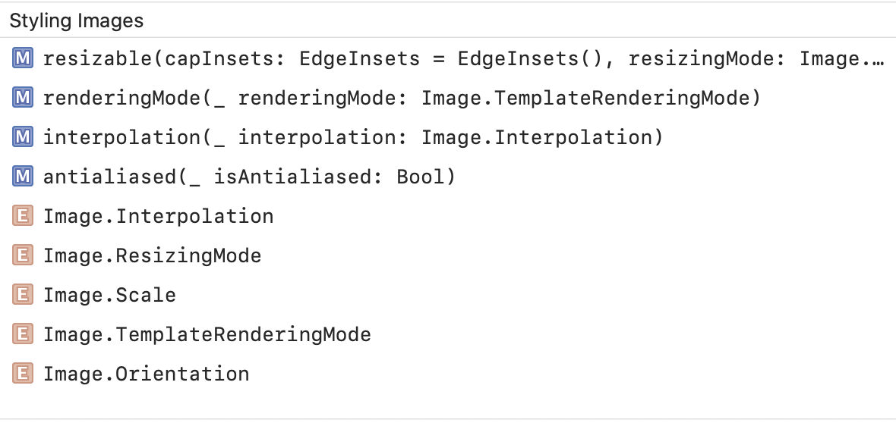

To use an image as a control, use one of the initializers that takes a label parameter. This allows the system’s accessibility frameworks to use the label as the name of the control for users who use features like VoiceOver. For images that are only present for aesthetic reasons, use an initializer with the decorative parameter; the accessibility systems ignore these images.

`resizable(capInsets:resizingMode:)` sets the mode by which the image is resized to fit its space. The default values for the two arguments are `EdgeInsets()` and `.stretch`.

`ResizingMode` enum has 2 cases - `stretch` (enlarges or reduces the size of an image so that it fills the available space), and `tile` (repeats the image at its original size, as many times as necessary to fill the available space).

> `aspectRatio(_:contentMode:)` in then above code snippet is actually a general view modifier, its not specific to Image alone.

> [Fitting Images into Available Space](https://developer.apple.com/documentation/swiftui/fitting-images-into-available-space) - Need to read this properly.

### AsyncImage

Introduces in iOS15, it asynchronously loads and displays an image.

```
AsyncImage(url: URL(string: "https://example.com/icon.png"))
    .frame(width: 200, height: 200)
```

### Button

The content (referred to as `Label`) can be any `View`, though it typically is `Text`.

```
struct Button<Label> where Label : View
```

```
Button("Celebrate birthday and print name!") {
    self.contact.age += 1
    print(self.name)
}
```

Creating a Button | Styling Buttons
--- | ---
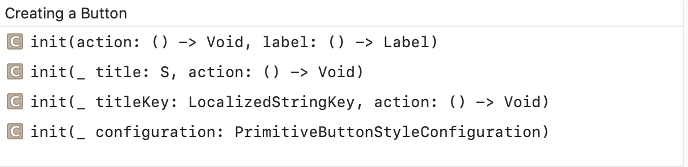 | 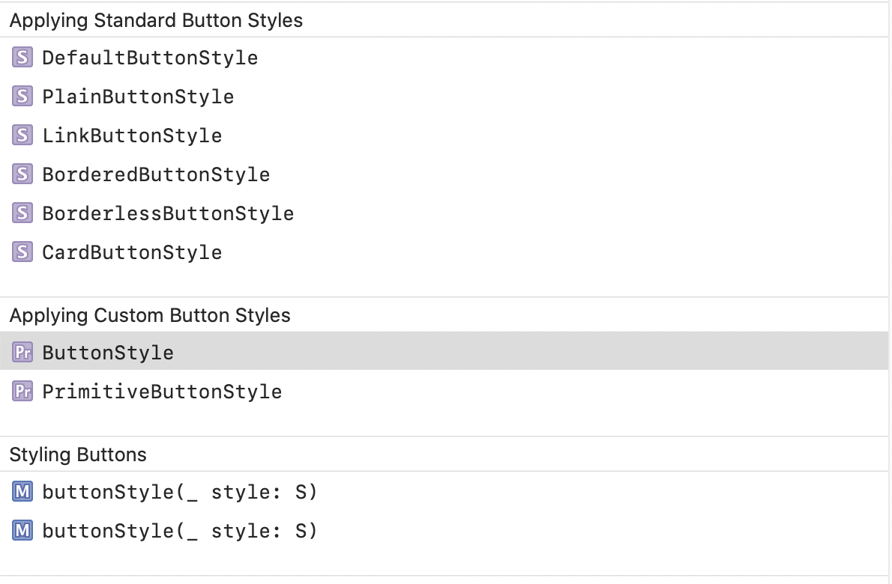

### EditButton

There are certain views that support editing of their content (i.e. they support `EditMode.active`). `NavigationView` is one such view. `EditButton` is a built-in button that toggles the edit mode (if any) of the current edit scope.

Not in edit mode |  In edit mode
--- | ---
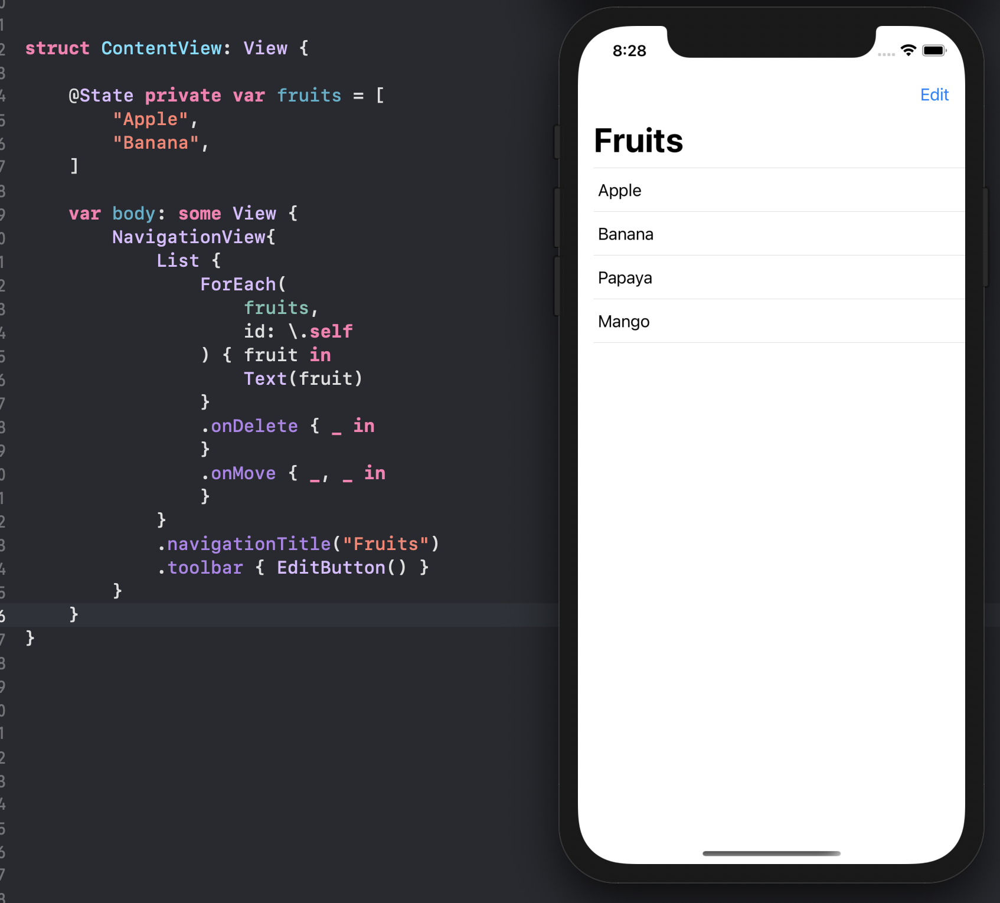 | 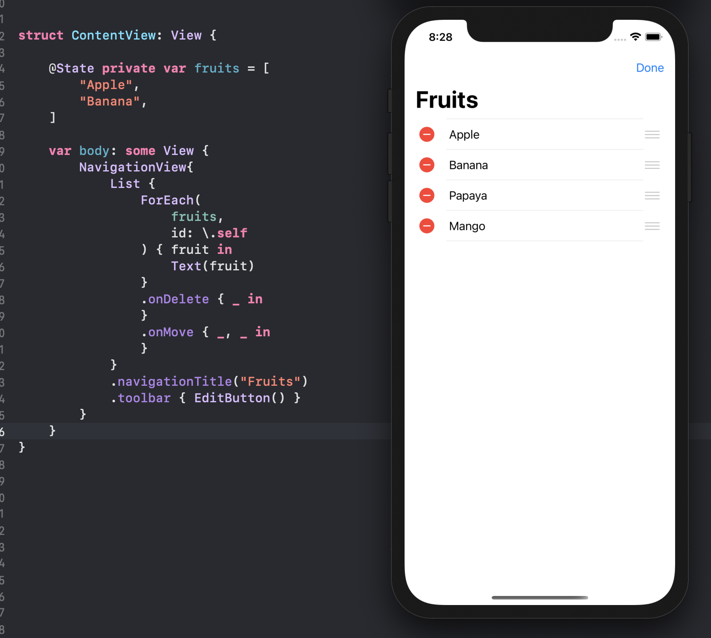

### Link

A hyperlink, that's it. The content is usually a `Text`, but can be any `View`.

```
struct Link<Label> where Label : View
```

```
Link("View Our Terms of Service",
      destination: URL(string: "https://www.example.com/TOS.html")!)
```

Creating a Link | Styling the Link text
--- | ---
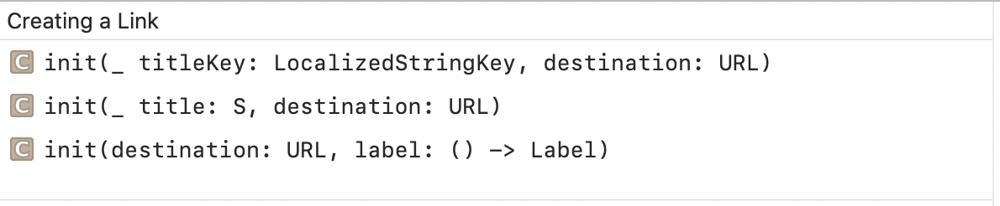 | 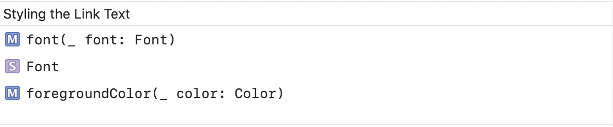

### Menu

Shows a Menu of actions that can be taken.

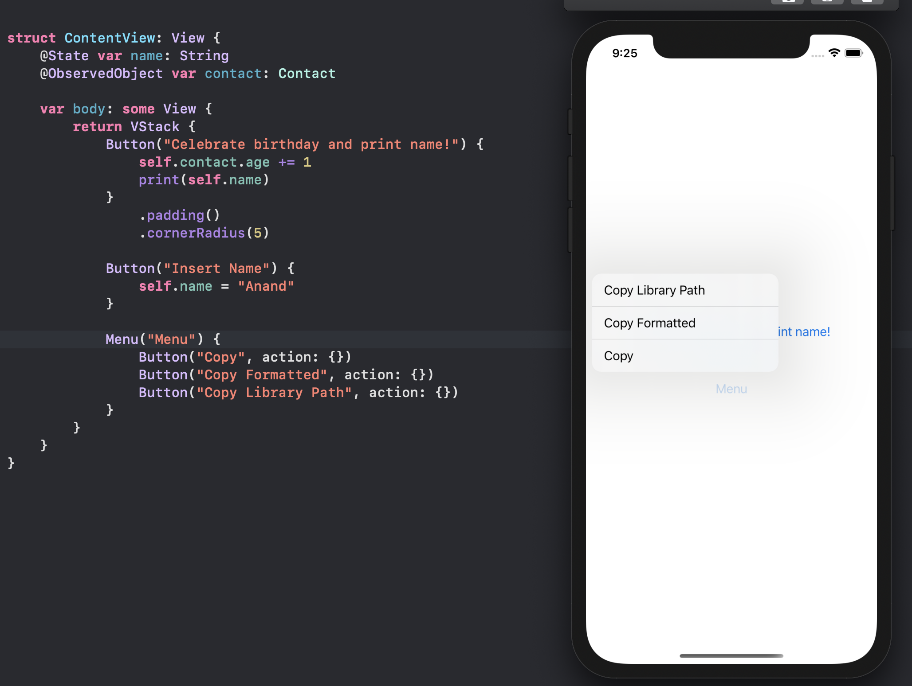

```
struct Menu<Label, Content> where Label : View, Content : View
```

Creating a Menu | Styling a Menu
--- | ---
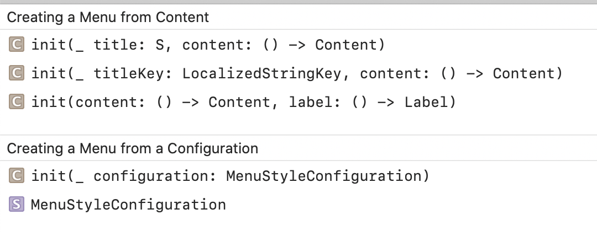 | 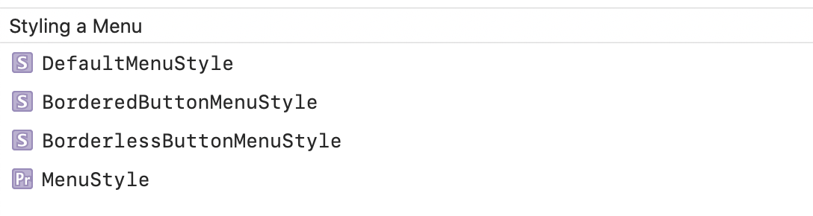

> Check `MenuStyleConfiguration`
