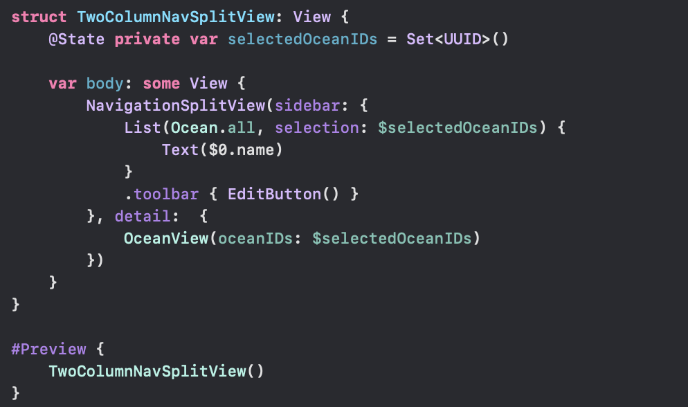

**List** is the SwiftUI equivalent of UIKit's **UITableView**.  [Reference](https://developer.apple.com/documentation/swiftui/list)

#### Sample Code

There is List in the root view of the NavigationSplitView there. The first argument is a data source of sorts, tbe second argument is a binding to a variable where the selections should be maintained. And the third argument (the closure that is) where the actual element to be displayed is composed. The seocnd arrument is such that if it corresponds to a Set then multi-selection is automatically allowed, else its not.

A **.toolbar()** modifier is there too and it adds a standard Edit button in the toolbar.

