[toc]

#### Quick refresher on OpenAPI

With OpenAPI (an industry standard thing and not something Apple), the API is documented using YAML/ JSON, and there is a rich ecosystem of tooling that exists to support it. There are tools for test generation, runtime validation, interoperability, and much more.

A sample OpenAPI document. The server URLs are mentioned in `servers`, the resource paths are mentioned in `paths` with their supported HTTP method mentioned inside it (such as `get` in below example).

| 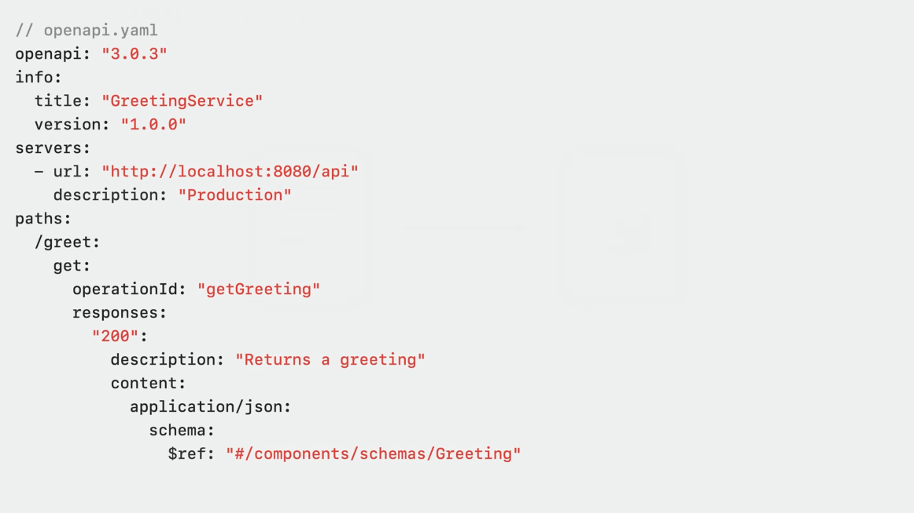 | 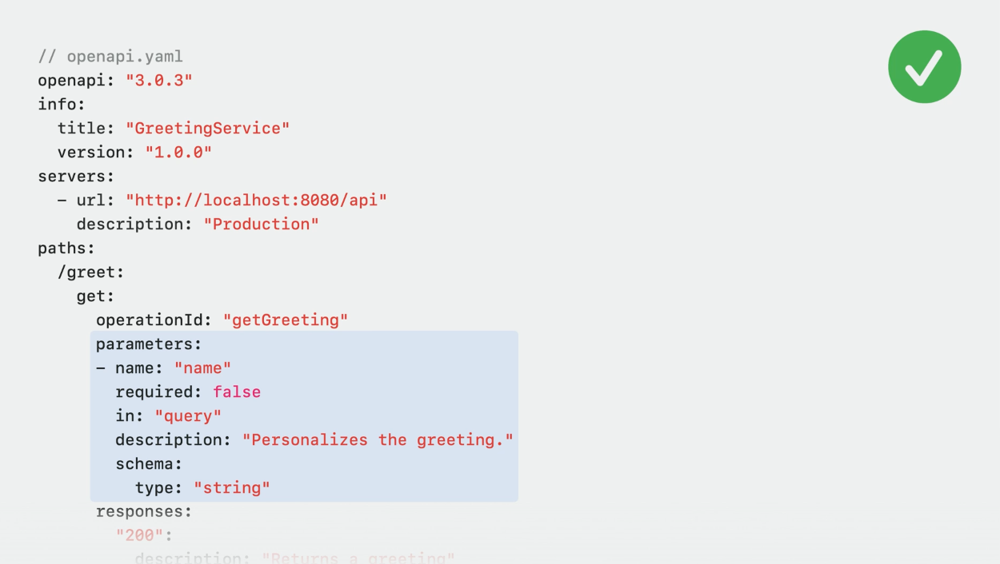 |
| ------------------------------------------------------------ | ------------------------------------------------------------ |

#### What is swift-openapi-generator

Its a SPM plug-in (of the type  build-tool) provided by Apple (to state the obvious its not something that is a part of Foundation framework) that automates several boilerplate things regarding making API calls if the OpenAPI spec is available. It has syntax to make the API call itself, and then ofcourse to parse it without having to custom write any model entities.

[Swift package URL](https://github.com/apple/swift-openapi-generator)

Being a build tool plugin, it runs automatically with builds and the generated code is always in sync with the OpenAPI document and in fact doesn't even need to be committed to the source repository.

> Where is the generated code anyway, didn't see in my successful test project? What does it have, model entities?

The code to use open-api-generator to make an API call and use the response looks something like this. The API server gets declared in `client` , the `getGreeting` function is automatically generated using the openAPI spec and it matches the API resource path declared there.

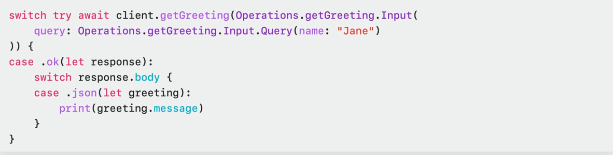

#### Client side usage

##### How to add the package in a consumer client project

The usual way. For example one way is to, navigate to project settings (not target settings) and add `swift-openapi-generator` ,  `swift-openapi-runtime`, and (this may not be  add  depending on Networking libs already in the project?) `swift-openapi-urlsession`.  Then go to Target settings, and `swift-openapi-generator` as a Run build Tool Plug-in and (not sure if this is really needed) the remaining as Target Dependencies.

| 1. Add packages in Project Settings                          | 2. Ensure all are there in Project Settings                  | 3. Add in Target Settings                                    |
| ------------------------------------------------------------ | ------------------------------------------------------------ | ------------------------------------------------------------ |
| 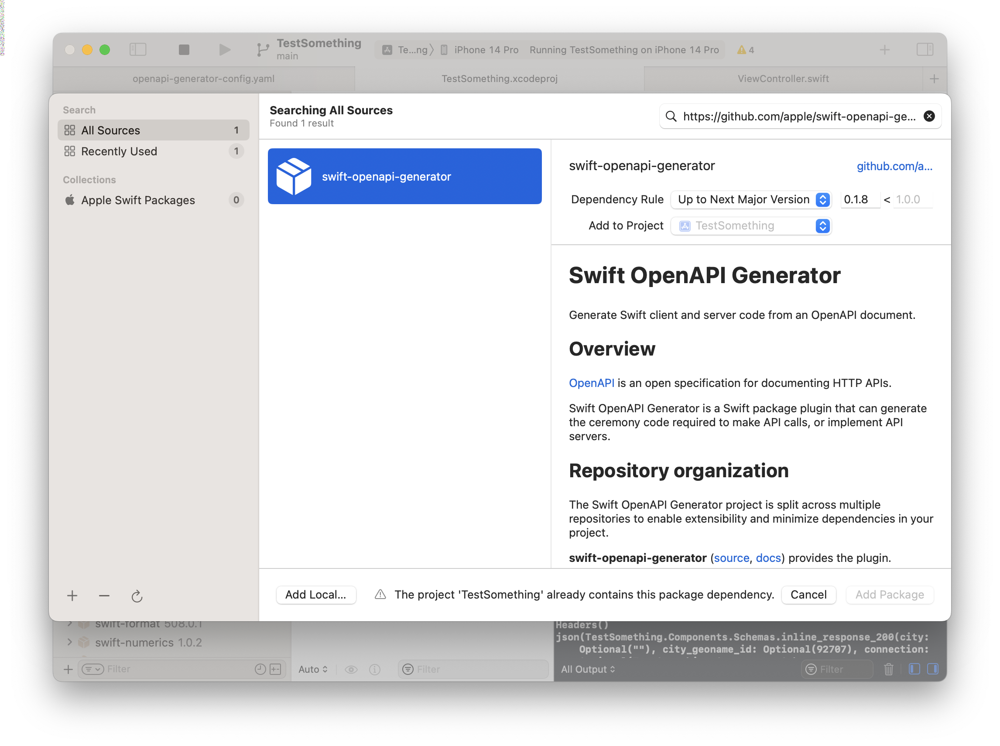 | 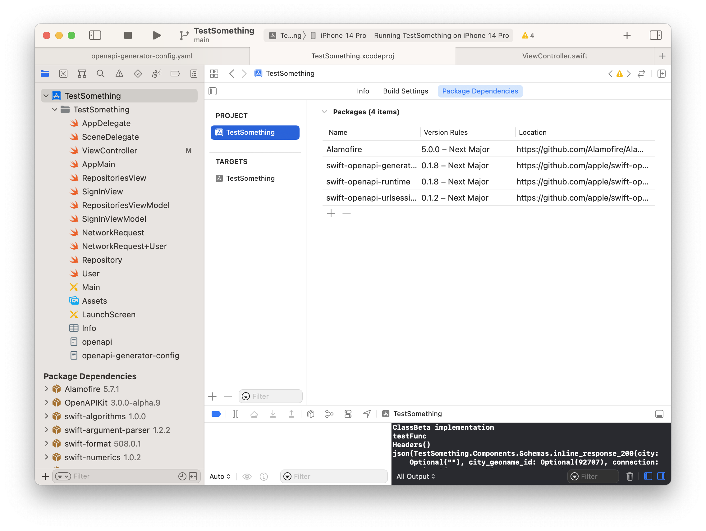 | 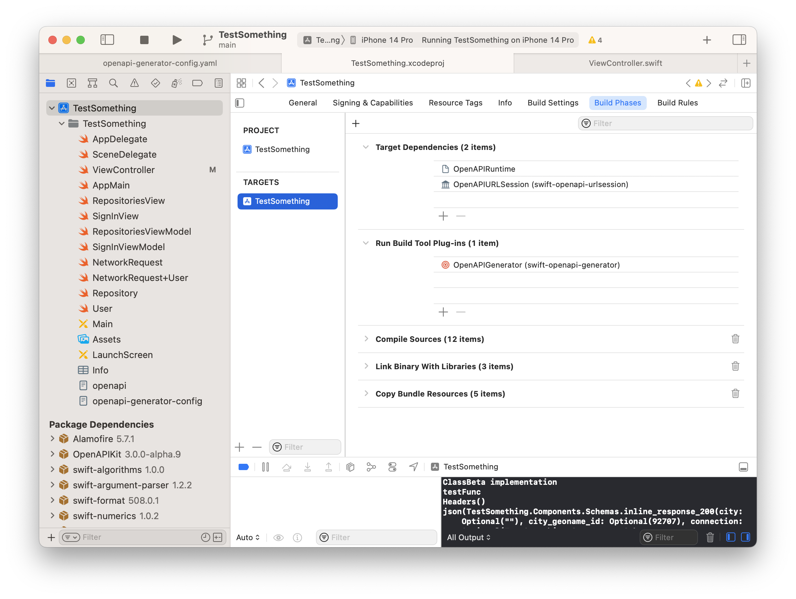 |

The client project needs to have two files with exact names - `openapi-generator-config.yaml` (a plugin config file),  `openapi.yaml` (this is where the API's OpenAPI spec goes). If the file names are not precisely these, there is a build error.

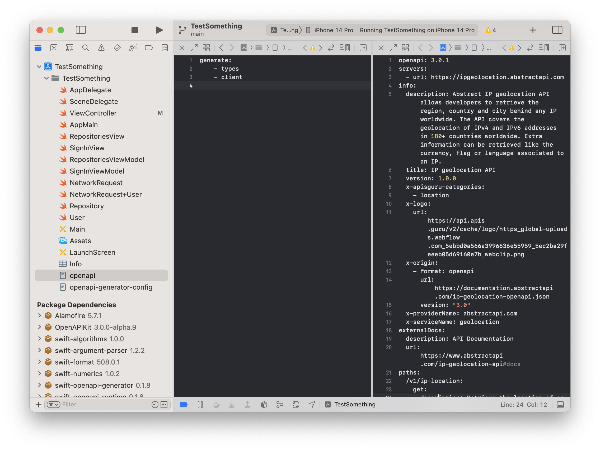

###### plugin config file (`openapi-generator-config.yaml`)

In the plugin config file, `generate.client` indicates that the code that needs to be generated is for client side. `generate.types` indicates that some reusable types need to be generated (what does that exactly mean?).

##### How to use generated code on client side

The generated code makes available a `Client` type that can be accessed from the code (note that `Client` conforms to something called `APIProtocol`). This client is what is used to make API calls. The response is an enum with two cases - `.ok(response)`, `.undocumented(statusCode, payload)`.

| 1. `Client` interface that gets generated                    | 2. Using `Client` in the codebase                            |
| ------------------------------------------------------------ | ------------------------------------------------------------ |
| 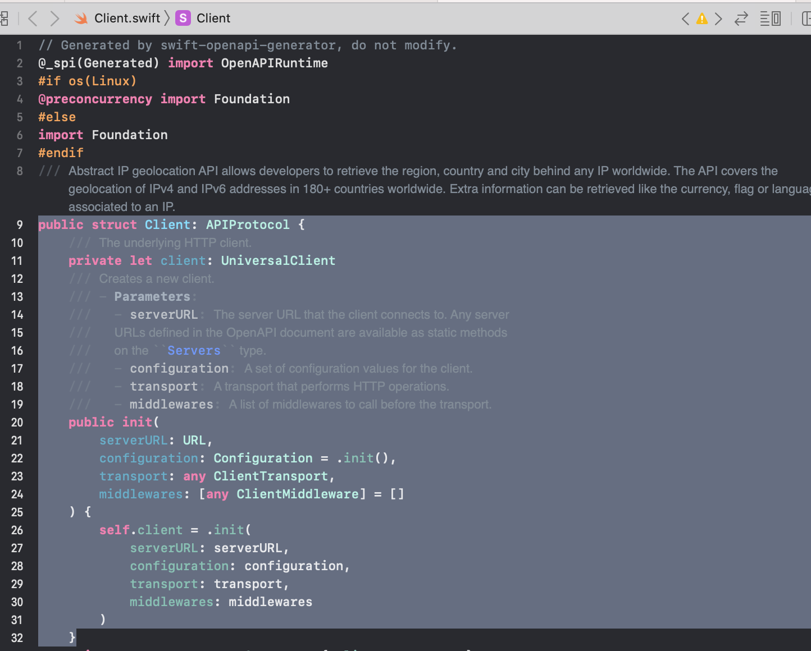 | 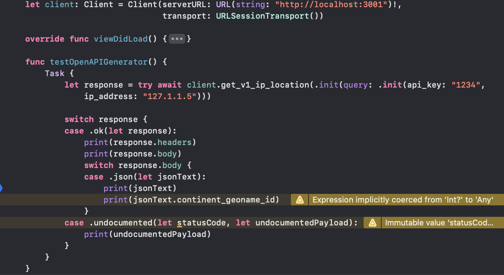 |

> Pay attention to what goes in the URL, it should not have superfluous paths which are already in the openAPI spec and will be appended to the URL anyway.

##### Testing with mocks

Done using dependency injection, a MockClient is defined which conforms to `APIProtocol`.

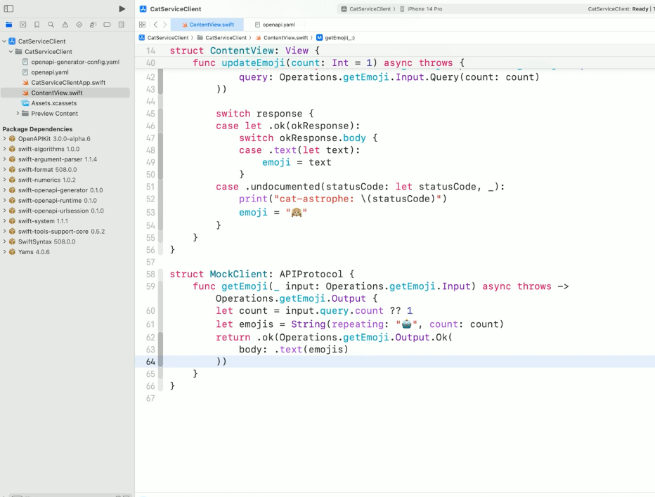

> Covered in 'WWDC 23 - Meet Swift OpenAPI Generator' from around 15:00 min mark.

#### Server development

Its also possible to use Swift OpenAPI generator for server side code. The server is typically a simple Swift package based on Vapor, which uses the Swift OpenAPI Generator package plug-in for code generation.

>Covered in 'WWDC 23 - Meet Swift OpenAPI Generator' from around 16:30 min mark. Study this after watching 'WWDC 22 - Use Xcode for server-side development'.

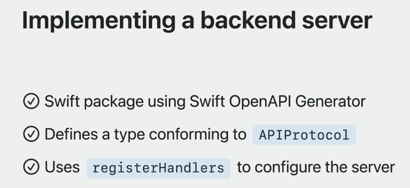

All the code for a simple server app.

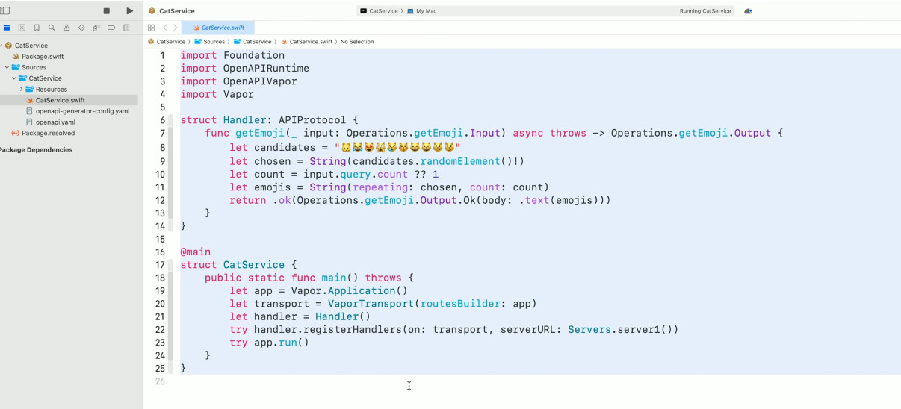

The Manifest file, uses a `OpenAPIVapor`dependency too.

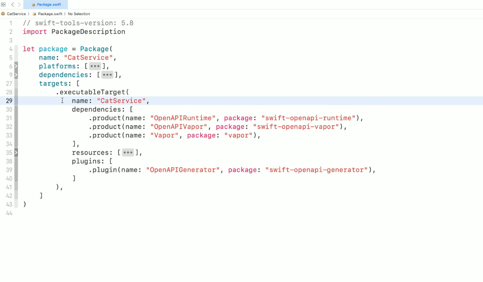]

#### Misc.

##### How to use openapi-generator with multiple openapi specs

As of now one target should have just one openAPI spec. The workaround mentioned is [this](https://github.com/apple/swift-openapi-generator/issues/132#issuecomment-1642726092), but that does not look great. It talks about having a separate library for every API call.

>  BTW, what is HTTP server transport (a term used at times)?

##### Resources

WWDC 23 - Meet Swift OpenAPI Generator [Swift.org introduction article](https://www.swift.org/blog/introducing-swift-openapi-generator/) 

